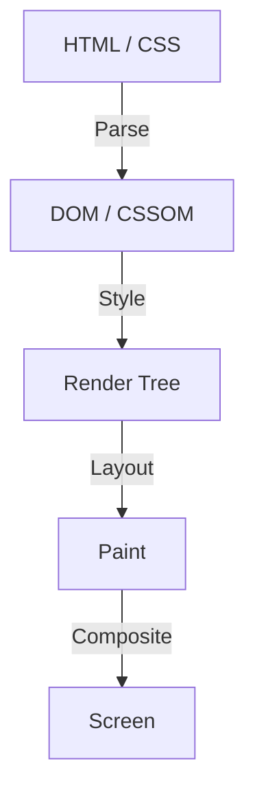

在 Web 前端開發的歷史中，CSS 始終作為一種宣告式語言在發展。開發者描述「它應該看起來像什麼樣子」，而瀏覽器則在幕後進行複雜的運算，將像素繪製到螢幕上。這種分工在許多使用情境下都運作得很好，但同時也產生了一個巨大的障礙。那就是「瀏覽器的渲染管線是一個黑盒子」的問題。

從新的 CSS 功能被提出，到所有主流瀏覽器都實作出來，並讓開發者能夠實際使用，通常需要花費數年的時間。即使試圖使用 Polyfill 來模擬新功能，若頻繁地使用 JavaScript 來操作 DOM 或樣式，就會陷入效能顯著下降的兩難。

為了解決這個限制而誕生的，就是 **CSS Houdini**。這個以著名脫逃大師哈利·胡迪尼（Harry Houdini）為名的專案，提供了一把魔法鑰匙，讓開發者能夠直接存取瀏覽器的渲染管線。

本文將從瀏覽器渲染的基礎、使用 JavaScript 操作 DOM 的效能問題，深入探討 CSS Houdini 的各項 API 如何解決這些問題，並實現次世代的 Web 效能。

## 瀏覽器渲染管線的基礎

為了理解 CSS Houdini，首先必須理解瀏覽器從接收 HTML 和 CSS，到將像素繪製到螢幕上的過程，也就是所謂的「渲染管線」。

1. **Parse（解析）**
   瀏覽器解析 HTML 以建構 DOM（文件物件模型）樹，並解析 CSS 以建構 CSSOM（CSS 物件模型）樹。
2. **Style（樣式計算）**
   結合 DOM 和 CSSOM，計算哪些樣式應套用於哪些元素上。此步驟的結果將建立出渲染樹（Render Tree）。
3. **Layout（排版 / 迴流）**
   根據渲染樹，計算每個元素在螢幕上的配置位置以及大小（寬度、高度、位置）。
4. **Paint（繪製）**
   將元素的視覺屬性（顏色、陰影、文字等）作為像素繪製到圖層上。
5. **Composite（合成）**
   將繪製好的多個圖層以正確的順序疊加，並將最終的影像輸出到螢幕上。

## 傳統 JavaScript 與佈局顛簸 (Layout Thrashing)

過去，如果想要實現 CSS 所沒有的獨特設計或動畫，必須使用 JavaScript 來修改行內樣式，或是新增、刪除 DOM 元素。然而，這伴隨著巨大的效能風險。

當我們嘗試用 JavaScript 讀取 DOM 的屬性（例如 `offsetWidth` 或 `clientHeight`）時，為了回傳最新的值，瀏覽器必須強制套用擱置中的樣式變更，並重新執行排版計算。緊接著，如果又用 JavaScript 修改樣式，排版又會再次失效。

在單一幀（通常為 16.6 毫秒）內反覆發生這種現象，被稱為 **佈局顛簸（Layout Thrashing）**。由於排版計算會對 CPU 造成巨大的負載，一旦發生佈局顛簸，幀率就會下降，帶給使用者「卡頓（Jank）」的不良體驗。

## CSS Houdini 帶來的革命

CSS Houdini 是一組 API 的集合，讓開發者能夠將 JavaScript（嚴格來說是稱為 Worklet 的輕量級執行緒）掛載（介入）到前述渲染管線的各個步驟（Style、Layout、Paint、Composite）中。

使用 Houdini，就能夠在不阻塞瀏覽器主執行緒的情況下，在與原生 CSS 相同的管線上執行處理，因此可以在維持壓倒性效能的同時擴充 CSS 的功能。

### 構成 Houdini 的主要 API 群

Houdini 並非單一的 API，而是多個規範的集合體。讓我們來看看其中幾個具代表性的：

#### 1. CSS Paint API
這可能是目前實用化進展最快的 API。開發者可以使用類似 Canvas API 的語法，動態繪製背景（`background-image`）、邊框（`border-image`）以及遮罩等圖片。

只需用 JavaScript（Paint Worklet）定義繪製邏輯，接著在 CSS 中像這樣呼叫 `background-image: paint(my-custom-effect);` 即可。在需要重新繪製的時機（例如調整視窗大小時），瀏覽器會自動呼叫 Worklet，因此效率極高。

#### 2. Typed OM (CSS Typed Object Model)
在傳統的 CSSOM 中，CSS 的值全部被視為字串處理。例如 `element.style.width = '100px'`，必須組合字串並賦值，然後瀏覽器再去解析它並轉換為數值與單位。

Typed OM 允許將 CSS 的值作為具有型別的 JavaScript 物件來處理。
你可以寫成 `element.attributeStyleMap.set('width', CSS.px(100))`，因為不需要解析字串，從 JavaScript 操作 CSS 時的效能將獲得戲劇性的提升。

#### 3. Properties and Values API
這是一個能夠為 CSS 自訂屬性（CSS 變數）定義型別（語法）、初始值以及是否繼承的 API。
因為傳統的 CSS 變數只是單純的標記替換，所以很難製作動畫（例如，顏色不會從紅色漸變到藍色，而是瞬間切換）。

使用此 API，你可以告訴瀏覽器「這個變數代表顏色」、「這個變數代表長度」，從而實現使用自訂屬性的流暢動畫。

#### 4. CSS Layout API
這是一個強大的 API，讓你可以自行打造排版演算法。不必依賴 Flexbox 或 Grid 等現有的排版模型，你可以在瀏覽器的原生排版管線中高速執行例如「瀑布流（Masonry）排版」或自訂的複雜網格系統。

#### 5. Animation Worklet
這是用於建立連動於捲動位置或使用者輸入、且具備高效能複雜動畫的 API。由於它不是在主執行緒，而是在合成（Compositor）執行緒上運作，即使主執行緒被繁重的處理阻塞，動畫依然能流暢地持續運行（維持 60fps）。

## 總結：獲得魔法的前端開發

CSS Houdini 是 Web 前端開發的典範轉移。我們不再需要等待瀏覽器廠商實作新的 CSS 功能，開發者自己就能擴充並定義瀏覽器渲染引擎的一部分。

這使得過去必須為了複雜的設計或動畫而濫用 JavaScript、進而犧牲效能的做法成為歷史，現在可以用等同於原生的速度來實現。雖然並非所有的 API 都已被所有瀏覽器支援，但其中一部分如 Paint API 和 Typed OM，已經可以在正式產品環境中使用了。

CSS 的未來，不再只是等待瀏覽器的進化。手握 Houdini 這根魔杖的開發者們，親手開拓未來的時代已經來臨。
