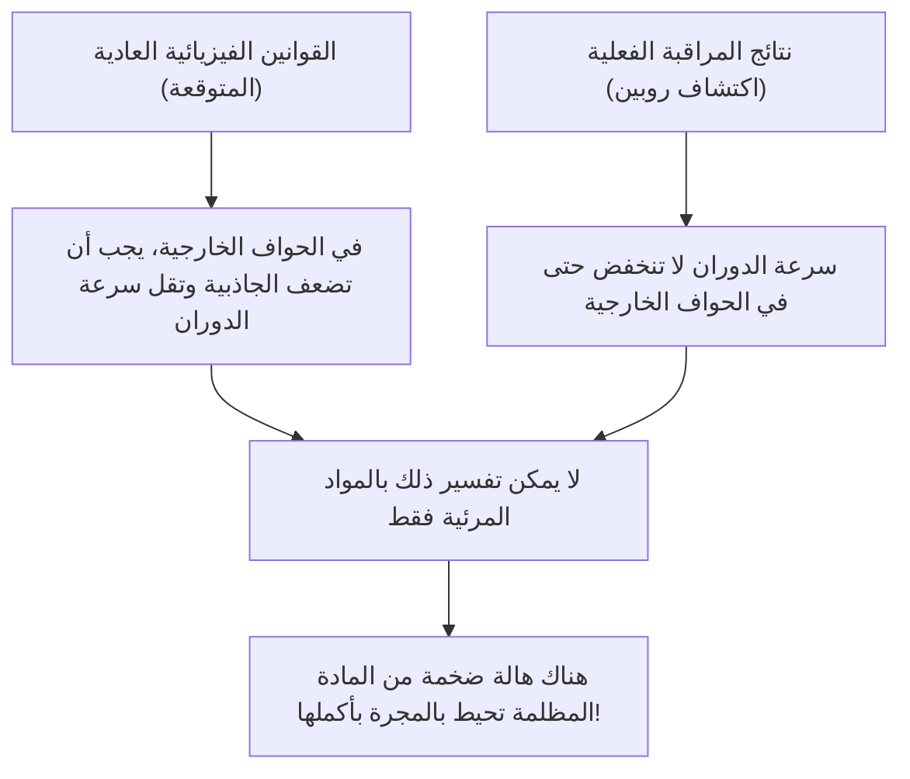
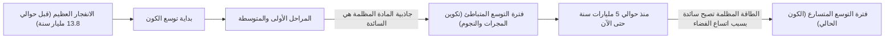

# المادة المظلمة والطاقة المظلمة: القوى الخفية التي تحكم الكون

عندما ننظر إلى سماء الليل، فإن النجوم والمجرات التي لا تعد ولا تحصى والتي نراها ليست سوى غيض من فيض من الكون بأكمله. وفقًا للنموذج الكوني القياسي الحالي (نموذج لامبدا-سي دي إم ΛCDM)، فإن المادة العادية التي نعرفها (النجوم والغازات والكواكب والذرات التي تتكون منها أجسامنا) تشكل فقط حوالي 5% من إجمالي نسبة تركيبة الطاقة والمادة في الكون. أما النسبة المتبقية وهي حوالي 27% فتشغلها كيانات مجهولة الهوية تُعرف باسم "المادة المظلمة" (Dark Matter)، وحوالي 68% تسمى "الطاقة المظلمة" (Dark Energy).

كيف تم اكتشاف هذا "الكون الخفي"، وكيف أصبح يتربع على عرش أكبر لغز في الفيزياء الحديثة؟ في هذا المقال، سنشرح بالتفصيل كل شيء بدءًا من تاريخه وصولاً إلى أحدث ما توصلت إليه فيزياء الجسيمات والتجارب الرصدية المتطورة.

## الاكتشاف التاريخي للمادة المظلمة: لغز الكتلة المفقودة

### فريتز زفيكي واقتراح "الكتلة الخفية"

ظهر مفهوم المادة المظلمة لأول مرة على الساحة العلمية في عام 1933. كان عالم الفلك السويسري الأصل فريتز زفيكي يراقب مجموعة ضخمة من المجرات تسمى عنقود الهلبة المجري (Coma Cluster). وقام بقياس سرعة حركة المجرات الفردية التي يتكون منها العنقود، ومن خلال تلك السرعة، حسب مقدار الجاذبية اللازمة لكي يتماسك العنقود المجري بأكمله معًا.

وفي الوقت نفسه، قدّر كتلة النجوم (الكتلة المرئية) الموجودة هناك من خلال الكمية الإجمالية للضوء المنبعث من العنقود المجري. ومن المثير للدهشة أن سرعات المجرات المرصودة كانت أسرع بكثير من أن يتم تماسكها بواسطة الجاذبية الناتجة عن الكتلة المقدرة من الضوء فقط. لو كانت المادة المرئية فقط هي الموجودة، لكان العنقود المجري قد تفكك وتناثر منذ زمن طويل. اعتقد زفيكي أن هناك كمية هائلة من مادة مجهولة غير مرئية، وأن جاذبيتها هي التي تحافظ على تماسك العنقود المجري، وأطلق عليها اسم "dunkle Materie" (المادة المظلمة). ومع ذلك، في الأوساط الفلكية في ذلك الوقت، تم تجاهل ادعائه لفترة طويلة بسبب الشكوك حول دقة الملاحظات.

### فيرا روبين ومشكلة منحنى دوران المجرات

بعد حوالي 40 عامًا من اكتشاف زفيكي، وفي أوائل السبعينيات، ظهرت نتائج رصد حاسمة تؤكد وجود المادة المظلمة. قامت عالمة الفلك الأمريكية فيرا روبين وزميلها كينت فورد بقياس "منحنى دوران المجرات" بالتفصيل لمجرات حلزونية مثل مجرة أندروميدا.

في المجرات التي تتكثف فيها النجوم في المركز، تضعف الجاذبية كلما ابتعدنا عن المركز، لذلك وفقًا لقوانين كبلر، يجب أن تكون سرعة دوران النجوم في الحواف الخارجية أبطأ (نفس المبدأ في النظام الشمسي، حيث تكون سرعة دوران الكواكب الخارجية أبطأ). ومع ذلك، كانت نتائج مراقبة روبين مخالفة للتوقعات. فحتى في الحواف الخارجية البعيدة عن مركز المجرة، لم تنخفض سرعة دوران النجوم والغازات، بل ظلت ثابتة تقريبًا.

الطريقة المنطقية الوحيدة لتفسير "تسطح منحنى دوران المجرات" هي افتراض وجود كتلة ضخمة غير مرئية (هالة المادة المظلمة) في منطقة شاسعة تتجاوز بكثير الجزء المرئي من المجرة، وأن جاذبيتها تسحب النجوم في الحواف الخارجية بسرعة عالية. بفضل الملاحظات الدقيقة لروبين، لم تعد المادة المظلمة مجرد فرضية، بل أصبحت حقيقة راسخة لا يمكن تجاهلها في علم الكونيات الحديث.

## البحث عن هوية المادة المظلمة: تحدي فيزياء الجسيمات

من المؤكد من خلال تأثير الجاذبية أن المادة المظلمة "موجودة هناك"، ولكن ما هي "هويتها" إذن؟ نظرًا لأنها لا تتفاعل مع الضوء (الموجات الكهرومغناطيسية)، فلا يمكن رؤيتها مباشرة ولا يمكن التقاطها بواسطة موجات الراديو أو الأشعة السينية. المرشح الرئيسي الحالي هو جسيم غير معروف يتجاوز النموذج القياسي (إطار الجسيمات الأولية المعروف حاليًا).

### المرشح الأول: جسيمات ويمب WIMP (الجسيمات الضخمة ضعيفة التفاعل)

لسنوات عديدة، كان المرشح الواعد والأكثر ترجيحاً هو WIMP (الجسيمات الضخمة ضعيفة التفاعل). كما يوحي اسمها، فإن جسيمات ويمب تمتلك كتلة (تولد جاذبية)، ولكنها جسيمات افتراضية لا تتفاعل مع القوة الكهرومغناطيسية أو القوة النووية القوية، ويُعتقد أنها تتفاعل مع المواد الأخرى فقط من خلال "القوة النووية الضعيفة" و"الجاذبية".
إذا كانت جسيمات ويمب موجودة، فهناك خلفية نظرية جميلة تسمى "معجزة ويمب"، والتي تفيد بأنه تم إنتاجها بكميات كبيرة في ظروف الحرارة العالية والكثافة العالية للكون المبكر، ومع تبريد الكون، تتبقى كمية تتطابق تمامًا مع الكثافة الحالية للمادة المظلمة. نظرًا لأنها تُستمد بشكل طبيعي أيضًا في النماذج الموسعة لفيزياء الجسيمات مثل نظرية التناظر الفائق، فقد تنافس علماء الفيزياء التجريبية في جميع أنحاء العالم بضراوة في البحث عن جسيمات ويمب.

### المرشح الثاني: الأكسيون (Axion)

المرشح الرئيسي الآخر هو الأكسيون. كان الأكسيون في الأصل جسيمًا غير مكتشف وخفيفًا للغاية، تم تقديمه لحل لغز آخر في الفيزياء وهو "خرق تناظر الشحنة والسوية CP" في التفاعل القوي (القوة التي تربط الكواركات ببعضها لتكوين البروتونات والنيوترونات).
في حين يُفترض أن تمتلك جسيمات ويمب كتلة ثقيلة تتراوح من عشرات إلى آلاف أضعاف كتلة البروتون، يُعتقد أن الأكسيونات تمتلك كتلة خفيفة بشكل مذهل، أقل من جزء من مئات الملايين من كتلة الإلكترون. ومع ذلك، إذا كان هناك عدد لا يحصى منها في الفضاء الخارجي، فكما تصنع قطرات الماء محيطًا، يمكنها أن تولد كتلة هائلة في المجمل وتتصرف كمادة مظلمة. في السنوات الأخيرة، ونظرًا لصعوبة اكتشاف جسيمات ويمب، زاد الاهتمام بشكل كبير بالبحث عن الأكسيونات.

## أحدث التجارب الرصدية: مطاردة ألغاز الكون من أعماق الأرض

من المتوقع أن تصطدم جسيمات المادة المظلمة (خاصة جسيمات ويمب) بشكل نادر مع المادة العادية (النوى الذرية). ومع ذلك، لا يمكن التقاط إشارة هذا الاصطدام الضعيفة على سطح الأرض بسبب وجود الكثير من الضوضاء مثل الأشعة الكونية. لذلك، تُجرى تجارب البحث المباشر عن المادة المظلمة في منشآت عميقة تحت الأرض، حيث يمكن لطبقة سميكة من الصخور حجب الأشعة الكونية.

### مشروع تجربة زينون (XENONnT)

يعد مشروع "XENON" الذي يُجرى في مختبر جران ساسو الوطني في إيطاليا (على عمق حوالي 1400 متر تحت الأرض) التجربة الأكثر حساسية في العالم للبحث عن المادة المظلمة باستخدام الزينون السائل. في أحدث نسخة "XENONnT"، يتم ملء خزان ضخم بحوالي 8.6 طن من الزينون السائل فائق النقاء، ويحاولون التقاط الضوء الضعيف (ضوء الوميض) والإلكترونات المنبعثة عندما تصطدم جسيمات المادة المظلمة بنواة ذرة الزينون. وتشارك أيضًا مجموعات بحثية من اليابان، مثل جامعة طوكيو وجامعة ناغويا، في انتظار مواجهة جسيمات غير معروفة في بيئة تم فيها تقليل ضوضاء الخلفية إلى أقصى حد.

### تجربة LUX-ZEPLIN (LZ) وتموجات "الهيغزينو"

حاليًا، يعمل المشروع الدولي المشترك "تجربة LUX-ZEPLIN (LZ)"، والذي يستخدم 10 أطنان من الزينون السائل فائق النقاء، في منشأة البحث "SURF" الواقعة على عمق حوالي 1.6 كيلومتر تحت الأرض في ولاية ساوث داكوتا الأمريكية. مؤخرًا، عندما قامت تجربة LZ هذه بتحليل بيانات المراقبة التي تم جمعها على مدار 220 يومًا من مارس 2023 إلى أبريل 2024، تم تسجيل تفاعل لجسيم منفرد لا يمكن تفسيره بواسطة ضوضاء الخلفية المعروفة، مما أحدث موجة كبيرة من الجدل في أوساط الفيزياء.

تبلغ قيمة المؤشر الإحصائي "سيغما (σ)" الذي يوضح احتمال حدوث ذلك بالصدفة 2.6، وهو لا يزال بعيدًا جدًا عن معيار 5 سيغما الذي يعتبر معيار الاكتشاف في الفيزياء. ومع ذلك، يعتبر هذا من أقوى المؤشرات على المادة المظلمة بين الحالات التي تم الإبلاغ عنها في تجربة LZ حتى الآن. وفيما يتعلق بهذا الحدث، اقترحت عدة فرق بحثية مستقلة تباعًا تفسيرًا يفيد بتورط "الهيغزينو" (بكتلة حوالي 1.1 تيرا إلكترون فولت)، وهو مرشح للمادة المظلمة تتنبأ به نظرية التناظر الفائق. يُقال إنه قد يكون حدثًا ناتجًا عن "التشتت غير المرن للهيغزينو (التشتت الذي يتغير فيه جسيم المادة المظلمة إلى حالة أثقل قليلًا بسبب جزء من زخم الاصطدام)". مع تراكم المزيد من البيانات في المستقبل، يراقب العالم بأسره بفارغ الصبر ما إذا كان هذا سيكون الخطوة الأولى نحو اكتشاف القرن، أم أنه سيختفي كمجرد تذبذب.

### من كاميوكاندي إلى هايبر-كاميوكاندي

تعتبر المنشأة الواقعة تحت الأرض في منجم كاميوكا في محافظة غيفو اليابانية أيضًا مركزًا عالميًا لرصد الجسيمات الأولية. تجربة "كاميوكاندي"، حيث لاحظ الدكتور ماساتوشي كوشيبا نيوترينوات المستعر الأعظم، وتجربة "سوبر كاميوكاندي"، حيث تم اكتشاف تذبذب النيوترينو، معروفتان جيدًا، ومن المتوقع أيضًا أن تساهم منشأة الجيل القادم "هايبر-كاميوكاندي" قيد الإنشاء حاليًا، بالإضافة إلى خطة خليفة تجربة استكشاف المادة المظلمة "XMASS (كريسماس)" التي تُجرى بالمثل تحت الأرض في كاميوكا، بشكل كبير في كشف مكونات الكون المظلمة. للنيوترينوات نفسها كتلة متناهية الصغر، وكانت تُعتبر في الماضي مرشحًا لتكون مادة مظلمة، ولكن من المعروف الآن أنها أخف من أن تفسر تكوين بنية الكون (ستصبح مادة مظلمة ساخنة). ومع ذلك، فإن تقنيات النشاط الإشعاعي المنخفض للغاية وتقنية الأنابيب المضاعفة الضوئية التي تم تطويرها في أبحاث النيوترينو أصبحت ضرورية للبحث عن المادة المظلمة.

## القوة الغامضة التي تسرع توسع الكون: الطاقة المظلمة (Dark Energy)

إذا كانت المادة المظلمة هي "القوة التي تجذب المواد معًا بالجاذبية لتشكل المجرات"، فإن "الطاقة المظلمة" تقع على النقيض من ذلك، وهي "القوة التي تحاول تمزيق الكون بأسره باستخدام قوة التنافر".

### اكتشاف التوسع المتسارع للكون

في عام 1998، قام فريقا مراقبة بقيادة شاول بيرلموتر وبريان شميدت وآدم ريس (الحائزون على جائزة نوبل في الفيزياء لعام 2011) برصد "مستعرات عظمى من النوع Ia" بعيدة (والتي يمكن استخدامها كشموع قياسية للكون لأن سطوعها ثابت)، وأعلنوا عن حقيقة صادمة.
في النظريات الكونية حتى ذلك الحين، كان يُعتقد أن الكون، الذي بدأ في التوسع مع الانفجار العظيم، يتباطأ تدريجياً في سرعة توسعه (توسع متباطئ) بسبب قوة الجاذبية المتبادلة بين المواد. ومع ذلك، جاءت نتائج المراقبة عكس ذلك تمامًا، فقد اتضح أن سرعة توسع الكون الآن أسرع مما كانت عليه في الماضي، أي أنه يمر بـ "توسع متسارع".

### هوية الطاقة المظلمة: هل هو الثابت الكوني لأينشتاين؟

الفضاء نفسه يسرع من توسعه. تم إدخال الطاقة المظلمة لتفسير ذلك. في حين أن المادة المظلمة لها خاصية التجمع بشكل غير متساو في مكان ما في الفضاء، فإن الطاقة المظلمة تملأ بشكل متساوٍ تمامًا كل مكان في الفضاء الكوني، ولها خاصية غريبة تتمثل في أن مقدارها الإجمالي يزداد كلما اتسع الفضاء.

المرشح الأكثر احتمالًا لذلك هو "الثابت الكوني (Λ: لامبدا)"، والذي أدخله ألبرت أينشتاين ذات مرة في معادلة الجاذبية للنسبية العامة، وسحبه لاحقًا باعتباره "أكبر خطأ في حياته". إنها فكرة أن الطاقة التي يمتلكها الفراغ نفسه (طاقة الفراغ) تعمل كقوة تنافر، وتدفع الكون للتوسع. ومع ذلك، هناك تناقض فلكي (أو أكثر) بمقدار 10 أس 120 ضعفًا بين قيمة طاقة الفراغ التي تتنبأ بها الحسابات النظرية لميكانيكا الكم وقيمة الطاقة المظلمة المشتقة من الرصد الفلكي، وهذه مشكلة مستعصية لم يتم حلها تُسمى أيضًا "أسوأ تنبؤ في تاريخ الفيزياء".

## الخلاصة: ما زلنا نعرف فقط 5% من الكون

المادة المظلمة والطاقة المظلمة. الاسمان متشابهان، لكن دورهما في الكون مختلف تمامًا. المادة المظلمة هي "الهيكل العظمي" الذي يشكل بنية الكون، وهي الغراء الذي يربط المجرات معًا. في المقابل، فإن الطاقة المظلمة هي القوة التي تدفع الفضاء نفسه للاتساع، ويمكن القول إنها "المدمر" للكون والذي سيبعد في النهاية جميع المجرات عن بعضها البعض.

إن العلوم والتكنولوجيا والقوانين الفيزيائية التي بنيناها مذهلة، ولكن لا يمكن تطبيقها إلا على 5% فقط من مادة الكون. هل سيأتي اليوم الذي نفهم فيه الطبيعة الحقيقية لـ 95% المتبقية ومما تتكون؟ في المختبرات العميقة تحت الأرض، أو باستخدام أحدث التلسكوبات العائمة في الفضاء الخارجي، تواصل البشرية اليوم تحديها الشجاع محاولةً الإمساك بطرف "الكون الخفي".
