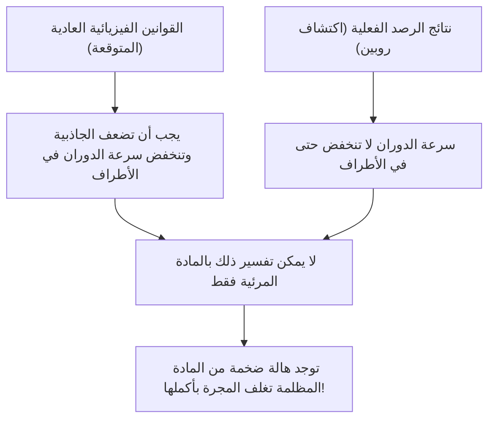
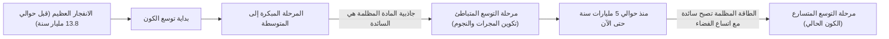

# المادة المظلمة والطاقة المظلمة: القوى الخفية التي تحكم الكون

عندما ننظر إلى سماء الليل، فإن النجوم والمجرات التي لا تحصى والتي نراها ليست سوى قمة جبل الجليد للكون بأسره. وفقًا للنموذج الكوني القياسي الحالي (نموذج لامبدا-سي دي إم ΛCDM)، فإن المادة العادية التي نعرفها (مثل النجوم والغاز والكواكب والذرات التي تشكلنا) لا تمثل سوى حوالي 5% من إجمالي نسبة الطاقة والمادة في الكون. أما النسبة المتبقية التي تبلغ حوالي 27% فهي كيان مجهول يسمى "المادة المظلمة"، وحوالي 68% تسمى "الطاقة المظلمة".

كيف تم اكتشاف هذا "الكون غير المرئي" ليصبح أكبر لغز في الفيزياء الحديثة؟ في هذا المقال، سنشرح بالتفصيل كل شيء بدءًا من تاريخه وصولاً إلى أحدث أبحاث فيزياء الجسيمات الأولية والتجارب الرصدية المتطورة.

## الاكتشاف التاريخي للمادة المظلمة: لغز الكتلة المفقودة

### فريتز زفيكي واقتراح "الكتلة غير المرئية"

ظهر مفهوم المادة المظلمة لأول مرة على الساحة العلمية في عام 1933. كان عالم الفلك السويسري فريتز زفيكي يراقب مجموعة ضخمة من المجرات تسمى عنقود كوما الماسي (Coma Cluster). قام بقياس سرعة حركة المجرات الفردية التي يتكون منها العنقود، ومن تلك السرعة حسب مقدار الجاذبية اللازمة لكي يتماسك العنقود بأسره.

في الوقت نفسه، قدر كتلة النجوم (الكتلة المرئية) الموجودة هناك بناءً على إجمالي كمية الضوء المنبعث من العنقود المجري. لكن المدهش أن سرعة حركة المجرات المرصودة كانت أسرع من أن تتمكن الجاذبية الناتجة عن الكتلة المقدرة من الضوء من الحفاظ عليها. لو كان هناك فقط المادة المرئية، لكان العنقود المجري قد تفكك وتناثر منذ زمن طويل. اعتقد زفيكي أن هناك كمية كبيرة من مادة غير مرئية ومجهولة، وأن جاذبيتها هي ما يجمع العنقود معًا، وأطلق عليها اسم "dunkle Materie" (المادة المظلمة). ومع ذلك، في الأوساط الفلكية في ذلك الوقت، تم تجاهل ادعائه لفترة طويلة بسبب الشكوك حول دقة الرصد.

### فيرا روبين ومشكلة منحنى دوران المجرات

بعد حوالي 40 عامًا من اكتشاف زفيكي، في بداية سبعينيات القرن العشرين، ظهرت نتائج رصد حاسمة لوجود المادة المظلمة. قامت عالمة الفلك الأمريكية فيرا روبين وزميلها كينت فورد بقياس "منحنى دوران المجرات" بالتفصيل لمجرات حلزونية مثل مجرة أندروميدا.

في المجرات التي تتكثف فيها النجوم في المركز، تضعف الجاذبية كلما ابتعدنا عن المركز، لذلك وفقًا لقوانين كيبلر، يجب أن تكون سرعة دوران النجوم في الأطراف الخارجية أبطأ (نفس المبدأ في النظام الشمسي، حيث تكون سرعة دوران الكواكب الخارجية أبطأ). لكن نتائج رصد روبين جاءت مخالفة للتوقعات. فحتى في الأطراف الخارجية البعيدة عن مركز المجرة، لم تنخفض سرعة دوران النجوم والغازات، بل حافظت على سرعة ثابتة تقريبًا.

الطريقة العقلانية الوحيدة لتفسير "تسطح منحنى دوران المجرات" هي افتراض وجود كتلة هائلة غير مرئية (هالة المادة المظلمة) في منطقة شاسعة تتجاوز بكثير الجزء المرئي من المجرة، وأن جاذبيتها تسحب النجوم في الأطراف الخارجية بسرعات عالية. بفضل عمليات الرصد الدقيقة التي قامت بها روبين، لم تعد المادة المظلمة مجرد فرضية، بل تم قبولها كحقيقة واقعة ومؤكدة لا يمكن تجاهلها في علم الكونيات الحديث.

## البحث عن هوية المادة المظلمة: تحدي فيزياء الجسيمات

من المؤكد أن المادة المظلمة "موجودة" نظرًا لتأثيرات الجاذبية، ولكن ما هي "هويتها" الحقيقية؟ بما أنها لا تتفاعل مع الضوء (الموجات الكهرومغناطيسية)، فلا يمكن رؤيتها مباشرة أو رصدها بواسطة موجات الراديو أو الأشعة السينية. المرشح الأبرز حاليًا هو جسيم أولي مجهول يتجاوز النموذج القياسي (الإطار المعروف حاليًا للجسيمات الأولية).

### المرشح 1: الجسيمات الثقيلة ضعيفة التفاعل (WIMP)

لسنوات عديدة، كان المرشح الأكثر احتمالًا هو WIMP (الجسيمات الثقيلة ضعيفة التفاعل). كما يوحي اسمها، تتمتع WIMP بكتلة (تولد جاذبية)، لكنها لا تتفاعل مع القوة الكهرومغناطيسية أو القوة النووية القوية، وهي جسيمات افتراضية يُعتقد أنها تتفاعل مع المواد الأخرى فقط من خلال "القوة النووية الضعيفة" و"الجاذبية".
إذا كانت WIMP موجودة، فهناك خلفية نظرية جميلة تُعرف باسم "معجزة WIMP"، والتي تشير إلى أنها تكونت بكميات هائلة في الحالة شديدة الحرارة والكثافة للكون المبكر، ومع برودة الكون، تبقت كمية تتطابق تمامًا مع كثافة المادة المظلمة الحالية. وبما أنها تُستنتج بشكل طبيعي أيضًا في النماذج الموسعة لفيزياء الجسيمات مثل نظرية التناظر الفائق، فقد تنافس علماء الفيزياء التجريبية في جميع أنحاء العالم بحثًا عن WIMP.

### المرشح 2: الأكسيون (Axion)

المرشح البارز الآخر هو الأكسيون. كان الأكسيون في الأصل جسيمًا خفيفًا للغاية وغير مكتشف، تم إدخاله لحل لغز آخر في الفيزياء يسمى "انتهاك تناظر CP" في التفاعل القوي (القوة التي تربط الكواركات لتكوين البروتونات والنيوترونات).
في حين يُفترض أن كتلة WIMP أثقل بعشرات إلى آلاف المرات من كتلة البروتون، يُعتقد أن الأكسيون يمتلك كتلة خفيفة بشكل مذهل، أقل من جزء من مئات الملايين من كتلة الإلكترون. ومع ذلك، إذا كانت موجودة بأعداد لا حصر لها في الفضاء الخارجي، تمامًا كما تتراكم ذرات الغبار لتشكل جبلًا، فيمكنها أن تولد كتلة هائلة بشكل عام وتعمل كمادة مظلمة. في السنوات الأخيرة، ومع صعوبة اكتشاف WIMP، زاد الاهتمام بالبحث عن الأكسيونات بشكل حاد.

## التجارب الرصدية في الخطوط الأمامية: تتبع أسرار الكون من أعماق الأرض

يُتوقع أن تصطدم جسيمات المادة المظلمة (خاصة WIMP) نادرًا بالمادة العادية (النوى الذرية). ومع ذلك، على سطح الأرض، يوجد الكثير من التشويش مثل الأشعة الكونية، مما يجعل من المستحيل التقاط إشارة الاصطدام الضعيفة. لذلك، تُجرى تجارب البحث المباشر عن المادة المظلمة في منشآت تحت الأرض العميقة، حيث يمكن لطبقات الصخور السميكة حجب الأشعة الكونية.

### مشروع تجربة زينون (XENONnT)

مشروع "XENON" الذي يُجرى في مختبر جران ساسو الوطني في إيطاليا (على عمق حوالي 1400 متر تحت الأرض) هو تجربة البحث عن المادة المظلمة الأكثر حساسية في العالم، والتي تستخدم الزينون السائل. في أحدث نسخة "XENONnT"، يتم ملء خزان ضخم بحوالي 8.6 طن من الزينون السائل فائق النقاء، بهدف التقاط الضوء الخافت (ضوء الوميض) والإلكترونات المنبعثة عندما تصطدم جسيمات المادة المظلمة بنواة ذرة الزينون. تشارك أيضًا مجموعات بحثية من اليابان، مثل جامعة طوكيو وجامعة ناغويا، في هذا المشروع، وينتظرون مواجهة جسيمات مجهولة في بيئة تم فيها تقليل ضوضاء الخلفية إلى أقصى حد.

### من كاميوكاندي إلى هايبر كاميوكاندي

تعتبر المنشأة الموجودة تحت الأرض في منجم كاميوكا بمحافظة جيفو في اليابان مركزًا عالميًا آخر لرصد الجسيمات الأولية. يشتهر "كاميوكاندي"، حيث رصد الدكتور ماساتوشي كوشيبا نيوترينوات المستعر الأعظم، و"سوبر كاميوكاندي"، الذي اكتشف تذبذب النيوترينو، ولكن من المتوقع أيضًا أن تساهم المنشأة من الجيل التالي "هايبر كاميوكاندي" التي يجري بناؤها حاليًا، وخطة المتابعة لتجربة البحث عن المادة المظلمة "XMASS" التي تُجرى أيضًا تحت الأرض في كاميوكا، بشكل كبير في توضيح المكونات المظلمة للكون. على الرغم من أن النيوترينوات نفسها لها كتلة دقيقة للغاية وكانت تُعتبر في السابق مرشحة للمادة المظلمة، إلا أنه من المعروف الآن أنها أخف من أن تفسر تكوين بنية الكون (ستصبح مادة مظلمة ساخنة). ومع ذلك، فإن تقنيات النشاط الإشعاعي المنخفض للغاية وتقنيات الأنابيب المضاعفة الضوئية التي تم تطويرها في أبحاث النيوترينو أصبحت ضرورية للبحث عن المادة المظلمة.

## القوة الغامضة التي تسرع توسع الكون: الطاقة المظلمة

إذا كانت المادة المظلمة هي "القوة التي تجذب المادة عن طريق الجاذبية وتشكل المجرات"، فإن "الطاقة المظلمة" تقع في الطرف النقيض، وهي "القوة التي تحاول تمزيق الكون بأسره بقوة التنافر".

### اكتشاف التوسع المتسارع للكون

في عام 1998، أعلن فريقا رصد بقيادة سول بيرلموتر وبريان شميدت وآدم ريس (الحائزون على جائزة نوبل في الفيزياء لعام 2011) عن حقيقة مروعة بعد رصد "مستعرات عظمى من النوع Ia" البعيدة (والتي يمكن استخدامها كشموع قياسية للكون لأن سطوعها ثابت).
في علم الكونيات حتى ذلك الحين، كان يُعتقد أن الكون الذي بدأ في التوسع مع الانفجار العظيم يبطئ سرعة توسعه تدريجيًا (توسع متباطئ) بسبب قوة الجاذبية المتبادلة بين المواد. لكن نتائج الرصد كانت معاكسة تمامًا؛ فقد تبين أن سرعة توسع الكون أصبحت أسرع الآن مما كانت عليه في الماضي، أي أنه يمر بـ "توسع متسارع".

### هوية الطاقة المظلمة: هل هي الثابت الكوني لأينشتاين؟

الفضاء نفسه يسرع توسعه. تم إدخال مفهوم الطاقة المظلمة لتفسير ذلك. في حين تميل المادة المظلمة إلى التجمع بشكل غير متساو في أماكن معينة في الفضاء، تملأ الطاقة المظلمة كل مكان في الفضاء الكوني بالتساوي تمامًا، ولها خاصية غريبة تتمثل في أن كميتها الإجمالية تزداد كلما اتسع الفضاء.

المرشح الأكثر احتمالاً لذلك هو "الثابت الكوني" (Λ: لامبدا)، الذي أدخله ألبرت أينشتاين ذات مرة في معادلة الجاذبية للنسبية العامة وسحبه لاحقًا باعتباره "أكبر خطأ في حياته". تعتمد هذه الفكرة على أن الطاقة التي يمتلكها الفراغ نفسه (طاقة الفراغ) تعمل كقوة تنافر وتدفع الكون للتوسع. ومع ذلك، هناك تناقض فلكي (أو أكثر) بمقدار 10 أس 120 بين قيمة طاقة الفراغ التي تنبأت بها الحسابات النظرية لميكانيكا الكم وقيمة الطاقة المظلمة المشتقة من الملاحظات الفلكية، وهو لغز لم يتم حله ويُسمى "أسوأ تنبؤ في تاريخ الفيزياء".

## الخلاصة: ما زلنا لا نعرف سوى 5% من الكون

المادة المظلمة والطاقة المظلمة. قد تتشابه أسماؤهما، لكن أدوارهما في الكون مختلفة تمامًا. المادة المظلمة هي "الهيكل العظمي" الذي يشكل بنية الكون، وهي الغراء الذي يربط المجرات معًا. من ناحية أخرى، الطاقة المظلمة هي "المدمر" للكون، حيث تدفع الفضاء نفسه للاتساع وتدفع في النهاية جميع المجرات بعيدًا.

إن التكنولوجيا العلمية والقوانين الفيزيائية التي بنيناها مذهلة حقًا، لكنها قابلة للتطبيق فقط على 5% من مادة الكون. هل سيأتي اليوم الذي نفهم فيه الطبيعة الحقيقية لنسبة الـ 95% المتبقية؟ في المختبرات العميقة تحت الأرض، أو باستخدام أحدث التلسكوبات التي تطفو في الفضاء، تستمر البشرية اليوم في تحديها الجريء لمحاولة الإمساك بطرف "الكون غير المرئي".
