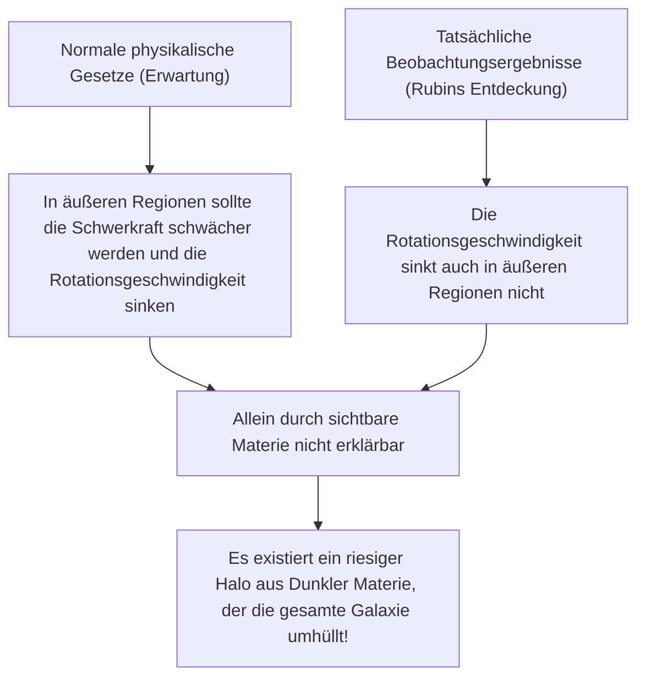
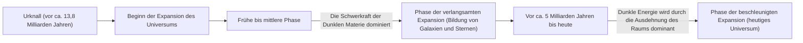

# Dunkle Materie und Dunkle Energie: Die unsichtbaren Kräfte, die das Universum beherrschen

Wenn wir in den Nachthimmel blicken, sind die unzähligen Sterne und Galaxien, die wir sehen, nur die Spitze des Eisbergs im gesamten Universum. Laut dem aktuellen Standardmodell der Kosmologie (ΛCDM-Modell) macht die gewöhnliche Materie, die wir kennen (Sterne, Gas, Planeten und die Atome, aus denen wir selbst bestehen), nur etwa 5% der gesamten Energie- und Materiezusammensetzung des Universums aus. Die restlichen etwa 27% werden von einer unbekannten Entität namens "Dunkle Materie" und etwa 68% von der sogenannten "Dunklen Energie" eingenommen.

Wie wurde dieses "unsichtbare Universum" entdeckt und warum ist es zum größten Rätsel der modernen Physik geworden? In diesem Artikel werden wir alles von der historischen Entwicklung über die neueste Teilchenphysik bis hin zu hochmodernen Beobachtungsexperimenten umfassend erläutern.

## Die historische Entdeckung der Dunklen Materie: Das Rätsel der fehlenden Masse

### Fritz Zwicky und der Vorschlag der "unsichtbaren Masse"

Das Konzept der Dunklen Materie betrat erstmals 1933 die wissenschaftliche Bühne. Der in der Schweiz geborene Astronom Fritz Zwicky beobachtete den Coma-Haufen, eine riesige Ansammlung von Galaxien. Er maß die Geschwindigkeiten der einzelnen Galaxien, die den Haufen bilden, und berechnete anhand dieser Geschwindigkeiten, wie viel Schwerkraft erforderlich sein müsste, um den gesamten Galaxienhaufen zusammenzuhalten.

Gleichzeitig schätzte er die Masse der darin enthaltenen Sterne (sichtbare Masse) aus der Gesamtmenge des vom Galaxienhaufen ausgesandten Lichts. Überraschenderweise war die beobachtete Bewegungsgeschwindigkeit der Galaxien zu schnell, um allein durch die Schwerkraft gehalten zu werden, die von der aus dem Licht geschätzten Masse erzeugt wurde. Wenn es nur sichtbare Materie gäbe, hätte der Galaxienhaufen längst auseinanderfliegen müssen. Zwicky vermutete, dass eine große Menge unbekannter, unsichtbarer Materie existierte und dass deren Schwerkraft den Galaxienhaufen zusammenhielt. Er nannte dies "dunkle Materie". Jedoch wurde seine Behauptung in der damaligen astronomischen Gemeinschaft aufgrund von Zweifeln an der Beobachtungsgenauigkeit lange Zeit ignoriert.

### Vera Rubin und das Problem der Rotationskurven von Galaxien

Etwa 40 Jahre nach Zwickys Entdeckung, in den 1970er Jahren, lieferten Beobachtungen entscheidende Beweise für die Existenz Dunkler Materie. Die amerikanische Astronomin Vera Rubin und ihr Kollege Kent Ford vermaßen detailliert die "Rotationskurven von Galaxien", wobei sie sich auf Spiralgalaxien wie die Andromedagalaxie konzentrierten.

In Galaxien, in denen Sterne im Zentrum dicht gedrängt sind, wird die Schwerkraft mit zunehmendem Abstand vom Zentrum schwächer. Nach den Keplerschen Gesetzen sollte sich die Rotationsgeschwindigkeit der Sterne in den äußeren Regionen verlangsamen (nach dem gleichen Prinzip, dass äußere Planeten in unserem Sonnensystem langsamere Umlaufgeschwindigkeiten haben). Rubins Beobachtungsergebnisse widersprachen jedoch den Erwartungen. Selbst in den weit vom galaktischen Zentrum entfernten äußeren Regionen nahm die Rotationsgeschwindigkeit von Sternen und Gas nicht ab, sondern blieb nahezu konstant.

Die einzige rationale Möglichkeit, diese "Flachheit der Rotationskurven von Galaxien" zu erklären, bestand darin, anzunehmen, dass es in einer riesigen Region weit über den sichtbaren Teil der Galaxie hinaus einen enormen Klumpen unsichtbarer Masse (Dunkle-Materie-Halo) gibt, dessen Schwerkraft die Sterne in den äußeren Regionen mit hoher Geschwindigkeit mitzieht. Durch Rubins präzise Beobachtungen wurde Dunkle Materie nicht mehr nur als Hypothese, sondern als eine unbestreitbare Realität akzeptiert, die in der modernen Kosmologie nicht ignoriert werden kann.

## Auf der Suche nach der wahren Natur der Dunklen Materie: Die Herausforderung der Teilchenphysik

Dass Dunkle Materie aufgrund ihrer gravitativen Wirkung "dort ist", ist sicher, aber was ist ihre "wahre Identität"? Da sie nicht mit Licht (elektromagnetischen Wellen) interagiert, kann sie weder direkt gesehen noch von Radiowellen oder Röntgenstrahlen erfasst werden. Derzeitige Hauptkandidaten sind unbekannte Elementarteilchen, die über das Standardmodell (den derzeit bekannten Rahmen von Elementarteilchen) hinausgehen.

### Kandidat 1: WIMPs (Weakly Interacting Massive Particles)

Der Kandidat, der seit vielen Jahren als der wahrscheinlichste gilt, ist das WIMP (schwach wechselwirkendes massereiches Teilchen). Wie der Name schon sagt, ist ein WIMP ein hypothetisches Teilchen, das Masse hat (Schwerkraft erzeugt), aber nicht mit elektromagnetischer oder starker Kernkraft interagiert, sondern sich nur durch "schwache Kernkraft" und "Schwerkraft" mit anderer Materie verbindet.
Wenn WIMPs existieren, gibt es einen schönen theoretischen Hintergrund, der als "WIMP-Wunder" bezeichnet wird: Sie wurden in den heißen, dichten Bedingungen des frühen Universums in großen Mengen erzeugt, und während das Universum abkühlte, blieb genau die Menge zurück, die perfekt mit der aktuellen Dichte der Dunklen Materie übereinstimmt. Da sie auch in erweiterten Modellen der Teilchenphysik, wie der Supersymmetrie, natürlich abgeleitet werden, haben Experimentalphysiker auf der ganzen Welt intensiv nach WIMPs gesucht.

### Kandidat 2: Axionen (Axions)

Ein weiterer vielversprechender Kandidat ist das Axion. Das Axion ist ein extrem leichtes, unentdecktes Teilchen, das ursprünglich eingeführt wurde, um ein anderes physikalisches Rätsel namens "CP-Verletzung" in der starken Wechselwirkung (der Kraft, die Quarks bindet, um Protonen und Neutronen zu erzeugen) zu lösen.
Während angenommen wird, dass WIMPs eine schwere Masse haben, die zig- bis tausendmal so groß ist wie die eines Protons, geht man davon aus, dass Axionen eine erstaunlich leichte Masse haben, die weniger als ein Hundertmillionstel eines Elektrons beträgt. Wenn sie jedoch in unzähligen Mengen im Weltraum existieren, können sie wie eine Ansammlung von Staub, der zu einem Berg wird, insgesamt eine enorme Masse erzeugen und sich als Dunkle Materie verhalten. In den letzten Jahren, da sich die Entdeckung von WIMPs als schwierig erwiesen hat, ist die Aufmerksamkeit für die Axionen-Suche rasant gestiegen.

## Beobachtungsexperimente an vorderster Front: Den Geheimnissen des Universums aus der Tiefe der Erde auf der Spur

Es wird erwartet, dass Dunkle-Materie-Teilchen (insbesondere WIMPs) selten mit gewöhnlicher Materie (Atomkernen) kollidieren. Auf der Erdoberfläche ist es jedoch aufgrund des Rauschens, wie zum Beispiel der kosmischen Strahlung, unmöglich, diese schwachen Kollisionssignale zu erfassen. Daher werden Experimente zur direkten Suche nach Dunkler Materie in tiefen unterirdischen Anlagen durchgeführt, wo dicke Gesteinsschichten die kosmische Strahlung abschirmen können.

### Das XENON-Experimentprojekt (XENONnT)

Das "XENON"-Projekt, das im italienischen Laboratori Nazionali del Gran Sasso (etwa 1400 Meter unter der Erde) durchgeführt wird, ist das weltweit empfindlichste Experiment zur Suche nach Dunkler Materie unter Verwendung von flüssigem Xenon. Im neuesten "XENONnT" ist ein riesiger Tank mit etwa 8,6 Tonnen ultrareinem flüssigem Xenon gefüllt. Das Ziel ist es, das schwache Licht (Szintillationslicht) und die Elektronen einzufangen, die freigesetzt werden, wenn Dunkle-Materie-Teilchen mit Xenon-Atomkernen kollidieren. Forschungsgruppen aus Japan, wie die Universität Tokio und die Universität Nagoya, sind ebenfalls beteiligt und warten in einer Umgebung mit extrem reduziertem Hintergrundrauschen auf die Begegnung mit unbekannten Teilchen.

### Das LUX-ZEPLIN (LZ) Experiment und die Auswirkungen des "Higgsino"

Derzeit ist das internationale Gemeinschaftsprojekt "LUX-ZEPLIN (LZ) Experiment", das 10 Tonnen ultrareines flüssiges Xenon verwendet, in der unterirdischen Forschungsanlage "SURF" in South Dakota, USA (etwa 1,6 km unter der Erde) in Betrieb. Kürzlich analysierte das LZ-Experiment Beobachtungsdaten von 220 Tagen, die von März 2023 bis April 2024 gesammelt wurden, und es wurde eine einzelne Teilchenwechselwirkung aufgezeichnet, die nicht durch bekanntes Hintergrundrauschen erklärt werden kann. Dies sorgte in der Physikgemeinschaft für großes Aufsehen.

Der Wert des statistischen Indikators "Sigma (σ)", der die Wahrscheinlichkeit eines zufälligen Auftretens angibt, liegt bei 2,6 und damit noch weit entfernt von der 5-Sigma-Marke, die in der Physik als Kriterium für eine Entdeckung gilt. Dennoch gilt dies unter den bisher gemeldeten Fällen des LZ-Experiments als das stärkste Anzeichen für Dunkle Materie. Mehrere unabhängige Forschungsteams haben nacheinander die Interpretation vorgeschlagen, dass das "Higgsino" (mit einer Masse von etwa 1,1 TeV), ein von der Supersymmetrie-Theorie vorhergesagter Kandidat für Dunkle Materie, an diesem Ereignis beteiligt sein könnte. Es wird vermutet, dass das Ereignis durch "inelastische Streuung" des Higgsinos verursacht worden sein könnte (eine Streuung, bei der sich das Teilchen der Dunklen Materie durch einen Teil der Kollisionsenergie in einen etwas schwereren Zustand verwandelt). Die Welt schaut gebannt zu, ob die zukünftige Ansammlung weiterer Daten der erste Schritt zu einer Entdeckung des Jahrhunderts sein wird oder einfach als bloße Schwankung verschwindet.

### Von Kamiokande zu Hyper-Kamiokande

Die unterirdische Anlage in der Kamioka-Mine in der Präfektur Gifu, Japan, ist ebenfalls ein weltweites Zentrum für Elementarteilchenbeobachtung. "Kamiokande", wo Dr. Masatoshi Koshiba einst Supernova-Neutrinos beobachtete, und "Super-Kamiokande", das Neutrino-Oszillationen entdeckte, sind berühmt. Es wird erwartet, dass auch die im Bau befindliche Anlage der nächsten Generation "Hyper-Kamiokande" und Pläne für die Nachfolge des Experiments zur Suche nach Dunkler Materie "XMASS", das ebenfalls im Kamioka-Untergrund durchgeführt wird, maßgeblich zur Aufklärung der dunklen Komponenten des Universums beitragen werden. Neutrinos selbst haben eine extrem kleine Masse und galten einst als Kandidaten für Dunkle Materie. Heute weiß man jedoch, dass sie zu leicht sind, um die Strukturbildung des Universums zu erklären (sie würden zu heißer Dunkler Materie werden). Nichtsdestotrotz sind die in der Neutrinoforschung kultivierte extrem strahlungsarme Technologie und die Photomultiplier-Technologie für die Suche nach Dunkler Materie unverzichtbar geworden.

## Die mysteriöse Kraft, die das Universum beschleunigt ausdehnt: Dunkle Energie

Wenn Dunkle Materie die "Kraft ist, die durch Schwerkraft Materie anzieht und Galaxien bildet", dann ist die "Dunkle Energie" die ihr entgegengesetzte "Kraft, die das gesamte Universum mit Abstoßung auseinanderreißen will".

### Die Entdeckung der beschleunigten Expansion des Universums

Im Jahr 1998 gaben zwei Beobachtungsteams unter der Leitung von Saul Perlmutter, Brian Schmidt und Adam Riess (die 2011 den Nobelpreis für Physik erhielten) nach Beobachtungen ferner "Typ-Ia-Supernovae" (die als kosmische Standardkerzen verwendet werden können, weil ihre Helligkeit konstant ist) eine schockierende Tatsache bekannt.
In der bis dahin vorherrschenden Kosmologie ging man davon aus, dass das Universum, das mit dem Urknall zu expandieren begann, seine Expansionsgeschwindigkeit aufgrund der gegenseitigen Anziehungskraft der Materie allmählich verringert (sich verlangsamt ausdehnt). Die Beobachtungsergebnisse zeigten jedoch genau das Gegenteil: Es stellte sich heraus, dass die Expansionsgeschwindigkeit des Universums heute schneller ist als in der Vergangenheit, es expandiert also "beschleunigt".

### Die wahre Natur der Dunklen Energie: Einsteins kosmologische Konstante?

Der Raum selbst beschleunigt die Expansion. Um dies zu erklären, wurde die Dunkle Energie eingeführt. Während Dunkle Materie die Eigenschaft hat, sich an bestimmten Orten im Raum ungleichmäßig anzusammeln, ist Dunkle Energie vollkommen gleichmäßig im gesamten Weltraum verteilt. Sie besitzt die seltsame Eigenschaft, dass ihre Gesamtmenge zunimmt, je weiter sich der Raum ausdehnt.

Der vielversprechendste Kandidat dafür ist die "kosmologische Konstante (Λ: Lambda)", die Albert Einstein einst in die Gravitationsgleichung der allgemeinen Relativitätstheorie einführte und später als seinen "größten Fehler" widerrief. Die Idee ist, dass die Energie, die das Vakuum selbst besitzt (Vakuumenergie), als abstoßende Kraft wirkt und das Universum ausdehnt. Es gibt jedoch eine astronomische (oder sogar noch größere) Diskrepanz von 10 hoch 120 zwischen dem Wert der Vakuumenergie, der von theoretischen Berechnungen der Quantenmechanik vorhergesagt wird, und dem Wert der Dunklen Energie, der aus astronomischen Beobachtungen abgeleitet wird. Dies ist ein ungelöstes Problem, das auch als "die schlechteste Vorhersage in der Geschichte der Physik" bezeichnet wird.

## Fazit: Wir kennen erst 5% des Universums

Dunkle Materie und Dunkle Energie. Die Namen klingen ähnlich, aber ihre Rollen im Universum sind völlig unterschiedlich. Dunkle Materie ist das "Skelett", das die Struktur des Universums bildet, und der Klebstoff, der Galaxien zusammenhält. Dunkle Energie hingegen dehnt den Raum selbst aus und ist sozusagen der "Zerstörer" des Universums, der letztendlich alle Galaxien voneinander entfernen wird.

Die Wissenschaft, Technologie und physikalischen Gesetze, die wir aufgebaut haben, sind erstaunlich, gelten aber nur für 5% der Materie im Universum. Wird der Tag kommen, an dem wir die wahre Natur der restlichen 95% verstehen? In unterirdischen Labors oder mit modernsten Teleskopen im Weltraum stellt sich die Menschheit auch heute der mutigen Herausforderung, dem "unsichtbaren Universum" auf die Spur zu kommen.
