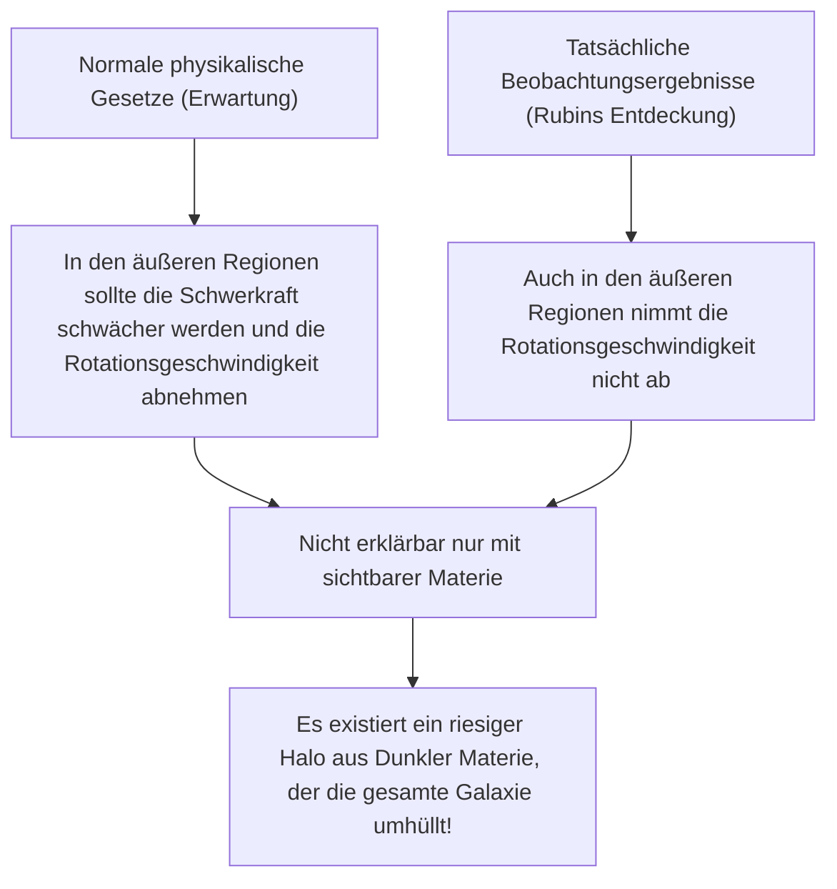
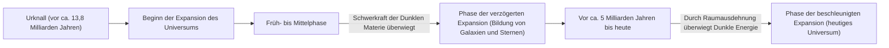

# Dunkle Materie und Dunkle Energie: Die unsichtbaren Kräfte, die das Universum beherrschen

Wenn wir in den Nachthimmel blicken, sind die unzähligen Sterne und Galaxien, die wir sehen, nur die Spitze des Eisbergs des gesamten Universums. Laut dem aktuellen kosmologischen Standardmodell (ΛCDM-Modell) macht die normale Materie, die wir kennen (Sterne, Gas, Planeten und die Atome, aus denen wir selbst bestehen), nur etwa 5% der Energie- und Materiezusammensetzung des gesamten Universums aus. Die restlichen etwa 27% werden von einer unbekannten Entität namens "Dunkle Materie" (Dark Matter) und etwa 68% von "Dunkler Energie" (Dark Energy) eingenommen.

Dieses "unsichtbare Universum", wie wurde es entdeckt und wie konnte es zum größten Rätsel der modernen Physik werden? In diesem Artikel werden wir von seiner Geschichte über die neueste Teilchenphysik bis hin zu hochmodernen Beobachtungsexperimenten alles ausführlich erklären.

## Die historische Entdeckung der Dunklen Materie: Das Rätsel der fehlenden Masse

### Fritz Zwicky und die Theorie der "unsichtbaren Masse"

Das Konzept der Dunklen Materie trat erstmals 1933 auf die wissenschaftliche Bühne. Der in der Schweiz geborene Astronom Fritz Zwicky beobachtete eine riesige Gruppe von Galaxien, den Coma-Galaxienhaufen (Coma Cluster). Er maß die Bewegungsgeschwindigkeiten der einzelnen Galaxien, aus denen der Haufen bestand, und berechnete anhand dieser Geschwindigkeiten, wie viel Schwerkraft der gesamte Galaxienhaufen aufbringen musste, um sich gegenseitig zusammenzuhalten.

Gleichzeitig schätzte er aus der Gesamtmenge des vom Galaxienhaufen ausgestrahlten Lichts die Masse der darin enthaltenen Sterne (sichtbare Masse). Überraschenderweise waren die beobachteten Geschwindigkeiten der Galaxien zu hoch, um nur durch die Schwerkraft der aus dem Licht geschätzten Masse zusammengehalten zu werden. Wenn nur sichtbare Materie existieren würde, hätte der Galaxienhaufen schon längst auseinanderfliegen müssen. Zwicky glaubte, dass eine große Menge einer unsichtbaren, unbekannten Materie existiert, deren Schwerkraft den Galaxienhaufen zusammenhält, und nannte dies "dunkle Materie". In der damaligen Astronomie-Gemeinschaft wurde seine Behauptung jedoch aufgrund von Zweifeln an der Beobachtungsgenauigkeit lange Zeit ignoriert.

### Vera Rubin und das Problem der Rotationskurven von Galaxien

Etwa 40 Jahre nach Zwickys Entdeckung, in den 1970er Jahren, lieferten Beobachtungsergebnisse den entscheidenden Beweis für die Existenz Dunkler Materie. Die amerikanische Astronomin Vera Rubin und ihr Kollege Kent Ford maßen detailliert die "Rotationskurven von Galaxien" von Spiralgalaxien wie der Andromedagalaxie.

In Galaxien mit dicht gedrängten Sternen im Zentrum wird die Schwerkraft schwächer, je weiter man sich vom Zentrum entfernt. Nach dem Keplerschen Gesetz sollte die Rotationsgeschwindigkeit der Sterne in den äußeren Regionen daher langsamer sein (das gleiche Prinzip, nach dem äußere Planeten im Sonnensystem langsamere Bahngeschwindigkeiten haben). Rubins Beobachtungsergebnisse widersprachen jedoch den Erwartungen. Selbst in den äußeren Regionen, weit entfernt vom Zentrum der Galaxie, nahm die Rotationsgeschwindigkeit von Sternen und Gas nicht ab, sondern blieb nahezu konstant.

Der einzige vernünftige Weg, diese "Flachheit der galaktischen Rotationskurven" zu erklären, bestand darin anzunehmen, dass es in einer riesigen Region weit über den sichtbaren Teil der Galaxie hinaus einen unsichtbaren, massiven Klumpen (Dunkle-Materie-Halo) gibt, dessen Schwerkraft die Sterne in den äußeren Regionen mit hoher Geschwindigkeit anzieht. Durch Rubins präzise Beobachtungen wurde Dunkle Materie nicht mehr nur als bloße Hypothese, sondern als eine unumstößliche Realität akzeptiert, die in der modernen Kosmologie nicht ignoriert werden kann.

## Auf der Suche nach der wahren Natur der Dunklen Materie: Die Herausforderung der Teilchenphysik

Dass Dunkle Materie aufgrund der Wirkung der Schwerkraft "da ist", ist sicher, aber was ist ihre "wahre Natur"? Da sie nicht mit Licht (elektromagnetischen Wellen) interagiert, kann sie weder direkt gesehen noch mit Radiowellen oder Röntgenstrahlen erfasst werden. Derzeitige Hauptkandidaten sind unbekannte Elementarteilchen, die über das Standardmodell (derzeit bekannter Rahmen der Elementarteilchen) hinausgehen.

### Kandidat 1: WIMP (Weakly Interacting Massive Particles)

Seit vielen Jahren ist der vielversprechendste Kandidat das WIMP (schwach wechselwirkendes massives Teilchen). Ein WIMP ist, wie der Name schon sagt, ein hypothetisches Teilchen, das Masse hat (Schwerkraft erzeugt), aber nicht mit der elektromagnetischen Kraft oder der starken Kernkraft interagiert und nur durch die "schwache Kernkraft" und "Schwerkraft" mit anderer Materie in Beziehung tritt.
Wenn WIMPs existieren, gibt es einen schönen theoretischen Hintergrund, das "WIMP-Wunder", demzufolge sie im Zustand hoher Temperatur und hoher Dichte des frühen Universums in großen Mengen erzeugt wurden und sich, als das Universum abkühlte, in einer Menge erhielten, die genau mit der Dichte der aktuellen Dunklen Materie übereinstimmt. Da sie sich auch auf natürliche Weise aus erweiterten Modellen der Teilchenphysik wie der Supersymmetrie-Theorie ableiten lassen, haben Experimentalphysiker auf der ganzen Welt intensiv nach WIMPs gesucht.

### Kandidat 2: Axion (Axion)

Ein weiterer vielversprechender Kandidat ist das Axion. Das Axion ist ein extrem leichtes, unentdecktes Teilchen, das ursprünglich eingeführt wurde, um ein weiteres physikalisches Rätsel zu lösen, nämlich die "Verletzung der CP-Symmetrie" bei der starken Wechselwirkung (der Kraft, die Quarks bindet, um Protonen und Neutronen zu bilden).
Während von WIMPs angenommen wird, dass sie eine schwere Masse haben, die zehn- bis tausendmal so groß ist wie die eines Protons, wird angenommen, dass Axionen eine unglaublich leichte Masse haben, die weniger als ein Hundertmillionstel der Masse eines Elektrons beträgt. Wenn sie jedoch in unzähligen Mengen im Weltraum vorhanden sind, können sie, wie Staub, der sich zu einem Berg auftürmt, insgesamt eine riesige Masse erzeugen und sich wie Dunkle Materie verhalten. In den letzten Jahren hat die Aufmerksamkeit für die Axion-Suche stark zugenommen, auch weil die Entdeckung von WIMPs auf Schwierigkeiten stößt.

## Beobachtungsexperimente an vorderster Front: Die Verfolgung der Rätsel des Universums aus der Tiefe der Erde

Es wird erwartet, dass Teilchen der Dunklen Materie (insbesondere WIMPs) selten mit normaler Materie (Atomkernen) kollidieren. Auf der Erdoberfläche gibt es jedoch zu viel Rauschen durch kosmische Strahlung, was es unmöglich macht, solch schwache Kollisionssignale zu erfassen. Daher werden direkte Experimente zur Suche nach Dunkler Materie in tiefen unterirdischen Anlagen durchgeführt, wo dickes Gestein die kosmische Strahlung abschirmen kann.

### XENON-Experimentierprojekt (XENONnT)

Das "XENON"-Projekt, das im italienischen Laboratori Nazionali del Gran Sasso (etwa 1400 Meter unter der Erde) durchgeführt wird, ist das empfindlichste Experiment der Welt zur Suche nach Dunkler Materie mit flüssigem Xenon. Das neueste "XENONnT" füllt etwa 8,6 Tonnen ultrahoch reines flüssiges Xenon in einen riesigen Tank, um die schwachen Lichtblitze (Szintillationslicht) und Elektronen zu erfassen, die emittiert werden, wenn Teilchen der Dunklen Materie mit Xenon-Atomkernen kollidieren. Forschungsgruppen von Universitäten wie der Universität Tokio und der Universität Nagoya in Japan nehmen ebenfalls teil und warten auf Begegnungen mit unbekannten Teilchen in einer Umgebung, in der die Hintergrundgeräusche auf ein Minimum reduziert wurden.

### Von Kamiokande zu Hyper-Kamiokande

Die Anlage tief unter der Kamioka-Mine in der japanischen Präfektur Gifu ist ebenfalls ein weltweites Zentrum für die Beobachtung von Elementarteilchen. "Kamiokande", wo Dr. Masatoshi Koshiba einst Supernova-Neutrinos beobachtete, und "Super-Kamiokande", das die Neutrinooszillation entdeckte, sind berühmt. Es wird jedoch erwartet, dass die im Bau befindliche Anlage der nächsten Generation "Hyper-Kamiokande" und Pläne für die Nachfolge des Experiments zur Suche nach Dunkler Materie "XMASS", das ebenfalls im Untergrund von Kamioka durchgeführt wird, wesentlich zur Aufklärung der dunklen Bestandteile des Universums beitragen werden. Neutrinos selbst haben eine winzige Masse und galten einst als Kandidaten für die Dunkle Materie, gelten aber heute als zu leicht, um die Strukturbildung des Universums zu erklären (sie wären heiße Dunkle Materie). Die in der Neutrinoforschung kultivierte extrem niedrige Radioaktivitätstechnologie und die Technologie der Photomultiplier-Röhren sind jedoch für die Suche nach Dunkler Materie unverzichtbar geworden.

## Die mysteriöse Kraft, die das Universum beschleunigt expandieren lässt: Dunkle Energie (Dark Energy)

Wenn Dunkle Materie die Kraft ist, die "Materie durch Schwerkraft anzieht und Galaxien bildet", ist die "Dunkle Energie" die entgegengesetzte Kraft, die "versucht, das gesamte Universum mit abstoßender Kraft auseinanderzureißen".

### Die Entdeckung der beschleunigten Expansion des Universums

1998 beobachteten zwei Beobachtungsteams, geleitet von Saul Perlmutter, Brian Schmidt und Adam Riess (Nobelpreisträger für Physik 2011), entfernte "Typ-Ia-Supernovae" (die als Standardkerzen im Universum verwendet werden können, da ihre Helligkeit konstant ist) und gaben eine schockierende Tatsache bekannt.
In der bisherigen Kosmologie ging man davon aus, dass das Universum, das mit dem Urknall zu expandieren begann, seine Expansionsgeschwindigkeit durch die gegenseitige Anziehung der Materie aufgrund der Schwerkraft allmählich verringert (sich verzögernd expandiert). Die Beobachtungsergebnisse zeigten jedoch genau das Gegenteil: Die Expansionsgeschwindigkeit des Universums ist heute schneller als in der Vergangenheit, es expandiert also "beschleunigt".

### Die wahre Natur der Dunklen Energie: Einsteins kosmologische Konstante?

Der Raum selbst beschleunigt die Expansion. Um dies zu erklären, wurde die Dunkle Energie eingeführt. Während Dunkle Materie die Eigenschaft hat, an bestimmten Orten im Raum ungleich verteilt zu sein und sich anzusammeln, erfüllt Dunkle Energie den gesamten Weltraum vollkommen gleichmäßig und hat die seltsame Eigenschaft, dass ihre Gesamtmenge mit der Ausdehnung des Raums zunimmt.

Der vielversprechendste Kandidat dafür ist die "kosmologische Konstante (Λ: Lambda)", die Albert Einstein einst in die Gravitationsgleichung der allgemeinen Relativitätstheorie einführte und später als seinen "größten Fehler" zurückzog. Die Idee ist, dass die Energie, die das Vakuum selbst besitzt (Vakuumenergie), als Abstoßungskraft wirkt und das Universum auseinanderdrückt. Zwischen dem von theoretischen Berechnungen der Quantenmechanik vorhergesagten Wert der Vakuumenergie und dem aus astronomischen Beobachtungen abgeleiteten Wert der Dunklen Energie gibt es jedoch eine Diskrepanz von 10 hoch 120 (oder mehr), was ein ungelöstes Problem darstellt, das auch als "die schlimmste Vorhersage in der Geschichte der Physik" bezeichnet wird.

## Fazit: Wir kennen erst 5% des Universums

Dunkle Materie und Dunkle Energie. Die Namen sind ähnlich, aber ihre Rollen im Universum sind völlig verschieden. Dunkle Materie ist das "Skelett", das die Struktur des Universums formt, und der Klebstoff, der Galaxien zusammenhält. Im Gegensatz dazu drückt die Dunkle Energie den Raum selbst auseinander und ist quasi der "Zerstörer" des Universums, der letztendlich alle Galaxien voneinander entfernen wird.

Die Wissenschaft, Technologie und physikalischen Gesetze, die wir aufgebaut haben, sind phänomenal, aber sie gelten nur für 5% der Materie im Universum. Wird jemals der Tag kommen, an dem wir die wahre Natur der restlichen 95% verstehen? In Labors tief unter der Erde oder mit hochmodernen Teleskopen im Weltraum setzen die Menschen ihre mutigen Bemühungen fort, den Schwanz dieses "unsichtbaren Universums" zu fassen zu bekommen.
