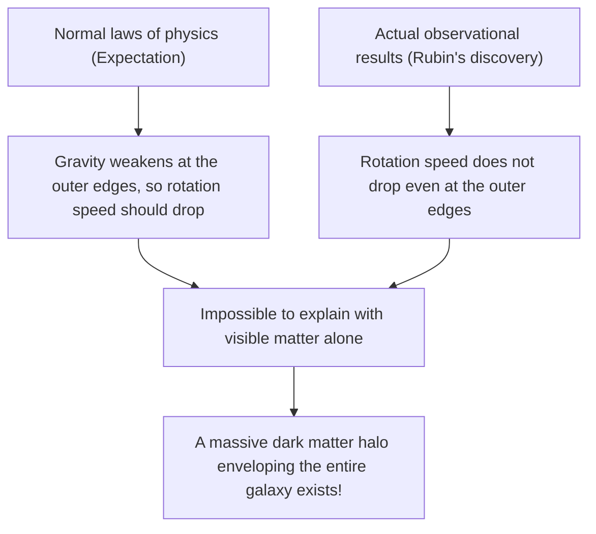
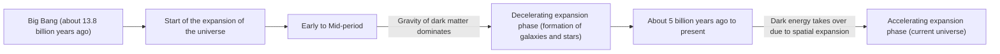

# Dark Matter and Dark Energy: The Invisible Forces Ruling the Universe

When we look up at the night sky, the countless stars and galaxies we see are merely the tip of the iceberg of the entire universe. According to the current standard model of cosmology (the ΛCDM model), the ordinary matter we know (stars, gas, planets, and the atoms that make up ourselves) accounts for only about 5% of the total energy-matter composition of the universe. The remaining approximately 27% is occupied by "Dark Matter," and about 68% by "Dark Energy"—both entities of unknown identity.

How was this "invisible universe" discovered, and how did it come to reign as the greatest mystery of modern physics? In this article, we will thoroughly explain everything from its history to the latest particle physics and cutting-edge observational experiments.

## The Historical Discovery of Dark Matter: The Mystery of the Missing Mass

### Fritz Zwicky and the Proposal of "Invisible Mass"

The concept of dark matter first appeared on the scientific stage in 1933. Swiss-born astronomer Fritz Zwicky was observing the Coma Cluster, a massive grouping of galaxies. He measured the velocities of the individual galaxies that make up the cluster and calculated how much gravity was needed for the entire cluster to hold itself together based on those velocities.

At the same time, he estimated the mass of the stars (visible mass) contained within the cluster from the total amount of light it emitted. Surprisingly, the observed velocities of the galaxies were too fast to be held together solely by the gravity produced by the mass estimated from the light. If only visible matter existed, the galaxy cluster should have flown apart long ago. Zwicky hypothesized that a large amount of invisible, unknown matter existed, and that its gravity was holding the galaxy cluster together. He named this "dunkle Materie" (dark matter). However, due to doubts about the observational accuracy at the time, his claims were largely ignored by the astronomical community for a long time.

### Vera Rubin and the Galaxy Rotation Curve Problem

About 40 years after Zwicky's discovery, entering the 1970s, observational results that decisively established the existence of dark matter were brought forth. American astronomer Vera Rubin and her colleague Kent Ford targeted spiral galaxies such as the Andromeda Galaxy and detailed the "galaxy rotation curves."

In galaxies where stars are densely packed in the center, gravity weakens the further one moves away from the center. Therefore, according to Kepler's laws, the rotation speed of stars in the outer edges should be slower (the same principle that the outer planets in the solar system have slower orbital velocities). However, Rubin's observational results defied expectations. Even in the outer edges far from the center of the galaxy, the rotation speed of stars and gas did not drop, maintaining a nearly constant velocity.

The only rational way to explain this "flatness of galaxy rotation curves" was to assume that a huge, invisible mass (dark matter halo) exists in a vast region extending far beyond the visible parts of the galaxy, and that its gravity is pulling the outer stars at high speeds. Thanks to Rubin's precise observations, dark matter was no longer a mere hypothesis, but became accepted as a solid reality that could not be ignored in modern cosmology.

## In Search of Dark Matter's Identity: The Challenge of Particle Physics

While it is certain from the effects of gravity that dark matter is "there," what exactly is its "identity"? Because it does not interact with light (electromagnetic waves), it cannot be seen directly, nor can it be captured by radio waves or X-rays. The current leading candidates are unknown elementary particles beyond the Standard Model (the framework of elementary particles currently known).

### Candidate 1: WIMP (Weakly Interacting Massive Particles)

For many years, the most prominent candidate has been the WIMP (Weakly Interacting Massive Particle). As the name suggests, a WIMP is a hypothetical particle that has mass (generates gravity) but does not interact via electromagnetic or strong nuclear forces, and is thought to interact with other matter only through the "weak nuclear force" and "gravity."
If WIMPs exist, they would have been created in massive quantities in the high-temperature, high-density state of the early universe. As the universe cooled, the amount remaining would perfectly match the current density of dark matter—a beautiful theoretical background known as the "WIMP Miracle." Since they are naturally derived in extended models of particle physics such as supersymmetry theory, experimental physicists around the world have fiercely competed in the search for WIMPs.

### Candidate 2: Axion

Another leading candidate is the axion. Axions are extremely light, undiscovered particles originally introduced to solve another mystery in physics called "CP violation" in strong interactions (the force that binds quarks together to form protons and neutrons).
While WIMPs are assumed to have a heavy mass tens to thousands of times that of a proton, axions are thought to have an astonishingly light mass—less than a hundred-millionth of an electron. However, if countless numbers of them exist in space, just as many grains of dust can pile up to form a mountain, they can collectively generate a huge mass and act as dark matter. In recent years, as the discovery of WIMPs has encountered difficulties, the attention on the search for axions has risen sharply.

## Frontier Observational Experiments: Chasing the Mysteries of the Universe from Deep Underground

Dark matter particles (especially WIMPs) are expected to rarely collide with ordinary matter (atomic nuclei). However, on the surface, there is too much noise, such as cosmic rays, making it impossible to capture those faint collision signals. Therefore, direct dark matter search experiments are conducted in deep underground facilities where thick bedrock can block cosmic rays.

### The XENON Experiment Project (XENONnT)

The "XENON" project, conducted at Italy's Gran Sasso National Laboratory (about 1,400 meters underground), is the world's most sensitive dark matter search experiment using liquid xenon. In the latest "XENONnT," about 8.6 tons of ultra-high-purity liquid xenon fills a giant tank, attempting to capture the faint light (scintillation light) and electrons emitted when dark matter particles collide with xenon nuclei. Research groups from Japan, such as the University of Tokyo and Nagoya University, are also participating, waiting to encounter unknown particles in an environment where background noise is reduced to the absolute limit.

### The LUX-ZEPLIN (LZ) Experiment and the Ripple of "Higgsino"

Currently, the international collaborative project "LUX-ZEPLIN (LZ) Experiment," using 10 tons of ultra-high-purity liquid xenon, is operating at the underground research facility "SURF," located about 1.6 km deep in South Dakota, USA. Recently, when the LZ experiment analyzed 220 days of observational data collected from March 2023 to April 2024, a single particle interaction was recorded that could not be explained by known background noise, causing a significant ripple in the physics community.

The value of the statistical indicator "sigma (σ)," which shows the probability of chance occurrence, was 2.6, still far short of the 5-sigma standard for a discovery in physics. However, among the cases reported by the LZ experiment so far, it is considered the most promising sign of dark matter. Regarding this event, multiple independent research teams have successively proposed the interpretation that a "Higgsino" (mass around 1.1 TeV)—a dark matter candidate predicted by supersymmetry theory—is involved. It is suggested that the event might have been caused by the "inelastic scattering" of a Higgsino (a scattering in which a portion of the collision's momentum changes the dark matter particle into a slightly heavier state). Whether this will become the first step toward the discovery of the century, or simply fade away as a mere fluctuation, the whole world watches with bated breath as further data is accumulated.

### From Kamiokande to Hyper-Kamiokande

The underground facility in the Kamioka Mine, Gifu Prefecture, Japan, is also a global hub for particle observation. The "Kamiokande," where Dr. Masatoshi Koshiba once observed supernova neutrinos, and the "Super-Kamiokande," which discovered neutrino oscillation, are famous. The next-generation facility "Hyper-Kamiokande," currently under construction, and the successor project to the dark matter search experiment "XMASS," also conducted underground in Kamioka, are expected to greatly contribute to elucidating the dark components of the universe. Neutrinos themselves have a minuscule mass and were once considered dark matter candidates, but it is now known that they are too light to explain the structure formation of the universe (they would be hot dark matter). However, the ultra-low radioactivity technologies and photomultiplier tube technologies cultivated in neutrino research have become indispensable for dark matter searches.

## The Mysterious Force Accelerating the Expansion of the Universe: Dark Energy

If dark matter is the "force that draws matter together by gravity to form galaxies," its polar opposite is "Dark Energy," the "force that attempts to tear the entire universe apart with a repulsive force."

### The Discovery of the Accelerating Expansion of the Universe

In 1998, two observation teams led by Saul Perlmutter, Brian Schmidt, and Adam Riess (2011 Nobel Laureates in Physics) observed distant "Type Ia supernovae (which have a constant brightness and can therefore be used as standard candles for the universe)" and announced a shocking fact.
Until then, cosmology held that the universe, which began expanding with the Big Bang, was gradually slowing its expansion speed (decelerating expansion) due to the gravitational attraction of matter. However, the observational results were exactly the opposite; the expansion speed of the universe was found to be faster now than in the past—in other words, it is "accelerating."

### The Identity of Dark Energy: Einstein's Cosmological Constant?

Space itself is accelerating its expansion. Dark energy was introduced to explain this. While dark matter has the property of clumping together and being localized somewhere in space, dark energy has the strange property of filling every part of the universe completely uniformly, and its total amount increases as space expands.

The most prominent candidate is the "Cosmological Constant (Λ: Lambda)," which Albert Einstein once introduced into the field equations of his general theory of relativity, and later retracted as his "biggest blunder." The idea is that the energy possessed by the vacuum itself (vacuum energy) acts as a repulsive force, pushing the universe apart. However, there is an astronomical (or greater) discrepancy of 10 to the power of 120 times between the value of vacuum energy predicted by theoretical calculations of quantum mechanics and the value of dark energy derived from astronomical observations. This is an unsolved predicament often called the "worst prediction in the history of physics."

## Conclusion: We Still Only Know 5% of the Universe

Dark matter and dark energy. Their names are similar, but their roles in the universe are completely different. Dark matter is the "skeleton" that shapes the structure of the universe, the glue that holds galaxies together. In contrast, dark energy is the universe's "destroyer," pushing space itself apart and eventually driving all galaxies away from each other.

The science, technology, and physical laws we have built are astonishing, but they only apply to the mere 5% of matter in the universe. Will the day ever come when we truly understand what the remaining 95% is made of? Today, whether in deep underground laboratories or with the latest telescopes floating in space, humanity continues its bold challenge to grab hold of the tail of the "invisible universe."
