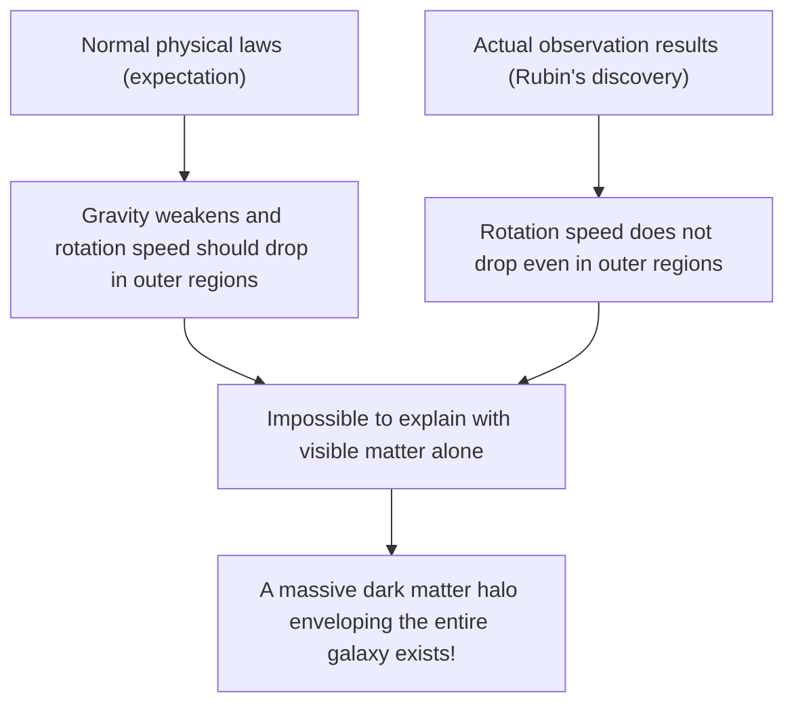
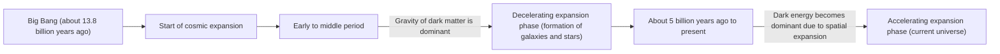

# Dark Matter and Dark Energy: The Invisible Forces Ruling the Universe

When we look up at the night sky, the countless stars and galaxies we see are just the tip of the iceberg of the entire universe. According to the current standard cosmological model (ΛCDM model), ordinary matter as we know it (stars, gas, planets, and the atoms that make up ourselves) accounts for only about 5% of the total energy and matter composition of the universe. The remaining approximately 27% is occupied by an unknown entity called "Dark Matter", and about 68% by "Dark Energy".

How was this "invisible universe" discovered, and how did it come to reign as the greatest mystery in modern physics? In this article, we will thoroughly explain everything from its history to the latest particle physics and cutting-edge observation experiments.

## The Historical Discovery of Dark Matter: The Mystery of Missing Mass

### Fritz Zwicky and the Proposal of "Invisible Mass"

The concept of dark matter first appeared on the scientific stage in 1933. Swiss astronomer Fritz Zwicky was observing a massive cluster of galaxies called the Coma Cluster. He measured the velocities of individual galaxies within the cluster and calculated how much gravitational force the entire cluster needed to hold itself together based on those velocities.

At the same time, he estimated the mass of the stars (visible mass) contained within the cluster from the total amount of light it emitted. Surprisingly, the observed velocities of the galaxies were too fast to be held together solely by the gravity produced by the mass estimated from the light. If only visible matter existed, the galaxy cluster should have flown apart long ago. Zwicky hypothesized that a large amount of invisible, unknown matter existed, and its gravity was holding the cluster together, naming this "dunkle Materie" (dark matter). However, in the astronomy community of the time, his claims were largely ignored for a long time due to doubts about observation accuracy.

### Vera Rubin and the Galaxy Rotation Curve Problem

About 40 years after Zwicky's discovery, in the 1970s, observation results emerged that would definitively confirm the existence of dark matter. American astronomer Vera Rubin and her colleague Kent Ford meticulously measured the "rotation curves" of spiral galaxies, such as the Andromeda Galaxy.

In galaxies where stars are densely packed in the center, gravity weakens the farther away from the center you go. According to Kepler's laws, the rotation speed of stars in the outer regions should be slower (the same principle by which outer planets in our solar system orbit slower). However, Rubin's observation results contradicted expectations. Even in the outer regions far from the galactic center, the rotation speed of stars and gas did not drop, maintaining a nearly constant speed.

The only reasonable way to explain this "flatness of the galaxy rotation curves" was to assume that a massive, invisible clump of mass (dark matter halo) exists in a vast region far beyond the visible part of the galaxy, and its gravity is pulling the outer stars at high speeds. Thanks to Rubin's precise observations, dark matter was no longer just a hypothesis, but accepted as an undeniable reality that cannot be ignored in modern cosmology.

## In Search of the True Identity of Dark Matter: The Challenge of Particle Physics

While it is certain from gravitational effects that dark matter is "there," what exactly is its "true identity"? Because it does not interact with light (electromagnetic waves), it cannot be seen directly or detected with radio waves or X-rays. The current leading candidates are unknown particles beyond the Standard Model (the framework of currently known elementary particles).

### Candidate 1: WIMP (Weakly Interacting Massive Particles)

For a long time, the most promising candidate has been the WIMP (Weakly Interacting Massive Particle). As the name suggests, a WIMP is a hypothetical particle that has mass (generates gravity) but does not interact via the electromagnetic or strong nuclear force, interacting with other matter only through the "weak nuclear force" and "gravity".
If WIMPs exist, there is a beautiful theoretical background called the "WIMP miracle," where they would be produced in large quantities in the high-temperature, high-density state of the early universe, and as the universe cooled, an amount that perfectly matches the current density of dark matter would remain. Because they are also naturally derived in extended models of particle physics such as supersymmetry theory, experimental physicists around the world have been competing fiercely in the search for WIMPs.

### Candidate 2: Axion

Another leading candidate is the axion. The axion was originally introduced to solve another mystery in physics called "CP violation" in the strong interaction (the force that binds quarks to form protons and neutrons), as an extremely light, undiscovered particle.
While WIMPs are assumed to have a heavy mass tens to thousands of times that of a proton, axions are thought to have an astonishingly light mass, less than a hundred millionth of an electron. However, if they exist in countless numbers in space, they can collectively produce a massive amount of mass and act as dark matter, much like dust piling up to form a mountain. In recent years, as the discovery of WIMPs has been difficult, attention to the axion search has grown rapidly.

## Forefront Observation Experiments: Chasing the Mysteries of the Universe from Deep Underground

Dark matter particles (especially WIMPs) are expected to rarely collide with ordinary matter (atomic nuclei). However, on the surface, there is too much noise, such as cosmic rays, making it impossible to detect these weak collision signals. Therefore, direct dark matter detection experiments are conducted in deep underground facilities where thick bedrock can block cosmic rays.

### The XENON Experiment Project (XENONnT)

The "XENON" project, conducted at the Gran Sasso National Laboratory in Italy (about 1,400 meters underground), is the world's most sensitive dark matter search experiment using liquid xenon. The latest "XENONnT" fills a giant tank with about 8.6 tons of ultra-high-purity liquid xenon, attempting to capture the faint light (scintillation light) and electrons emitted when dark matter particles collide with xenon nuclei. Research groups from Japan, such as the University of Tokyo and Nagoya University, are also participating, waiting to encounter unknown particles in an environment where background noise has been reduced to the absolute limit.

### From Kamiokande to Hyper-Kamiokande

The underground facility in the Kamioka mine in Gifu Prefecture, Japan, is also a global hub for particle observation. The "Kamiokande," where Dr. Masatoshi Koshiba once observed supernova neutrinos, and the "Super-Kamiokande," which discovered neutrino oscillation, are famous. The next-generation facility "Hyper-Kamiokande" currently under construction, and the successor project to the dark matter search experiment "XMASS" also conducted underground in Kamioka, are expected to greatly contribute to unraveling the dark components of the universe. Neutrinos themselves have an extremely small mass and were once considered a dark matter candidate, but it is now known that they are too light to explain the formation of cosmic structures (they would be hot dark matter). However, the extremely low radioactivity techniques and photomultiplier tube technologies developed through neutrino research have become indispensable for dark matter searches.

## The Mysterious Force Accelerating the Expansion of the Universe: Dark Energy

If dark matter is "the force that attracts matter through gravity and forms galaxies," its polar opposite, "the force trying to tear the entire universe apart with repulsive force," is "Dark Energy."

### The Discovery of the Accelerating Expansion of the Universe

In 1998, two observation teams led by Saul Perlmutter, Brian Schmidt, and Adam Riess (who won the 2011 Nobel Prize in Physics) observed distant "Type Ia supernovae" (which can be used as standard candles in the universe because their absolute brightness is constant) and announced a shocking fact.
In the cosmology up to that point, it was thought that the universe, which began expanding with the Big Bang, was gradually slowing down its expansion rate (decelerating expansion) due to the gravitational attraction between matter. However, the observation results were the exact opposite: the expansion rate of the universe is faster now than in the past, meaning it was found to be undergoing "accelerating expansion."

### The True Identity of Dark Energy: Einstein's Cosmological Constant?

Space itself is accelerating the expansion. Dark energy was introduced to explain this. Unlike dark matter, which has the property of clumping together in specific places within space, dark energy has the strange property of completely and evenly filling all of space, and as space expands, its total amount also increases.

The most promising candidate is the "cosmological constant (Λ: lambda)," which Albert Einstein once introduced into the gravitational equations of general relativity and later retracted as his "biggest blunder." This is the idea that the energy inherent in the vacuum itself (vacuum energy) acts as a repulsive force, pushing the universe apart. However, there is a discrepancy of a factor of 10 to the power of 120 (or more) between the value of vacuum energy predicted by theoretical calculations in quantum mechanics and the value of dark energy derived from astronomical observations. This is an unsolved problem often called the "worst prediction in the history of physics."

## Conclusion: We Still Only Know 5% of the Universe

Dark matter and dark energy. While their names are similar, their roles in the universe are completely different. Dark matter is the "skeleton" that shapes the structure of the universe, the glue that holds galaxies together. On the other hand, dark energy is the "destroyer" of the universe, pushing space itself apart and eventually driving all galaxies away from each other.

The science, technology, and physical laws we have built are astonishing, but they apply to only a mere 5% of the matter in the universe. Will the day ever come when we understand the true nature of what the remaining 95% is made of? Deep underground in laboratories, or out in space with cutting-edge telescopes, humanity continues its bold challenge to grasp the tail of the "invisible universe" today.
