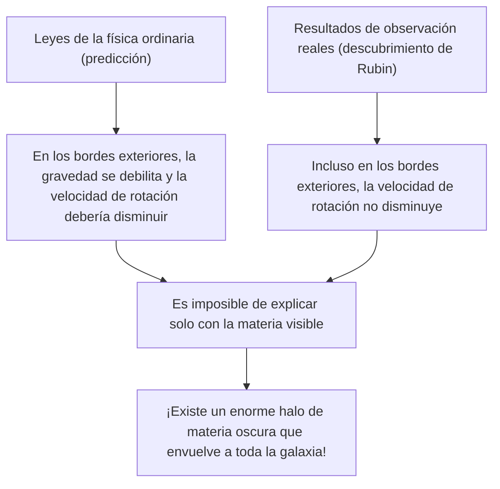
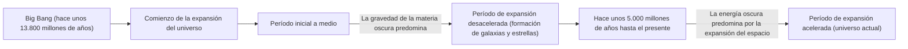

# Materia oscura y energía oscura: Las fuerzas invisibles que gobiernan el universo

Cuando miramos al cielo nocturno, la innumerable cantidad de estrellas y galaxias que vemos son solo la punta del iceberg de todo el universo. Según el modelo cosmológico estándar actual (modelo ΛCDM), la materia ordinaria que conocemos (estrellas, gas, planetas y los átomos de los que estamos hechos) representa solo alrededor del 5% de la proporción de energía y materia de todo el universo. El aproximadamente 27% restante está ocupado por lo que se llama "materia oscura" y un 68% por "energía oscura", entidades de identidad desconocida.

Este "universo invisible", ¿cómo se descubrió y cómo llegó a reinar como el mayor misterio de la física moderna? En este artículo, explicaremos exhaustivamente desde su historia hasta la física de partículas más reciente y los experimentos de observación más avanzados.

## El descubrimiento histórico de la materia oscura: El misterio de la masa perdida

### Fritz Zwicky y la propuesta de la "masa invisible"

El concepto de materia oscura apareció por primera vez en el escenario de la ciencia en 1933. El astrónomo de origen suizo Fritz Zwicky estaba observando un grupo masivo de galaxias llamado Cúmulo de Coma. Él midió las velocidades de movimiento de las galaxias individuales que componen el cúmulo y, a partir de esas velocidades, calculó cuánta gravedad necesitaba el cúmulo en su conjunto para mantenerlas unidas entre sí.

Al mismo tiempo, estimó la masa de las estrellas (masa visible) contenidas en él a partir de la cantidad total de luz emitida por el cúmulo de galaxias. Sorprendentemente, las velocidades de movimiento de las galaxias observadas eran demasiado rápidas para ser retenidas únicamente por la gravedad creada por la masa estimada a partir de la luz. Si solo existiera la materia visible, el cúmulo de galaxias se habría dispersado hace mucho tiempo. Zwicky pensó que existía una gran cantidad de materia desconocida e invisible, cuya gravedad mantenía unido al cúmulo, y la llamó "dunkle Materie" (materia oscura). Sin embargo, en la comunidad astronómica de la época, su afirmación fue ignorada durante mucho tiempo debido a dudas sobre la precisión de las observaciones.

### Vera Rubin y el problema de la curva de rotación galáctica

Aproximadamente 40 años después del descubrimiento de Zwicky, a principios de la década de 1970, se aportaron resultados de observación que determinaron la existencia de la materia oscura. La astrónoma estadounidense Vera Rubin y su colega Kent Ford midieron en detalle la "curva de rotación galáctica" en galaxias espirales como la galaxia de Andrómeda.

En las galaxias con estrellas concentradas en el centro, la gravedad se debilita a medida que uno se aleja del centro, por lo que, de acuerdo con las leyes de Kepler, la velocidad de rotación de las estrellas en los bordes exteriores debería disminuir (el mismo principio que en el sistema solar, donde los planetas más alejados tienen velocidades orbitales más lentas). Sin embargo, los resultados de la observación de Rubin fueron contrarios a lo esperado. Incluso en los bordes exteriores lejos del centro de la galaxia, las velocidades de rotación de las estrellas y el gas no disminuían, manteniendo una velocidad casi constante.

La única forma racional de explicar esta "planitud de la curva de rotación galáctica" era asumir que en una vasta región que trasciende con creces la parte visible de la galaxia, existía una enorme masa invisible (halo de materia oscura), cuya gravedad estaba tirando a alta velocidad de las estrellas en los bordes exteriores. Gracias a las precisas observaciones de Rubin, la materia oscura ya no era solo una hipótesis, sino que llegó a ser aceptada como una realidad firme imposible de ignorar en la cosmología moderna.

## En busca de la verdadera identidad de la materia oscura: El desafío de la física de partículas

El hecho de que la materia oscura "está ahí" es seguro por los efectos de la gravedad, pero entonces, ¿cuál es su "verdadera identidad"? Dado que no interactúa con la luz (ondas electromagnéticas), no puede verse directamente ni captarse mediante ondas de radio o rayos X. El principal candidato actual es una partícula elemental desconocida que va más allá del Modelo Estándar (el marco actual de partículas elementales conocidas).

### Candidato 1: WIMP (Weakly Interacting Massive Particles)

Durante muchos años, el candidato más fuerte ha sido el WIMP (Partículas Masivas de Interacción Débil). Como sugiere su nombre, los WIMP son partículas hipotéticas que tienen masa (generan gravedad) pero no interactúan con la fuerza electromagnética o la fuerza nuclear fuerte, relacionándose con otra materia solo a través de la "fuerza nuclear débil" y la "gravedad".
Si los WIMP existieran, se habrían generado en grandes cantidades en el estado de alta temperatura y alta densidad del universo primitivo, y a medida que el universo se enfrió, quedó una cantidad que coincide perfectamente con la densidad actual de la materia oscura, un hermoso trasfondo teórico llamado "el milagro de los WIMP". Debido a que también se derivan naturalmente de modelos extendidos de la física de partículas como la teoría de la supersimetría, los físicos experimentales de todo el mundo han estado compitiendo ferozmente en la búsqueda de los WIMP.

### Candidato 2: Axión (Axion)

Otro candidato fuerte es el axión. Originalmente, el axión es una partícula no descubierta extremadamente ligera que se introdujo para resolver otro misterio de la física, la "violación de simetría CP" en la interacción fuerte (la fuerza que une los quarks para formar protones y neutrones).
Mientras que se supone que los WIMP tienen una masa pesada que es de docenas a miles de veces la de un protón, se cree que los axiones tienen una masa asombrosamente ligera de menos de cientos de millones de veces la de un electrón. Sin embargo, si existen innumerables en el espacio, pueden generar una masa enorme en su conjunto y actuar como materia oscura, al igual que los granos de polvo pueden formar una montaña. En los últimos años, con la dificultad de descubrir los WIMP, la atención hacia la búsqueda de axiones ha aumentado drásticamente.

## Experimentos de observación de vanguardia: Persiguiendo los misterios del universo desde las profundidades del subsuelo

Se espera que las partículas de materia oscura (especialmente los WIMP) colisionen raramente con la materia ordinaria (núcleos atómicos). Sin embargo, en la superficie de la Tierra hay demasiado ruido proveniente de rayos cósmicos y similares, lo que hace imposible captar estas débiles señales de colisión. Por lo tanto, los experimentos de búsqueda directa de materia oscura se llevan a cabo en instalaciones subterráneas profundas donde los gruesos cimientos rocosos pueden bloquear los rayos cósmicos.

### Proyecto de experimento XENON (XENONnT)

El proyecto "XENON", que se lleva a cabo en el Laboratorio Nacional del Gran Sasso en Italia (aproximadamente a 1400 metros bajo tierra), es el experimento de búsqueda de materia oscura más sensible del mundo que utiliza xenón líquido. En el último "XENONnT", se llena un tanque gigante con unas 8.6 toneladas de xenón líquido ultrapuro, intentando captar la débil luz (luz de centelleo) y los electrones emitidos cuando una partícula de materia oscura colisiona con un núcleo de xenón. Grupos de investigación japoneses de la Universidad de Tokio, la Universidad de Nagoya, entre otros, también participan, esperando encontrar partículas desconocidas en un entorno donde el ruido de fondo se reduce al límite.

### De Kamiokande a Hyper-Kamiokande

Las instalaciones subterráneas de la mina de Kamioka en la prefectura de Gifu, Japón, también son un centro mundial para la observación de partículas elementales. Son famosos el antiguo "Kamiokande", donde el Dr. Masatoshi Koshiba observó los neutrinos de supernovas, y el "Super-Kamiokande", que descubrió la oscilación de neutrinos. Actualmente se espera que las instalaciones de próxima generación en construcción, "Hyper-Kamiokande", así como los proyectos sucesores del experimento de búsqueda de materia oscura "XMASS" también en el subsuelo de Kamioka, contribuyan en gran medida a esclarecer los componentes oscuros del universo. Los neutrinos en sí mismos tienen una masa extremadamente pequeña y alguna vez fueron considerados candidatos a la materia oscura, pero ahora se sabe que son demasiado livianos para explicar la formación de estructuras del universo (se convertirían en materia oscura caliente). Sin embargo, las tecnologías de radiactividad extremadamente baja y la tecnología de tubos fotomultiplicadores cultivadas en la investigación de neutrinos se han vuelto indispensables para la búsqueda de la materia oscura.

## La fuerza misteriosa que acelera la expansión del universo: Energía oscura

Si la materia oscura es "la fuerza que atrae la materia y forma galaxias a través de la gravedad", entonces en el polo opuesto, "la fuerza que intenta desgarrar todo el universo con fuerza repulsiva" es la "energía oscura".

### El descubrimiento de la expansión acelerada del universo

En 1998, dos equipos de observación dirigidos por Saul Perlmutter, Brian Schmidt y Adam Riess (ganadores del Premio Nobel de Física en 2011) observaron lejanas "supernovas de tipo Ia (que pueden usarse como candelas estándar del universo debido a su luminosidad constante)" y anunciaron un hecho impactante.
En la cosmología hasta ese momento, se creía que el universo que comenzó a expandirse con el Big Bang estaba disminuyendo gradualmente su velocidad de expansión (expansión desacelerada) debido a la atracción gravitatoria entre las sustancias. Sin embargo, los resultados de la observación mostraron exactamente lo contrario: la velocidad de expansión del universo es ahora más rápida que en el pasado, es decir, se ha descubierto que está en "expansión acelerada".

### La verdadera identidad de la energía oscura: ¿La constante cosmológica de Einstein?

El espacio en sí está acelerando la expansión. La energía oscura se introdujo para explicar esto. A diferencia de la materia oscura, que tiene la propiedad de distribuirse de manera desigual y acumularse en algún lugar del espacio, la energía oscura tiene la extraña propiedad de llenar cada rincón del espacio exterior de manera completamente uniforme, y su cantidad total aumenta a medida que el espacio se expande.

Su candidato más fuerte es la "constante cosmológica (Λ: lambda)", que Albert Einstein una vez introdujo en la ecuación del campo gravitatorio de la teoría de la relatividad general, y que luego retractó como "el mayor error de mi vida". Es la idea de que la energía inherente al vacío mismo (la energía del vacío) actúa como una fuerza de repulsión que empuja y expande el universo. Sin embargo, hay una desviación astronómica (o mayor) de 10 a la potencia de 120 entre el valor de la energía del vacío predicho por los cálculos teóricos de la mecánica cuántica y el valor de la energía oscura derivado de las observaciones astronómicas, un problema sin resolver que también es llamado "la peor predicción en la historia de la física".

## Conclusión: Todavía conocemos solo el 5% del universo

Materia oscura y energía oscura. Aunque sus nombres son similares, sus roles en el universo son completamente diferentes. La materia oscura es el "esqueleto" que da forma a la estructura del universo y el pegamento que mantiene unidas a las galaxias. Por el contrario, la energía oscura se puede llamar el "destructor" del universo que empuja el espacio mismo, y eventualmente alejará a todas las galaxias.

La ciencia, la tecnología y las leyes de la física que hemos construido son asombrosas, pero solo se aplican al 5% de la materia del universo. ¿Llegará el día en que comprendamos verdaderamente de qué está hecho el 95% restante? En laboratorios en las profundidades del subsuelo o con los últimos telescopios flotando en el espacio exterior, la humanidad continúa hoy su valiente desafío para aferrarse a la cola de este "universo invisible".
