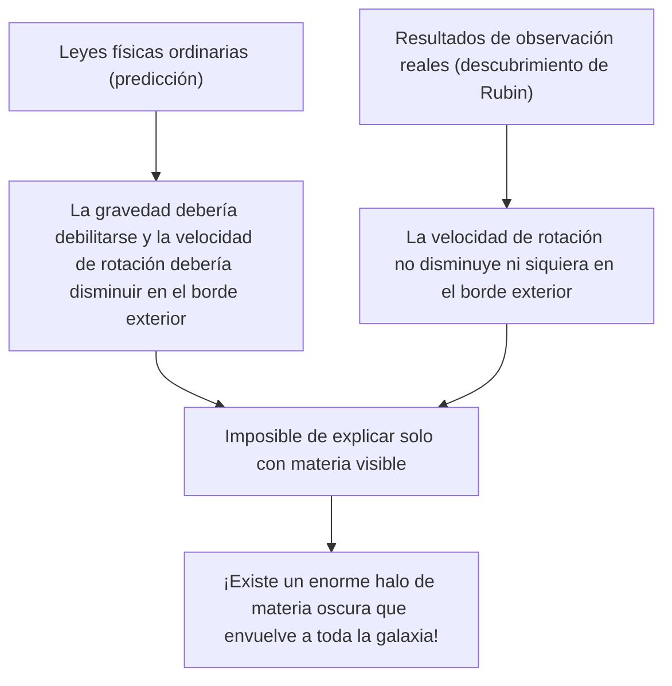
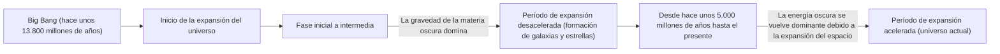

# Materia Oscura y Energía Oscura: Las Fuerzas Invisibles que Gobiernan el Universo

Cuando miramos al cielo nocturno, las innumerables estrellas y galaxias que vemos son solo la punta del iceberg de todo el universo. Según el modelo cosmológico estándar actual (modelo ΛCDM), la materia ordinaria que conocemos (como estrellas, gases, planetas y los átomos que nos componen a nosotros mismos) representa solo alrededor del 5% de la composición total de energía y materia del universo. El aproximadamente 27% restante está compuesto por la "materia oscura" y un 68% por la "energía oscura", entidades de identidad desconocida.

¿Cómo se descubrió este "universo invisible" y llegó a reinar como el mayor misterio de la física moderna? En este artículo, explicaremos exhaustivamente desde su historia hasta la física de partículas más reciente y los experimentos de observación de vanguardia.

## El descubrimiento histórico de la materia oscura: El misterio de la masa perdida

### Fritz Zwicky y la propuesta de la "masa invisible"

El concepto de materia oscura apareció por primera vez en el escenario científico en 1933. El astrónomo suizo Fritz Zwicky estaba observando un enorme grupo de galaxias llamado Cúmulo de Coma (Coma Cluster). Él midió la velocidad de movimiento de las galaxias individuales que componen el cúmulo y, a partir de esas velocidades, calculó cuánta gravedad era necesaria para que todo el cúmulo se mantuviera unido.

Al mismo tiempo, estimó la masa de las estrellas contenidas allí (masa visible) a partir de la cantidad total de luz emitida por el cúmulo. Sorprendentemente, la velocidad de movimiento de las galaxias observadas era demasiado rápida para ser retenida solo por la gravedad generada por la masa estimada a partir de la luz. Si solo existiera la materia visible, el cúmulo de galaxias se habría desintegrado y dispersado hace mucho tiempo. Zwicky pensó que existía una gran cantidad de materia desconocida invisible y que su gravedad mantenía unido al cúmulo de galaxias, a lo cual llamó "dunkle Materie" (materia oscura). Sin embargo, en la comunidad astronómica de la época, sus afirmaciones fueron ignoradas durante mucho tiempo debido a dudas sobre la precisión de las observaciones, entre otras cosas.

### Vera Rubin y el problema de las curvas de rotación galáctica

Aproximadamente 40 años después del descubrimiento de Zwicky, en la década de 1970, se obtuvieron resultados de observación que determinaron la existencia de la materia oscura. La astrónoma estadounidense Vera Rubin y su colega Kent Ford midieron detalladamente las "curvas de rotación galáctica" enfocándose en galaxias espirales como la Galaxia de Andrómeda.

En las galaxias donde las estrellas están densamente concentradas en el centro, la gravedad se debilita a medida que nos alejamos del centro, por lo que de acuerdo con las leyes de Kepler, la velocidad de rotación de las estrellas en los bordes exteriores debería disminuir (el mismo principio por el cual los planetas exteriores en el sistema solar tienen velocidades orbitales más lentas). Sin embargo, los resultados de observación de Rubin fueron contrarios a las expectativas. Incluso en los bordes exteriores lejanos del centro galáctico, la velocidad de rotación de las estrellas y los gases no disminuía, manteniendo una velocidad casi constante.

La única forma racional de explicar esta "planitud de la curva de rotación galáctica" era asumir que en una vasta región que excede con creces la parte visible de la galaxia, existe una enorme masa invisible (halo de materia oscura), y que su gravedad atrae a las estrellas en el borde exterior a alta velocidad. Gracias a las meticulosas observaciones de Rubin, la materia oscura ya no era solo una hipótesis, sino que llegó a ser aceptada como una realidad firme que no se puede ignorar en la cosmología moderna.

## En busca de la verdadera identidad de la materia oscura: El desafío de la física de partículas

El hecho de que la materia oscura "está ahí" es seguro debido a la acción de la gravedad, pero entonces, ¿cuál es su "verdadera identidad"? Dado que no interactúa con la luz (ondas electromagnéticas), no se puede ver directamente ni captar con ondas de radio o rayos X. El candidato principal actual es una partícula elemental desconocida que va más allá del Modelo Estándar (el marco de las partículas elementales conocidas actualmente).

### Candidato 1: WIMP (Weakly Interacting Massive Particles)

Durante muchos años, el candidato más prometedor han sido las WIMP (Partículas Masivas que Interactúan Débilmente). Como su nombre lo indica, las WIMP son partículas hipotéticas que tienen masa (generan gravedad), pero no interactúan con la fuerza electromagnética ni con la fuerza nuclear fuerte, y se relacionan con otras materias solo a través de la "fuerza nuclear débil" y la "gravedad".
Si existieran las WIMP, hay un hermoso trasfondo teórico llamado el "milagro WIMP", según el cual se generaron en grandes cantidades en el estado de alta temperatura y alta densidad del universo primitivo, y a medida que el universo se enfrió, quedó una cantidad que coincide exactamente con la densidad actual de la materia oscura. Dado que también se derivan naturalmente de modelos extendidos de física de partículas, como la teoría de la supersimetría, los físicos experimentales de todo el mundo han estado compitiendo en la búsqueda de WIMP.

### Candidato 2: Axión (Axion)

Otro candidato prometedor es el axión. Originalmente, el axión es una partícula no descubierta extremadamente ligera introducida para resolver otro misterio de la física llamado la "violación de la simetría CP" en la interacción fuerte (la fuerza que une los quarks para formar protones y neutrones).
Mientras que se supone que los WIMP tienen una masa pesada de decenas a miles de veces la de un protón, se cree que el axión tiene una masa increíblemente ligera de menos de cientos de millones de veces la de un electrón. Sin embargo, si existen innumerables en el espacio, así como el polvo se acumula para formar una montaña, pueden generar una masa enorme en su conjunto y actuar como materia oscura. En los últimos años, con la dificultad de encontrar WIMP, la atención hacia la búsqueda de axiones ha aumentado drásticamente.

## Experimentos de observación en la vanguardia: Persiguiendo los misterios del universo desde las profundidades de la tierra

Se espera que las partículas de materia oscura (especialmente los WIMP) colisionen raramente con la materia ordinaria (núcleos atómicos). Sin embargo, en la superficie de la Tierra hay demasiado ruido, como los rayos cósmicos, por lo que es imposible captar esas débiles señales de colisión. Por lo tanto, los experimentos de búsqueda directa de materia oscura se llevan a cabo en instalaciones subterráneas profundas donde los gruesos lechos de roca pueden bloquear los rayos cósmicos.

### Proyecto de experimento XENON (XENONnT)

El proyecto "XENON", que se lleva a cabo en el Laboratorio Nacional del Gran Sasso en Italia (a unos 1400 metros bajo tierra), es el experimento de búsqueda de materia oscura con la mayor sensibilidad del mundo utilizando xenón líquido. En el último "XENONnT", llenan un tanque gigante con unas 8.6 toneladas de xenón líquido de pureza ultra alta y tratan de capturar la débil luz (luz de centelleo) y los electrones emitidos cuando una partícula de materia oscura choca con el núcleo atómico del xenón. Grupos de investigación de Japón, como la Universidad de Tokio y la Universidad de Nagoya, también están participando, esperando un encuentro con partículas desconocidas en un entorno donde el ruido de fondo se ha reducido al límite.

### El experimento LUX-ZEPLIN (LZ) y las repercusiones del "Higgsino"

Actualmente, en la instalación de investigación "SURF", ubicada a unos 1.6 km bajo tierra en Dakota del Sur, Estados Unidos, el proyecto internacional conjunto "experimento LUX-ZEPLIN (LZ)", que utiliza 10 toneladas de xenón líquido de pureza ultra alta, está en funcionamiento. Recientemente, cuando este experimento LZ analizó los datos de observación de 220 días recopilados entre marzo de 2023 y abril de 2024, se registró una interacción de una sola partícula que no se puede explicar por el ruido de fondo conocido, lo que ha causado grandes repercusiones en la comunidad física.

El valor del índice estadístico "sigma (σ)", que indica la probabilidad de ocurrencia aleatoria, es de 2.6, lo cual está aún lejos de los 5 sigma que se consideran el estándar de descubrimiento en física. Sin embargo, se considera el indicio más sólido de materia oscura entre los casos reportados en el experimento LZ hasta ahora. Con respecto a este evento, múltiples equipos de investigación independientes han propuesto sucesivamente la interpretación de que el "Higgsino" (con una masa de aproximadamente 1.1 TeV), un candidato de materia oscura predicho por la teoría de la supersimetría, está involucrado. Dicen que existe la posibilidad de que sea un evento causado por la "dispersión inelástica (una dispersión en la que parte de la fuerza de la colisión cambia la partícula de materia oscura a un estado ligeramente más pesado)" del Higgsino. Con la acumulación de más datos en el futuro, el mundo entero está observando con gran expectación si este será el primer paso del descubrimiento del siglo o si simplemente desaparecerá como una fluctuación.

### Desde el Kamiokande hasta el Hyper-Kamiokande

Las instalaciones subterráneas en la mina Kamioka de la prefectura de Gifu en Japón también son centros mundiales para la observación de partículas elementales. El "Kamiokande", donde el Dr. Masatoshi Koshiba observó una vez los neutrinos de una supernova, y el "Super-Kamiokande", que descubrió la oscilación de los neutrinos, son famosos, pero también se espera que instalaciones de próxima generación actualmente en construcción como el "Hyper-Kamiokande", y proyectos sucesores al experimento de búsqueda de materia oscura "XMASS", que también se lleva a cabo en el subsuelo de Kamioka, contribuyan en gran medida a esclarecer los componentes oscuros del universo. Los propios neutrinos tienen una masa extremadamente pequeña y alguna vez fueron considerados candidatos para la materia oscura, pero ahora se sabe que son demasiado ligeros para explicar la formación de estructuras en el universo (se convertirían en materia oscura caliente). Sin embargo, la tecnología de radiactividad extremadamente baja y la tecnología de tubos fotomultiplicadores cultivada en la investigación de neutrinos se han vuelto indispensables para la búsqueda de materia oscura.

## La fuerza misteriosa que acelera la expansión del universo: La energía oscura

Si la materia oscura es la "fuerza que atrae la materia a través de la gravedad y forma galaxias", entonces la "energía oscura" es la fuerza diametralmente opuesta que "intenta destrozar todo el universo con una fuerza repulsiva".

### El descubrimiento de la expansión acelerada del universo

En 1998, dos equipos de observación dirigidos por Saul Perlmutter, Brian Schmidt y Adam Riess (ganadores del Premio Nobel de Física en 2011) observaron "supernovas de tipo Ia (que se pueden usar como candelas estándar del universo porque su brillo es constante)" distantes y anunciaron un hecho impactante.
En la cosmología hasta ese entonces, se pensaba que el universo, que comenzó a expandirse con el Big Bang, estaba disminuyendo gradualmente su velocidad de expansión (expandiéndose de forma desacelerada) debido a la atracción gravitatoria entre las materias. Sin embargo, los resultados de observación fueron exactamente opuestos; se descubrió que la velocidad de expansión del universo es más rápida ahora que en el pasado, es decir, está en "expansión acelerada".

### La identidad de la energía oscura: ¿La constante cosmológica de Einstein?

El propio espacio está acelerando la expansión. Para explicar esto, se introdujo la energía oscura. Mientras que la materia oscura tiene la propiedad de distribuirse de forma desigual y acumularse en algún lugar del espacio, la energía oscura tiene la extraña propiedad de llenar todo el espacio exterior de manera completamente uniforme y, a medida que el espacio se expande, su cantidad total también aumenta.

El candidato más fuerte para ello es la "constante cosmológica (Λ: Lambda)" que Albert Einstein introdujo una vez en la ecuación de la gravedad de la relatividad general, y que luego retiró como "el mayor error de mi vida". Es la idea de que la energía que el propio vacío posee (energía del vacío) actúa como una fuerza de repulsión (fuerza repulsiva) y empuja el universo hacia afuera. Sin embargo, hay una discrepancia astronómica (o más) de 10 elevado a la 120 veces entre el valor de la energía del vacío predicho por los cálculos teóricos de la mecánica cuántica y el valor de la energía oscura derivado de las observaciones astronómicas, y esto es un problema difícil no resuelto también llamado "la peor predicción en la historia de la física".

## Conclusión: Solo conocemos el 5% del universo

Materia oscura y energía oscura. Los nombres son similares, pero su papel en el universo es completamente diferente. La materia oscura es el "esqueleto" que forma la estructura del universo y el pegamento que mantiene unidas a las galaxias. Por el contrario, la energía oscura es una existencia que también se puede llamar el "destructor" del universo, que expande el espacio mismo y finalmente alejará a todas las galaxias.

La ciencia y tecnología y las leyes físicas que hemos construido son asombrosas, pero solo se pueden aplicar a un mero 5% de la materia en el universo. ¿Llegará el día en que comprendamos la verdadera naturaleza del 95% restante y de qué está hecho? Hoy, en laboratorios subterráneos profundos, o con los últimos telescopios flotando en el espacio exterior, la humanidad continúa su valiente desafío para agarrar la cola del "universo invisible".
