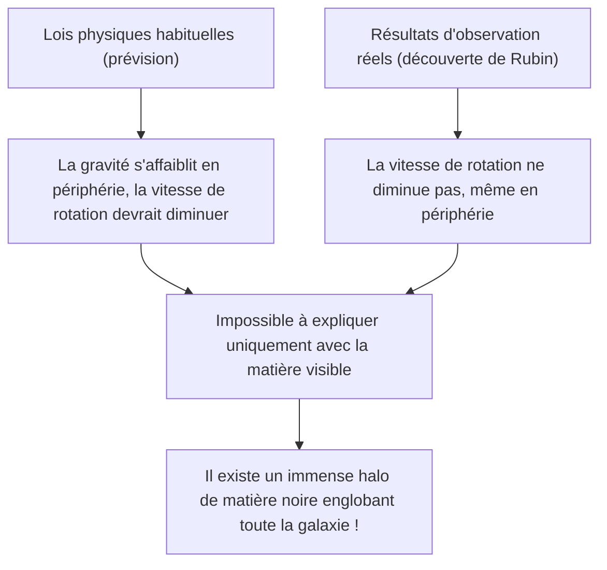
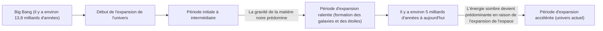

# Matière noire et énergie sombre : les forces invisibles qui gouvernent l'univers

Lorsque nous levons les yeux vers le ciel nocturne, les innombrables étoiles et galaxies que nous voyons ne sont que la partie émergée de l'iceberg de l'univers tout entier. Selon le modèle cosmologique standard actuel (modèle ΛCDM), la matière ordinaire que nous connaissons (étoiles, gaz, planètes et les atomes qui nous composent) ne représente qu'environ 5 % de la composition totale en énergie et en matière de l'univers. Les 95 % restants sont constitués d'entités inconnues : environ 27 % de « matière noire » (dark matter) et environ 68 % d'« énergie sombre » (dark energy).

Comment cet « univers invisible » a-t-il été découvert et comment est-il devenu le plus grand mystère de la physique moderne ? Dans cet article, nous expliquerons tout en détail, de son histoire à la physique des particules la plus récente, en passant par les expériences d'observation à la pointe de la technologie.

## La découverte historique de la matière noire : le mystère de la masse manquante

### Fritz Zwicky et la proposition de la « masse invisible »

Le concept de matière noire est apparu pour la première fois sur la scène scientifique en 1933. L'astronome d'origine suisse Fritz Zwicky observait un gigantesque amas de galaxies appelé l'amas de la Chevelure de Bérénice (Coma Cluster). Il a mesuré la vitesse de déplacement des galaxies individuelles composant l'amas, et à partir de ces vitesses, il a calculé la force gravitationnelle nécessaire pour que l'amas tout entier reste uni.

Simultanément, il a estimé la masse des étoiles qu'il contenait (masse visible) à partir de la quantité totale de lumière émise par l'amas de galaxies. Étonnamment, la vitesse de déplacement observée des galaxies était trop rapide pour être retenue uniquement par la gravité produite par la masse estimée à partir de la lumière. S'il n'y avait que de la matière visible, l'amas de galaxies se serait dispersé depuis longtemps. Zwicky a pensé qu'une grande quantité de matière inconnue et invisible était présente, et que sa gravité maintenait l'amas de galaxies ensemble, ce qu'il a nommé « dunkle Materie » (matière noire). Cependant, à l'époque, la communauté astronomique a longtemps ignoré ses affirmations, doutant notamment de la précision des observations.

### Vera Rubin et le problème des courbes de rotation des galaxies

Environ 40 ans après la découverte de Zwicky, dans les années 1970, des observations décisives confirmant l'existence de la matière noire ont été apportées. L'astronome américaine Vera Rubin et son collègue Kent Ford ont mesuré en détail les « courbes de rotation des galaxies » en ciblant des galaxies spirales comme la galaxie d'Andromède.

Dans les galaxies où les étoiles sont concentrées au centre, la gravité s'affaiblit à mesure que l'on s'éloigne du centre. Selon les lois de Kepler, la vitesse de rotation des étoiles dans les régions périphériques devrait donc ralentir (c'est le même principe que dans le système solaire, où les planètes extérieures orbitent plus lentement). Cependant, les résultats des observations de Rubin ont contredit ces attentes. Même dans les régions périphériques éloignées du centre de la galaxie, la vitesse de rotation des étoiles et des gaz ne diminuait pas et restait presque constante.

La seule façon rationnelle d'expliquer cette « planéité des courbes de rotation des galaxies » était de supposer l'existence d'une masse géante et invisible (halo de matière noire) s'étendant dans une vaste région bien au-delà de la partie visible de la galaxie, dont la gravité tire les étoiles périphériques à grande vitesse. Grâce aux observations précises de Rubin, la matière noire n'était plus une simple hypothèse, mais a été acceptée comme une réalité incontestable ne pouvant être ignorée dans la cosmologie moderne.

## À la recherche de la véritable nature de la matière noire : le défi de la physique des particules

Il est certain que la matière noire « est là » en raison de ses effets gravitationnels, mais quelle est sa « véritable nature » ? Puisqu'elle n'interagit pas avec la lumière (ondes électromagnétiques), il est impossible de la voir directement ou de la détecter avec des ondes radio ou des rayons X. Le candidat actuel le plus probable est une particule élémentaire inconnue, au-delà du modèle standard (le cadre actuel des particules élémentaires connues).

### Candidat 1 : les WIMP (Weakly Interacting Massive Particles)

Pendant de nombreuses années, le candidat considéré comme le plus prometteur a été les WIMP (particules massives interagissant faiblement). Comme leur nom l'indique, les WIMP sont des particules hypothétiques qui ont une masse (elles produisent de la gravité), mais qui n'interagissent pas par la force électromagnétique ou l'interaction forte, et ne se lient aux autres matières que par l'« interaction faible » et la « gravité ».
S'ils existent, les WIMP auraient été produits en grande quantité dans l'état dense et à haute température de l'univers primordial. Au fur et à mesure que l'univers s'est refroidi, il en serait resté une quantité correspondant exactement à la densité actuelle de la matière noire. C'est ce qu'on appelle le « miracle des WIMP », un contexte théorique très élégant. Comme ils sont également dérivés naturellement dans des modèles étendus de la physique des particules tels que la théorie de la supersymétrie, les physiciens expérimentaux du monde entier se livrent une concurrence féroce pour les découvrir.

### Candidat 2 : l'Axion (Axion)

Un autre candidat très sérieux est l'axion. À l'origine, l'axion est une particule extrêmement légère et non découverte introduite pour résoudre un autre mystère de la physique, la « violation de la symétrie CP » dans l'interaction forte (la force qui lie les quarks pour former les protons et les neutrons).
Alors que l'on suppose que les WIMP ont une masse lourde allant de dizaines à des milliers de fois celle d'un proton, on pense que l'axion a une masse incroyablement faible, moins d'un cent-millionième de celle d'un électron. Cependant, s'ils existent en nombre incalculable dans l'espace, l'accumulation de ces petites masses pourrait générer une masse globale gigantesque et se comporter comme de la matière noire. Ces dernières années, en raison de la difficulté à trouver des WIMP, l'attention portée à la recherche d'axions a considérablement augmenté.

## Expériences d'observation de pointe : poursuivre les mystères de l'univers depuis les profondeurs de la Terre

On s'attend à ce que les particules de matière noire (en particulier les WIMP) entrent rarement en collision avec la matière ordinaire (noyaux atomiques). Cependant, à la surface de la Terre, il y a trop de bruits de fond, comme les rayons cosmiques, pour détecter les signaux très faibles de ces collisions. C'est pourquoi les expériences de recherche directe de la matière noire sont menées dans des installations souterraines profondes, où les rayons cosmiques peuvent être bloqués par d'épaisses couches de roche.

### Le projet d'expérience XENON (XENONnT)

Le projet « XENON », mené au laboratoire national du Gran Sasso en Italie (à environ 1400 mètres sous terre), est l'expérience de recherche de matière noire la plus sensible au monde utilisant du xénon liquide. Dans le dernier « XENONnT », environ 8,6 tonnes de xénon liquide ultra-pur remplissent un énorme réservoir pour tenter de capturer la faible lumière (lumière de scintillation) et les électrons émis lorsqu'une particule de matière noire entre en collision avec un noyau de xénon. Des groupes de recherche japonais, tels que l'Université de Tokyo et l'Université de Nagoya, y participent également et attendent de rencontrer des particules inconnues dans un environnement où le bruit de fond a été réduit à l'extrême.

### L'expérience LUX-ZEPLIN (LZ) et les répercussions du « Higgsino »

Actuellement, le projet international conjoint « expérience LUX-ZEPLIN (LZ) », utilisant 10 tonnes de xénon liquide ultra-pur, est en cours de fonctionnement dans l'installation de recherche « SURF » située à environ 1,6 km sous terre dans le Dakota du Sud, aux États-Unis. Récemment, lorsque cette expérience LZ a analysé les données d'observation de 220 jours collectées de mars 2023 à avril 2024, une interaction de particule unique qui ne peut être expliquée par le bruit de fond connu a été enregistrée, provoquant de grandes répercussions dans la communauté des physiciens.

La valeur de l'indicateur statistique « sigma (σ) », qui montre la probabilité qu'elle se produise par hasard, est de 2,6, ce qui est encore loin des 5 sigmas considérés comme le critère de découverte en physique. Cependant, parmi les cas rapportés jusqu'à présent par l'expérience LZ, cela est considéré comme l'indice le plus fort de la matière noire. En réponse à cet événement, plusieurs équipes de recherche indépendantes ont successivement proposé l'interprétation selon laquelle le « Higgsino » (masse d'environ 1,1 TeV), un candidat à la matière noire prédit par la théorie de la supersymétrie, serait impliqué. Il pourrait s'agir d'un événement causé par la « diffusion inélastique » du Higgsino (une diffusion dans laquelle la particule de matière noire se transforme en un état légèrement plus lourd en raison d'une partie de l'énergie de la collision). Avec l'accumulation de données supplémentaires à l'avenir, le monde entier retient son souffle pour voir si ce sera le premier pas vers la découverte du siècle ou si cela disparaîtra comme une simple fluctuation.

### De Kamiokande à Hyper-Kamiokande

Les installations souterraines de la mine de Kamioka, dans la préfecture de Gifu au Japon, constituent également un centre mondial de l'observation des particules élémentaires. Le « Kamiokande », où le Dr Masatoshi Koshiba a observé autrefois les neutrinos de supernova, et le « Super-Kamiokande », qui a découvert l'oscillation des neutrinos, sont célèbres. Aujourd'hui, on s'attend à ce que l'installation de la prochaine génération, l'« Hyper-Kamiokande », actuellement en construction, ainsi que les projets qui succéderont à l'expérience de recherche de matière noire « XMASS », également menée dans les souterrains de Kamioka, contribuent grandement à l'élucidation de la composante sombre de l'univers. Les neutrinos eux-mêmes ont une masse infime et étaient autrefois considérés comme des candidats pour la matière noire, mais on sait maintenant qu'ils sont trop légers pour expliquer la formation des structures cosmiques (ils seraient de la matière noire chaude). Cependant, les technologies de très faible radioactivité et de tubes photomultiplicateurs développées grâce à la recherche sur les neutrinos sont devenues indispensables à la recherche de la matière noire.

## La force mystérieuse qui accélère l'expansion de l'univers : l'énergie sombre (dark energy)

Si la matière noire est la « force qui attire la matière par la gravité et forme les galaxies », à l'opposé se trouve l'« énergie sombre » (dark energy), la « force qui tente de déchirer l'univers tout entier par une force de répulsion ».

### La découverte de l'expansion accélérée de l'univers

En 1998, deux équipes d'observation dirigées par Saul Perlmutter, Brian Schmidt et Adam Riess (lauréats du prix Nobel de physique 2011) ont observé des « supernovae de type Ia » (qui peuvent être utilisées comme chandelles standard cosmiques en raison de leur luminosité constante) lointaines et ont annoncé un fait choquant.
Dans la cosmologie de l'époque, on pensait que l'univers, qui avait commencé à s'étendre avec le Big Bang, ralentissait progressivement son expansion (expansion ralentie) en raison de l'attraction gravitationnelle mutuelle de la matière. Cependant, les résultats de l'observation étaient exactement à l'opposé : la vitesse d'expansion de l'univers s'est avérée être plus rapide aujourd'hui que par le passé, c'est-à-dire qu'elle est en « expansion accélérée ».

### La véritable nature de l'énergie sombre : la constante cosmologique d'Einstein ?

L'espace lui-même accélère son expansion. C'est pour expliquer cela que l'énergie sombre a été introduite. Contrairement à la matière noire, qui a tendance à se rassembler de manière inégale quelque part dans l'espace, l'énergie sombre a la particularité étrange d'être parfaitement uniformément répartie partout dans l'espace, et plus l'espace s'étend, plus sa quantité totale augmente.

Le candidat le plus probable est la « constante cosmologique (Λ : lambda) », qu'Albert Einstein avait autrefois introduite dans les équations du champ gravitationnel de la théorie de la relativité générale, avant de la retirer plus tard en la qualifiant de « la plus grande erreur de sa vie ». L'idée est que l'énergie possédée par le vide lui-même (l'énergie du vide) agit comme une force de répulsion, poussant et élargissant l'univers. Cependant, il y a un écart astronomique (ou plus) d'un facteur 10 à la puissance 120 entre la valeur de l'énergie du vide prédite par les calculs théoriques de la mécanique quantique et la valeur de l'énergie sombre dérivée des observations astronomiques, ce qui constitue un problème non résolu ardu, souvent qualifié de « pire prédiction de l'histoire de la physique ».

## Conclusion : nous ne connaissons encore que 5 % de l'univers

Matière noire et énergie sombre. Bien que leurs noms se ressemblent, leurs rôles dans l'univers sont complètement différents. La matière noire est le « squelette » qui façonne la structure de l'univers et la colle qui maintient les galaxies ensemble. En revanche, l'énergie sombre peut être considérée comme le « destructeur » de l'univers, repoussant l'espace lui-même et finissant par éloigner toutes les galaxies.

Les technologies scientifiques et les lois physiques que nous avons développées sont stupéfiantes, mais elles ne s'appliquent qu'à 5 % de la matière de l'univers. Viendra-t-il un jour où nous comprendrons la véritable nature de ce qui compose les 95 % restants ? Aujourd'hui encore, dans des laboratoires souterrains profonds ou avec les derniers télescopes flottant dans l'espace, l'humanité poursuit son défi audacieux pour tenter de saisir la queue de cet « univers invisible ».
