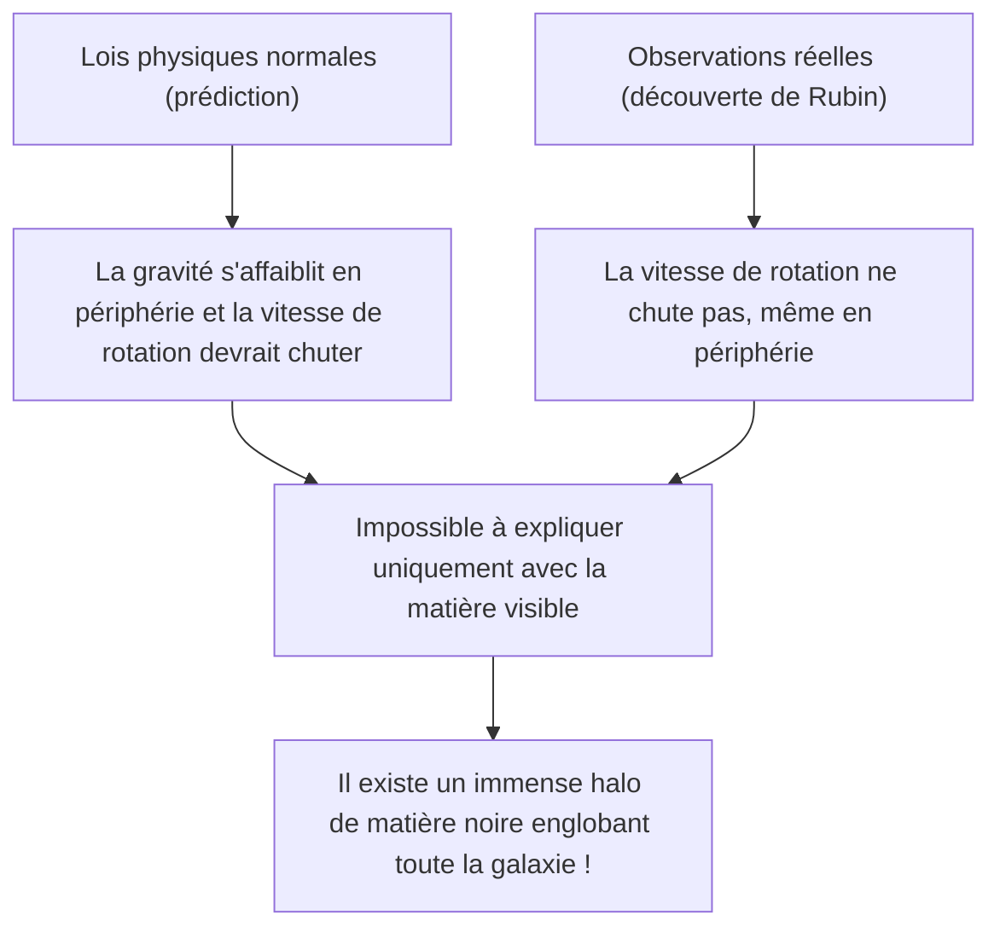
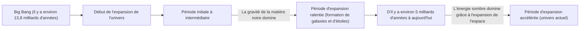

# Matière noire et énergie sombre : les forces invisibles qui dominent l'univers

Lorsque nous regardons le ciel nocturne, les innombrables étoiles et galaxies que nous voyons ne sont que la pointe de l'iceberg de l'univers tout entier. Selon le modèle cosmologique standard actuel (le modèle ΛCDM), la matière ordinaire que nous connaissons (les étoiles, les gaz, les planètes et les atomes qui nous composent) ne représente qu'environ 5 % de la composition totale en énergie et en matière de l'univers. Les quelque 95 % restants sont constitués d'entités inconnues : environ 27 % de "matière noire" (dark matter) et environ 68 % d'"énergie sombre" (dark energy).

Comment cet "univers invisible" a-t-il été découvert et comment est-il devenu le plus grand mystère de la physique moderne ? Cet article explique tout en détail, de son histoire à la physique des particules la plus récente, en passant par les expériences d'observation à la pointe de la technologie.

## La découverte historique de la matière noire : le mystère de la masse manquante

### Fritz Zwicky et la théorie de la "masse invisible"

Le concept de matière noire est apparu pour la première fois sur la scène scientifique en 1933. L'astronome d'origine suisse Fritz Zwicky observait un amas géant de galaxies appelé l'amas de la Chevelure de Bérénice (Coma Cluster). Il a mesuré la vitesse de déplacement des galaxies individuelles composant l'amas, et à partir de cette vitesse, il a calculé la force de gravité nécessaire pour que l'amas de galaxies tout entier reste lié.

Dans le même temps, il a estimé la masse des étoiles (masse visible) qu'il contenait à partir de la quantité totale de lumière émise par l'amas de galaxies. Étonnamment, les vitesses de déplacement des galaxies observées étaient trop rapides pour être retenues par la seule gravité générée par la masse estimée à partir de la lumière. S'il n'y avait que de la matière visible, l'amas de galaxies se serait dispersé depuis longtemps. Zwicky a pensé qu'il existait une grande quantité de matière inconnue et invisible dont la gravité maintenait l'amas de galaxies ensemble, et il l'a appelée "dunkle Materie" (matière noire). Cependant, en raison des doutes sur la précision des observations de l'époque, son affirmation a longtemps été ignorée par la communauté astronomique.

### Vera Rubin et le problème des courbes de rotation des galaxies

Environ 40 ans après la découverte de Zwicky, dans les années 1970, des observations sont venues confirmer l'existence de la matière noire. L'astronome américaine Vera Rubin et son collègue Kent Ford ont mesuré en détail les "courbes de rotation des galaxies" en ciblant des galaxies spirales telles que la galaxie d'Andromède.

Dans les galaxies où les étoiles sont concentrées au centre, la gravité s'affaiblit à mesure que l'on s'éloigne du centre. Par conséquent, selon les lois de Kepler, la vitesse de rotation des étoiles dans les régions externes devrait ralentir (c'est le même principe que dans le système solaire, où plus les planètes sont éloignées, plus leur vitesse de révolution est lente). Cependant, les observations de Rubin ont contredit les prédictions. Même dans les régions externes, loin du centre de la galaxie, la vitesse de rotation des étoiles et des gaz ne diminuait pas et restait presque constante.

La seule façon rationnelle d'expliquer cette "planéité des courbes de rotation des galaxies" était de supposer l'existence d'une immense masse invisible (le halo de matière noire) dans une région s'étendant bien au-delà de la partie visible de la galaxie, dont la gravité tire les étoiles des régions externes à grande vitesse. Grâce aux observations minutieuses de Rubin, la matière noire n'était plus une simple hypothèse, mais une réalité incontestable ne pouvant plus être ignorée dans la cosmologie moderne.

## À la recherche de la véritable nature de la matière noire : le défi de la physique des particules

Il est certain, d'après les effets gravitationnels, que la matière noire "est là", mais quelle est sa véritable nature ? Comme elle n'interagit pas avec la lumière (ondes électromagnétiques), elle ne peut être vue directement ni détectée par des ondes radio ou des rayons X. Les candidats les plus prometteurs actuels sont des particules élémentaires inconnues au-delà du modèle standard (le cadre des particules élémentaires actuellement connu).

### Candidat 1 : WIMP (Weakly Interacting Massive Particles)

Pendant de nombreuses années, le candidat le plus prometteur a été le WIMP (particule massive interagissant faiblement). Comme son nom l'indique, le WIMP est une particule hypothétique qui possède une masse (générant de la gravité) mais n'interagit pas avec la force électromagnétique ou l'interaction forte, n'interagissant avec les autres matières que par "l'interaction faible" et la "gravité".
S'ils existent, les WIMP auraient été produits en grande quantité dans l'état dense et à haute température de l'univers primordial, et à mesure que l'univers s'est refroidi, il serait resté une quantité correspondant exactement à la densité actuelle de la matière noire. Il s'agit d'un contexte théorique élégant appelé le "miracle des WIMP". Comme ils sont également dérivés naturellement de modèles étendus de la physique des particules tels que la théorie de la supersymétrie, les physiciens expérimentaux du monde entier se sont livrés une concurrence acharnée dans la recherche de WIMP.

### Candidat 2 : L'axion (Axion)

Un autre candidat de premier plan est l'axion. L'axion est une particule extrêmement légère et non découverte introduite à l'origine pour résoudre un autre mystère de la physique : la "violation de la symétrie CP" dans l'interaction forte (la force qui lie les quarks pour former des protons et des neutrons).
Alors que l'on s'attend à ce que le WIMP ait une masse lourde des dizaines à des milliers de fois supérieure à celle d'un proton, on pense que l'axion n'a qu'une masse incroyablement légère, inférieure à un cent millionième de celle d'un électron. Cependant, si d'innombrables axions existent dans l'espace, ils peuvent collectivement générer une masse énorme et agir comme de la matière noire, tout comme les petits ruisseaux font les grandes rivières. Ces dernières années, la difficulté de découvrir les WIMP a entraîné une augmentation rapide de l'intérêt pour la recherche d'axions.

## Des expériences d'observation à la pointe de la technologie : poursuivre les mystères de l'univers depuis les profondeurs de la Terre

Les particules de matière noire (en particulier les WIMP) sont supposées entrer rarement en collision avec la matière ordinaire (noyaux atomiques). Cependant, à la surface de la Terre, il y a trop de bruit, comme les rayons cosmiques, pour détecter ces signaux de collision extrêmement faibles. Par conséquent, les expériences de recherche directe de matière noire sont menées dans des installations souterraines profondes où l'épaisse roche peut bloquer les rayons cosmiques.

### Le projet d'expérience XENON (XENONnT)

Le projet "XENON", mené au Laboratoire national du Gran Sasso en Italie (à environ 1 400 mètres de profondeur), est l'expérience de recherche de matière noire la plus sensible au monde, utilisant du xénon liquide. Dans sa dernière itération, "XENONnT", environ 8,6 tonnes de xénon liquide de très haute pureté remplissent un énorme réservoir pour capturer la faible lumière (lumière de scintillation) et les électrons émis lorsque les particules de matière noire entrent en collision avec les noyaux de xénon. Des groupes de recherche japonais, tels que l'Université de Tokyo et l'Université de Nagoya, y participent également, attendant la rencontre avec des particules inconnues dans un environnement où le bruit de fond a été réduit à la limite extrême.

### De Kamiokande à Hyper-Kamiokande

Les installations souterraines de la mine de Kamioka, dans la préfecture de Gifu au Japon, sont également un centre mondial de l'observation des particules élémentaires. "Kamiokande", où le Dr Masatoshi Koshiba a autrefois observé les neutrinos de supernova, et "Super-Kamiokande", qui a découvert l'oscillation des neutrinos, sont célèbres. Cependant, l'installation de nouvelle génération "Hyper-Kamiokande" actuellement en construction, ainsi que le plan successeur de l'expérience de recherche de matière noire "XMASS" (également menée dans le sous-sol de Kamioka), devraient grandement contribuer à élucider la composante sombre de l'univers.
Le neutrino lui-même a une masse infime et était autrefois considéré comme un candidat pour la matière noire, mais on sait maintenant qu'il est trop léger pour expliquer la formation des structures de l'univers (il s'agirait de matière noire chaude). Cependant, la technologie à très faible radioactivité et la technologie des tubes photomultiplicateurs cultivées par la recherche sur les neutrinos sont devenues indispensables à la recherche de la matière noire.

## La force mystérieuse qui accélère l'expansion de l'univers : l'énergie sombre (dark energy)

Si la matière noire est "la force qui attire la matière par gravité pour former des galaxies", à l'opposé se trouve "l'énergie sombre" (dark energy), qui est "la force qui tente de déchirer l'univers entier avec une force de répulsion".

### Découverte de l'expansion accélérée de l'univers

En 1998, deux équipes d'observation dirigées par Saul Perlmutter, Brian Schmidt et Adam Riess (lauréats du prix Nobel de physique en 2011) ont observé des "supernovae de type Ia" lointaines (qui peuvent être utilisées comme bougies standard dans l'univers car leur luminosité est constante) et ont annoncé un fait choquant.
Dans la cosmologie de l'époque, on pensait que l'univers, qui avait commencé à s'étendre avec le Big Bang, ralentissait progressivement son expansion (expansion ralentie) en raison de l'attraction gravitationnelle mutuelle de la matière. Cependant, les résultats des observations ont montré exactement le contraire : la vitesse d'expansion de l'univers est aujourd'hui plus rapide que par le passé, c'est-à-dire qu'elle est en "expansion accélérée".

### La véritable nature de l'énergie sombre : la constante cosmologique d'Einstein ?

L'espace lui-même accélère l'expansion. L'énergie sombre a été introduite pour expliquer cela. Alors que la matière noire a la propriété d'être localisée et de s'accumuler quelque part dans l'espace, l'énergie sombre a la propriété étrange de remplir l'univers de manière complètement uniforme, et sa quantité totale augmente à mesure que l'espace s'étend.

Le candidat le plus prometteur pour cela est la "constante cosmologique (Λ : lambda)" qu'Albert Einstein a autrefois introduite dans les équations du champ gravitationnel de la relativité générale et qu'il a ensuite retirée comme "la plus grande erreur de sa vie". C'est l'idée que l'énergie du vide lui-même (l'énergie du vide) agit comme une force de répulsion, poussant l'univers à s'étendre. Cependant, il y a un écart astronomique (voire plus) d'un facteur 10 puissance 120 entre la valeur de l'énergie du vide prédite par les calculs théoriques de la mécanique quantique et la valeur de l'énergie sombre dérivée des observations astronomiques, ce qui en fait un problème non résolu également connu sous le nom de "pire prédiction de l'histoire de la physique".

## Conclusion : nous ne connaissons encore que 5 % de l'univers

Matière noire et énergie sombre. Bien que leurs noms se ressemblent, leurs rôles dans l'univers sont complètement différents. La matière noire est le "squelette" qui forme la structure de l'univers et la colle qui maintient les galaxies ensemble. En revanche, l'énergie sombre est une sorte de "destructeur" cosmique qui repousse l'espace lui-même et finira par éloigner toutes les galaxies.

Les technologies scientifiques et les lois physiques que nous avons développées sont extraordinaires, mais elles ne s'appliquent qu'à 5 % de la matière de l'univers. Viendra-t-il un jour où nous comprendrons la véritable nature des 95 % restants ? Dans des laboratoires souterrains profonds ou avec les derniers télescopes flottant dans l'espace, l'humanité continue aujourd'hui de relever le défi audacieux de saisir la queue de cet "univers invisible".
