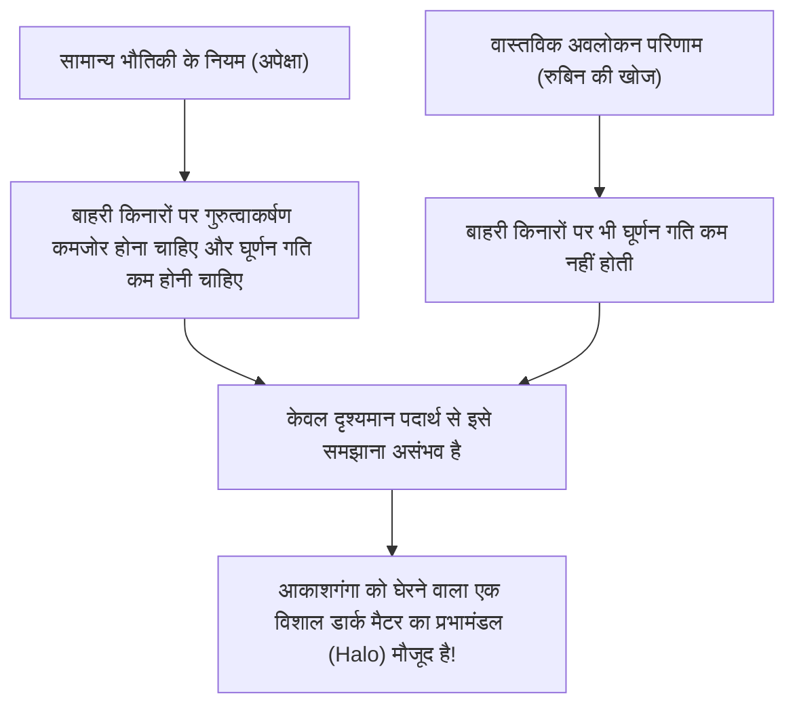
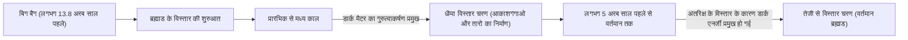

# डार्क मैटर और डार्क एनर्जी: ब्रह्मांड पर राज करने वाली अदृश्य ताकतें

रात के आकाश में जब हम अनगिनत तारों और आकाशगंगाओं को देखते हैं, तो वे पूरे ब्रह्मांड के विशाल हिमखंड का केवल एक छोटा सा हिस्सा होते हैं। वर्तमान मानक ब्रह्मांड विज्ञान (ΛCDM मॉडल) के अनुसार, सामान्य पदार्थ जिसे हम जानते हैं (जैसे तारे, गैस, ग्रह और हमें बनाने वाले परमाणु), पूरे ब्रह्मांड की ऊर्जा और पदार्थ संरचना का केवल लगभग 5% हिस्सा हैं। शेष लगभग 27% "डार्क मैटर (अदृश्य पदार्थ)" और लगभग 68% "डार्क एनर्जी (अदृश्य ऊर्जा)" नामक अज्ञात तत्वों से बना है।

यह "अदृश्य ब्रह्मांड" कैसे खोजा गया, और यह आधुनिक भौतिकी के सबसे बड़े रहस्य के रूप में कैसे स्थापित हुआ? इस लेख में, हम इसके इतिहास से लेकर नवीनतम कण भौतिकी और अत्याधुनिक अवलोकन प्रयोगों तक सब कुछ विस्तार से समझाएंगे।

## डार्क मैटर की ऐतिहासिक खोज: खोए हुए द्रव्यमान का रहस्य

### फ्रिट्ज़ ज़्विकी और "अदृश्य द्रव्यमान" का प्रस्ताव

डार्क मैटर की अवधारणा पहली बार 1933 में विज्ञान के मंच पर आई थी। स्विस खगोलशास्त्री फ्रिट्ज़ ज़्विकी कोमा क्लस्टर (Coma Cluster) नामक एक विशाल आकाशगंगा समूह का अवलोकन कर रहे थे। उन्होंने क्लस्टर बनाने वाली व्यक्तिगत आकाशगंगाओं की गति को मापा और उस गति के आधार पर गणना की कि पूरे क्लस्टर को एक साथ बांधे रखने के लिए कितने गुरुत्वाकर्षण की आवश्यकता है।

उसी समय, उन्होंने क्लस्टर द्वारा उत्सर्जित प्रकाश की कुल मात्रा से उसमें मौजूद तारों के द्रव्यमान (दृश्यमान द्रव्यमान) का अनुमान लगाया। आश्चर्यजनक रूप से, देखी गई आकाशगंगाओं की गति इतनी तेज़ थी कि उसे केवल प्रकाश से अनुमानित द्रव्यमान द्वारा उत्पन्न गुरुत्वाकर्षण से बांधे नहीं रखा जा सकता था। यदि केवल दृश्यमान पदार्थ ही मौजूद होता, तो क्लस्टर बहुत पहले ही बिखर चुका होता। ज़्विकी का मानना था कि बड़ी मात्रा में अदृश्य अज्ञात पदार्थ मौजूद है और इसका गुरुत्वाकर्षण क्लस्टर को एक साथ बांधे हुए है। उन्होंने इसे "dunkle Materie (डार्क मैटर)" नाम दिया। हालाँकि, उस समय खगोल विज्ञान जगत में अवलोकन की सटीकता पर संदेह के कारण उनके दावों को लंबे समय तक नजरअंदाज कर दिया गया।

### वेरा रुबिन और आकाशगंगाओं के घूर्णन वक्र की समस्या

ज़्विकी की खोज के लगभग 40 साल बाद, 1970 के दशक में, ऐसे अवलोकन परिणाम आए जिन्होंने डार्क मैटर के अस्तित्व को निर्णायक रूप से साबित कर दिया। अमेरिकी खगोलशास्त्री वेरा रुबिन और उनके सहयोगी केंट फोर्ड ने एंड्रोमेडा आकाशगंगा जैसी सर्पिल आकाशगंगाओं के "घूर्णन वक्र (Rotation Curve)" का विस्तृत मापन किया।

जिन आकाशगंगाओं के केंद्र में तारे घने होते हैं, वहां केंद्र से दूरी बढ़ने पर गुरुत्वाकर्षण कमजोर हो जाता है, इसलिए केप्लर के नियमों के अनुसार, बाहरी किनारों पर तारों की घूर्णन गति धीमी होनी चाहिए (जैसे सौर मंडल में बाहरी ग्रहों की कक्षीय गति धीमी होती है)। हालाँकि, रुबिन के अवलोकन के परिणाम उम्मीद के विपरीत थे। आकाशगंगा के केंद्र से दूर बाहरी किनारों पर भी, तारों और गैस की घूर्णन गति कम नहीं हुई और लगभग स्थिर रही।

इस "आकाशगंगा के घूर्णन वक्र की समतलता" को समझाने का एकमात्र तार्किक तरीका यह था कि आकाशगंगा के दृश्यमान भाग से कहीं आगे एक विशाल क्षेत्र में अदृश्य विशाल द्रव्यमान (डार्क मैटर हलो) मौजूद है, और इसका गुरुत्वाकर्षण बाहरी तारों को तेज गति से खींच रहा है। रुबिन के सटीक अवलोकनों के कारण, डार्क मैटर अब केवल एक परिकल्पना नहीं रह गया, बल्कि आधुनिक ब्रह्मांड विज्ञान में एक निर्विवाद वास्तविकता के रूप में स्वीकार किया जाने लगा।

## डार्क मैटर की असलियत की तलाश: कण भौतिकी की चुनौती

डार्क मैटर "वहाँ है", यह गुरुत्वाकर्षण के प्रभाव से निश्चित है, लेकिन इसकी "असलियत" क्या है? चूँकि यह प्रकाश (विद्युत चुम्बकीय तरंगों) के साथ प्रतिक्रिया नहीं करता है, इसलिए इसे सीधे नहीं देखा जा सकता है, न ही इसे रेडियो तरंगों या एक्स-रे से पकड़ा जा सकता है। वर्तमान में इसके प्रमुख उम्मीदवार अज्ञात उप-परमाणु कण हैं जो मानक मॉडल (वर्तमान में ज्ञात उप-परमाणु कणों की रूपरेखा) से परे हैं।

### उम्मीदवार 1: WIMP (Weakly Interacting Massive Particles)

सालों से, सबसे प्रमुख उम्मीदवार WIMP (कमजोर रूप से बातचीत करने वाले भारी कण) रहा है। जैसा कि नाम से पता चलता है, WIMP एक काल्पनिक कण है जिसमें द्रव्यमान होता है (गुरुत्वाकर्षण पैदा करता है), लेकिन यह विद्युत चुम्बकीय या मजबूत परमाणु बलों के साथ बातचीत नहीं करता है, और केवल "कमजोर परमाणु बल" और "गुरुत्वाकर्षण" के माध्यम से अन्य पदार्थों के साथ जुड़ता है।
यदि WIMP मौजूद हैं, तो एक सुंदर सैद्धांतिक पृष्ठभूमि है जिसे "WIMP का चमत्कार" कहा जाता है: वे प्रारंभिक ब्रह्मांड के उच्च तापमान और उच्च घनत्व की स्थिति में बड़ी मात्रा में उत्पन्न हुए थे, और जैसे-जैसे ब्रह्मांड ठंडा हुआ, ठीक उतनी ही मात्रा बची जो वर्तमान डार्क मैटर के घनत्व से मेल खाती है। चूंकि यह सुपरसिमेट्री (Supersymmetry) सिद्धांत जैसे कण भौतिकी के उन्नत मॉडलों में भी स्वाभाविक रूप से प्राप्त होता है, इसलिए दुनिया भर के प्रायोगिक भौतिक विज्ञानी WIMPs की खोज में कड़ी मेहनत कर रहे हैं।

### उम्मीदवार 2: एक्सियन (Axion)

एक अन्य प्रमुख उम्मीदवार एक्सियन है। एक्सियन मूल रूप से एक अत्यंत हल्का, अनदेखा कण है जिसे एक अन्य भौतिकी रहस्य को सुलझाने के लिए पेश किया गया था जिसे मजबूत अंतःक्रियाओं (प्रोटॉन और न्यूट्रॉन बनाने के लिए क्वार्क को एक साथ बांधने वाला बल) में "CP समरूपता (CP Symmetry) का टूटना" कहा जाता है।
जबकि WIMP को प्रोटॉन से दसियों से हजारों गुना भारी माना जाता है, एक्सियन के बारे में माना जाता है कि उनका द्रव्यमान अविश्वसनीय रूप से हल्का होता है, एक इलेक्ट्रॉन के द्रव्यमान का भी करोड़ों गुना कम। हालाँकि, यदि अंतरिक्ष में इनकी अनगिनत संख्या मौजूद हो, तो बूंद-बूंद से सागर बनने की तरह, वे कुल मिलाकर एक विशाल द्रव्यमान पैदा कर सकते हैं और डार्क मैटर के रूप में कार्य कर सकते हैं। हाल के वर्षों में, चूंकि WIMPs की खोज में कठिनाइयां आ रही हैं, इसलिए एक्सियन की खोज पर ध्यान तेजी से बढ़ा है।

## फ्रंटलाइन अवलोकन प्रयोग: भूमिगत गहराइयों से ब्रह्मांड के रहस्यों का पीछा करना

डार्क मैटर कणों (विशेष रूप से WIMPs) से सामान्य पदार्थ (परमाणु नाभिक) से शायद ही कभी टकराने की उम्मीद की जाती है। हालाँकि, पृथ्वी की सतह पर ब्रह्मांडीय किरणों (Cosmic Rays) का इतना शोर होता है कि उनके कमजोर टकराव के संकेतों को पकड़ना असंभव है। इसलिए, डार्क मैटर की प्रत्यक्ष खोज के प्रयोग गहरी भूमिगत सुविधाओं में किए जाते हैं जहाँ मोटी चट्टानें ब्रह्मांडीय किरणों को रोक सकती हैं।

### XENON प्रयोग परियोजना (XENONnT)

इटली की ग्रान सासो राष्ट्रीय प्रयोगशाला (Gran Sasso National Laboratory) (लगभग 1400 मीटर भूमिगत) में चल रही "XENON" परियोजना, तरल ज़ेनॉन (Liquid Xenon) का उपयोग करके दुनिया का सबसे संवेदनशील डार्क मैटर खोज प्रयोग है। नवीनतम "XENONnT" में, एक विशाल टैंक लगभग 8.6 टन अति-शुद्ध तरल ज़ेनॉन से भरा हुआ है, जो डार्क मैटर कणों के ज़ेनॉन नाभिक से टकराने पर निकलने वाले प्रकाश (सिंटिलेशन लाइट) और इलेक्ट्रॉनों को पकड़ने का प्रयास कर रहा है। जापान के टोक्यो विश्वविद्यालय (University of Tokyo) और नागोया विश्वविद्यालय (Nagoya University) जैसे शोध समूह भी इसमें भाग ले रहे हैं, और एक ऐसे वातावरण में अज्ञात कणों का सामना करने की प्रतीक्षा कर रहे हैं जहाँ पृष्ठभूमि शोर (Background Noise) को न्यूनतम स्तर तक कम कर दिया गया है।

### कामियोकांडे (Kamiokande) से हाइपर-कामियोकांडे (Hyper-Kamiokande) तक

जापान के गिफू प्रान्त में कामियोका खदान के भूमिगत स्थित सुविधा भी कण अवलोकन के लिए एक विश्व स्तरीय केंद्र है। "कामियोकांडे", जहाँ डॉ. मासातोशी कोशिबा (Dr. Masatoshi Koshiba) ने सुपरनोवा न्यूट्रिनो (Supernova Neutrinos) को देखा था, और "सुपर-कामियोकांडे", जिसने न्यूट्रिनो दोलन (Neutrino Oscillation) की खोज की थी, प्रसिद्ध हैं। वर्तमान में निर्माणाधीन अगली पीढ़ी की सुविधा "हाइपर-कामियोकांडे", और कामियोका के भूमिगत चल रहे डार्क मैटर खोज प्रयोग "XMASS" की उत्तराधिकारी योजना भी ब्रह्मांड के अंधेरे घटकों को समझने में महत्वपूर्ण योगदान देने की उम्मीद है। न्यूट्रिनो का द्रव्यमान भी बहुत कम होता है, और एक समय उन्हें डार्क मैटर का उम्मीदवार माना जाता था, लेकिन अब यह ज्ञात है कि वे इतने हल्के हैं कि ब्रह्मांड की संरचना के निर्माण की व्याख्या नहीं कर सकते (वे गर्म डार्क मैटर बन जाएंगे)। हालाँकि, न्यूट्रिनो अनुसंधान के माध्यम से विकसित अति-निम्न रेडियोधर्मिता (Ultra-low Radioactivity) तकनीक और फोटोमल्टीप्लायर (Photomultiplier) तकनीक डार्क मैटर की खोज के लिए अपरिहार्य हो गई हैं।

## ब्रह्मांड के विस्तार को गति देने वाली रहस्यमय शक्ति: डार्क एनर्जी (अदृश्य ऊर्जा)

यदि डार्क मैटर "वह शक्ति है जो गुरुत्वाकर्षण के माध्यम से पदार्थ को एक साथ खींचती है और आकाशगंगाओं का निर्माण करती है", तो "डार्क एनर्जी" इसके बिल्कुल विपरीत है, "वह शक्ति जो पूरे ब्रह्मांड को प्रतिकर्षण (Repulsion) बल के साथ फाड़ने की कोशिश करती है"।

### ब्रह्मांड के त्वरित विस्तार (Accelerating Expansion) की खोज

1998 में, शाऊल पर्लमटर (Saul Perlmutter), ब्रायन श्मिट (Brian Schmidt), और एडम रीस (Adam Riess) (2011 में भौतिकी के नोबेल पुरस्कार विजेता) के नेतृत्व में दो अवलोकन टीमों ने दूर के "टाइप Ia सुपरनोवा (Type Ia Supernovae)" (जिनका उपयोग ब्रह्मांड के मानक प्रकाश स्रोतों के रूप में किया जा सकता है क्योंकि उनकी चमक स्थिर होती है) का अवलोकन किया और एक चौंकाने वाले तथ्य की घोषणा की।
उस समय तक ब्रह्मांड विज्ञान में, यह माना जाता था कि बिग बैंग से विस्तार करना शुरू करने वाले ब्रह्मांड ने पदार्थों के बीच गुरुत्वाकर्षण आकर्षण के कारण अपनी विस्तार गति को धीरे-धीरे कम कर दिया है (धीमा विस्तार)। लेकिन अवलोकन के परिणाम बिल्कुल विपरीत थे, यह पाया गया कि ब्रह्मांड के विस्तार की गति अतीत की तुलना में अब तेज है, यानी यह "तेजी से विस्तार (Accelerating Expansion)" कर रहा है।

### डार्क एनर्जी की असलियत: आइंस्टीन का ब्रह्मांड संबंधी स्थिरांक (Cosmological Constant)?

अंतरिक्ष स्वयं विस्तार को गति दे رہا है। इसे समझाने के लिए डार्क एनर्जी को पेश किया गया था। डार्क मैटर के विपरीत, जो अंतरिक्ष में कहीं जमा होने की प्रवृत्ति रखता है, डार्क एनर्जी पूरे ब्रह्मांडीय अंतरिक्ष में पूरी तरह से समान रूप से भरी हुई है, और इसका एक अजीब गुण है कि जैसे-जैसे अंतरिक्ष फैलता है, इसकी कुल मात्रा भी बढ़ती जाती है।

इसका सबसे प्रमुख उम्मीदवार "ब्रह्मांड संबंधी स्थिरांक (Cosmological Constant / Λ: Lambda)" है, जिसे अल्बर्ट आइंस्टीन (Albert Einstein) ने एक बार सापेक्षता के सामान्य सिद्धांत (General Theory of Relativity) के अपने गुरुत्वाकर्षण समीकरण में पेश किया था और बाद में अपनी "जीवन की सबसे बड़ी गलती" के रूप में वापस ले लिया था। यह विचार है कि निर्वात (Vacuum) की ऊर्जा स्वयं प्रतिकर्षण (Repulsive Force) के रूप में कार्य करती है, जो ब्रह्मांड को धकेलती है। हालाँकि, क्वांटम यांत्रिकी (Quantum Mechanics) की सैद्धांतिक गणनाओं द्वारा भविष्यवाणी की गई निर्वात ऊर्जा के मूल्य और खगोलीय अवलोकनों से प्राप्त डार्क एनर्जी के मूल्य के बीच 10 की घात 120 (10^120) गुना का खगोलीय (या इससे भी अधिक) अंतर है। यह एक अनसुलझी पहेली है जिसे "भौतिकी के इतिहास में सबसे खराब भविष्यवाणी" भी कहा जाता है।

## निष्कर्ष: हम अभी भी ब्रह्मांड का केवल 5% ही जानते हैं

डार्क मैटर और डार्क एनर्जी। इनके नाम समान हैं, लेकिन ब्रह्मांड में इनकी भूमिकाएं बिल्कुल अलग हैं। डार्क मैटर वह "कंकाल" है जो ब्रह्मांड की संरचना बनाता है, और वह गोंद है जो आकाशगंगाओं को एक साथ बांध कर रखता है। दूसरी ओर, डार्क एनर्जी ब्रह्मांड का "विनाशक" है, जो अंतरिक्ष को ही फैला रहा है और अंततः सभी आकाशगंगाओं को दूर धकेल देगा।

हमारे द्वारा विकसित विज्ञान, तकनीक और भौतिकी के नियम अद्भुत हैं, लेकिन वे ब्रह्मांड के केवल 5% पदार्थ पर ही लागू होते हैं। बाकी 95% हिस्सा किस चीज से बना है, क्या कभी वह दिन आएगा जब हम इसके वास्तविक स्वरूप को समझ पाएंगे? गहरी भूमिगत प्रयोगशालाओं में, या अंतरिक्ष में तैरती नवीनतम दूरबीनों के साथ, आज भी मानवता "अदृश्य ब्रह्मांड" की पूंछ पकड़ने की साहसिक चुनौती जारी रखे हुए है।
