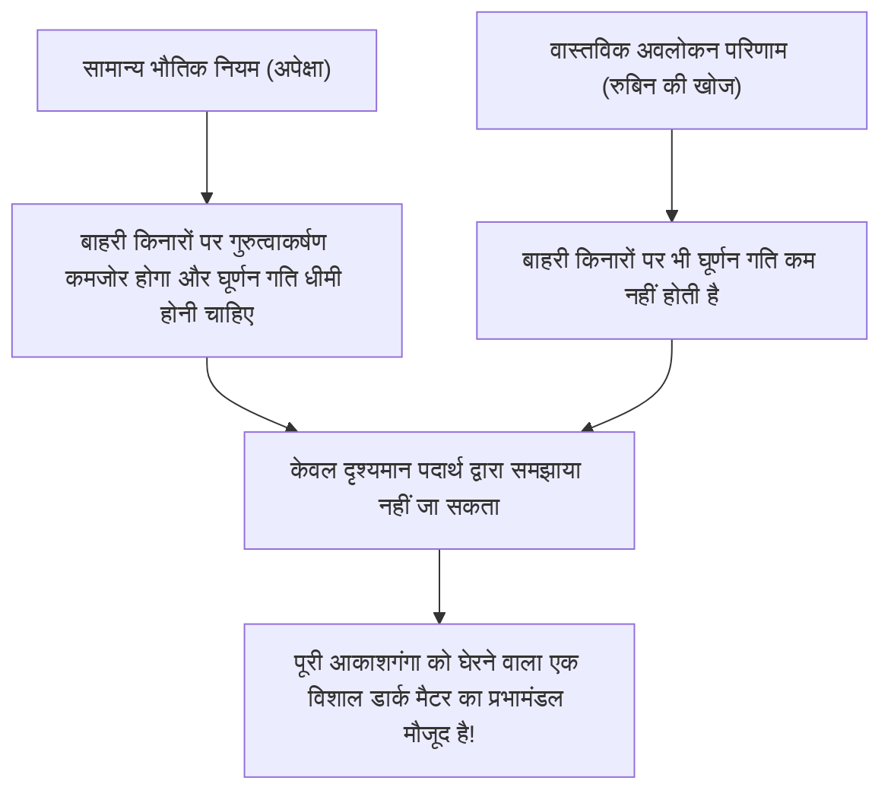
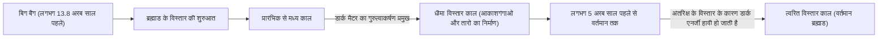

# डार्क मैटर और डार्क एनर्जी: ब्रह्मांड को नियंत्रित करने वाली अदृश्य शक्तियाँ

जब हम रात के आकाश को देखते हैं, तो अनगिनत तारे और आकाशगंगाएँ जो हम देखते हैं, वे पूरे ब्रह्मांड का केवल एक अंश हैं। वर्तमान मानक ब्रह्मांड विज्ञान (ΛCDM मॉडल) के अनुसार, सामान्य पदार्थ जिसे हम जानते हैं (तारे, गैस, ग्रह और परमाणु जिनसे हम बने हैं) ब्रह्मांड की कुल ऊर्जा और पदार्थ संरचना का केवल लगभग 5% है। शेष लगभग 27% "डार्क मैटर" (Dark Matter) है, और लगभग 68% "डार्क एनर्जी" (Dark Energy) नामक एक अज्ञात अस्तित्व से भरा हुआ है।

यह "अदृश्य ब्रह्मांड" कैसे खोजा गया और यह आधुनिक भौतिकी के सबसे बड़े रहस्य के रूप में कैसे स्थापित हुआ? इस लेख में, हम इसके इतिहास से लेकर नवीनतम कण भौतिकी और अत्याधुनिक अवलोकन प्रयोगों तक सब कुछ विस्तार से समझाएंगे।

## डार्क मैटर की ऐतिहासिक खोज: खोए हुए द्रव्यमान का रहस्य

### फ्रिट्ज़ ज़्विकी और "अदृश्य द्रव्यमान" का प्रस्ताव

डार्क मैटर की अवधारणा पहली बार 1933 में विज्ञान के मंच पर आई। स्विस मूल के खगोलशास्त्री फ्रिट्ज़ ज़्विकी (Fritz Zwicky) कोमा क्लस्टर (Coma Cluster) नामक आकाशगंगाओं के एक विशाल समूह का अवलोकन कर रहे थे। उन्होंने क्लस्टर में अलग-अलग आकाशगंगाओं की गति को मापा और उस गति के आधार पर गणना की कि पूरे क्लस्टर को एक साथ बांधे रखने के लिए कितने गुरुत्वाकर्षण की आवश्यकता होगी।

उसी समय, उन्होंने क्लस्टर द्वारा उत्सर्जित प्रकाश की कुल मात्रा से उसमें मौजूद तारों के द्रव्यमान (दृश्यमान द्रव्यमान) का अनुमान लगाया। आश्चर्यजनक रूप से, आकाशगंगाओं की मापी गई गति इतनी तेज थी कि प्रकाश से अनुमानित द्रव्यमान से उत्पन्न गुरुत्वाकर्षण उन्हें एक साथ बांध कर नहीं रख सकता था। यदि केवल दृश्यमान पदार्थ ही मौजूद होता, तो क्लस्टर बहुत पहले ही बिखर चुका होता। ज़्विकी का मानना था कि बड़ी मात्रा में अदृश्य अज्ञात पदार्थ मौजूद है, और इसका गुरुत्वाकर्षण क्लस्टर को एक साथ रखता है, और इसे "dunkle Materie" (डार्क मैटर) नाम दिया। हालाँकि, उस समय खगोलीय समुदाय में अवलोकन सटीकता के बारे में संदेह के कारण लंबे समय तक उनके दावों को नजरअंदाज कर दिया गया था।

### वेरा रुबिन और आकाशगंगाओं के घूर्णन वक्र की समस्या

ज़्विकी की खोज के लगभग 40 साल बाद, 1970 के दशक में, ऐसे अवलोकन परिणाम सामने आए जिन्होंने डार्क मैटर के अस्तित्व की पुष्टि की। अमेरिकी खगोलशास्त्री वेरा रुबिन (Vera Rubin) और उनके सहयोगी केंट फोर्ड (Kent Ford) ने एंड्रोमेडा जैसी सर्पिल आकाशगंगाओं के "घूर्णन वक्र" (Rotation curve) को विस्तार से मापा।

उन आकाशगंगाओं में जहाँ तारे केंद्र में घनीभूत होते हैं, गुरुत्वाकर्षण केंद्र से दूर जाने पर कमजोर हो जाता है, इसलिए केपलर के नियमों के अनुसार, बाहरी किनारों पर तारों की घूर्णन गति धीमी होनी चाहिए (जैसे सौर मंडल में बाहरी ग्रहों की कक्षीय गति धीमी होती है)। हालाँकि, रुबिन के अवलोकन के परिणाम अपेक्षाओं के विपरीत थे। आकाशगंगा के केंद्र से बहुत दूर बाहरी किनारों पर भी, तारों और गैस की घूर्णन गति कम नहीं हुई और लगभग स्थिर रही।

इस "आकाशगंगा के घूर्णन वक्र की समतलता" को समझाने का एकमात्र तार्किक तरीका यह मानना था कि आकाशगंगा के दृश्य भाग से बहुत आगे एक विशाल अदृश्य द्रव्यमान का पिंड (डार्क मैटर प्रभामंडल) मौजूद है, और इसका गुरुत्वाकर्षण बाहरी तारों को तेज गति से खींच रहा है। रुबिन के विस्तृत अवलोकनों के कारण, डार्क मैटर को अब केवल एक परिकल्पना नहीं, बल्कि आधुनिक ब्रह्मांड विज्ञान में एक निर्विवाद वास्तविकता के रूप में स्वीकार किया गया जिसे नजरअंदाज नहीं किया जा सकता।

## डार्क मैटर की वास्तविकता की तलाश: कण भौतिकी की चुनौती

गुरुत्वाकर्षण के प्रभाव से यह निश्चित है कि डार्क मैटर "वहाँ है", लेकिन इसकी "वास्तविकता" क्या है? क्योंकि यह प्रकाश (विद्युत चुम्बकीय तरंगों) के साथ प्रतिक्रिया नहीं करता है, इसे सीधे देखा नहीं जा सकता है और न ही रेडियो तरंगों या एक्स-रे से इसका पता लगाया जा सकता है। वर्तमान में अग्रणी उम्मीदवार मानक मॉडल (वर्तमान में ज्ञात प्राथमिक कणों का ढांचा) से परे एक अज्ञात प्राथमिक कण है।

### उम्मीदवार 1: WIMP (Weakly Interacting Massive Particles)

कई वर्षों से, सबसे आशाजनक उम्मीदवार WIMP (कमजोर रूप से परस्पर क्रिया करने वाले भारी कण) रहा है। जैसा कि नाम से पता चलता है, WIMP एक काल्पनिक कण है जिसका द्रव्यमान होता है (गुरुत्वाकर्षण पैदा करता है), लेकिन यह विद्युत चुम्बकीय या मजबूत परमाणु बल के साथ परस्पर क्रिया नहीं करता है, और केवल "कमजोर परमाणु बल" और "गुरुत्वाकर्षण" के माध्यम से अन्य पदार्थों के साथ संपर्क करता है।
यदि WIMP मौजूद हैं, तो एक सुंदर सैद्धांतिक पृष्ठभूमि है जिसे "WIMP चमत्कार" कहा जाता है, जिसमें प्रारंभिक ब्रह्मांड के उच्च तापमान और उच्च घनत्व की स्थिति में वे बड़ी मात्रा में उत्पन्न हुए थे, और जैसे-जैसे ब्रह्मांड ठंडा हुआ, बची हुई मात्रा वर्तमान डार्क मैटर के घनत्व से पूरी तरह मेल खाती है। चूंकि यह सुपरसिमेट्री सिद्धांत जैसे कण भौतिकी के विस्तारित मॉडल में भी स्वाभाविक रूप से प्राप्त होता है, इसलिए दुनिया भर के प्रायोगिक भौतिक विज्ञानी WIMP की खोज में कड़ी प्रतिस्पर्धा कर रहे हैं।

### उम्मीदवार 2: एक्सियन (Axion)

एक अन्य आशाजनक उम्मीदवार एक्सियन है। एक्सियन मूल रूप से एक अत्यंत हल्का, अनदेखा कण है जिसे मजबूत परस्पर क्रिया (वह बल जो प्रोटॉन और न्यूट्रॉन बनाने के लिए क्वार्क को एक साथ बांधता है) में "सीपी समरूपता उल्लंघन" नामक भौतिकी के एक अन्य रहस्य को सुलझाने के लिए पेश किया गया था।
जबकि WIMP को प्रोटॉन से दसियों से हजारों गुना भारी माना जाता है, एक्सियन को एक इलेक्ट्रॉन से भी करोड़ों गुना हल्का माना जाता है। हालाँकि, यदि अंतरिक्ष में इनकी अनगिनत संख्या मौजूद हो, तो जैसे कण-कण मिलकर पहाड़ बनते हैं, वे समग्र रूप से एक विशाल द्रव्यमान उत्पन्न कर सकते हैं और डार्क मैटर के रूप में व्यवहार कर सकते हैं। हाल के वर्षों में, चूंकि WIMP की खोज कठिन हो गई है, इसलिए एक्सियन की खोज पर ध्यान तेजी से बढ़ा है।

## सबसे आगे के अवलोकन प्रयोग: भूमिगत गहराई से ब्रह्मांड के रहस्यों का पीछा

डार्क मैटर कणों (विशेषकर WIMP) के सामान्य पदार्थ (परमाणु नाभिक) से कभी-कभार टकराने की उम्मीद है। हालाँकि, पृथ्वी की सतह पर कॉस्मिक किरणों जैसा शोर बहुत अधिक होने के कारण इस कमजोर टकराव के संकेत को पकड़ना असंभव है। इसलिए, डार्क मैटर की प्रत्यक्ष खोज के प्रयोग गहरी भूमिगत सुविधाओं में किए जाते हैं जहाँ मोटी चट्टानें कॉस्मिक किरणों को रोक सकती हैं।

### XENON प्रयोग परियोजना (XENONnT)

इटली की ग्रान सासो राष्ट्रीय प्रयोगशाला (लगभग 1400 मीटर भूमिगत) में चल रही "XENON" परियोजना तरल ज़ेनॉन का उपयोग करने वाला दुनिया का सबसे संवेदनशील डार्क मैटर खोज प्रयोग है। नवीनतम "XENONnT" में, लगभग 8.6 टन अति-उच्च शुद्धता वाले तरल ज़ेनॉन को एक विशाल टैंक में भरा गया है, और जब डार्क मैटर कण ज़ेनॉन नाभिक से टकराते हैं तो यह उत्पन्न होने वाले कमजोर प्रकाश (सिंटिलेशन प्रकाश) और इलेक्ट्रॉनों को पकड़ने का प्रयास कर रहा है। टोक्यो विश्वविद्यालय और नागोया विश्वविद्यालय जैसे जापानी शोध समूह भी भाग ले रहे हैं, और एक ऐसे वातावरण में अज्ञात कणों का सामना करने की प्रतीक्षा कर रहे हैं जहाँ पृष्ठभूमि के शोर को काफी हद तक कम कर दिया गया है।

### LUX-ZEPLIN (LZ) प्रयोग और "हिग्सिनो" की लहर

वर्तमान में, अमेरिका के दक्षिण डकोटा में लगभग 1.6 किमी भूमिगत शोध सुविधा "SURF" में, 10 टन अति-उच्च शुद्धता वाले तरल ज़ेनॉन का उपयोग करके एक अंतरराष्ट्रीय संयुक्त परियोजना "LUX-ZEPLIN (LZ) प्रयोग" चल रही है। हाल ही में, जब इस LZ प्रयोग द्वारा मार्च 2023 से अप्रैल 2024 तक एकत्र किए गए 220 दिनों के अवलोकन डेटा का विश्लेषण किया गया, तो एक एकल कण की परस्पर क्रिया दर्ज की गई जिसे ज्ञात पृष्ठभूमि शोर द्वारा समझाया नहीं जा सकता है, जिससे भौतिकी समुदाय में काफी हलचल मच गई है।

संयोग से होने की संभावना को दर्शाने वाला सांख्यिकीय सूचकांक "सिग्मा (σ)" का मान 2.6 है, जो भौतिकी में खोज के मानक माने जाने वाले 5 सिग्मा से अभी भी बहुत दूर है। हालाँकि, इसे अब तक LZ प्रयोगों में रिपोर्ट किए गए मामलों में डार्क मैटर का सबसे मजबूत संकेत माना जाता है। इस घटना के जवाब में, कई स्वतंत्र शोध टीमों ने प्रस्ताव दिया है कि सुपरसिमेट्री सिद्धांत द्वारा अनुमानित डार्क मैटर का एक उम्मीदवार "हिग्सिनो" (द्रव्यमान लगभग 1.1 TeV) इसमें शामिल हो सकता है। कहा जाता है कि यह घटना हिग्सिनो के "अकुशल प्रकीर्णन (Inelastic scattering) (प्रकीर्णन जिसमें टकराव की शक्ति के एक हिस्से के कारण डार्क मैटर कण थोड़े भारी अवस्था में बदल जाते हैं)" के कारण हुई होगी। जैसे-जैसे भविष्य में और डेटा एकत्र किया जाएगा, पूरी दुनिया यह देखने के लिए सांस रोक कर इंतजार कर रही है कि क्या यह सदी की खोज का पहला कदम होगा, या यह केवल एक उतार-चढ़ाव के रूप में गायब हो जाएगा।

### कामियोकांडे से हाइपर-कामियोकांडे तक

जापान के गिफू प्रान्त में कामियोका खदान के भूमिगत स्थित सुविधा भी प्राथमिक कण अवलोकन का एक विश्वव्यापी केंद्र है। "कामियोकांडे", जहाँ डॉ. मासातोशी कोशिबा ने सुपरनोवा न्यूट्रिनो का अवलोकन किया था, और "सुपर-कामियोकांडे", जिसने न्यूट्रिनो दोलन की खोज की, प्रसिद्ध हैं, लेकिन वर्तमान में निर्माणाधीन अगली पीढ़ी की सुविधा "हाइपर-कामियोकांडे", और कामियोका भूमिगत में चल रहे डार्क मैटर खोज प्रयोग "XMASS" की उत्तराधिकारी योजना, ब्रह्मांड के अंधेरे घटकों को स्पष्ट करने में बहुत योगदान देने की उम्मीद है। न्यूट्रिनो का भी बहुत छोटा द्रव्यमान होता है और कभी इन्हें डार्क मैटर का उम्मीदवार माना जाता था, लेकिन अब यह ज्ञात है कि वे ब्रह्मांड की संरचना के निर्माण को समझाने के लिए बहुत हल्के हैं (वे गर्म डार्क मैटर बन जाएंगे)। हालाँकि, न्यूट्रिनो शोध में विकसित अत्यंत कम रेडियोधर्मिता तकनीक और फोटोमल्टीप्लायर ट्यूब तकनीक डार्क मैटर की खोज के लिए अपरिहार्य हो गई हैं।

## ब्रह्मांड के विस्तार को गति देने वाली रहस्यमय शक्ति: डार्क एनर्जी

यदि डार्क मैटर "वह बल है जो गुरुत्वाकर्षण के माध्यम से पदार्थ को आकर्षित करता है और आकाशगंगाओं का निर्माण करता है", तो इसके विपरीत ध्रुव पर स्थित, "वह बल जो प्रतिकारक बल के साथ पूरे ब्रह्मांड को अलग करने की कोशिश करता है" उसे "डार्क एनर्जी" कहा जाता है।

### ब्रह्मांड के त्वरित विस्तार की खोज

1998 में, शाऊल पर्लमटर, ब्रायन श्मिट और एडम रीस (2011 में भौतिकी के नोबेल पुरस्कार विजेता) के नेतृत्व वाली दो अवलोकन टीमों ने दूर स्थित "टाइप Ia सुपरनोवा (जिसका उपयोग ब्रह्मांड में एक मानक प्रकाश स्रोत के रूप में किया जा सकता है क्योंकि इसकी चमक स्थिर होती है)" का अवलोकन किया और एक चौंकाने वाले तथ्य की घोषणा की।
उस समय तक ब्रह्मांड विज्ञान में, यह माना जाता था कि बिग बैंग से विस्तार करना शुरू करने वाले ब्रह्मांड की विस्तार गति पदार्थों के बीच गुरुत्वाकर्षण के आकर्षण के कारण धीरे-धीरे धीमी हो रही है (विस्तार धीमा हो रहा है)। हालाँकि, अवलोकन परिणाम बिल्कुल विपरीत थे, यह दर्शाता है कि ब्रह्मांड की विस्तार गति अतीत की तुलना में वर्तमान में तेज है, यानी यह "त्वरित विस्तार" (accelerating expansion) कर रहा है।

### डार्क एनर्जी की वास्तविकता: आइंस्टीन का ब्रह्मांडीय स्थिरांक?

अंतरिक्ष ही अपने विस्तार को गति दे रहा है। इसे समझाने के लिए डार्क एनर्जी को पेश किया गया था। जबकि डार्क मैटर में अंतरिक्ष में कहीं भी असमान रूप से इकट्ठा होने की प्रवृत्ति होती है, डार्क एनर्जी पूरे अंतरिक्ष में समान रूप से भरी होती है, और इसमें एक अजीब गुण होता है कि जैसे-जैसे अंतरिक्ष फैलता है, इसकी कुल मात्रा भी बढ़ती जाती है।

इसका सबसे आशाजनक उम्मीदवार "ब्रह्मांडीय स्थिरांक (Cosmological constant) (Λ: लैम्ब्डा)" है, जिसे अल्बर्ट आइंस्टीन ने एक बार अपने सामान्य सापेक्षता के गुरुत्वाकर्षण समीकरण में पेश किया था और बाद में इसे अपनी "जीवन की सबसे बड़ी गलती" कहकर वापस ले लिया था। यह विचार है कि शून्य (vacuum) की अपनी ऊर्जा (शून्य ऊर्जा) एक प्रतिकारक बल के रूप में कार्य करती है और ब्रह्मांड को फैला रही है। हालाँकि, क्वांटम यांत्रिकी की सैद्धांतिक गणनाओं द्वारा अनुमानित शून्य ऊर्जा के मूल्य और खगोलीय अवलोकनों से प्राप्त डार्क एनर्जी के मूल्य के बीच 10 की घात 120 (या उससे अधिक) का खगोलीय अंतर है, जो एक अनसुलझी समस्या है जिसे "भौतिकी के इतिहास में सबसे खराब भविष्यवाणी" भी कहा जाता है।

## निष्कर्ष: हम अभी भी ब्रह्मांड का केवल 5% ही जानते हैं

डार्क मैटर और डार्क एनर्जी। नाम समान हो सकते हैं, लेकिन ब्रह्मांड में उनकी भूमिकाएँ पूरी तरह से भिन्न हैं। डार्क मैटर "कंकाल" है जो ब्रह्मांड की संरचना बनाता है, और वह गोंद है जो आकाशगंगाओं को एक साथ रखता है। दूसरी ओर, डार्क एनर्जी एक अंतरिक्ष का "विनाशक" है जो अंतरिक्ष को ही फैलाता है और अंततः सभी आकाशगंगाओं को दूर कर देगा।

विज्ञान, प्रौद्योगिकी और भौतिकी के नियम जो हमने बनाए हैं, वे आश्चर्यजनक हैं, लेकिन वे ब्रह्मांड के केवल 5% पदार्थ पर ही लागू होते हैं। बाकी 95% किस चीज से बना है, क्या वह दिन आएगा जब हम इसकी वास्तविक प्रकृति को समझ पाएंगे? गहरी भूमिगत प्रयोगशालाओं में या अंतरिक्ष में तैरने वाली नवीनतम दूरबीनों के साथ, आज भी, मानवता बहादुरी से "अदृश्य ब्रह्मांड" की पूंछ पकड़ने की कोशिश कर रही है।
