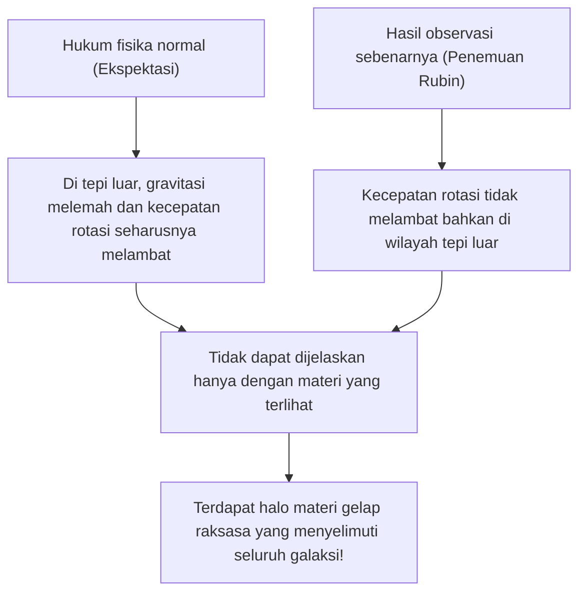
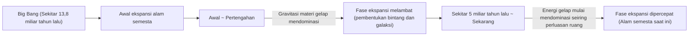

# Materi Gelap (Dark Matter) dan Energi Gelap: Kekuatan Tak Terlihat yang Menguasai Alam Semesta

Saat kita menatap langit malam, bintang-bintang dan galaksi yang tak terhitung jumlahnya yang kita lihat hanyalah puncak gunung es dari seluruh alam semesta. Menurut kosmologi standar saat ini (model ΛCDM), materi biasa yang kita kenal (bintang, gas, planet, dan atom yang membentuk diri kita) hanya menyumbang sekitar 5% dari komposisi energi dan materi seluruh alam semesta. Sisanya, sekitar 27% adalah "Materi Gelap (Dark Matter)", dan sekitar 68% adalah "Energi Gelap (Dark Energy)", yang didominasi oleh entitas yang belum teridentifikasi.

Bagaimana "alam semesta yang tak terlihat" ini ditemukan dan menjadi misteri terbesar dalam fisika modern? Artikel ini akan menjelaskan secara menyeluruh mulai dari sejarahnya hingga fisika partikel terbaru, serta eksperimen observasi paling mutakhir.

## Penemuan Bersejarah Materi Gelap: Misteri Massa yang Hilang

### Fritz Zwicky dan Gagasan "Massa yang Tak Terlihat"

Konsep materi gelap pertama kali muncul di panggung sains pada tahun 1933. Astronom kelahiran Swiss, Fritz Zwicky, mengamati kelompok galaksi raksasa yang disebut Gugus Coma (Coma Cluster). Dia mengukur kecepatan pergerakan setiap galaksi yang membentuk gugus tersebut, dan dari kecepatan itu, dia menghitung berapa banyak gravitasi yang dibutuhkan gugus tersebut secara keseluruhan untuk menahannya agar tidak terpencar.

Pada saat yang sama, ia memperkirakan massa bintang-bintang yang ada di dalamnya (massa yang terlihat) dari jumlah total cahaya yang dipancarkan oleh gugus galaksi tersebut. Hal yang mengejutkan, kecepatan pergerakan galaksi yang diamati terlalu cepat untuk ditahan hanya oleh gravitasi yang dihasilkan dari massa yang diperkirakan melalui cahayanya. Jika hanya ada materi yang terlihat, gugus galaksi tersebut pasti sudah hancur berantakan dan terpencar jauh sejak lama. Zwicky percaya bahwa ada sejumlah besar materi tak terlihat yang tidak diketahui dan gravitasinyalah yang menyatukan gugus galaksi, ia menyebutnya sebagai "dunkle Materie" (Materi Gelap). Namun, di komunitas astronomi pada saat itu, klaimnya diabaikan untuk waktu yang lama karena keraguan terhadap akurasi observasi.

### Vera Rubin dan Masalah Kurva Rotasi Galaksi

Sekitar 40 tahun setelah penemuan Zwicky, pada tahun 1970-an, hasil observasi yang mengkonfirmasi keberadaan materi gelap akhirnya didapatkan. Astronom Amerika, Vera Rubin dan rekannya Kent Ford, mengukur secara rinci "kurva rotasi galaksi" untuk galaksi spiral seperti Galaksi Andromeda.

Dalam sebuah galaksi di mana bintang-bintang terkonsentrasi di pusatnya, gravitasi melemah semakin jauh dari pusatnya, jadi menurut Hukum Kepler, kecepatan rotasi bintang-bintang di tepi luar seharusnya melambat (prinsip yang sama dengan di Tata Surya kita, di mana semakin jauh letak planet, semakin lambat kecepatan orbitnya). Namun, hasil observasi Rubin bertentangan dengan ekspektasi. Bahkan di wilayah tepi luar yang jauh dari pusat galaksi, kecepatan rotasi bintang dan gas tidak menurun, melainkan mempertahankan kecepatan yang hampir konstan.

Satu-satunya cara rasional untuk menjelaskan "kerataan kurva rotasi galaksi" ini adalah dengan mengasumsikan bahwa ada gumpalan besar materi tak terlihat (halo materi gelap) di area luas yang jauh melampaui bagian galaksi yang terlihat, dan gravitasinya menarik bintang-bintang di tepi luar dengan kecepatan tinggi. Melalui observasi teliti Rubin, materi gelap bukan lagi sekadar hipotesis, melainkan telah diterima sebagai kenyataan kuat yang tidak dapat diabaikan dalam kosmologi modern.

## Mencari Identitas Materi Gelap: Tantangan Fisika Partikel

Keberadaan materi gelap "di sana" dapat dipastikan dari efek gravitasinya, tetapi apa sebenarnya "identitasnya"? Karena tidak berinteraksi dengan cahaya (gelombang elektromagnetik), ia tidak dapat dilihat secara langsung atau ditangkap oleh gelombang radio maupun sinar-X. Kandidat kuat saat ini adalah partikel tak dikenal yang melampaui Model Standar (kerangka partikel elementer yang diketahui saat ini).

### Kandidat 1: WIMP (Weakly Interacting Massive Particles)

Selama bertahun-tahun, kandidat yang paling dijagokan adalah WIMP (Partikel Masif yang Berinteraksi Lemah). Seperti namanya, WIMP adalah partikel hipotetis yang memiliki massa (menghasilkan gravitasi), namun tidak berinteraksi dengan gaya elektromagnetik maupun gaya nuklir kuat, dan hanya berinteraksi dengan materi lain melalui "gaya nuklir lemah" dan "gravitasi".
Jika WIMP ada, ada latar belakang teoretis yang indah yang disebut "Keajaiban WIMP", di mana partikel ini diproduksi dalam jumlah besar pada keadaan bersuhu tinggi dan padat di awal alam semesta, dan seiring dengan mendinginnya alam semesta, jumlah yang tersisa akan sama persis dengan kepadatan materi gelap saat ini. Karena partikel ini secara alami diturunkan dalam model perluasan fisika partikel seperti teori supersimetri, para ahli fisika eksperimental di seluruh dunia telah bersaing ketat untuk mencari WIMP.

### Kandidat 2: Axion

Kandidat kuat lainnya adalah Axion. Axion awalnya adalah partikel yang sangat ringan dan belum ditemukan, yang diperkenalkan untuk memecahkan misteri fisika lain yang disebut "Pelanggaran Simetri CP" dalam interaksi kuat (gaya yang mengikat quark untuk membentuk proton dan neutron).
Sementara WIMP diperkirakan memiliki massa yang berat—puluhan hingga ribuan kali lipat massa proton, Axion dianggap memiliki massa yang sangat ringan, bahkan kurang dari seperseratus juta dari massa elektron. Namun, jika ada dalam jumlah tak terhingga di luar angkasa, seperti debu yang menumpuk menjadi gunung, mereka dapat secara kolektif menghasilkan massa yang sangat besar dan bertindak sebagai materi gelap. Baru-baru ini, seiring dengan kesulitan dalam menemukan WIMP, perhatian terhadap pencarian Axion meningkat tajam.

## Eksperimen Observasi Garis Depan: Mengejar Misteri Alam Semesta dari Dalam Bawah Tanah

Partikel materi gelap (terutama WIMP) diharapkan jarang bertabrakan dengan materi biasa (inti atom). Namun, di atas tanah, terdapat terlalu banyak gangguan seperti sinar kosmik, sehingga mustahil untuk menangkap sinyal tabrakan yang sangat lemah tersebut. Oleh karena itu, eksperimen pencarian langsung materi gelap dilakukan di fasilitas bawah tanah yang dalam, di mana lapisan batuan tebal dapat menghalangi sinar kosmik.

### Proyek Eksperimen XENON (XENONnT)

Proyek "XENON", yang berlangsung di Laboratorium Nasional Gran Sasso di Italia (sekitar 1400 meter di bawah tanah), adalah eksperimen pencarian materi gelap paling sensitif di dunia yang menggunakan xenon cair. Pada "XENONnT" terbaru, tangki raksasa diisi dengan sekitar 8,6 ton xenon cair dengan kemurnian sangat tinggi, mencoba menangkap cahaya (cahaya sintilasi) dan elektron yang sangat lemah yang dipancarkan ketika partikel materi gelap bertabrakan dengan inti atom xenon. Kelompok penelitian dari Jepang, seperti Universitas Tokyo dan Universitas Nagoya, juga ikut serta dalam proyek ini, menunggu perjumpaan dengan partikel tak dikenal di lingkungan dengan kebisingan latar belakang yang ditekan hingga ke batas ekstrem.

### Dari Kamiokande ke Hyper-Kamiokande

Fasilitas di bawah Tambang Kamioka, Prefektur Gifu, Jepang, juga merupakan pusat observasi partikel elementer kelas dunia. "Kamiokande", di mana Dr. Masatoshi Koshiba pernah mengamati neutrino dari supernova, dan "Super-Kamiokande", yang menemukan osilasi neutrino, sangatlah terkenal. Saat ini, fasilitas generasi berikutnya "Hyper-Kamiokande" yang sedang dibangun, dan rencana penerus untuk eksperimen pencarian materi gelap "XMASS" yang juga berlokasi di bawah tanah Kamioka, diharapkan dapat berkontribusi besar untuk mengungkap komponen gelap alam semesta. Neutrino sendiri memiliki massa yang sangat kecil dan pernah dianggap sebagai kandidat materi gelap, namun kini diketahui bahwa partikel ini terlalu ringan untuk menjelaskan pembentukan struktur alam semesta (karena akan menjadi materi gelap panas). Akan tetapi, teknologi radioaktivitas sangat rendah dan teknologi tabung pengganda foto (photomultiplier tube) yang dikembangkan dari penelitian neutrino telah menjadi sangat penting bagi pencarian materi gelap.

## Kekuatan Misterius yang Mempercepat Ekspansi Alam Semesta: Energi Gelap (Dark Energy)

Jika materi gelap adalah "kekuatan yang menarik materi bersama-sama dan membentuk galaksi dengan gravitasi", kebalikannya adalah "Energi Gelap (Dark Energy)"—"kekuatan penolakan (repulsif) yang mencoba mengoyak seluruh alam semesta".

### Penemuan Ekspansi yang Dipercepat dari Alam Semesta

Pada tahun 1998, dua tim observasi yang dipimpin oleh Saul Perlmutter, Brian Schmidt, dan Adam Riess (Pemenang Hadiah Nobel Fisika 2011) mengamati "Supernova Tipe Ia" (yang bersinar pada tingkat yang konstan sehingga dapat digunakan sebagai lilin standar kosmik) yang berjarak jauh, dan mengumumkan fakta yang mengejutkan.
Dalam kosmologi hingga saat itu, alam semesta yang mulai berekspansi saat Big Bang diyakini secara bertahap memperlambat kecepatan ekspansinya (ekspansi yang melambat) karena tarikan gravitasi antara materi-materinya. Namun, hasil pengamatan menunjukkan hal yang sebaliknya: alam semesta mengembang lebih cepat saat ini daripada di masa lalu, yang berarti terjadi "ekspansi yang dipercepat".

### Identitas Energi Gelap: Konstanta Kosmologis Einstein?

Ruang itu sendirilah yang mempercepat ekspansi. Energi gelap diperkenalkan untuk menjelaskan hal ini. Sementara materi gelap cenderung berkumpul dan terdistribusi secara tidak merata di beberapa tempat dalam ruang, energi gelap memiliki sifat aneh, yakni mengisi seluruh ruang secara merata dan meresap ke mana-mana, di mana jumlah totalnya akan meningkat seiring dengan meluasnya ruang tersebut.

Kandidat paling kuat untuk energi gelap adalah "Konstanta Kosmologis (Λ: Lambda)", yang pernah diperkenalkan oleh Albert Einstein ke dalam persamaan gravitasi Teori Relativitas Umumnya, dan kemudian ditarik kembali karena dianggap sebagai "kesalahan terbesar dalam hidupnya". Gagasannya adalah bahwa energi yang terkandung di dalam ruang hampa itu sendiri (energi vakum) bertindak sebagai gaya tolak (repulsif), yang mendorong alam semesta agar melebar. Namun, perbedaan antara nilai energi vakum yang diprediksi oleh perhitungan teoritis mekanika kuantum dengan nilai energi gelap yang diturunkan dari observasi astronomi memiliki selisih sebesar 10 pangkat 120 (atau bahkan lebih), menjadikan ini masalah yang belum terpecahkan dan sering disebut sebagai "prediksi terburuk dalam sejarah fisika".

## Kesimpulan: Kita Baru Mengenal 5% dari Alam Semesta

Materi gelap dan energi gelap. Namanya terdengar mirip, tetapi peran mereka di alam semesta sangatlah berbeda. Materi gelap adalah "kerangka" yang membentuk struktur alam semesta, perekat yang menyatukan galaksi. Sebaliknya, energi gelap adalah "penghancur" alam semesta yang mendorong dan memperluas ruang itu sendiri, yang pada akhirnya akan menjauhkan semua galaksi satu sama lain.

Ilmu pengetahuan dan teknologi serta hukum fisika yang telah kita bangun sungguh menakjubkan, namun semua itu hanya berlaku untuk 5% materi di alam semesta. Akankah tiba harinya kita benar-benar memahami terbuat dari apa yang 95% sisanya? Baik di laboratorium jauh di bawah tanah, maupun dengan teleskop terbaru yang mengorbit di luar angkasa, umat manusia hingga hari ini terus melanjutkan tantangan beraninya untuk menangkap jejak "alam semesta yang tak terlihat".
