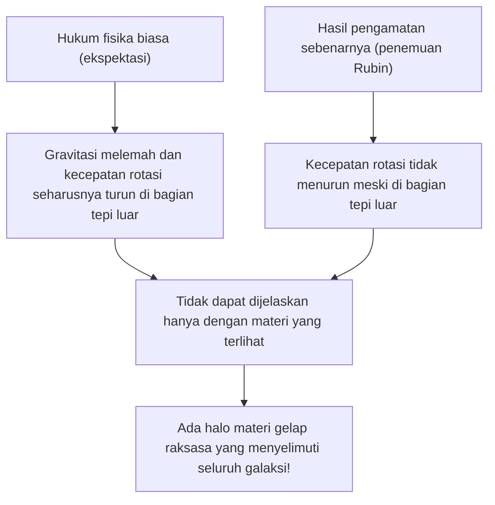
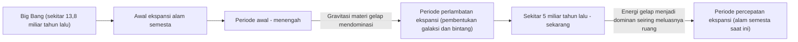

# Materi Gelap (Dark Matter) dan Energi Gelap: Kekuatan Tak Terlihat yang Menguasai Alam Semesta

Saat kita menatap langit malam, bintang-bintang dan galaksi tak terhitung jumlahnya yang kita lihat hanyalah puncak gunung es dari keseluruhan alam semesta. Menurut kosmologi standar saat ini (model ΛCDM), materi biasa yang kita ketahui (seperti bintang, gas, planet, dan atom yang membentuk diri kita sendiri) hanya menyumbang sekitar 5% dari total rasio komposisi energi dan materi alam semesta. Sisanya sekitar 27% ditempati oleh "materi gelap (dark matter)" dan sekitar 68% oleh "energi gelap (dark energy)", yang merupakan entitas tak dikenal.

Bagaimana "alam semesta tak terlihat" ini ditemukan, dan bagaimana hal itu bisa menjadi misteri terbesar dalam fisika modern? Dalam artikel ini, kita akan membahasnya secara menyeluruh, mulai dari sejarahnya hingga fisika partikel terbaru, serta eksperimen observasi paling mutakhir.

## Penemuan Bersejarah Materi Gelap: Misteri Massa yang Hilang

### Fritz Zwicky dan Gagasan "Massa Tak Terlihat"

Konsep materi gelap pertama kali muncul di panggung sains pada tahun 1933. Astronom kelahiran Swiss, Fritz Zwicky, sedang mengamati gugus galaksi raksasa yang disebut Gugus Coma (Coma Cluster). Ia mengukur kecepatan pergerakan galaksi-galaksi individu yang membentuk gugus galaksi tersebut, dan dari kecepatan itu ia menghitung seberapa besar gravitasi yang dibutuhkan agar seluruh gugus galaksi saling menahan satu sama lain.

Pada saat yang sama, ia memperkirakan massa bintang-bintang (massa yang terlihat) di dalamnya dari total cahaya yang dipancarkan gugus galaksi. Mengejutkannya, pergerakan galaksi yang diamati terlalu cepat jika hanya ditahan oleh gravitasi yang dihasilkan oleh massa yang diperkirakan dari cahaya. Jika hanya materi yang terlihat yang ada, gugus galaksi seharusnya sudah tercerai-berai sejak lama. Zwicky percaya bahwa ada sejumlah besar materi tak dikenal dan tak terlihat, yang gravitasinya menyatukan gugus galaksi, dan ia menamainya "dunkle Materie (materi gelap)". Namun, di dunia astronomi pada masa itu, karena keraguan terhadap ketepatan pengamatan, klaimnya diabaikan untuk waktu yang lama.

### Vera Rubin dan Masalah Kurva Rotasi Galaksi

Sekitar 40 tahun setelah penemuan Zwicky, pada tahun 1970-an, hasil pengamatan yang memastikan keberadaan materi gelap dibawa. Astronom Amerika, Vera Rubin, dan rekannya Kent Ford, mengukur "kurva rotasi galaksi" secara rinci pada galaksi spiral seperti Galaksi Andromeda.

Dalam galaksi dengan bintang-bintang yang padat di pusatnya, gravitasi akan melemah saat menjauh dari pusat, jadi menurut Hukum Kepler, kecepatan rotasi bintang-bintang di bagian tepi luar seharusnya melambat (sama dengan prinsip bahwa di tata surya, semakin luar planetnya, semakin lambat kecepatan revolusinya). Namun, hasil pengamatan Rubin bertentangan dengan ekspektasi. Bahkan di bagian tepi luar yang jauh dari pusat galaksi, kecepatan rotasi bintang dan gas tidak menurun, melainkan mempertahankan kecepatan yang hampir konstan.

Satu-satunya cara rasional untuk menjelaskan "kerataan kurva rotasi galaksi" ini adalah dengan mengasumsikan bahwa ada massa raksasa tak terlihat (halo materi gelap) yang ada di wilayah luas jauh melampaui bagian galaksi yang terlihat, dan gravitasinya menarik bintang-bintang di tepi luar dengan kecepatan tinggi. Berkat pengamatan Rubin yang teliti, materi gelap bukan lagi sekadar hipotesis, melainkan diterima sebagai kenyataan yang kuat dan tak bisa diabaikan dalam kosmologi modern.

## Mencari Identitas Materi Gelap: Tantangan Fisika Partikel

Bahwa materi gelap "ada di sana" sudah pasti karena efek gravitasi, tetapi apa "identitas" sebenarnya? Karena tidak berinteraksi dengan cahaya (gelombang elektromagnetik), kita tidak bisa melihatnya secara langsung atau menangkapnya dengan gelombang radio maupun sinar-X. Kandidat yang kuat saat ini adalah partikel tak dikenal di luar Model Standar (kerangka kerja partikel yang diketahui saat ini).

### Kandidat 1: WIMP (Weakly Interacting Massive Particles / Partikel Masif yang Berinteraksi Lemah)

Kandidat yang dianggap paling kuat selama bertahun-tahun adalah WIMP (partikel berat yang berinteraksi secara lemah). Sesuai dengan namanya, WIMP adalah partikel hipotetis yang memiliki massa (menghasilkan gravitasi), tetapi tidak berinteraksi dengan gaya elektromagnetik maupun gaya nuklir kuat, dan hanya berinteraksi dengan materi lain melalui "gaya nuklir lemah" dan "gravitasi".
Jika WIMP ada, partikel ini akan diproduksi dalam jumlah besar pada keadaan alam semesta awal yang bersuhu dan berkepadatan tinggi, dan saat alam semesta mendingin, jumlah yang tersisa akan sangat cocok dengan kepadatan materi gelap saat ini, sebuah latar belakang teori yang indah yang disebut "Keajaiban WIMP". Karena partikel ini juga secara alami diturunkan dalam model perluasan fisika partikel seperti Teori Supersimetri, fisikawan eksperimental di seluruh dunia berlomba-lomba untuk menemukan WIMP.

### Kandidat 2: Axion

Kandidat kuat lainnya adalah Axion. Axion awalnya adalah partikel ringan yang belum ditemukan, yang diperkenalkan untuk memecahkan misteri fisika lain yang disebut "pelanggaran simetri CP" dalam interaksi kuat (gaya yang mengikat kuark untuk membentuk proton dan neutron).
Sementara WIMP diasumsikan memiliki massa yang berat yaitu puluhan hingga ribuan kali lipat proton, Axion diyakini memiliki massa yang sangat ringan yaitu hanya ratusan juta kali lebih kecil dari elektron atau bahkan kurang. Namun, jika ada dalam jumlah tak terhingga di ruang angkasa, seperti pepatah sedikit demi sedikit menjadi bukit, partikel ini dapat menghasilkan massa yang luar biasa besar secara keseluruhan dan bertindak sebagai materi gelap. Mengingat sulitnya menemukan WIMP dalam beberapa tahun terakhir, perhatian terhadap pencarian Axion meningkat tajam.

## Eksperimen Observasi Terdepan: Mengejar Misteri Alam Semesta dari Bawah Tanah yang Dalam

Partikel materi gelap (khususnya WIMP) diharapkan jarang sekali dapat bertabrakan dengan materi biasa (inti atom). Namun, di atas permukaan bumi terlalu banyak kebisingan seperti sinar kosmik, sehingga tidak mungkin untuk menangkap sinyal tabrakan yang sangat lemah tersebut. Oleh karena itu, eksperimen pencarian langsung materi gelap dilakukan di fasilitas bawah tanah yang dalam, di mana sinar kosmik dapat diblokir oleh lapisan batuan tebal.

### Proyek Eksperimen XENON (XENONnT)

Proyek "XENON" yang dilakukan di Laboratorium Nasional Gran Sasso di Italia (sekitar 1400 meter di bawah tanah) adalah eksperimen pencarian materi gelap dengan sensitivitas tertinggi di dunia yang menggunakan xenon cair. Pada "XENONnT" terbaru, sekitar 8,6 ton xenon cair dengan kemurnian sangat tinggi diisi ke dalam tangki raksasa, mencoba menangkap cahaya lemah (cahaya sintilasi) dan elektron yang dipancarkan saat partikel materi gelap bertabrakan dengan inti xenon. Kelompok penelitian dari Jepang seperti Universitas Tokyo dan Universitas Nagoya juga turut serta, menunggu pertemuan dengan partikel tak dikenal di lingkungan dengan kebisingan latar belakang yang telah dikurangi hingga ke batas maksimal.

### Eksperimen LUX-ZEPLIN (LZ) dan Riak "Higgsino"

Saat ini, di fasilitas penelitian "SURF" yang berada sekitar 1,6 km di bawah tanah di South Dakota, Amerika Serikat, proyek kolaborasi internasional "Eksperimen LUX-ZEPLIN (LZ)" yang menggunakan 10 ton xenon cair berangkal ultra-murni sedang beroperasi. Baru-baru ini, saat eksperimen LZ ini menganalisis data observasi selama 220 hari yang dikumpulkan dari Maret 2023 hingga April 2024, tercatat interaksi partikel tunggal yang tidak dapat dijelaskan oleh kebisingan latar belakang yang diketahui, menimbulkan riak besar di dunia fisika.

Nilai "sigma (σ)", sebuah indikator statistik yang menunjukkan probabilitas terjadinya secara kebetulan adalah 2,6, masih jauh dari 5 sigma yang dianggap sebagai standar penemuan dalam fisika. Namun, di antara kasus-kasus yang dilaporkan dalam eksperimen LZ selama ini, ini dianggap sebagai pertanda paling kuat akan materi gelap. Terhadap peristiwa ini, berbagai tim peneliti independen secara beruntun mengusulkan interpretasi bahwa "Higgsino" (dengan massa sekitar 1,1 TeV), kandidat materi gelap yang diprediksi oleh Teori Supersimetri, ikut terlibat. Diduga peristiwa ini mungkin disebabkan oleh "hamburan inelastik" (hamburan di mana sebagian momentum tabrakan mengubah partikel materi gelap menjadi keadaan yang sedikit lebih berat) dari Higgsino. Dengan akumulasi data lebih lanjut di masa depan, dunia menahan napas menyaksikan apakah ini akan menjadi langkah pertama menuju penemuan abad ini atau sekadar fluktuasi yang akan memudar.

### Dari Kamiokande Menuju Hyper-Kamiokande

Fasilitas yang terletak di bawah tanah Tambang Kamioka di Prefektur Gifu, Jepang, juga merupakan pusat observasi partikel tingkat dunia. "Kamiokande", di mana Dr. Masatoshi Koshiba pernah mengamati neutrino supernova, dan "Super-Kamiokande", yang menemukan osilasi neutrino, sangat terkenal. Namun, fasilitas generasi berikutnya "Hyper-Kamiokande" yang saat ini sedang dibangun, serta proyek penerus dari eksperimen pencarian materi gelap "XMASS" yang juga dilakukan di bawah tanah Kamioka, diharapkan dapat berkontribusi besar dalam memecahkan komponen gelap alam semesta. Neutrino sendiri memiliki massa yang sangat kecil dan pernah dianggap sebagai kandidat materi gelap, namun kini diketahui terlalu ringan untuk menjelaskan pembentukan struktur alam semesta (karena akan menjadi materi gelap panas). Akan tetapi, teknologi radioaktivitas sangat rendah dan teknologi tabung pengganda foto (photomultiplier tube) yang dikembangkan dalam penelitian neutrino telah menjadi sangat diperlukan untuk pencarian materi gelap.

## Kekuatan Misterius yang Mempercepat Ekspansi Alam Semesta: Energi Gelap (Dark Energy)

Jika materi gelap adalah "kekuatan yang menarik materi melalui gravitasi dan membentuk galaksi", maka kebalikannya adalah "energi gelap (dark energy)", yaitu "kekuatan yang mencoba merobek seluruh alam semesta dengan gaya tolak-menolak".

### Penemuan Ekspansi Alam Semesta yang Dipercepat

Pada tahun 1998, dua tim observasi yang dipimpin oleh Saul Perlmutter, Brian Schmidt, dan Adam Riess (Pemenang Hadiah Nobel Fisika 2011), mengamati "Supernova Tipe Ia" (yang dapat digunakan sebagai lilin standar kosmik karena kecerahannya yang konstan) di kejauhan, dan mengumumkan fakta yang mengejutkan.
Dalam kosmologi hingga saat itu, diyakini bahwa alam semesta yang mulai mengembang dengan Big Bang secara bertahap melambat kecepatan ekspansinya (mengalami perlambatan ekspansi) akibat tarikan gravitasi antar materi. Namun, hasil pengamatannya justru kebalikannya, ditemukan bahwa kecepatan ekspansi alam semesta lebih cepat saat ini daripada di masa lalu, yang berarti ia sedang "berekspansi dengan percepatan".

### Identitas Energi Gelap: Konstanta Kosmologis Einstein?

Ruang itu sendiri yang mempercepat ekspansi. Energi gelap diperkenalkan untuk menjelaskan hal ini. Berbeda dengan materi gelap yang memiliki sifat berkumpul secara tidak merata di suatu tempat dalam ruang, energi gelap memenuhi seluruh bagian ruang angkasa dengan sangat merata, dan memiliki sifat aneh di mana jumlah totalnya akan meningkat seiring dengan meluasnya ruang.

Kandidat yang paling kuat untuk ini adalah "konstanta kosmologis (Λ: lambda)" yang pernah diperkenalkan oleh Albert Einstein ke dalam persamaan gravitasi Teori Relativitas Umum, dan kemudian ditariknya kembali sebagai "kesalahan terbesar dalam hidupnya". Ini adalah gagasan bahwa energi yang dimiliki ruang hampa itu sendiri (energi vakum) bekerja sebagai gaya tolak (repulsi) dan memperluas alam semesta. Namun, terdapat perbedaan astronomis (atau bahkan lebih besar) sebesar 10 pangkat 120 kali antara nilai energi vakum yang diprediksi oleh perhitungan teoretis mekanika kuantum dan nilai energi gelap yang diturunkan dari pengamatan astronomi. Ini adalah masalah tak terpecahkan yang juga disebut sebagai "prediksi terburuk dalam sejarah fisika".

## Kesimpulan: Kita Masih Hanya Mengetahui 5% dari Alam Semesta

Materi gelap dan energi gelap. Namanya memang mirip, tetapi perannya di alam semesta sangatlah berbeda. Materi gelap adalah "kerangka" yang membentuk struktur alam semesta, dan lem yang menyatukan galaksi-galaksi. Sebaliknya, energi gelap adalah entitas yang bahkan bisa disebut sebagai "penghancur" alam semesta, yang memperluas ruang itu sendiri dan pada akhirnya akan menjauhkan semua galaksi.

Teknologi sains dan hukum fisika yang telah kita bangun memang luar biasa, namun semua itu hanya dapat diterapkan pada 5% materi di alam semesta. Akankah tiba harinya di mana kita akan memahami sosok sebenarnya dari sisa 95% tersebut dan dari apa ia terbentuk? Hari ini pun, entah di laboratorium jauh di bawah tanah, ataupun melalui teleskop terbaru yang melayang di luar angkasa, umat manusia terus melanjutkan tantangan yang berani untuk menggenggam ekor dari "alam semesta tak terlihat".
