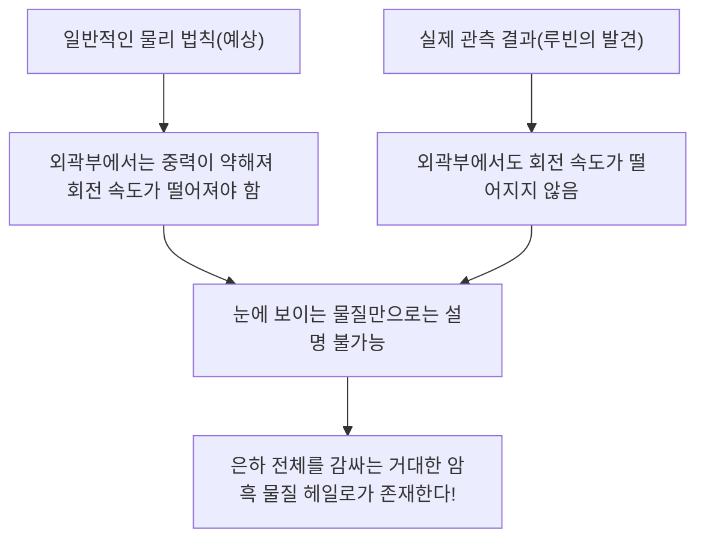

# 암흑 물질(다크 매터)과 암흑 에너지: 우주를 지배하는 보이지 않는 힘

밤하늘을 올려다볼 때 우리가 보는 무수한 별과 은하는 우주 전체의 빙산의 일각에 불과합니다. 현재의 표준 우주론(ΛCDM 모델)에 따르면, 우리가 알고 있는 일반적인 물질(별, 가스, 행성, 그리고 우리 자신을 구성하는 원자 등)은 우주 전체의 에너지·물질 구성비의 약 5%에 불과합니다. 나머지 약 27%는 '암흑 물질(다크 매터)', 약 68%는 '암흑 에너지(다크 에너지)'라 불리는 정체불명의 존재로 채워져 있습니다.

이 '보이지 않는 우주'는 어떻게 발견되었으며, 현대 물리학의 최대 미스터리로 군림하게 되었을까요? 본 기사에서는 그 역사부터 최신 입자 물리학, 그리고 최첨단 관측 실험에 이르기까지 철저하게 해설합니다.

## 암흑 물질의 역사적 발견: 잃어버린 질량의 수수께끼

### 프리츠 츠비키와 '보이지 않는 질량'의 제창

암흑 물질의 개념이 과학의 무대에 처음 등장한 것은 1933년의 일입니다. 스위스 출신의 천문학자 프리츠 츠비키는 머리털자리 은하단(Coma Cluster)이라는 거대한 은하 집단을 관측하고 있었습니다. 그는 은하단을 구성하는 개별 은하의 이동 속도를 측정하고, 그 속도로부터 은하단 전체가 얼마나 큰 중력으로 서로를 붙잡고 있어야 하는지를 계산했습니다.

동시에, 은하단이 방출하는 빛의 총량으로부터 그곳에 포함된 별들의 질량(가시 질량)을 추정했습니다. 그러자 놀랍게도 관측된 은하의 이동 속도는 빛으로부터 추정된 질량이 만들어내는 중력만으로 붙잡아두기에는 너무 빨랐습니다. 만약 눈에 보이는 물질만 존재한다면, 은하단은 오래전에 산산조각 나서 흩어졌을 것입니다. 츠비키는 눈에 보이지 않는 미지의 물질이 대량으로 존재하며, 그 중력이 은하단을 하나로 묶고 있다고 생각하여 이를 'dunkle Materie(암흑 물질)'라고 명명했습니다. 그러나 당시 천문학계에서는 관측 정밀도에 대한 의문 등으로 인해 그의 주장은 오랫동안 무시당하고 말았습니다.

### 베라 루빈과 은하 회전 곡선 문제

츠비키의 발견으로부터 약 40년 후인 1970년대에 접어들어, 암흑 물질의 존재를 결정짓는 관측 결과가 나오게 됩니다. 미국의 천문학자 베라 루빈과 동료 켄트 포드는 안드로메다 은하 등의 나선 은하를 대상으로 '은하의 회전 곡선'을 상세하게 측정했습니다.

중심부에 별이 밀집해 있는 은하에서는 중심에서 멀어질수록 중력이 약해지기 때문에, 케플러의 법칙에 따르면 외곽부 별들의 회전 속도는 느려져야 합니다(태양계에서 바깥쪽 행성일수록 공전 속도가 느린 것과 같은 원리입니다). 그러나 루빈의 관측 결과는 예상과 달랐습니다. 은하의 중심에서 멀리 떨어진 외곽부에서도 별과 가스의 회전 속도는 떨어지지 않고 거의 일정한 속도를 유지하고 있었던 것입니다.

이 '은하 회전 곡선의 평탄성'을 설명하는 유일하게 합리적인 방법은, 은하의 가시적인 부분을 훨씬 뛰어넘는 광활한 영역에 눈에 보이지 않는 거대한 질량 덩어리(암흑 물질 헤일로)가 존재하고, 그 중력이 외곽부의 별을 고속으로 끌어당기고 있다고 가정하는 것뿐이었습니다. 루빈의 치밀한 관측을 통해 암흑 물질은 더 이상 단순한 가설이 아니라, 현대 우주론에서 무시할 수 없는 확고한 현실로 받아들여지게 되었습니다.

## 암흑 물질의 정체를 찾아서: 입자 물리학의 도전

암흑 물질이 '그곳에 존재한다'는 것은 중력의 작용을 통해 확실하지만, 그렇다면 그 '정체'는 무엇일까요? 빛(전자기파)과 상호작용하지 않기 때문에 직접 볼 수도 없고, 전파나 X선으로 포착할 수도 없습니다. 현재 유력한 후보는 표준 모형(현재 알려진 기본 입자의 틀)을 넘어선 미지의 기본 입자입니다.

### 후보 1: 윔프(WIMP, Weakly Interacting Massive Particles)

오랜 세월 가장 유력하게 여겨져 온 후보가 윔프(약하게 상호작용하는 무거운 입자)입니다. 윔프는 그 이름처럼 질량을 가지며(중력을 발생시키며), 그러나 전자기력이나 강한 핵력과는 상호작용하지 않고 '약한 핵력'과 '중력'만으로 다른 물질과 관여한다고 여겨지는 가상의 입자입니다.
만약 윔프가 존재한다면, 초기 우주의 고온 고밀도 상태에서 대량으로 생성되었고 우주가 식어감에 따라 현재의 암흑 물질 밀도와 정확히 일치하는 양이 남게 된다는 '윔프의 기적'이라 불리는 아름다운 이론적 배경이 있습니다. 초대칭성 이론 등 입자 물리학의 확장 모델에서도 자연스럽게 도출되기 때문에 전 세계의 실험 물리학자들이 윔프 탐색에 열을 올리고 있습니다.

### 후보 2: 액시온(Axion)

또 다른 유력한 후보가 액시온입니다. 액시온은 원래 강한 상호작용(쿼크를 결합하여 양성자나 중성자를 만드는 힘)에서의 'CP 대칭성 깨짐'이라는 물리학의 또 다른 수수께끼를 해결하기 위해 도입된, 극히 가벼운 미발견 입자입니다.
윔프가 양성자의 수십 배에서 수천 배에 달하는 무거운 질량을 가질 것으로 예상되는 반면, 액시온은 전자의 수억 분의 일 이하라는 경이로울 정도로 가벼운 질량밖에 갖지 않는다고 생각됩니다. 그러나 우주 공간에 무수히 존재한다면 티끌 모아 태산이 되듯 전체적으로 거대한 질량을 만들어내 암흑 물질로 작용할 수 있습니다. 최근 윔프의 발견이 난항을 겪으면서 액시온 탐색에 대한 주목도가 급격히 높아지고 있습니다.

## 최전선의 관측 실험: 지하 깊은 곳에서 우주의 수수께끼를 쫓다

암흑 물질 입자(특히 윔프)는 아주 드물게 일반 물질(원자핵)과 충돌할 것으로 기대됩니다. 그러나 지상에서는 우주선 등의 노이즈가 너무 많아 그 미약한 충돌 신호를 포착하는 것이 불가능합니다. 따라서 암흑 물질 직접 탐색 실험은 두꺼운 암반으로 우주선을 차단할 수 있는 깊은 지하시설에서 이루어집니다.

### XENON 실험 프로젝트(XENONnT)

이탈리아의 그란 사소 국립 연구소(지하 약 1400미터)에서 진행되고 있는 'XENON' 프로젝트는 액체 크세논을 이용한 세계 최고 감도의 암흑 물질 탐색 실험입니다. 최신 'XENONnT'에서는 약 8.6톤의 초고순도 액체 크세논을 거대한 탱크에 채우고, 암흑 물질 입자가 크세논 원자핵과 충돌할 때 발생하는 미약한 빛(섬광)과 전자를 포착하려고 시도하고 있습니다. 일본의 도쿄 대학이나 나고야 대학 등의 연구 그룹도 참여하고 있으며, 배경 노이즈를 극한까지 줄인 환경에서 미지의 입자와의 조우를 기다리고 있습니다.

### 카미오칸데에서 하이퍼 카미오칸데로

일본 기후현 카미오카 광산 지하에 있는 시설도 입자 관측의 세계적인 거점입니다. 과거 고시바 마사토시 박사가 초신성 중성미자를 관측한 '카미오칸데', 그리고 중성미자 진동을 발견한 '슈퍼 카미오칸데'는 유명하지만, 현재 건설이 진행 중인 차세대 시설 '하이퍼 카미오칸데'나 마찬가지로 카미오카 지하에서 진행 중인 암흑 물질 탐색 실험 'XMASS(엑스마스)'의 후속 계획 등도 우주의 암흑 성분 규명에 크게 기여할 것으로 기대됩니다. 중성미자 자체도 극히 미세한 질량을 가지며 과거에는 암흑 물질 후보로 여겨졌으나, 현재는 너무 가벼워서 우주의 구조 형성을 설명할 수 없다는(뜨거운 암흑 물질이 되어버린다는) 것이 밝혀져 있습니다. 그러나 중성미자 연구에서 축적된 극저 방사능 기술이나 광전자 증폭관 기술은 암흑 물질 탐색에 필수적인 요소가 되었습니다.

## 우주를 가속 팽창시키는 미지의 힘: 암흑 에너지(다크 에너지)

암흑 물질이 '중력으로 물질을 끌어당겨 은하를 형성하는 힘'이라면, 그와 대극에 위치하여 '우주 전체를 반발력으로 찢어놓으려는 힘'이 바로 '암흑 에너지(다크 에너지)'입니다.

### 우주의 가속 팽창 발견

1998년, 솔 펄머터, 브라이언 슈밋, 애덤 리스 세 명(2011년 노벨 물리학상 수상)이 이끄는 두 관측 팀은 먼 거리의 'Ia형 초신성(밝기가 일정하여 우주의 표준 광원으로 사용할 수 있음)'을 관측하고 충격적인 사실을 발표했습니다.
그때까지의 우주론에서는 빅뱅으로 팽창을 시작한 우주가 물질 간의 중력 인력에 의해 점차 그 팽창 속도를 늦추고 있다(감속 팽창하고 있다)고 생각했습니다. 그러나 관측 결과는 정반대로, 우주의 팽창 속도는 과거보다 현재가 더 빠르다, 즉 '가속 팽창'하고 있다는 것이 밝혀진 것입니다.

### 암흑 에너지의 정체: 아인슈타인의 우주 상수인가?

공간 자체가 팽창을 가속시키고 있다. 이를 설명하기 위해 도입된 것이 암흑 에너지입니다. 암흑 물질이 공간 내 어딘가에 편재하여 모이는 성질을 가진 반면, 암흑 에너지는 우주 공간의 모든 곳에 완전히 균등하게 가득 차 있으며 공간이 넓어질수록 그 총량도 늘어난다는 기묘한 성질을 갖습니다.

그 가장 유력한 후보는, 알베르트 아인슈타인이 과거 일반 상대성 이론의 중력 방정식에 도입했다가 나중에 '내 생애 최대의 실수'라며 철회했던 '우주 상수(Λ: 람다)'입니다. 진공 자체가 가진 에너지(진공 에너지)가 척력(반발력)으로 작용하여 우주를 밀어내고 있다는 생각입니다. 그러나 양자 역학의 이론 계산이 예측하는 진공 에너지 값과 천체 관측으로부터 도출되는 암흑 에너지 값 사이에는 10의 120제곱 배라는 천문학적(혹은 그 이상)인 차이가 있으며, 이는 '물리학 역사상 최악의 예측'이라고도 불리는 미해결 난제입니다.

## 결론: 우리는 아직 우주의 5%밖에 모른다

암흑 물질과 암흑 에너지. 이름은 비슷하지만 우주에서의 역할은 완전히 다릅니다. 암흑 물질은 우주의 구조를 형성하는 '골격'이자 은하를 묶어두는 접착제입니다. 반면 암흑 에너지는 공간 자체를 밀어 넓히며 최종적으로는 모든 은하를 멀어지게 하는 우주의 '파괴자'라고도 할 수 있는 존재입니다.

우리가 이룩해 온 과학 기술이나 물리 법칙은 경이롭지만, 그것들이 적용될 수 있는 것은 우주의 단 5%의 물질에 대해서뿐입니다. 나머지 95%가 무엇으로 이루어져 있는지, 우리가 그 진짜 모습을 이해하는 날이 오게 될까요? 지하 깊은 실험실에서, 혹은 우주 공간에 떠 있는 최신 망원경으로, 오늘도 인류는 '보이지 않는 우주'의 꼬리를 잡기 위해 과감한 도전을 계속하고 있습니다.
