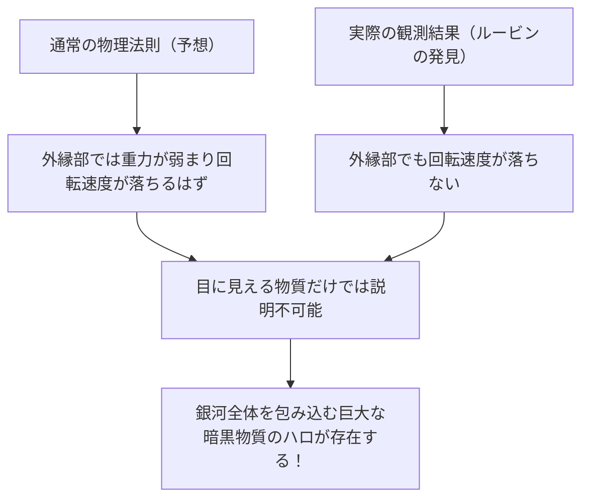

# 暗黒物質（ダークマター）と暗黒エネルギー：宇宙を支配する見えない力

夜空を見上げるとき、私たちが目にしている無数の星々や銀河は、宇宙全体のほんの氷山の一角に過ぎません。現在の標準的な宇宙論（ΛCDMモデル）によれば、私たちが知っている通常の物質（星、ガス、惑星、そして私たち自身を構成する原子など）は、宇宙全体のエネルギー・物質構成比のわずか約5%にすぎません。残りの約27%は「暗黒物質（ダークマター）」、約68%は「暗黒エネルギー（ダークエネルギー）」と呼ばれる、正体不明の存在で占められています。

この「見えない宇宙」は、いかにして発見され、現代物理学の最大の謎として君臨するようになったのでしょうか。本記事では、その歴史から最新の素粒子物理学、そして最先端の観測実験に至るまでを徹底的に解説します。

## ダークマターの歴史的発見：失われた質量の謎

### フリッツ・ツビッキーと「見えない質量」の提唱

ダークマターの概念が初めて科学の舞台に登場したのは、1933年のことです。スイス出身の天文学者フリッツ・ツビッキーは、かみのけ座銀河団（Coma Cluster）という巨大な銀河の集団を観測していました。彼は、銀河団を構成する個々の銀河の移動速度を測定し、その速度から銀河団全体がどれほどの重力で互いを引き留めている必要があるのかを計算しました。

同時に、銀河団が発している光の総量から、そこに含まれる星々の質量（可視質量）を推定しました。すると驚くべきことに、観測された銀河の移動速度は、光から推定される質量が作り出す重力だけで引き留めるには速すぎたのです。もし目に見える物質しか存在しないのであれば、銀河団は遠の昔にバラバラに飛び散っているはずでした。ツビッキーは、目に見えない未知の物質が大量に存在し、その重力が銀河団をまとめていると考え、これを「dunkle Materie（暗黒物質）」と名付けました。しかし、当時の天文学界では観測精度への疑問などから、彼の主張は長らく無視されてしまいました。

### ヴェラ・ルービンと銀河の回転曲線の問題

ツビッキーの発見から約40年後、1970年代に入り、ダークマターの存在を決定づける観測結果がもたらされます。アメリカの天文学者ヴェラ・ルービンと同僚のケント・フォードは、アンドロメダ銀河などの渦巻銀河を対象に、「銀河の回転曲線」を詳細に測定しました。

中心部に星が密集している銀河では、中心から離れるほど重力が弱まるため、ケプラーの法則に従えば、外縁部の星々の回転速度は遅くなるはずです（太陽系において、外側の惑星ほど公転速度が遅いのと同じ原理です）。しかし、ルービンの観測結果は予想に反していました。銀河の中心から遠く離れた外縁部でも、星々やガスの回転速度は落ちず、ほぼ一定の速度を保っていたのです。

この「銀河の回転曲線の平坦性」を説明する唯一の合理的な方法は、銀河の可視部分をはるかに超える広大な領域に、目に見えない巨大な質量の塊（ダークマター・ハロ）が存在し、その重力が外縁部の星を高速で引っ張っていると仮定することでした。ルービンの緻密な観測により、ダークマターはもはや単なる仮説ではなく、現代宇宙論において無視できない確固たる現実として受け入れられるようになったのです。

## ダークマターの正体を求めて：素粒子物理学の挑戦

ダークマターが「そこに在る」ことは重力の作用から確実ですが、ではその「正体」は何なのでしょうか。光（電磁波）と相互作用しないため、直接見ることも電波やX線で捉えることもできません。現在の有力な候補は、標準模型（現在知られている素粒子の枠組み）を超えた、未知の素粒子です。

### 候補1：WIMP（Weakly Interacting Massive Particles）

長年、最も有力視されてきた候補がWIMP（弱く相互作用する重い粒子）です。WIMPは、その名の通り質量を持ち（重力を生み出す）、しかし電磁気力や強い核力とは相互作用せず、「弱い核力」と「重力」だけで他の物質と関わるとされる仮想の粒子です。
もしWIMPが存在すれば、初期宇宙の高温高密度の状態で大量に生成され、宇宙が冷えるにつれて現在のダークマターの密度とぴったり一致する量が残存するという「WIMPの奇跡」と呼ばれる美しい理論的背景があります。超対称性理論などの素粒子物理学の拡張モデルにおいても自然に導出されるため、世界中の実験物理学者がWIMPの探索に鎬を削ってきました。

### 候補2：アクシオン（Axion）

もう一つの有力な候補がアクシオンです。アクシオンは元々、強い相互作用（クォークを結びつけて陽子や中性子を作る力）における「CP対称性の破れ」という別の物理学の謎を解決するために導入された極めて軽い未発見の粒子です。
WIMPが陽子の数十倍〜数千倍という重い質量を持つと想定されるのに対し、アクシオンは電子のさらに数億分の一以下という驚異的に軽い質量しか持たないと考えられています。しかし、宇宙空間に無数に存在していれば、塵も積もれば山となるように、全体として巨大な質量を生み出しダークマターとして振る舞うことができます。近年、WIMPの発見が難航していることもあり、アクシオン探索への注目度が急激に高まっています。

## 最前線の観測実験：地下深くから宇宙の謎を追う

ダークマター粒子（特にWIMP）は、稀に通常の物質（原子核）と衝突することが期待されています。しかし、地上では宇宙線などのノイズが多すぎて、その微弱な衝突信号を捉えることは不可能です。そのため、ダークマター直接探索実験は、分厚い岩盤で宇宙線を遮断できる深い地下施設で行われます。

### XENON実験プロジェクト（XENONnT）

イタリアのグラン・サッソ国立研究所（地下約1400メートル）で行われている「XENON」プロジェクトは、液体キセノンを用いた世界最高感度のダークマター探索実験です。最新の「XENONnT」では、約8.6トンもの超高純度液体キセノンを巨大なタンクに満たし、ダークマター粒子がキセノン原子核に衝突した際に発する微弱な光（シンチレーション光）と電子を捉えようとしています。日本の東京大学や名古屋大学などの研究グループも参加しており、極限までバックグラウンドノイズを減らした環境で未知の粒子との遭遇を待ち受けています。

### LUX-ZEPLIN（LZ）実験と「ヒグシーノ」の波紋

現在、アメリカのサウスダコタ州にある地下約1.6kmの研究施設「SURF」では、10トンの超高純度液体キセノンを用いた国際共同プロジェクト「LUX-ZEPLIN（LZ）実験」が稼働しています。最近、このLZ実験が2023年3月から2024年4月にかけて収集した220日分の観測データを解析したところ、既知の背景ノイズでは説明がつかない単一の粒子相互作用が記録され、物理学界に大きな波紋を呼んでいます。

偶然生じる確率を示す統計的な指標「シグマ（σ）」の値は2.6であり、物理学における発見の基準とされる5シグマにはまだ遠く及びません。しかし、これまでのLZ実験で報告された事例のなかでは暗黒物質の最も有力な兆候とされています。この事象に対し、超対称性理論が予言するダークマターの候補である「ヒグシーノ」（質量約1.1TeV）が関与しているという解釈が、複数の独立した研究チームから相次いで提案されました。ヒグシーノの「非弾性散乱（衝突の勢いの一部によって暗黒物質の粒子がわずかに重い状態に変わる散乱）」によって生じた事象である可能性があるというのです。今後のさらなるデータ蓄積によって、これが世紀の発見の第一歩となるのか、あるいは単なるゆらぎとして消えていくのか、世界中が固唾を呑んで見守っています。

### カミオカンデからハイパーカミオカンデへ

日本の岐阜県・神岡鉱山の地下にある施設も、素粒子観測の世界的拠点です。かつて小柴昌俊博士が超新星ニュートリノを観測した「カミオカンデ」、そしてニュートリノ振動を発見した「スーパーカミオカンデ」は有名ですが、現在建設が進められている次世代施設「ハイパーカミオカンデ」や、同じく神岡地下で行われている暗黒物質探索実験「XMASS（エックスマス）」の後継計画なども、宇宙の暗黒成分の解明に大きく貢献することが期待されています。ニュートリノ自体も極微の質量を持ち、かつてはダークマターの候補とされましたが、現在では軽すぎて宇宙の構造形成を説明できない（熱いダークマターになってしまう）ことが分かっています。しかし、ニュートリノ研究で培われた極低放射能技術や光電子増倍管の技術は、ダークマター探索に不可欠なものとなっています。

## 宇宙を加速膨張させる謎の力：暗黒エネルギー（ダークエネルギー）

ダークマターが「重力によって物質を引き寄せ、銀河を形成する力」だとすれば、それと対極に位置し、「宇宙全体を反発力で引き裂こうとする力」が「暗黒エネルギー（ダークエネルギー）」です。

### 宇宙の加速膨張の発見

1998年、ソール・パールマッター、ブライアン・シュミット、アダム・リースの3氏（2011年ノーベル物理学賞受賞）が率いる2つの観測チームは、遠方の「Ia型超新星（明るさが一定であるため宇宙の標準光源として使える）」を観測し、衝撃的な事実を発表しました。
それまでの宇宙論では、ビッグバンで膨張を始めた宇宙は、物質同士の重力の引き合いによって徐々にその膨張速度を落としている（減速膨張している）と考えられていました。しかし観測結果は真逆で、宇宙の膨張速度は過去よりも現在の方が速くなっている、つまり「加速膨張」していることが判明したのです。

### ダークエネルギーの正体：アインシュタインの宇宙定数か？

空間そのものが膨張を加速させている。これを説明するために導入されたのがダークエネルギーです。ダークマターが空間内のどこかに偏在して集まる性質を持つのに対し、ダークエネルギーは宇宙空間のあらゆる場所に完全に均等に満ちており、空間が広がるほどその総量も増えていくという奇妙な性質を持ちます。

その最も有力な候補は、アルベルト・アインシュタインがかつて一般相対性理論の重力方程式に導入し、後に「生涯最大の過ち」として撤回した「宇宙定数（Λ：ラムダ）」です。真空そのものが持つエネルギー（真空のエネルギー）が、斥力（反発力）として働き、宇宙を押し広げているという考え方です。しかし、量子力学の理論計算が予言する真空のエネルギーの値と、天体観測から導かれるダークエネルギーの値には、10の120乗倍という天文学的（あるいはそれ以上）なズレがあり、これは「物理学史上最悪の予言」とも呼ばれる未解決の難問です。

## 結論：我々はまだ宇宙の5%しか知らない

ダークマターとダークエネルギー。名前は似ていますが、宇宙における役割は全く異なります。ダークマターは宇宙の構造を形作る「骨格」であり、銀河を繋ぎ止める接着剤です。対してダークエネルギーは、空間そのものを押し広げ、最終的にはすべての銀河を遠ざけてしまう宇宙の「破壊者」とも言える存在です。

私たちが築き上げてきた科学技術や物理法則は驚異的なものですが、それらが適用できるのは宇宙のたった5%の物質に対してだけです。残りの95%が何でできているのか、私たちがその真の姿を理解する日は来るのでしょうか。地下深くの実験室で、あるいは宇宙空間に浮かぶ最新の望遠鏡で、今日も人類は「見えない宇宙」の尻尾を掴もうと、果敢な挑戦を続けています。
