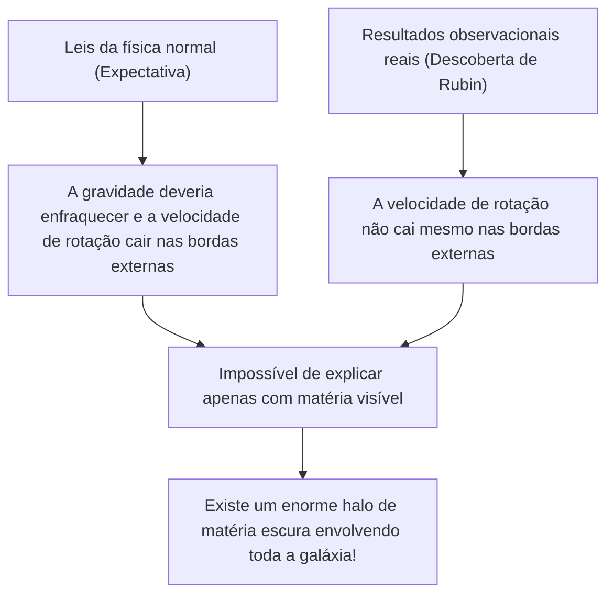
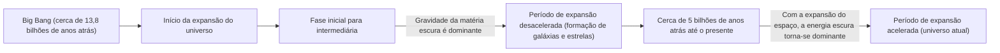

# Matéria Escura e Energia Escura: As Forças Invisíveis que Dominam o Universo

Ao olharmos para o céu noturno, as incontáveis estrelas e galáxias que vemos são apenas a ponta do iceberg de todo o universo. De acordo com a cosmologia padrão atual (modelo ΛCDM), a matéria normal que conhecemos (estrelas, gás, planetas e os átomos que nos compõem) representa apenas cerca de 5% da composição de energia e matéria de todo o universo. Os restantes cerca de 27% são ocupados pela "matéria escura" e cerca de 68% pela "energia escura", que são entidades de identidade desconhecida.

Como este "universo invisível" foi descoberto e passou a reinar como o maior mistério da física moderna? Neste artigo, explicaremos de forma abrangente desde a sua história até a física de partículas mais recente e os experimentos observacionais de ponta.

## A Descoberta Histórica da Matéria Escura: O Mistério da Massa Perdida

### Fritz Zwicky e a Proposta da "Massa Invisível"

O conceito de matéria escura apareceu pela primeira vez no cenário científico em 1933. O astrônomo suíço Fritz Zwicky estava observando um enorme grupo de galáxias chamado Aglomerado de Coma. Ele mediu as velocidades de movimento das galáxias individuais que compõem o aglomerado e calculou, a partir dessas velocidades, quanta gravidade era necessária para manter todo o aglomerado unido.

Ao mesmo tempo, ele estimou a massa das estrelas contidas nele (massa visível) a partir da quantidade total de luz emitida pelo aglomerado de galáxias. Surpreendentemente, as velocidades de movimento observadas das galáxias eram rápidas demais para serem contidas apenas pela gravidade criada pela massa estimada a partir da luz. Se apenas a matéria visível existisse, o aglomerado de galáxias já teria se despedaçado há muito tempo. Zwicky propôs a existência de uma grande quantidade de matéria invisível e desconhecida, cuja gravidade mantinha o aglomerado unido, e chamou-a de "dunkle Materie" (matéria escura). No entanto, na comunidade astronômica da época, devido a dúvidas sobre a precisão das observações, sua alegação foi ignorada por muito tempo.

### Vera Rubin e o Problema da Curva de Rotação das Galáxias

Cerca de 40 anos após a descoberta de Zwicky, na década de 1970, surgiram resultados observacionais que confirmaram a existência da matéria escura. A astrônoma americana Vera Rubin e seu colega Kent Ford mediram detalhadamente a "curva de rotação galáctica" de galáxias espirais, como a Galáxia de Andrômeda.

Em galáxias onde as estrelas estão densamente agrupadas no centro, a gravidade enfraquece à medida que se afasta do centro, então, de acordo com as leis de Kepler, a velocidade de rotação das estrelas nas bordas externas deveria ser mais lenta (o mesmo princípio no sistema solar, onde os planetas mais externos têm velocidades orbitais mais lentas). No entanto, os resultados observacionais de Rubin contrariaram as expectativas. Mesmo nas bordas externas, longe do centro galáctico, a velocidade de rotação de estrelas e gases não caía, mantendo-se quase constante.

A única maneira razoável de explicar este "achatamento da curva de rotação galáctica" era assumir que existia uma enorme massa invisível (halo de matéria escura) em uma vasta região que se estendia muito além da parte visível da galáxia, e que sua gravidade puxava as estrelas nas bordas externas em alta velocidade. Devido às observações precisas de Rubin, a matéria escura não era mais apenas uma hipótese, mas passou a ser aceita como uma realidade inegável que não pode ser ignorada na cosmologia moderna.

## Em Busca da Identidade da Matéria Escura: O Desafio da Física de Partículas

Embora seja certo pela ação da gravidade que a matéria escura "está lá", qual é a sua "identidade"? Como ela não interage com a luz (ondas eletromagnéticas), não podemos vê-la diretamente, nem captá-la com ondas de rádio ou raios-X. O candidato atual mais forte é uma partícula elementar desconhecida que vai além do Modelo Padrão (a estrutura atualmente conhecida das partículas elementares).

### Candidato 1: WIMP (Weakly Interacting Massive Particles)

Por muitos anos, o candidato mais forte tem sido o WIMP (Partículas Massivas de Interação Fraca). O WIMP, como o nome sugere, é uma partícula hipotética que tem massa (gerando gravidade), mas não interage com a força eletromagnética ou com a força nuclear forte, relacionando-se com outras matérias apenas pela "força nuclear fraca" e "gravidade".

Se os WIMPs existirem, há um belo pano de fundo teórico chamado de "Milagre do WIMP", onde eles seriam produzidos em grande quantidade no estado de alta temperatura e alta densidade do universo primitivo, e, à medida que o universo esfriasse, uma quantidade que corresponde perfeitamente à densidade atual de matéria escura permaneceria. Como são derivados naturalmente em modelos estendidos da física de partículas, como a teoria da supersimetria, os físicos experimentais em todo o mundo têm competido intensamente em busca dos WIMPs.

### Candidato 2: Áxion (Axion)

Outro forte candidato é o áxion. O áxion foi originalmente introduzido como uma partícula não descoberta, extremamente leve, para resolver outro mistério da física chamado "violação da simetria CP" nas interações fortes (a força que une os quarks para formar prótons e nêutrons).

Enquanto se assume que o WIMP tem uma massa pesada, dezenas a milhares de vezes maior que um próton, acredita-se que o áxion tenha uma massa incrivelmente leve, sendo centenas de milhões de vezes menor que a de um elétron. No entanto, se existirem em números incontáveis no espaço sideral, podem gerar, como um todo, uma massa enorme e se comportar como matéria escura, como grãos de poeira formando uma montanha. Nos últimos anos, com a dificuldade em descobrir os WIMPs, a atenção à busca por áxions aumentou drasticamente.

## Experimentos Observacionais de Ponta: Perseguindo os Mistérios do Universo nas Profundezas da Terra

Espera-se que as partículas de matéria escura (especialmente os WIMPs) colidam raramente com a matéria normal (núcleos atômicos). No entanto, na superfície da Terra, há muito ruído, como os raios cósmicos, impossibilitando a captura de seus fracos sinais de colisão. Portanto, os experimentos de busca direta por matéria escura são conduzidos em instalações subterrâneas profundas, onde camadas espessas de rocha podem bloquear os raios cósmicos.

### Projeto do Experimento XENON (XENONnT)

O projeto "XENON", realizado no Laboratório Nacional do Gran Sasso, na Itália (cerca de 1400 metros de profundidade), é o experimento de busca por matéria escura de maior sensibilidade do mundo, utilizando xenônio líquido. No mais recente "XENONnT", um tanque gigante é preenchido com cerca de 8,6 toneladas de xenônio líquido de ultra-alta pureza na tentativa de captar a luz fraca (luz de cintilação) e os elétrons emitidos quando uma partícula de matéria escura colide com um núcleo de xenônio. Grupos de pesquisa de instituições japonesas, como a Universidade de Tóquio e a Universidade de Nagoya, também estão participando e aguardando o encontro com partículas desconhecidas em um ambiente onde o ruído de fundo foi reduzido ao extremo.

### O Experimento LUX-ZEPLIN (LZ) e as Ondulações do "Higgsino"

Atualmente, no centro de pesquisa "SURF" em Dakota do Sul, EUA, localizado a cerca de 1,6 km de profundidade, está em operação o projeto internacional conjunto "Experimento LUX-ZEPLIN (LZ)", que utiliza 10 toneladas de xenônio líquido de ultra-alta pureza. Recentemente, a análise de 220 dias de dados de observação coletados por este experimento LZ entre março de 2023 e abril de 2024 registrou uma interação de partícula única que não pode ser explicada pelo ruído de fundo conhecido, causando grandes repercussões na comunidade física.

O valor de "sigma (σ)", um indicador estatístico que mostra a probabilidade de ocorrer por acaso, é de 2,6, ainda muito aquém dos 5 sigmas considerados o padrão para uma descoberta na física. No entanto, entre os casos relatados pelo experimento LZ até agora, é considerado o sinal mais forte de matéria escura. Para este evento, interpretações de que o "higgsino" (massa de cerca de 1,1 TeV), um candidato à matéria escura previsto pela teoria da supersimetria, estaria envolvido, foram propostas sucessivamente por várias equipes de pesquisa independentes. Diz-se que o evento pode ter sido causado por um "espalhamento inelástico" do higgsino (um espalhamento no qual parte da força da colisão transforma a partícula de matéria escura em um estado ligeiramente mais pesado). O mundo todo aguarda com ansiedade, prendendo a respiração, para ver se o acúmulo adicional de dados se tornará o primeiro passo para a descoberta do século, ou se desaparecerá como uma mera flutuação.

### Do Kamiokande ao Hyper-Kamiokande

A instalação subterrânea na Mina de Kamioka, na província de Gifu, Japão, é também um centro global para a observação de partículas elementares. O "Kamiokande", onde o Dr. Masatoshi Koshiba observou anteriormente os neutrinos de supernovas, e o "Super-Kamiokande", que descobriu a oscilação dos neutrinos, são famosos. Espera-se que a instalação de próxima geração "Hyper-Kamiokande", atualmente em construção, e os planos sucessores para o experimento de busca por matéria escura "XMASS", também conduzido no subsolo de Kamioka, contribuam grandemente para a elucidação dos componentes escuros do universo. Os próprios neutrinos possuem uma massa minúscula e já foram considerados candidatos à matéria escura, mas hoje sabe-se que são leves demais para explicar a formação da estrutura do universo (eles seriam matéria escura quente). No entanto, as tecnologias de baixíssima radioatividade e as tecnologias de tubos fotomultiplicadores cultivadas na pesquisa de neutrinos tornaram-se indispensáveis para a busca pela matéria escura.

## A Força Misteriosa que Acelera a Expansão do Universo: Energia Escura

Se a matéria escura é "a força que atrai a matéria através da gravidade e forma galáxias", a "energia escura" encontra-se no pólo oposto e é "a força que tenta rasgar todo o universo com uma força repulsiva".

### A Descoberta da Expansão Acelerada do Universo

Em 1998, duas equipes de observação lideradas por Saul Perlmutter, Brian Schmidt e Adam Riess (vencedores do Prêmio Nobel de Física em 2011) observaram distantes "Supernovas do Tipo Ia (que podem ser usadas como velas padrão do universo por terem uma luminosidade constante)" e anunciaram um fato chocante.

Na cosmologia até então, acreditava-se que o universo, que começou a se expandir com o Big Bang, estava diminuindo gradualmente sua velocidade de expansão (expansão desacelerada) devido à atração gravitacional entre as matérias. No entanto, os resultados observacionais mostraram exatamente o oposto: a velocidade de expansão do universo é mais rápida agora do que no passado, ou seja, revelou-se que o universo está em "expansão acelerada".

### A Identidade da Energia Escura: A Constante Cosmológica de Einstein?

O próprio espaço está acelerando sua expansão. Para explicar isso, a energia escura foi introduzida. Em contraste com a matéria escura, que tem a propriedade de estar distribuída de forma desigual e se agrupar em algum lugar do espaço, a energia escura preenche todos os lugares do espaço sideral de forma completamente uniforme e tem a estranha propriedade de que, à medida que o espaço se expande, a sua quantidade total também aumenta.

O candidato mais forte é a "constante cosmológica (Λ: lambda)", que Albert Einstein introduziu uma vez nas equações de campo da relatividade geral e depois retirou como "o maior erro de sua vida". A ideia é que a energia inerente ao próprio vácuo (energia do vácuo) atue como uma força repulsiva, expandindo o universo. No entanto, há uma diferença astronômica (ou até maior) de 10 elevado a 120 vezes entre o valor da energia do vácuo previsto pelos cálculos teóricos da mecânica quântica e o valor da energia escura derivado de observações astronômicas, e este é um problema não resolvido também conhecido como "a pior previsão da história da física".

## Conclusão: Ainda Conhecemos Apenas 5% do Universo

Matéria escura e energia escura. Os nomes são semelhantes, mas seus papéis no universo são completamente diferentes. A matéria escura é o "esqueleto" que forma a estrutura do universo e a cola que mantém as galáxias unidas. Por outro lado, a energia escura pode ser considerada a "destruidora" do universo que empurra o próprio espaço, afastando todas as galáxias no final.

A ciência, tecnologia e as leis da física que construímos são impressionantes, mas só podem ser aplicadas a apenas 5% da matéria do universo. Chegará o dia em que entenderemos a verdadeira natureza do que compõe os 95% restantes? Hoje, em laboratórios nas profundezas do subsolo ou com os mais modernos telescópios flutuando no espaço, a humanidade continua o seu audacioso desafio de tentar agarrar a cauda deste "universo invisível".
