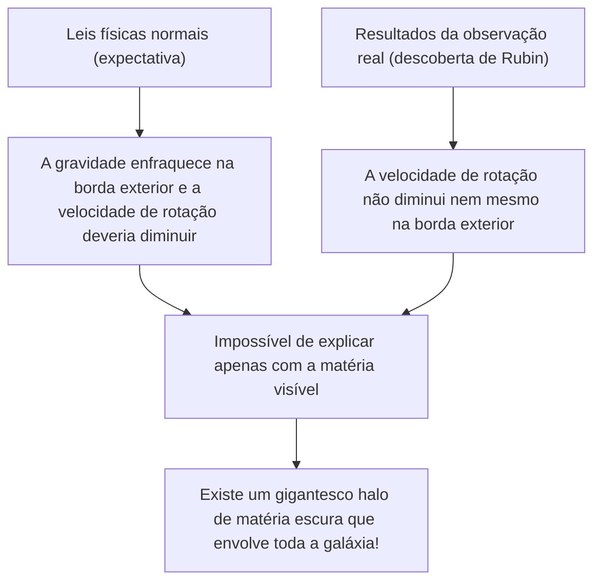
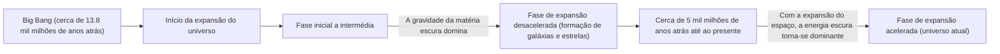

# Matéria Escura e Energia Escura: As Forças Invisíveis que Dominam o Universo

Quando olhamos para o céu noturno, as inúmeras estrelas e galáxias que vemos são apenas a ponta do iceberg de todo o universo. De acordo com a cosmologia padrão atual (modelo ΛCDM), a matéria normal que conhecemos (estrelas, gás, planetas e os átomos que nos compõem) constitui apenas cerca de 5% da proporção de energia e matéria de todo o universo. Os restantes cerca de 27% são ocupados pela "matéria escura" e cerca de 68% pela "energia escura", ambas entidades de identidade desconhecida.

Como este "universo invisível" foi descoberto e se tornou o maior mistério da física moderna? Neste artigo, explicaremos tudo, desde a sua história até à física de partículas mais recente e as experiências de observação de ponta.

## A Descoberta Histórica da Matéria Escura: O Mistério da Massa Perdida

### Fritz Zwicky e a Proposta da "Massa Invisível"

O conceito de matéria escura apareceu pela primeira vez no palco da ciência em 1933. O astrónomo suíço Fritz Zwicky estava a observar o Enxame da Cabeleira de Berenice (Coma Cluster), um gigantesco aglomerado de galáxias. Ele mediu a velocidade de movimento das galáxias individuais que compõem o enxame e, a partir dessa velocidade, calculou a força gravitacional necessária para que todo o enxame se mantivesse unido.

Ao mesmo tempo, estimou a massa das estrelas nele contidas (massa visível) a partir da quantidade total de luz emitida pelo enxame de galáxias. Surpreendentemente, a velocidade de movimento observada das galáxias era demasiado rápida para ser contida apenas pela gravidade produzida pela massa estimada a partir da luz. Se apenas a matéria visível existisse, o enxame de galáxias ter-se-ia desintegrado e espalhado há muito tempo. Zwicky pensou que devia existir uma grande quantidade de matéria desconhecida e invisível, cuja gravidade mantinha o enxame de galáxias unido, e chamou-lhe "dunkle Materie" (matéria escura). No entanto, devido a dúvidas sobre a precisão das observações na comunidade astronómica da época, a sua afirmação foi ignorada durante muito tempo.

### Vera Rubin e o Problema da Curva de Rotação Galáctica

Cerca de 40 anos após a descoberta de Zwicky, na década de 1970, surgiram resultados de observação que confirmaram a existência de matéria escura. A astrónoma americana Vera Rubin e o seu colega Kent Ford mediram detalhadamente a "curva de rotação galáctica", tendo como alvo galáxias espirais como a Galáxia de Andrómeda.

Em galáxias onde as estrelas estão densamente concentradas no centro, a gravidade enfraquece à medida que a distância do centro aumenta, pelo que, de acordo com as leis de Kepler, a velocidade de rotação das estrelas nas extremidades exteriores deveria ser mais lenta (o mesmo princípio pelo qual os planetas exteriores no sistema solar têm velocidades orbitais mais lentas). No entanto, os resultados das observações de Rubin contrariaram as expectativas. Mesmo nas extremidades exteriores, longe do centro da galáxia, a velocidade de rotação das estrelas e do gás não diminuía, mantendo uma velocidade quase constante.

A única maneira lógica de explicar esta "planura da curva de rotação galáctica" era assumir que existia uma gigantesca massa invisível (halo de matéria escura) numa vasta região muito além da parte visível da galáxia, e que a sua gravidade estava a puxar as estrelas na borda exterior a alta velocidade. Devido às observações precisas de Rubin, a matéria escura deixou de ser apenas uma hipótese e passou a ser aceite como uma realidade firme que não pode ser ignorada na cosmologia moderna.

## Em Busca da Identidade da Matéria Escura: O Desafio da Física de Partículas

Embora a existência da matéria escura seja certa devido aos seus efeitos gravitacionais, qual é então a sua "identidade"? Como não interage com a luz (ondas electromagnéticas), não pode ser vista diretamente nem captada por ondas de rádio ou raios-X. Os principais candidatos atuais são partículas elementares desconhecidas, que vão além do Modelo Padrão (a estrutura das partículas elementares atualmente conhecidas).

### Candidato 1: WIMP (Weakly Interacting Massive Particles)

Durante muitos anos, o candidato mais forte tem sido o WIMP (Partículas Massivas que Interagem Fracamente). O WIMP é uma partícula hipotética que, como o nome sugere, tem massa (gera gravidade), mas não interage com a força eletromagnética ou a força nuclear forte, relacionando-se com a outra matéria apenas através da "força nuclear fraca" e da "gravidade".
Se os WIMPs existirem, há um belo contexto teórico chamado de "Milagre do WIMP", onde eles teriam sido gerados em grandes quantidades no estado de alta temperatura e alta densidade do universo primordial, e à medida que o universo arrefeceu, a quantidade restante corresponderia perfeitamente à densidade atual da matéria escura. Como também é derivado naturalmente de modelos de extensão da física de partículas, como a teoria da supersimetria, físicos experimentais de todo o mundo têm competido ferozmente na busca de WIMPs.

### Candidato 2: Áxion (Axion)

Outro candidato forte é o áxion. O áxion é uma partícula não descoberta extremamente leve que foi originalmente introduzida para resolver outro mistério da física chamado "violação da simetria CP" na interação forte (a força que liga os quarks para formar protões e neutrões).
Enquanto se assume que o WIMP tem uma massa pesada de dezenas a milhares de vezes a de um protão, acredita-se que o áxion tem uma massa incrivelmente leve, inferior a centenas de milhões de vezes a de um eletrão. No entanto, se existirem em quantidades inumeráveis no espaço, tal como a poeira que se acumula para formar uma montanha, podem gerar uma massa gigantesca no total e atuar como matéria escura. Nos últimos anos, com a dificuldade em descobrir WIMPs, a atenção sobre a busca de áxions aumentou dramaticamente.

## Experiências de Observação na Linha da Frente: Perseguindo os Mistérios do Universo nas Profundezas da Terra

Espera-se que as partículas de matéria escura (especialmente os WIMPs) colidam raramente com a matéria normal (núcleos atómicos). No entanto, na superfície da Terra, há demasiado ruído de raios cósmicos e outros, o que torna impossível captar esses sinais fracos de colisão. Portanto, as experiências de busca direta de matéria escura são realizadas em instalações subterrâneas profundas, onde rochas espessas podem bloquear os raios cósmicos.

### Projeto de Experiência XENON (XENONnT)

O projeto "XENON", realizado no Laboratório Nacional do Gran Sasso, em Itália (cerca de 1400 metros debaixo da terra), é a experiência de busca de matéria escura de maior sensibilidade do mundo, utilizando xénon líquido. No modelo mais recente "XENONnT", cerca de 8,6 toneladas de xénon líquido de ultra-alta pureza enchem um tanque gigante, tentando captar a luz fraca (luz de cintilação) e os eletrões emitidos quando as partículas de matéria escura colidem com os núcleos de xénon. Grupos de investigação do Japão, como a Universidade de Tóquio e a Universidade de Nagoya, também estão a participar, aguardando um encontro com partículas desconhecidas num ambiente onde o ruído de fundo foi reduzido ao limite absoluto.

### Do Kamiokande ao Hyper-Kamiokande

A instalação no subsolo da Mina de Kamioka, na província de Gifu, no Japão, é também uma base global para a observação de partículas elementares. O "Kamiokande", onde o Dr. Masatoshi Koshiba observou outrora os neutrinos de supernovas, e o "Super-Kamiokande", que descobriu a oscilação dos neutrinos, são famosos. Espera-se que a instalação da próxima geração, o "Hyper-Kamiokande", atualmente em construção, e os planos sucessores da experiência de busca de matéria escura "XMASS", também realizada no subsolo de Kamioka, contribuam grandemente para elucidar a componente escura do universo. Os próprios neutrinos têm uma massa muito pequena e foram outrora considerados candidatos a matéria escura, mas sabe-se agora que são demasiado leves para explicar a formação da estrutura do universo (eles seriam matéria escura quente). No entanto, a tecnologia de radiação ultrabaixa e a tecnologia de tubos fotomultiplicadores desenvolvidas na investigação de neutrinos tornaram-se indispensáveis para a busca de matéria escura.

## A Força Misteriosa que Acelera a Expansão do Universo: Energia Escura (Dark Energy)

Se a matéria escura é a "força que atrai matéria através da gravidade e forma galáxias", a "energia escura (dark energy)" é o seu oposto exato, a "força que tenta despedaçar todo o universo com uma força repulsiva".

### A Descoberta da Expansão Acelerada do Universo

Em 1998, duas equipas de observação lideradas por Saul Perlmutter, Brian Schmidt e Adam Riess (vencedores do Prémio Nobel da Física de 2011) observaram "supernovas do Tipo Ia" distantes (que podem ser usadas como velas padrão no universo devido ao seu brilho constante) e anunciaram um facto chocante.
Na cosmologia até então, pensava-se que o universo, que começou a expandir-se com o Big Bang, estava gradualmente a diminuir a sua velocidade de expansão (expansão desacelerada) devido à atração gravitacional da matéria. No entanto, os resultados das observações mostraram exatamente o oposto: a velocidade de expansão do universo é agora mais rápida do que no passado, ou seja, descobriu-se que está a sofrer uma "expansão acelerada".

### A Identidade da Energia Escura: A Constante Cosmológica de Einstein?

O próprio espaço está a acelerar a expansão. A energia escura foi introduzida para explicar isto. Ao contrário da matéria escura, que tem a propriedade de se concentrar em certas partes do espaço, a energia escura tem a propriedade bizarra de preencher todo o espaço de forma completamente uniforme, e à medida que o espaço se expande, a sua quantidade total também aumenta.

O seu candidato mais provável é a "constante cosmológica (Λ: lambda)", que Albert Einstein outrora introduziu na sua equação de campo gravitacional da Relatividade Geral e mais tarde retirou como "o maior erro da sua vida". É a ideia de que a energia do próprio vácuo (energia do vácuo) atua como uma força repulsiva, empurrando o universo para se expandir. No entanto, existe uma discrepância astronómica (ou até maior) de 10 elevado a 120 entre o valor da energia do vácuo previsto pelos cálculos teóricos da mecânica quântica e o valor da energia escura derivado de observações astronómicas. Isto é um problema por resolver e é frequentemente chamado de "a pior previsão da história da física".

## Conclusão: Ainda Conhecemos Apenas 5% do Universo

Matéria escura e energia escura. Os nomes são semelhantes, mas os seus papéis no universo são completamente diferentes. A matéria escura é o "esqueleto" que forma a estrutura do universo e a cola que une as galáxias. Em contraste, a energia escura é a "destruidora" do universo, expandindo o próprio espaço e, em última análise, afastando todas as galáxias.

A ciência, a tecnologia e as leis da física que construímos são impressionantes, mas só podem ser aplicadas a meros 5% da matéria do universo. Chegará o dia em que compreenderemos verdadeiramente de que são feitos os restantes 95%? Em laboratórios subterrâneos profundos, ou com os mais recentes telescópios flutuando no espaço, a humanidade continua o seu audacioso desafio hoje para agarrar a cauda deste "universo invisível".
