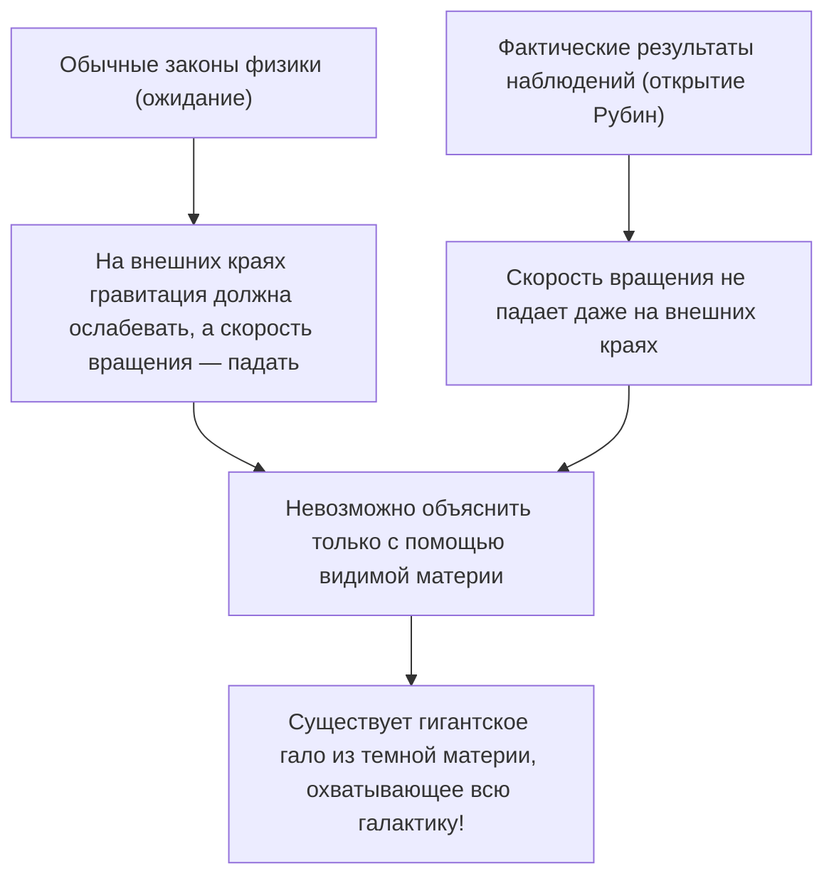
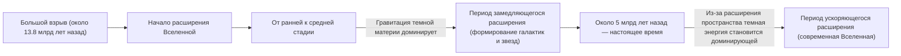

# Темная материя и темная энергия: невидимые силы, управляющие Вселенной

Когда мы смотрим на ночное небо, бесчисленные звезды и галактики, которые мы видим — это лишь верхушка айсберга всей Вселенной. Согласно текущей стандартной космологической модели (модели ΛCDM), обычная материя, которую мы знаем (звезды, газ, планеты и атомы, из которых состоим мы сами), составляет всего около 5% от общего соотношения энергии и материи во Вселенной. Остальные примерно 27% состоят из «темной материи», а около 68% — из «темной энергии», сущностей с неизвестной природой.

Как была открыта эта «невидимая Вселенная» и как она стала величайшей загадкой современной физики? В этой статье мы подробно рассмотрим все: от ее истории до новейшей физики элементарных частиц и передовых экспериментов по наблюдению.

## Историческое открытие темной материи: загадка потерянной массы

### Фриц Цвикки и теория «невидимой массы»

Понятие темной материи впервые появилось на научной арене в 1933 году. Швейцарский астроном Фриц Цвикки наблюдал за гигантским скоплением галактик, известным как Скопление Волос Вероники (Coma Cluster). Он измерил скорости движения отдельных галактик, составляющих скопление, и на основе этих скоростей рассчитал, какая гравитация необходима скоплению в целом, чтобы удерживать их вместе.

В то же время, по общему количеству света, излучаемого скоплением галактик, он оценил массу содержащихся в нем звезд (видимую массу). Удивительно, но наблюдаемые скорости движения галактик оказались слишком высокими, чтобы их могла удерживать только гравитация, создаваемая массой, оцененной по свету. Если бы существовала только видимая материя, скопление галактик давно бы разлетелось на части. Цвикки предположил, что существует большое количество невидимой неизвестной материи, чья гравитация удерживает скопление вместе, и назвал это «dunkle Materie» (темная материя). Однако в то время астрономическое сообщество долго игнорировало его утверждения из-за сомнений в точности наблюдений.

### Вера Рубин и проблема кривых вращения галактик

Спустя почти 40 лет после открытия Цвикки, в 1970-х годах, были получены результаты наблюдений, которые подтвердили существование темной материи. Американский астроном Вера Рубин и ее коллега Кент Форд подробно измерили «кривые вращения галактик», наблюдая спиральные галактики, такие как галактика Андромеды.

В галактиках с плотным скоплением звезд в центре гравитация ослабевает по мере удаления от центра, поэтому, согласно законам Кеплера, скорость вращения звезд на внешних краях должна быть ниже (по тому же принципу, по которому внешние планеты в Солнечной системе имеют меньшую орбитальную скорость). Однако результаты наблюдений Рубин противоречили ожиданиям. Даже на внешних краях, вдали от центра галактики, скорость вращения звезд и газа не падала, оставаясь почти постоянной.

Единственным разумным способом объяснить эту «плоскость кривой вращения галактик» было предположение, что в обширной области, далеко выходящей за пределы видимой части галактики, существует огромная невидимая масса (гало темной материи), гравитация которой с высокой скоростью притягивает звезды на внешних краях. Благодаря тщательным наблюдениям Рубин, темная материя перестала быть просто гипотезой и была принята как неоспоримая реальность, которую нельзя игнорировать в современной космологии.

## В поисках истинной природы темной материи: вызов физике элементарных частиц

То, что темная материя «находится там», несомненно из-за действия гравитации, но какова ее «истинная природа»? Поскольку она не взаимодействует со светом (электромагнитными волнами), ее нельзя увидеть напрямую или зафиксировать с помощью радиоволн или рентгеновских лучей. В настоящее время ведущими кандидатами являются неизвестные элементарные частицы, выходящие за рамки Стандартной модели (существующей системы известных элементарных частиц).

### Кандидат 1: Вимпы (WIMP - Weakly Interacting Massive Particles)

В течение многих лет наиболее вероятным кандидатом считались вимпы (слабовзаимодействующие массивные частицы). Вимпы, как следует из их названия, имеют массу (создают гравитацию), но не взаимодействуют с электромагнитными или сильными ядерными силами, а взаимодействуют с другой материей только посредством «слабого ядерного взаимодействия» и «гравитации».
Если вимпы существуют, есть красивая теоретическая подоплека, называемая «чудом вимпов», согласно которой они были рождены в больших количествах в высокотемпературном и плотном состоянии ранней Вселенной, и по мере остывания Вселенной их оставшееся количество идеально совпадает с плотностью нынешней темной материи. Поскольку они также естественным образом выводятся в расширенных моделях физики элементарных частиц, таких как теория суперсимметрии, физики-экспериментаторы по всему миру ожесточенно конкурируют в поиске вимпов.

### Кандидат 2: Аксионы (Axion)

Другим перспективным кандидатом являются аксионы. Аксион изначально был введен как чрезвычайно легкая, еще не открытая частица для решения другой загадки физики, называемой «нарушением CP-симметрии» в сильном взаимодействии (силе, связывающей кварки для образования протонов и нейтронов).
В то время как предполагается, что вимпы имеют тяжелую массу, в десятки или тысячи раз превышающую массу протона, считается, что аксионы имеют невероятно легкую массу — менее чем в сотни миллионов раз меньше массы электрона. Однако, если они существуют в бесчисленном количестве в космосе, как пылинки, из которых складываются горы, они в совокупности могут создавать огромную массу и действовать как темная материя. В последние годы, отчасти из-за трудностей в обнаружении вимпов, внимание к поиску аксионов резко возросло.

## Передовые эксперименты по наблюдению: разгадывая тайны Вселенной глубоко под землей

Ожидается, что частицы темной материи (особенно вимпы) в редких случаях будут сталкиваться с обычной материей (атомными ядрами). Однако на поверхности земли слишком много шума, например, от космических лучей, что делает невозможным уловить эти слабые сигналы столкновения. Поэтому эксперименты по прямому поиску темной материи проводятся в глубоких подземных установках, где толстые скальные породы могут блокировать космические лучи.

### Проект эксперимента XENON (XENONnT)

Проект «XENON», который проводится в Национальной лаборатории Гран-Сассо (на глубине около 1400 метров под землей) в Италии, является самым чувствительным в мире экспериментом по поиску темной материи с использованием жидкого ксенона. В новейшем проекте «XENONnT» огромный резервуар заполнен примерно 8,6 тоннами жидкого ксенона сверхвысокой чистоты, и ученые пытаются уловить слабый свет (сцинтилляционный свет) и электроны, испускаемые, когда частица темной материи сталкивается с ядром ксенона. Японские исследовательские группы из Токийского университета, Нагойского университета и других также принимают участие в этом проекте, ожидая встречи с неизвестными частицами в среде, где фоновый шум снижен до абсолютного минимума.

### От Камиоканде к Гипер-Камиоканде

Установка, расположенная под землей в шахте Камиока в префектуре Гифу, Япония, также является мировым центром наблюдения элементарных частиц. «Камиоканде», где доктор Масатоси Косиба когда-то наблюдал сверхновые нейтрино, и «Супер-Камиоканде», обнаруживший нейтринные осцилляции, хорошо известны. Ожидается, что строящаяся сейчас установка следующего поколения «Гипер-Камиоканде» и преемник эксперимента по поиску темной материи «XMASS», также проводимого в подземельях Камиока, внесут значительный вклад в выяснение темных компонентов Вселенной. Само нейтрино имеет чрезвычайно малую массу и когда-то считалось кандидатом на роль темной материи, но теперь известно, что оно слишком легкое, чтобы объяснить формирование структуры Вселенной (оно было бы «горячей темной материей»). Тем не менее, технологии сверхнизкой радиоактивности и технологии фотоэлектронных умножителей, разработанные в ходе исследований нейтрино, стали незаменимыми для поиска темной материи.

## Загадочная сила, ускоряющая расширение Вселенной: темная энергия

Если темная материя — это «сила, которая притягивает материю с помощью гравитации и формирует галактики», то ее противоположность — «темная энергия», это «сила, которая пытается разорвать всю Вселенную силой отталкивания».

### Открытие ускоряющегося расширения Вселенной

В 1998 году две команды наблюдателей, возглавляемые Солом Перлмуттером, Брайаном Шмидтом и Адамом Риссом (лауреатами Нобелевской премии по физике 2011 года), наблюдали далекие «сверхновые типа Ia» (которые можно использовать в качестве стандартных космических свечей, поскольку их яркость постоянна) и объявили о шокирующем факте.
В предыдущей космологии считалось, что Вселенная, начавшая расширяться во время Большого взрыва, постепенно замедляет скорость своего расширения из-за гравитационного притяжения между материей (замедляющееся расширение). Однако результаты наблюдений оказались прямо противоположными: выяснилось, что скорость расширения Вселенной сейчас выше, чем в прошлом, то есть она «расширяется с ускорением».

### Природа темной энергии: Космологическая постоянная Эйнштейна?

Само пространство ускоряет свое расширение. Для объяснения этого была введена темная энергия. В то время как темная материя имеет свойство концентрироваться неравномерно в некоторых местах пространства, темная энергия обладает тем странным свойством, что она совершенно равномерно заполняет все пространство во Вселенной, и ее общее количество увеличивается по мере расширения пространства.

Наиболее вероятным кандидатом на ее роль является «космологическая постоянная» (Λ: лямбда), которую Альберт Эйнштейн когда-то ввел в уравнения гравитации общей теории относительности, а затем отказался от нее, назвав «величайшей ошибкой своей жизни». Идея заключается в том, что энергия, присущая самому вакууму (энергия вакуума), действует как сила отталкивания, расширяя Вселенную. Однако существует астрономическое (или даже большее) расхождение в 10 в 120-й степени раз между значением энергии вакуума, предсказанным теоретическими расчетами квантовой механики, и значением темной энергии, полученным из астрономических наблюдений, и это нерешенная проблема, которую также называют «худшим предсказанием в истории физики».

## Вывод: мы по-прежнему знаем лишь 5% Вселенной

Темная материя и темная энергия. Названия похожи, но их роли во Вселенной совершенно разные. Темная материя — это «скелет», который формирует структуру Вселенной, и клей, скрепляющий галактики. С другой стороны, темная энергия — это своего рода «разрушитель» Вселенной, который расширяет само пространство и в конечном итоге отдаляет все галактики друг от друга.

Наука, технологии и законы физики, которые мы создали, удивительны, но они применимы лишь к 5% материи во Вселенной. Настанет ли тот день, когда мы поймем истинную природу того, из чего состоят остальные 95%? В глубоких подземных лабораториях и с помощью новейших телескопов, плавающих в космосе, человечество и сегодня продолжает свой смелый вызов, пытаясь ухватить «невидимую Вселенную» за хвост.
