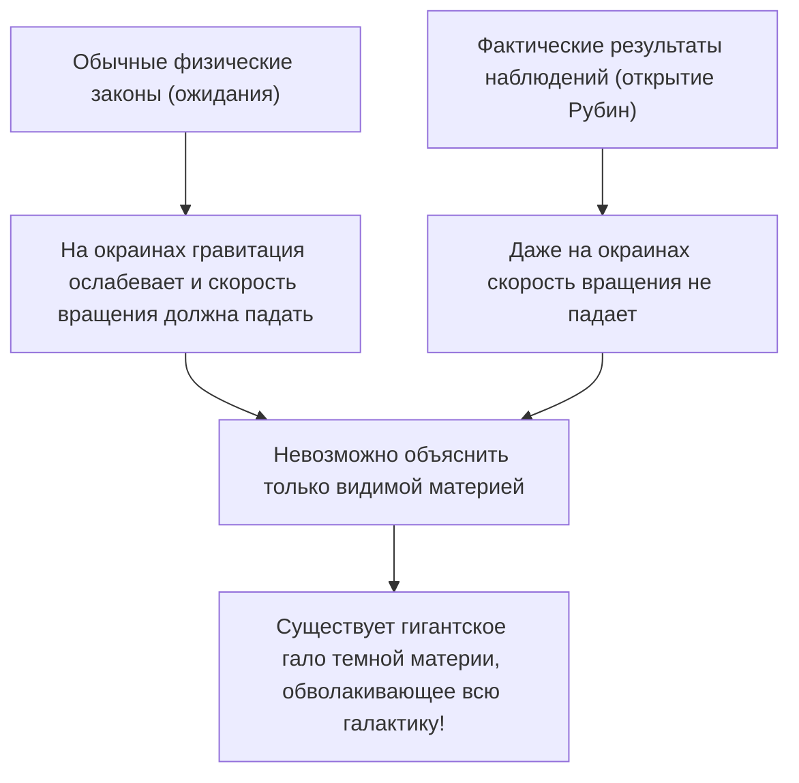
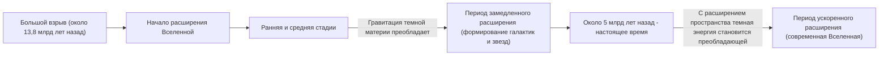

# Темная материя и темная энергия: Невидимые силы, управляющие Вселенной

Глядя на ночное небо, бесчисленные звезды и галактики, которые мы видим, являются лишь верхушкой айсберга всей Вселенной. Согласно современной стандартной космологической модели (модели ΛCDM), обычная материя, которую мы знаем (звезды, газ, планеты и атомы, из которых состоим мы сами), составляет лишь около 5% от общего состава энергии и материи во Вселенной. Оставшиеся примерно 27% занимает "темная материя", а около 68% - "темная энергия", обе представляющие собой нечто неизвестной природы.

Как же была открыта эта "невидимая Вселенная" и как она стала величайшей загадкой современной физики? В этой статье мы подробно рассмотрим все - от истории ее открытия до новейших достижений физики элементарных частиц и самых передовых наблюдательных экспериментов.

## Историческое открытие темной материи: Загадка недостающей массы

### Фриц Цвикки и идея "невидимой массы"

Впервые концепция темной материи появилась на научной арене в 1933 году. Астроном швейцарского происхождения Фриц Цвикки наблюдал за гигантским скоплением галактик в созвездии Волосы Вероники (скопление Кома). Он измерил скорости движения отдельных галактик, входящих в скопление, и на основе этих скоростей вычислил, какая гравитация необходима, чтобы удерживать скопление в целом.

Одновременно он оценил массу звезд (видимую массу), содержащихся в скоплении, исходя из общего количества излучаемого им света. К его удивлению, наблюдаемая скорость движения галактик оказалась слишком высокой, чтобы удерживаться одной лишь гравитацией, создаваемой массой, оцененной по свету. Если бы существовала только видимая материя, скопление галактик давно бы разлетелось на части. Цвикки предположил, что существует большое количество невидимой, неизвестной материи, гравитация которой скрепляет скопление, и назвал ее "dunkle Materie" (темная материя). Однако из-за сомнений в точности наблюдений того времени его идеи долго игнорировались астрономическим сообществом.

### Вера Рубин и проблема кривых вращения галактик

Спустя почти 40 лет после открытия Цвикки, в 1970-х годах, были получены результаты наблюдений, которые убедительно доказали существование темной материи. Американские астрономы Вера Рубин и ее коллега Кент Форд подробно измерили "кривые вращения галактик", изучая спиральные галактики, такие как галактика Андромеды.

В галактиках с высокой концентрацией звезд в центре гравитация должна ослабевать по мере удаления от центра, поэтому, согласно законам Кеплера, скорость вращения звезд на внешних краях должна уменьшаться (тот же принцип, по которому в Солнечной системе внешние планеты имеют меньшую орбитальную скорость). Однако результаты наблюдений Рубин противоречили ожиданиям. Даже на далеких окраинах от центра галактики скорость вращения звезд и газа не снижалась и оставалась почти постоянной.

Единственным разумным способом объяснить эту "плоскость кривых вращения галактик" было предположение о том, что в огромной области, далеко выходящей за пределы видимой части галактики, существует невидимое гигантское скопление массы (гало темной материи), гравитация которого притягивает звезды на окраинах с высокой скоростью. Благодаря тщательным наблюдениям Рубин темная материя перестала быть просто гипотезой и была принята как неоспоримая реальность, которую нельзя игнорировать в современной космологии.

## В поисках природы темной материи: Вызов физике элементарных частиц

То, что темная материя "находится там", доподлинно известно благодаря гравитационному воздействию, но какова же ее "природа"? Поскольку она не взаимодействует со светом (электромагнитными волнами), ее нельзя увидеть напрямую или уловить радиоволнами и рентгеновскими лучами. Основными кандидатами в настоящее время считаются неизвестные элементарные частицы, выходящие за рамки Стандартной модели (современной системы известных элементарных частиц).

### Кандидат 1: Вимпы (WIMP - Weakly Interacting Massive Particles)

На протяжении многих лет наиболее вероятным кандидатом считались вимпы (слабовзаимодействующие массивные частицы). Как следует из названия, вимпы - это гипотетические частицы, обладающие массой (создающие гравитацию), но не взаимодействующие с электромагнитными и сильными ядерными силами, а взаимодействующие с другой материей только посредством "слабых ядерных сил" и "гравитации".
Если вимпы существуют, есть красивая теоретическая предпосылка, называемая "чудом вимпов", согласно которой они в больших количествах образовались в условиях высокой температуры и плотности ранней Вселенной, и по мере ее остывания сохранилось количество, в точности совпадающее с нынешней плотностью темной материи. Поскольку они естественным образом выводятся в расширенных моделях физики элементарных частиц, таких как теория суперсимметрии, физики-экспериментаторы по всему миру ведут ожесточенную борьбу за обнаружение вимпов.

### Кандидат 2: Аксион (Axion)

Еще одним вероятным кандидатом является аксион. Аксион изначально был введен как сверхлегкая, пока не открытая частица для решения другой физической загадки - "нарушения CP-симметрии" в сильных взаимодействиях (силе, связывающей кварки для создания протонов и нейтронов).
В то время как предполагается, что вимпы имеют тяжелую массу, в десятки или тысячи раз превышающую массу протона, считается, что аксион обладает невероятно легкой массой - в сотни миллионов раз меньше массы электрона. Однако, если они в огромном количестве существуют в космическом пространстве, они могут в совокупности создавать гигантскую массу, как гора из песчинок, и вести себя как темная материя. В последние годы, в том числе из-за трудностей с обнаружением вимпов, внимание к поискам аксионов резко возросло.

## Передовые наблюдательные эксперименты: В погоне за тайнами Вселенной глубоко под землей

Ожидается, что частицы темной материи (особенно вимпы) могут крайне редко сталкиваться с обычной материей (атомными ядрами). Однако на поверхности Земли слишком много шума от космических лучей и других источников, поэтому уловить этот слабый сигнал столкновения невозможно. По этой причине эксперименты по прямому поиску темной материи проводятся в глубоких подземных лабораториях, где толстые слои горных пород блокируют космические лучи.

### Экспериментальный проект XENON (XENONnT)

Проект "XENON", проводимый в Национальной лаборатории Гран-Сассо в Италии (на глубине около 1400 метров), является самым чувствительным в мире экспериментом по поиску темной материи с использованием жидкого ксенона. В новейшей установке "XENONnT" около 8,6 тонн сверхчистого жидкого ксенона заполняют гигантский резервуар, чтобы уловить слабый свет (сцинтилляционный свет) и электроны, испускаемые при столкновении частиц темной материи с ядрами ксенона. В нем также участвуют исследовательские группы из Японии, таких как Токийский университет и Нагойский университет, ожидая встречи с неизвестными частицами в условиях максимального снижения фонового шума.

### Эксперимент LUX-ZEPLIN (LZ) и резонанс вокруг "хиггсино"

В настоящее время в США, в подземной исследовательской лаборатории "SURF" в Южной Дакоте на глубине около 1,6 км, работает международный совместный проект "LUX-ZEPLIN (LZ)", использующий 10 тонн сверхчистого жидкого ксенона. Недавно, когда эксперимент LZ проанализировал данные наблюдений, собранные за 220 дней в период с марта 2023 года по апрель 2024 года, было зафиксировано единичное взаимодействие частиц, которое не может быть объяснено известным фоновым шумом, что вызвало большой резонанс в физическом сообществе.

Статистический показатель "сигма (σ)", указывающий на вероятность случайного возникновения, составляет 2,6, что еще далеко от 5 сигм, считающихся стандартом для открытий в физике. Однако это считается наиболее убедительным признаком темной материи среди всех случаев, зарегистрированных в эксперименте LZ до сих пор. На этот инцидент сразу несколько независимых исследовательских команд предложили интерпретацию, что в нем участвует "хиггсино" (массой около 1,1 ТэВ) — кандидат на роль темной материи, предсказываемый теорией суперсимметрии. Существует вероятность, что это событие было вызвано "неупругим рассеянием" хиггсино (рассеянием, при котором часть энергии столкновения превращает частицу темной материи в немного более тяжелое состояние). Весь мир затаив дыхание наблюдает, станет ли это благодаря дальнейшему накоплению данных первым шагом к открытию века, или же оно исчезнет как простая флуктуация.

### От Камиоканде к Гипер-Камиоканде

Лаборатория, расположенная глубоко в шахте Камиока в префектуре Гифу, Япония, также является мировым центром наблюдений за элементарными частицами. Знаменитый "Камиоканде", где доктор Масатоси Косиба наблюдал нейтрино от сверхновых, и "Супер-Камиоканде", где были открыты нейтринные осцилляции, хорошо известны. Ожидается, что строящаяся установка следующего поколения "Гипер-Камиоканде" и проект-преемник эксперимента по поиску темной материи "XMASS", также проводящегося под землей в Камиоке, внесут значительный вклад в разгадку темных компонентов Вселенной. Нейтрино сами по себе обладают крошечной массой и когда-то считались кандидатами на роль темной материи, но теперь известно, что они слишком легкие, чтобы объяснить формирование структур во Вселенной (они стали бы горячей темной материей). Тем не менее, технологии сверхнизкой радиоактивности и технологии фотоэлектронных умножителей, разработанные при исследовании нейтрино, стали незаменимыми в поиске темной материи.

## Загадочная сила, ускоряющая расширение Вселенной: Темная энергия

Если темная материя - это "сила, которая притягивает материю посредством гравитации и формирует галактики", то ее противоположность, "сила, пытающаяся разорвать всю Вселенную силой отталкивания" - это "темная энергия".

### Открытие ускоренного расширения Вселенной

В 1998 году две наблюдательные команды во главе с Солом Перлмуттером, Брайаном Шмидтом и Адамом Риссом (лауреаты Нобелевской премии по физике 2011 года) провели наблюдение далеких "сверхновых типа Ia (которые можно использовать в качестве стандартных свечей во Вселенной, поскольку их светимость постоянна)" и объявили шокирующий факт.
В прежней космологии считалось, что Вселенная, начавшая расширяться после Большого взрыва, постепенно замедляет скорость своего расширения (расширяется с замедлением) из-за гравитационного притяжения между материей. Однако результаты наблюдений показали прямо противоположное: скорость расширения Вселенной в настоящее время выше, чем в прошлом, то есть она "расширяется с ускорением".

### Природа темной энергии: Космологическая постоянная Эйнштейна?

Само пространство ускоряет свое расширение. Для объяснения этого была введена темная энергия. В то время как темная материя имеет свойство концентрироваться в определенных местах в пространстве, темная энергия обладает странным свойством быть абсолютно равномерно распределенной повсюду в космическом пространстве, и по мере расширения пространства ее общее количество также увеличивается.

Ее наиболее вероятным кандидатом является "космологическая постоянная (Λ: лямбда)", которую Альберт Эйнштейн когда-то ввел в свое гравитационное уравнение общей теории относительности, а позже назвал "величайшей ошибкой в своей жизни" и отменил. Это идея о том, что энергия самого вакуума (энергия вакуума) действует как сила отталкивания, расширяя Вселенную. Однако существует астрономическое (или даже большее) расхождение в 10 в 120-й степени раз между значением энергии вакуума, предсказанным теоретическими расчетами квантовой механики, и значением темной энергии, полученным из астрономических наблюдений. Это нерешенная проблема, которую также называют "худшим предсказанием в истории физики".

## Вывод: Мы знаем лишь 5% Вселенной

Темная материя и темная энергия. Названия похожи, но их роли во Вселенной совершенно разные. Темная материя - это "скелет", формирующий структуру Вселенной, и клей, скрепляющий галактики. В отличие от нее, темная энергия - это, можно сказать, "разрушитель" Вселенной, который расширяет само пространство и в конечном итоге оттолкнет все галактики друг от друга.

Наука, технологии и физические законы, которые мы создали, удивительны, но они применимы только к 5% материи во Вселенной. Из чего состоят оставшиеся 95%, и наступит ли день, когда мы поймем их истинную природу? Глубоко под землей в лабораториях или в космосе с помощью новейших телескопов человечество и сегодня продолжает свои смелые попытки ухватить "невидимую Вселенную" за хвост.
