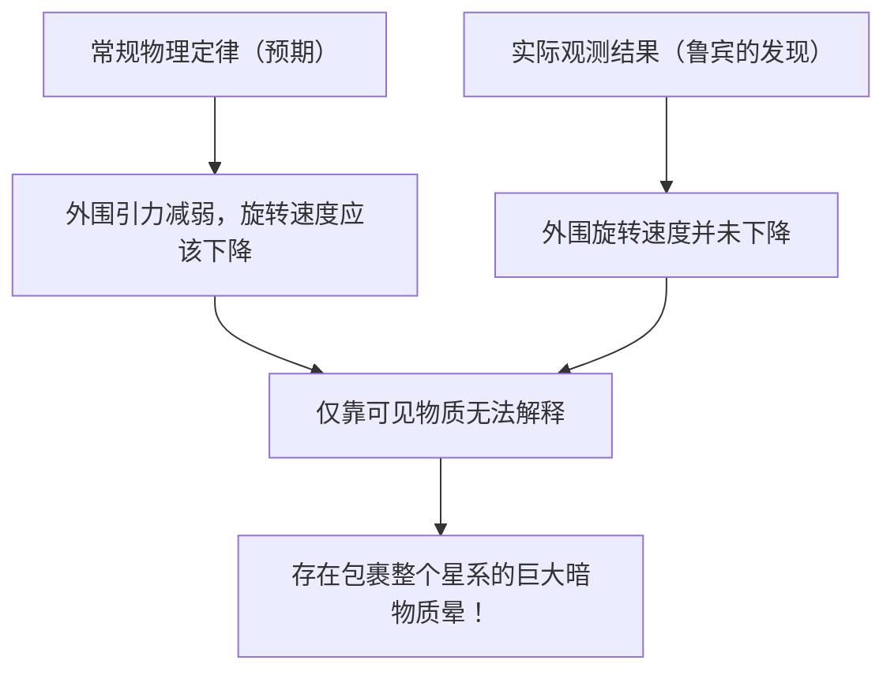

# 暗物质（Dark Matter）与暗能量：支配宇宙的无形力量

当我们仰望夜空时，无数的星星和星系只是整个宇宙的冰山一角。根据目前的标准宇宙学模型（ΛCDM模型），我们所知的常规物质（如恒星、气体、行星以及构成我们自身的原子等）仅占宇宙总能量和物质构成的约5%。剩下的约27%被称为“暗物质（Dark Matter）”，约68%被称为“暗能量（Dark Energy）”，它们都是由身份不明的存在所占据。

这个“不可见的宇宙”是如何被发现的？又是如何成为现代物理学最大谜团的？本文将从其历史渊源到最新的粒子物理学，再到最前沿的观测实验，进行全面彻底的解析。

## 暗物质的历史发现：消失的质量之谜

### 弗里茨·兹威基与“不可见质量”的提出

暗物质的概念首次登上科学舞台是在1933年。出生于瑞士的天文学家弗里茨·兹威基（Fritz Zwicky）当时正在观测一个名为后发座星系团（Coma Cluster）的巨大星系团。他测量了构成星系团的各个星系的运动速度，并根据这些速度计算出星系团整体需要多大的引力才能将彼此束缚在一起。

同时，他从星系团发出的总光量中推算出了其中包含的恒星质量（可见质量）。令人惊讶的是，观测到的星系运动速度实在太快了，仅靠通过发光推算出的质量所产生的引力根本无法将其束缚。如果只存在肉眼可见的物质，那么星系团早就应该四分五裂了。兹威基认为，存在着大量看不见的未知物质，正是其引力将星系团凝聚在一起，他将其命名为“dunkle Materie（暗物质）”。然而，在当时的天文学界，由于对观测精度的质疑等原因，他的主张长期被忽视。

### 薇拉·鲁宾与星系旋转曲线问题

在兹威基发现约40年后的20世纪70年代，终于出现了决定暗物质存在的观测结果。美国天文学家薇拉·鲁宾（Vera Rubin）和她的同事肯特·福特（Kent Ford）以仙女座星系等旋涡星系为对象，详细测量了“星系旋转曲线”。

在中心恒星密集的星系中，越远离中心引力就越弱，因此根据开普勒定律，外围恒星的旋转速度应该会减慢（这与太阳系中越外侧的行星公转速度越慢是同一原理）。然而，鲁宾的观测结果却出乎意料。即使在远离星系中心的外围区域，恒星和气体的旋转速度也没有下降，而是几乎保持着恒定的速度。

解释这种“星系旋转曲线平坦性”的唯一合理方法是，在远远超出星系可见部分的广阔区域内，假设存在着肉眼看不见的巨大质量块（暗物质晕），其引力正以高速拉扯着外围的恒星。通过鲁宾细致的观测，暗物质不再仅仅是假设，而是作为现代宇宙学中不可忽视的坚实现实被接受。

## 寻找暗物质的真面目：粒子物理学的挑战

虽然从引力作用可以确信暗物质“就在那里”，但它的“真面目”到底是什么呢？由于它不与光（电磁波）发生相互作用，因此我们既无法直接看到它，也无法用射电波或X射线捕捉到它。目前有力的候选者是超越标准模型（目前已知的基本粒子框架）的未知基本粒子。

### 候选1：WIMP（弱相互作用大质量粒子）

长久以来，最被看好的候选者是WIMP（弱相互作用大质量粒子，Weakly Interacting Massive Particles）。顾名思义，WIMP具有质量（产生引力），但不参与电磁力或强核力，只通过“弱核力”和“引力”与其他物质相互作用，是一种假想粒子。
如果WIMP存在，它们在早期宇宙的高温高密状态下会大量生成，随着宇宙冷却，残存的数量正好与当前暗物质的密度完全一致，这一美妙的理论背景被称为“WIMP奇迹”。由于超对称理论等粒子物理学扩展模型自然地推导出了它的存在，世界各地的实验物理学家都在竞相寻找WIMP。

### 候选2：轴子（Axion）

另一个有力的候选者是轴子。轴子原本是为了解决强相互作用（结合夸克形成质子和中子的力）中“CP对称性破缺”这一物理学谜团而引入的、极轻的未被发现的粒子。
相较于WIMP被认为具有质子几十倍到几千倍的庞大质量，轴子的质量被认为轻得惊人，不到电子质量的数亿分之一。然而，如果宇宙空间中存在无数的轴子，聚沙成塔，它们整体上就能产生巨大的质量，从而表现出暗物质的特性。近年来，由于WIMP的寻找陷入僵局，对轴子探索的关注度急剧上升。

## 最前沿的观测实验：从地下深处追寻宇宙之谜

暗物质粒子（尤其是WIMP）被期望会有极小概率与普通物质（原子核）发生碰撞。然而，在地面上由于宇宙射线等背景噪声过多，捕捉这种微弱的碰撞信号是不可能的。因此，暗物质直接探测实验通常在能够阻挡宇宙射线的厚重岩层下的深地设施中进行。

### XENON实验项目（XENONnT）

在意大利大萨索国家实验室（地下约1400米）进行的“XENON”项目，是使用液态氙的全球最高灵敏度暗物质探测实验。在最新的“XENONnT”中，巨大的水箱里装满了约8.6吨超高纯度液态氙，试图捕捉暗物质粒子碰撞氙原子核时发出的微弱光芒（闪烁光）和电子。日本东京大学、名古屋大学等研究团队也参与其中，在将背景噪声降至极限的环境下，等待着与未知粒子的相遇。

### LUX-ZEPLIN（LZ）实验与“希格西诺（Higgsino）”的波澜

目前，在美国南达科他州地下约1.6公里的研究设施“SURF”中，使用了10吨超高纯度液态氙的国际合作项目“LUX-ZEPLIN（LZ）实验”正在运行。最近，LZ实验对2023年3月至2024年4月期间收集的220天观测数据进行分析，记录下了一次无法用已知背景噪声解释的单一粒子相互作用，在物理学界引起了巨大波澜。

表示偶然发生概率的统计指标“西格玛（σ）”值为2.6，距离物理学界公认的发现标准5西格玛还有很大距离。但是，在迄今为止LZ实验报告的案例中，它被认为是暗物质最有力的迹象。对于这一事件，多个独立的研究团队相继提出解释，认为这与超对称理论预言的暗物质候选者“希格西诺”（质量约1.1TeV）有关。他们认为，这可能是由于希格西诺的“非弹性散射（碰撞的部分能量使暗物质粒子转变为略微变重的状态的散射）”而产生的事件。随着未来数据的进一步积累，这究竟会成为世纪大发现的第一步，还是仅仅作为单纯的涨落而消失，全世界都在拭目坚待。

### 从神冈探测器到顶级神冈探测器

位于日本岐阜县神冈矿山地下的设施，也是粒子观测的全球中心。曾经小柴昌俊博士观测到超新星中微子的“神冈探测器（Kamiokande）”，以及发现中微子振荡的“超级神冈探测器（Super-Kamiokande）”都非常著名。目前正在建设的下一代设施“顶级神冈探测器（Hyper-Kamiokande）”，以及同样在神冈地下进行的暗物质探测实验“XMASS”的后继计划等，都被寄予厚望，有望在解开宇宙暗成分之谜方面做出巨大贡献。中微子本身也具有极微小的质量，曾经也被视为暗物质的候选者，但现在已知它太轻了，无法解释宇宙的结构形成（会变成热暗物质）。不过，在中微子研究中培养出的极低放射性技术和光电倍增管技术，已成为暗物质探索中不可或缺的手段。

## 使宇宙加速膨胀的神秘力量：暗能量（Dark Energy）

如果说暗物质是“通过引力吸引物质、形成星系的力量”，那么与之相对立、“试图用排斥力撕裂整个宇宙的力量”就是“暗能量”。

### 宇宙加速膨胀的发现

1998年，由索尔·珀尔马特（Saul Perlmutter）、布莱恩·施密特（Brian Schmidt）和亚当·里斯（Adam Riess）（2011年诺贝尔物理学奖得主）领导的两个观测团队，通过观测遥远的“Ia型超新星（由于亮度恒定，可用作宇宙的标准光源）”，发表了令人震惊的事实。
在当时的宇宙学中，人们认为在大爆炸后开始膨胀的宇宙，由于物质之间的引力相互吸引，其膨胀速度正在逐渐减慢（减速膨胀）。然而观测结果却截然相反，宇宙的膨胀速度现在比过去更快了，也就是说，宇宙正在“加速膨胀”。

### 暗能量的真面目：爱因斯坦的宇宙常数？

空间本身正在加速膨胀。为了解释这一点，人们引入了暗能量。暗物质具有在空间某处偏向聚集的性质，而暗能量则完全均匀地充满宇宙空间的每一个角落，并且具有随着空间扩展其总量也会增加的奇异特性。

其最有力的候选者是阿尔伯特·爱因斯坦曾经引入广义相对论引力场方程，后来又作为“一生中最大的错误”而撤回的“宇宙常数（Λ：Lambda）”。这种观点认为，真空本身所具有的能量（真空零点能）作为斥力（排斥力）发挥作用，推动宇宙不断膨胀。然而，量子力学理论计算预言的真空能量值与从天文观测推导出的暗能量值之间，存在着10的120次方倍这一天文数字级别（甚至更大）的差异，这也被称为“物理学史上最糟糕的预言”，是一个未解的难题。

## 结论：我们仍然只了解宇宙的5%

暗物质与暗能量。虽然名字相似，但它们在宇宙中的作用截然不同。暗物质是塑造宇宙结构的“骨架”，是将星系连接在一起的粘合剂。相反，暗能量则是在不断撑开空间本身，最终会将所有星系推向远方，可以说是宇宙的“破坏者”。

我们所建立的科学技术和物理定律固然惊人，但它们适用的范围仅仅是宇宙中那5%的物质。剩下的95%到底是由什么构成的？我们是否终将迎来揭开其真正面貌的那一天？在地下深处的实验室里，亦或是在悬浮于太空的最新望远镜中，今天的人类依然在勇敢地进行着挑战，试图抓住这个“不可见的宇宙”的尾巴。
