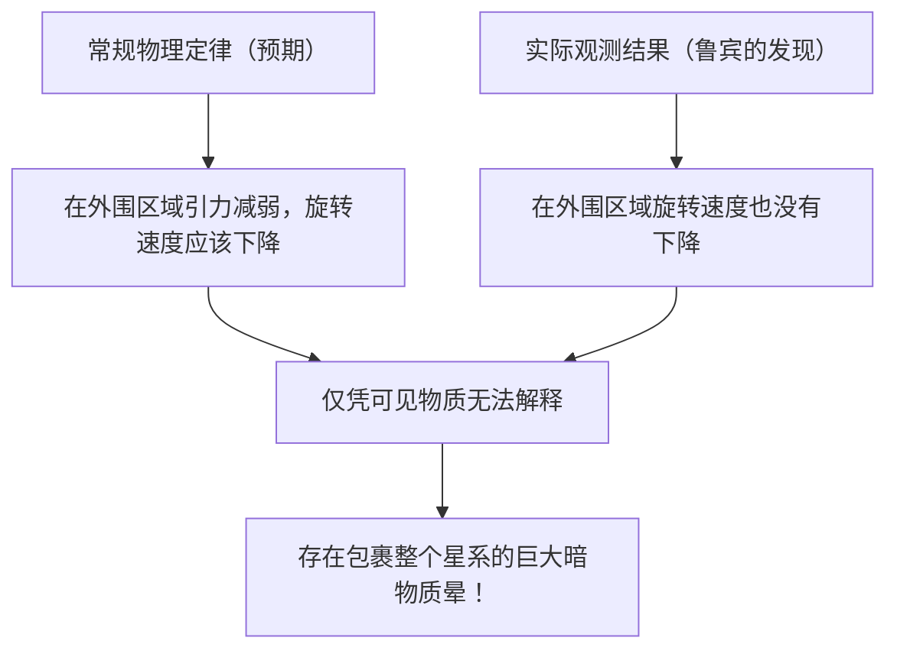

# 暗物质与暗能量：支配宇宙的无形力量

当我们仰望夜空时，看到的无数恒星和星系，不过是整个宇宙的冰山一角。根据目前的标准宇宙学模型（ΛCDM模型），我们所知的普通物质（恒星、气体、行星以及构成我们自身的原子等）仅占宇宙总能量和物质构成的约5%。剩余的约27%被称为“暗物质（Dark Matter）”，约68%被称为“暗能量（Dark Energy）”，被这些身份不明的存在所占据。

这个“看不见的宇宙”是如何被发现，并成为现代物理学最大谜团的呢？本文将从其历史、最新的粒子物理学，再到最前沿的观测实验，进行彻底的解说。

## 暗物质的历史性发现：缺失质量之谜

### 弗里茨·兹威基与“不可见质量”的提出

暗物质的概念首次出现在科学舞台上是在1933年。瑞士天文学家弗里茨·兹威基（Fritz Zwicky）当时正在观测一个名为后发座星系团（Coma Cluster）的巨大星系集合。他测量了星系团中各个星系的移动速度，并根据这些速度计算出整个星系团需要多大的引力才能将彼此束缚在一起。

同时，他根据星系团发出的总光量，估算了其中包含的恒星质量（可见质量）。令人惊讶的是，观测到的星系移动速度太快，仅凭光线估算出的质量所产生的引力根本无法束缚住它们。如果只存在肉眼可见的物质，星系团早就分崩离析了。兹威基认为，存在大量看不见的未知物质，正是它们的引力将星系团维系在一起，他将其命名为“dunkle Materie（暗物质）”。然而，由于当时天文学界对观测精度的质疑等原因，他的主张长期被忽视。

### 薇拉·鲁宾与星系旋转曲线问题

在兹威基发现约40年后的20世纪70年代，出现了决定暗物质存在的观测结果。美国天文学家薇拉·鲁宾（Vera Rubin）及其同事肯特·福特（Kent Ford）以仙女座星系等旋涡星系为对象，详细测量了“星系旋转曲线”。

在恒星密集的星系中心部，越远离中心引力越弱，因此根据开普勒定律，外围恒星的旋转速度应该会变慢（原理与太阳系中外侧行星公转速度较慢相同）。然而，鲁宾的观测结果却出乎意料。即使在远离星系中心的外围区域，恒星和气体的旋转速度也没有下降，而是保持在几乎恒定的速度。

解释这种“星系旋转曲线平坦性”的唯一合理方法是假设在远超星系可见部分的广阔区域内，存在大量看不见的巨大质量块（暗物质晕），其引力正在高速拉扯外围的恒星。通过鲁宾的精密观测，暗物质不再仅仅是一个假说，而是作为现代宇宙学中不可忽视的确凿现实被接受。

## 追寻暗物质的真面目：粒子物理学的挑战

虽然从引力的作用可以确定暗物质“存在于那里”，但它的“真面目”到底是什么呢？因为它不与光（电磁波）发生相互作用，所以既无法直接看到，也无法用电波或X射线捕捉到。目前最有力的候选者是超出现有标准模型（目前已知的基本粒子框架）的未知基本粒子。

### 候选1：WIMP（弱相互作用大质量粒子）

长期以来，最被看好的候选者是WIMP（弱相互作用大质量粒子）。正如其名，WIMP具有质量（产生引力），但不参与电磁力和强核力相互作用，是一种仅通过“弱核力”和“引力”与其他物质产生关联的假想粒子。
如果WIMP存在，它将在早期宇宙的高温高密状态下大量生成，随着宇宙冷却，残留下来的数量正好与现在的暗物质密度完美吻合，这被称为“WIMP奇迹”，具有优美的理论背景。由于在超对称性理论等粒子物理学的扩展模型中也能自然推导出来，全世界的实验物理学家都在竞相探索WIMP。

### 候选2：轴子（Axion）

另一个有力的候选者是轴子。轴子最初是为了解决强相互作用（将夸克结合成质子和中子的力）中“CP对称性破缺”这一其他物理学谜团而引入的一种极轻的未发现粒子。
WIMP被认为具有质子数十至数千倍的沉重质量，而轴子则被认为只有电子几亿分之一甚至更轻的惊人质量。然而，如果它们在宇宙空间中无数地存在，聚沙成塔，整体上就能产生巨大的质量，并作为暗物质发挥作用。近年来，由于WIMP的发现进展艰难，对轴子探索的关注度急剧上升。

## 最前沿的观测实验：从地下深处追寻宇宙之谜

暗物质粒子（特别是WIMP）被期望偶尔会与普通物质（原子核）发生碰撞。然而，在地表，宇宙射线等噪声太多，不可能捕捉到那种微弱的碰撞信号。因此，暗物质直接探测实验都在深层地下设施中进行，那里可以用厚厚的岩层阻挡宇宙射线。

### XENON实验项目（XENONnT）

在意大利格兰萨索国家实验室（地下约1400米）进行的“XENON”项目，是使用液态氙的世界上灵敏度最高的暗物质探测实验。在最新的“XENONnT”中，他们将约8.6吨的超高纯度液态氙注满巨大的储罐，试图捕捉暗物质粒子碰撞氙原子核时发出的微弱光芒（闪烁光）和电子。日本的东京大学、名古屋大学等研究团队也参与其中，在将背景噪声降至极限的环境中等待与未知粒子的相遇。

### 从神冈探测器到超级神冈探测器

位于日本岐阜县神冈矿山地下的设施也是世界级的粒子观测基地。曾经小柴昌俊博士观测到超新星中微子的“神冈探测器（Kamiokande）”，以及发现中微子振荡的“超级神冈探测器（Super-Kamiokande）”都非常有名。目前正在建设的下一代设施“顶级神冈探测器（Hyper-Kamiokande）”，以及同样在神冈地下进行的暗物质探测实验“XMASS”的后续计划等，都被期待能为揭开宇宙暗成分做出重大贡献。中微子本身也具有极微的质量，曾经被认为是暗物质的候选者，但现在已知它太轻了，无法解释宇宙的结构形成（会变成热暗物质）。然而，在中微子研究中培养出的极低放射性技术和光电倍增管技术，已成为暗物质探测不可或缺的技术。

## 让宇宙加速膨胀的神秘力量：暗能量（Dark Energy）

如果说暗物质是“通过引力吸引物质、形成星系的力量”，那么与之相对立，“试图以排斥力撕裂整个宇宙的力量”就是“暗能量（Dark Energy）”。

### 宇宙加速膨胀的发现

1998年，由索尔·珀尔马特（Saul Perlmutter）、布莱恩·施密特（Brian Schmidt）和亚当·里斯（Adam Riess）（2011年诺贝尔物理学奖得主）领导的两个观测团队，通过观测遥远的“Ia型超新星（由于亮度恒定，可作为宇宙的标准光源）”，发表了令人震惊的事实。
在以往的宇宙学中，人们认为在大爆炸后开始膨胀的宇宙，由于物质之间引力的相互吸引，其膨胀速度正在逐渐减慢（减速膨胀）。然而，观测结果却截然相反，宇宙现在的膨胀速度比过去更快，也就是说，它正在“加速膨胀”。

### 暗能量的真面目：爱因斯坦的宇宙常数？

空间本身正在加速膨胀。为了解释这一点，引入了暗能量。暗物质具有在空间某处偏在聚集的性质，而暗能量则完全均匀地充满整个宇宙空间，并且具有一种奇妙的性质：空间越扩大，其总量也随之增加。

其最有力的候选者，是阿尔伯特·爱因斯坦曾经引入广义相对论引力场方程，后来又作为“一生最大的错误”撤回的“宇宙常数（Λ：Lambda）”。这种观点认为，真空本身所具有的能量（真空能量）作为排斥力发挥作用，正在推开宇宙。然而，量子力学理论计算预言的真空能量值，与从天文观测得出的暗能量值之间，存在着10的120次方倍的天文学（甚至更大）差距，这也被称为“物理学史上最糟糕的预言”，是一个尚未解决的难题。

## 结论：我们仍然只了解宇宙的5%

暗物质与暗能量。虽然名字相似，但它们在宇宙中的作用却截然不同。暗物质是塑造宇宙结构的“骨架”，是连接星系的粘合剂。相反，暗能量则推开空间本身，最终将让所有星系远离，可以说是宇宙的“破坏者”。

我们建立起来的科学技术和物理定律固然令人惊叹，但它们适用的仅仅是宇宙中那5%的物质。剩下的95%究竟是由什么构成的？我们是否能有理解其真实面貌的一天？在深层地下的实验室中，亦或是在悬浮于太空的最新望远镜上，人类今天依然在果敢地挑战，试图抓住这个“看不见的宇宙”的尾巴。
