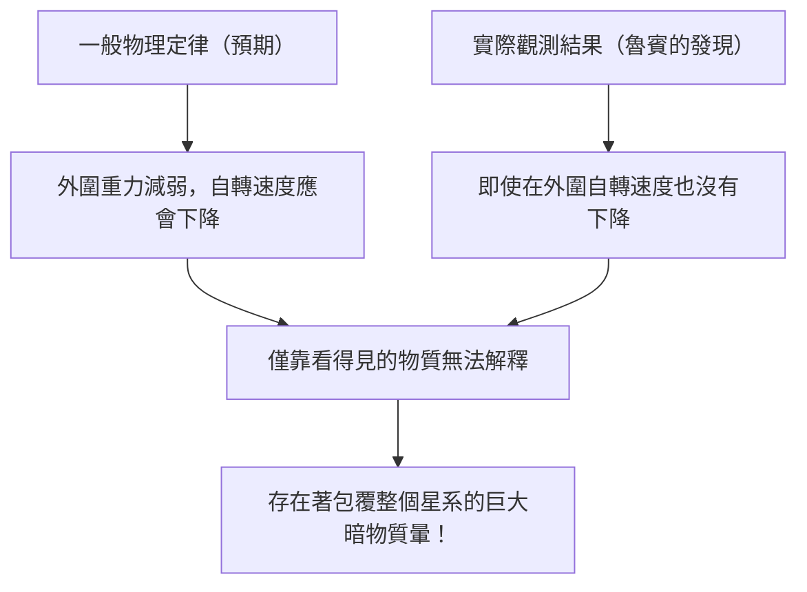

# 暗物質（Dark Matter）與暗能量：支配宇宙的無形力量

當我們仰望夜空時，我們眼中所見的無數恆星與星系，不過是整個宇宙的冰山一角。根據目前標準的宇宙學（ΛCDM模型），我們所熟知的一般物質（如恆星、氣體、行星，以及構成我們自身的原子等），僅佔宇宙整體能量與物質構成比的約5%。剩下的約27%被稱為「暗物質（Dark Matter）」，約68%被稱為「暗能量（Dark Energy）」，由這些真面目不明的存在所佔據。

這個「看不見的宇宙」是如何被發現，並成為現代物理學最大謎團的呢？本文將從其歷史到最新的粒子物理學，乃至最先進的觀測實驗，為您進行徹底的解說。

## 暗物質的歷史性發現：失落質量的謎團

### 弗里茨·茲威基與「看不見的質量」之提倡

暗物質的概念首次登上科學舞台是在1933年。瑞士裔天文學家弗里茨·茲威基（Fritz Zwicky）當時正在觀測一個被稱為后髮座星系團（Coma Cluster）的巨大星系集團。他測量了構成星系團的各個星系的移動速度，並從該速度計算出星系團整體需要多大的重力才能將彼此維繫在一起。

同時，他根據星系團發出的總光量，估算了其中所含恆星的質量（可見質量）。結果令人驚訝，觀測到的星系移動速度，僅靠從光度估算的質量所產生的重力來維繫實在太快了。如果只存在看得見的物質，星系團早就應該分崩離析了。茲威基認為，存在大量看不見的未知物質，其重力將星系團凝聚在一起，並將其命名為「dunkle Materie（暗物質）」。然而，在當時的天文學界，由於對觀測精度的質疑等原因，他的主張長期被忽視。

### 薇拉·魯賓與星系自轉曲線問題

在茲威基的發現大約40年後，進入1970年代，帶來了決定暗物質存在的觀測結果。美國天文學家薇拉·魯賓（Vera Rubin）與其同事肯特·福特（Kent Ford）以仙女座星系等螺旋星系為對象，詳細測量了「星系自轉曲線」。

在中心部位恆星密集的星系中，越遠離中心重力就越弱，因此根據克卜勒定律，外圍恆星的自轉速度應該會變慢（這與太陽系中，越外側的行星公轉速度越慢是同樣的原理）。然而，魯賓的觀測結果卻出乎意料。即使在遠離星系中心的外圍，恆星與氣體的旋轉速度也沒有下降，而是保持著幾乎恆定的速度。

要解釋這個「星系自轉曲線的平坦性」，唯一合理的方法是假設在遠遠超乎星系可見部分的廣大區域中，存在著看不見的巨大質量塊（暗物質暈），其重力正以高速牽引著外圍的恆星。藉由魯賓精密的觀測，暗物質不再只是單純的假說，而是作為現代宇宙學中不容忽視的確鑿現實被接受了。

## 探尋暗物質的真面目：粒子物理學的挑戰

從重力的作用可以確定暗物質「就在那裡」，那麼它的「真面目」到底是什麼呢？因為它不與光（電磁波）產生交互作用，所以無法直接看到，也無法用電波或X射線捕捉。目前的有力候選者是超越了標準模型（目前已知的基本粒子框架）的未知基本粒子。

### 候選1：大質量弱交互作用粒子（WIMP）

多年來，最被看好的候選者是WIMP（大質量弱交互作用粒子）。顧名思義，WIMP具有質量（會產生重力），但不與電磁力或強核力產生交互作用，被認為是僅透過「弱核力」與「重力」與其他物質發生關聯的假想粒子。
如果WIMP存在，它會在早期宇宙的高溫高密狀態下大量生成，隨著宇宙冷卻，殘留的數量會與現在暗物質的密度完全一致，這被稱為「WIMP奇蹟」，有著優美的理論背景。在超對稱性理論等粒子物理學的擴充模型中也能自然推導出來，因此全世界的實驗物理學家都在WIMP的探尋上激烈競爭。

### 候選2：軸子（Axion）

另一個有力的候選者是軸子（Axion）。軸子原本是為了解決強交互作用（將夸克結合形成質子或中子的力量）中「CP對稱性破缺」這個另一個物理學謎團而引入的、極其輕且尚未被發現的粒子。
相較於WIMP被假定具有質子數十倍到數千倍的龐大質量，軸子被認為只具有電子質量數億分之一以下的驚人輕質量。然而，如果它們在宇宙空間中無數地存在著，聚沙成塔，整體就能產生巨大的質量並表現出暗物質的行為。近年來，由於WIMP的發現遭遇瓶頸，對軸子探索的關注度正急劇上升。

## 最前線的觀測實驗：從地下深處追尋宇宙之謎

暗物質粒子（特別是WIMP）被期待偶爾會與一般物質（原子核）發生碰撞。然而，在地面上由於宇宙射線等雜訊太多，要捕捉那微弱的碰撞訊號是不可能的。因此，暗物質直接探測實驗會在能以厚實岩層阻擋宇宙射線的深層地下設施中進行。

### XENON實驗計畫（XENONnT）

在義大利格蘭薩索國家實驗室（地下約1400公尺）進行的「XENON」計畫，是使用液態氙、世界最高靈敏度的暗物質探索實驗。在最新的「XENONnT」中，將約8.6噸的超高純度液態氙注滿巨大儲槽，試圖捕捉暗物質粒子與氙原子核碰撞時發出的微弱光芒（閃爍光）與電子。日本的東京大學與名古屋大學等研究團隊也有參與，在將背景雜訊降至極限的環境中等待著與未知粒子的相遇。

### 從神岡探測器到頂級神岡探測器

位於日本岐阜縣神岡礦山地下的設施，也是粒子觀測的世界級重鎮。過去小柴昌俊博士觀測到超新星微中子的「神岡探測器（Kamiokande）」，以及發現微中子震盪的「超級神岡探測器（Super-Kamiokande）」都非常有名，而目前正在建設中的次世代設施「頂級神岡探測器（Hyper-Kamiokande）」，以及同樣在神岡地下進行的暗物質探索實驗「XMASS」的後繼計畫等，也被期待能為解開宇宙暗黑成分做出巨大貢獻。微中子本身也具有極微小的質量，過去曾被當作暗物質的候選者，但現在已知其太輕而無法解釋宇宙的結構形成（會變成熱暗物質）。然而，在微中子研究中培養出的極低輻射技術與光電倍增管技術，已成為暗物質探索不可或缺的要素。

## 使宇宙加速膨脹的謎之力量：暗能量（Dark Energy）

如果說暗物質是「透過重力吸引物質、形成星系的力量」，那麼與之相對立、「試圖以斥力撕裂整個宇宙的力量」就是「暗能量（Dark Energy）」。

### 宇宙加速膨脹的發現

1998年，由索爾·珀爾馬特（Saul Perlmutter）、布萊恩·施密特（Brian Schmidt）和亞當·里斯（Adam Riess）三人（2011年諾貝爾物理學獎得主）率領的兩個觀測團隊，觀測了遠方的「Ia型超新星（因為亮度恆定，可作為宇宙的標準燭光）」，發表了令人震驚的事實。
在以往的宇宙學中，認為因大霹靂而開始膨脹的宇宙，會因為物質間重力的互相牽引而逐漸降低膨脹速度（減速膨脹）。然而觀測結果卻恰恰相反，宇宙現在的膨脹速度比過去還要快，也就是說，宇宙正在「加速膨脹」。

### 暗能量的真面目：愛因斯坦的宇宙常數？

空間本身正在加速膨脹。為了解釋這一點而引入的概念就是暗能量。相較於暗物質具有偏佈並聚集在空間某處的性質，暗能量則完全均勻地充滿宇宙空間的各個角落，並具有一個奇妙的性質：空間擴展得越大，其總量也就越多。

其最有力的候選者，是阿爾伯特·愛因斯坦過去在廣義相對論的重力方程式中所引入，後來又作為「一生最大的錯誤」而撤回的「宇宙常數（Λ：Lambda）」。這種觀點認為，真空本身所具有的能量（真空能量）發揮了斥力（排斥力）的作用，正在將宇宙推廣開來。然而，量子力學理論計算預言的真空能量值，與從天文觀測推導出的暗能量值之間，有著10的120次方倍這種天文數字（甚至更多）的落差，這也被稱為「物理學史上最糟糕的預言」，是一個尚未解決的難題。

## 結論：我們仍只了解宇宙的5%

暗物質與暗能量。雖然名字相似，但它們在宇宙中扮演的角色卻截然不同。暗物質是塑造宇宙結構的「骨架」，是將星系維繫在一起的黏合劑。相對地，暗能量則是推廣空間本身，最終將使所有星系彼此遠離，可說是宇宙的「破壞者」。

我們建立起來的科學技術與物理定律雖然令人驚嘆，但它們能適用的，僅僅只是宇宙中那5%的物質。剩下的95%是由什麼構成的？我們能有理解其真實面貌的一天嗎？無論是在地下深處的實驗室，還是在漂浮於太空的最新望遠鏡中，人類今天依然為了抓住「看不見的宇宙」的尾巴，而持續進行著果敢的挑戰。
