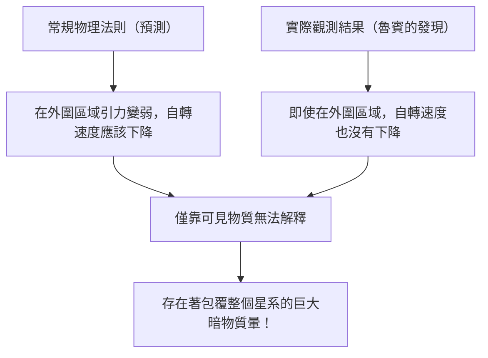

# 暗物質（Dark Matter）與暗能量（Dark Energy）：支配宇宙的無形力量

當我們仰望夜空時，我們眼中所見的無數星辰與星系，不過是整個宇宙的冰山一角。根據目前標準的宇宙學模型（ΛCDM模型），我們所熟知的常規物質（恆星、氣體、行星以及構成我們自身的原子等）僅佔宇宙整體能量與物質構成比例的約5%。剩餘的約27%被稱為「暗物質（Dark Matter）」，約68%被稱為「暗能量（Dark Energy）」，它們都是被不明真相的存在所佔據。

這個「看不見的宇宙」究竟是如何被發現，並成為現代物理學中最大的謎團的呢？在本文中，我們將從其歷史講起，一直到最新的粒子物理學以及最尖端的觀測實驗，為您進行全面深入的解說。

## 暗物質的歷史性發現：失落質量的謎團

### 弗里茨·茲威基（Fritz Zwicky）與「看不見的質量」的提出

暗物質的概念首次登上科學舞台是在1933年。出生於瑞士的天文學家弗里茨·茲威基當時正在觀測一個被稱為后髮座星系團（Coma Cluster）的巨大星系集合體。他測量了構成該星系團的各個星系的移動速度，並根據這些速度計算出整個星系團需要多大的引力才能將彼此維繫在一起。

同時，他根據星系團發出的總光量，估算了其中所包含的恆星質量（可見質量）。結果令人震驚：觀測到的星系移動速度過快，單靠光所估算出的質量所產生的引力根本無法將它們拉住。如果只存在肉眼可見的物質，那麼星系團早就應該分崩離析了。茲威基認為，存在著大量看不見的未知物質，正是它們的引力將星系團凝聚在一起，並將其命名為「dunkle Materie（暗物質）」。然而，在當時的天文學界，由於對觀測精度的質疑等原因，他的主張在很長一段時間內都被忽視了。

### 薇拉·魯賓（Vera Rubin）與星系自轉曲線的問題

在茲威基的發現之後約40年，進入1970年代，決定性證實暗物質存在的觀測結果出現了。美國天文學家薇拉·魯賓與同事肯特·福特（Kent Ford）以仙女座星系等螺旋星系為對象，詳細測量了「星系自轉曲線」。

在中心恆星密集的星系中，越遠離中心引力就越弱，因此根據克卜勒定律，外圍恆星的自轉速度應該會變慢（這與太陽系中外側行星公轉速度較慢的原理相同）。然而，魯賓的觀測結果卻出乎意料。即使在距離星系中心很遠的外圍區域，恆星和氣體的自轉速度也沒有下降，而是保持著幾乎恆定的速度。

要解釋這種「星系自轉曲線的平坦性」，唯一合理的方法就是假設在遠遠超出星系可見部分的廣闊區域中，存在著肉眼看不見的巨大質量塊（暗物質暈），其引力正以高速拉扯著外圍的恆星。藉由魯賓精密的觀測，暗物質不再僅僅是個假說，而是作為現代宇宙學中不容忽視的確鑿現實而被接受了。

## 探尋暗物質的真面目：粒子物理學的挑戰

雖然從引力作用可以確定暗物質「確實在這裡」，那麼它的「真面目」究竟是什麼呢？由於它不與光（電磁波）發生交互作用，我們無法直接看到它，也無法用無線電波或X射線捕捉到它。目前有力的候選者，是超出了標準模型（目前已知的基本粒子框架）的未知基本粒子。

### 候選者1：WIMP（大質量弱交互作用粒子）

多年來，最被看好的候選者是WIMP（大質量弱交互作用粒子）。正如其名，WIMP具有質量（能產生引力），但不與電磁力或強核力發生交互作用，被認為是僅透過「弱核力」和「引力」與其他物質發生關聯的假想粒子。
如果WIMP存在，那麼在早期宇宙高溫高密的狀態下它會被大量生成，而隨著宇宙冷卻，留存下來的數量恰好與目前暗物質的密度完全一致，這被稱為「WIMP奇蹟」，有著優美的理論背景。由於在超對稱理論等粒子物理學擴展模型中也能自然推導出來，世界各地的實驗物理學家們一直在激烈競爭尋找WIMP。

### 候選者2：軸子（Axion）

另一個有力的候選者是軸子。軸子原本是為了解決強交互作用（將夸克結合形成質子和中子的力）中「CP對稱性破缺」這個另一項物理學謎團而引入的一種極輕的未發現粒子。
相較於WIMP被假定為具有質子數十倍到數千倍的龐大質量，軸子則被認為具有驚人的輕盈質量，不到電子質量的數億分之一。然而，如果宇宙空間中存在著無數的軸子，積少成多，整體上就能產生巨大的質量並表現出暗物質的特性。近年來，由於WIMP的發現遭遇困難，對軸子探索的關注度正在急劇上升。

## 最前線的觀測實驗：從地下深處追尋宇宙之謎

暗物質粒子（特別是WIMP）被期待偶爾會與常規物質（原子核）發生碰撞。然而，在地面上由於宇宙射線等背景雜訊過多，要捕捉到那微弱的碰撞訊號是不可能的。因此，暗物質的直接探測實驗都是在能夠用厚重岩層阻擋宇宙射線的地下深處設施中進行。

### XENON實驗計畫（XENONnT）

在義大利格蘭薩索國家實驗室（地下約1400公尺）進行的「XENON」計畫，是使用液態氙、擁有世界最高靈敏度的暗物質探索實驗。在最新的「XENONnT」中，將約8.6噸的超高純度液態氙注滿巨大儲槽，試圖捕捉暗物質粒子與氙原子核碰撞時發出的微弱閃光（閃爍光）和電子。日本的東京大學和名古屋大學等研究團隊也參與其中，在極限降低背景雜訊的環境中等待著與未知粒子的相遇。

### LUX-ZEPLIN（LZ）實驗與「希格西諾（Higgsino）」的波瀾

目前，在美國南達科他州地下約1.6公里的研究設施「SURF」中，使用10噸超高純度液態氙的國際合作計畫「LUX-ZEPLIN（LZ）實驗」正在運作。最近，該LZ實驗分析了從2023年3月到2024年4月期間收集的220天觀測數據，記錄到了一次無法用已知背景雜訊解釋的單一粒子交互作用，在物理學界引起了巨大的波瀾。

表示偶然發生機率的統計指標「西格瑪（σ）」的值為2.6，距離物理學中作為發現標準的5西格瑪還差得很遠。然而，在迄今為止LZ實驗報告的案例中，這被認為是最有力的暗物質徵兆。對於這一事件，多個獨立的研究團隊相繼提出解釋，認為這可能與超對稱理論所預言的暗物質候選者「希格西諾」（質量約1.1 TeV）有關。他們指出，這可能是由希格西諾的「非彈性散射（暗物質粒子因碰撞的部分動能而轉變成質量稍大狀態的散射）」所引起的事件。隨著未來數據的進一步累積，這究竟會成為世紀發現的第一步，還是僅僅作為單純的漲落而消失，全世界都在屏息以待。

### 從神岡探測器（Kamiokande）到頂級神岡探測器（Hyper-Kamiokande）

位於日本岐阜縣神岡礦山地下的設施，也是基本粒子觀測的世界級據點。曾經由小柴昌俊博士觀測到超新星微中子的「神岡探測器」，以及發現微中子振盪的「超級神岡探測器」非常有名，而目前正在建設的次世代設施「頂級神岡探測器」，以及同樣在神岡地下進行的暗物質探索實驗「XMASS」的後續計畫等，也被期待能為解開宇宙暗成分做出重大貢獻。微中子本身也具有極微小的質量，曾經也被認為是暗物質的候選者，但現在已知其過於輕盈，無法解釋宇宙結構的形成（會成為熱暗物質）。然而，在微中子研究中培養出來的極低輻射技術和光電倍增管技術，已成為暗物質探索中不可或缺的一部分。

## 加速宇宙膨脹的神秘力量：暗能量（Dark Energy）

如果說暗物質是「透過引力吸引物質並形成星系的力量」，那麼與之完全對立、「試圖用排斥力撕裂整個宇宙的力量」就是「暗能量（Dark Energy）」。

### 宇宙加速膨脹的發現

1998年，由薩爾·珀爾馬特（Saul Perlmutter）、布萊恩·施密特（Brian Schmidt）和亞當·里斯（Adam Riess）三位（2011年諾貝爾物理學獎得主）率領的兩個觀測團隊，藉由觀測遙遠的「Ia型超新星（因為亮度恆定，可作為宇宙的標準光源）」，發表了一項令人震驚的事實。
在先前的宇宙學中，人們認為在大霹靂中開始膨脹的宇宙，會因為物質之間引力的相互牽引而逐漸減緩其膨脹速度（減速膨脹）。然而觀測結果卻恰恰相反，宇宙的膨脹速度現在比過去更快，也就是說它正在「加速膨脹」。

### 暗能量的真面目：愛因斯坦的宇宙常數？

空間本身正在加速膨脹。為了解釋這個現象而引入的就是暗能量。相較於暗物質具有偏存於空間某處並聚集的性質，暗能量則完全均勻地充滿在宇宙空間的每個角落，並且具有一種奇特的性質：空間越擴大，其總量也隨之增加。

其最有力的候選者，是阿爾伯特·愛因斯坦曾經引入廣義相對論引力方程式中，後來又稱其為「一生中最大的錯誤」而撤回的「宇宙常數（Λ：Lambda）」。這種觀點認為，真空本身所具有的能量（真空能量）起到了斥力（排斥力）的作用，正在將宇宙推開。然而，量子力學理論計算預測的真空能量值與從天文觀測推導出的暗能量值之間，存在著高達10的120次方倍這種天文數字級（甚至更大）的落差，這也被稱為「物理學史上最糟糕的預測」，是一個尚未解決的難題。

## 結論：我們對宇宙仍只了解5%

暗物質與暗能量。名字雖然相似，但在宇宙中扮演的角色卻截然不同。暗物質是塑造宇宙結構的「骨架」，是將星系維繫在一起的黏合劑。相對地，暗能量則是撐開空間本身，最終將使所有星系遠離的宇宙「破壞者」。

我們所建立的科學技術和物理法則雖然令人驚嘆，但它們能適用的，僅僅是宇宙中那5%的物質。剩下的95%究竟是由什麼組成的？我們會有了解其真正面貌的一天嗎？在深處地下的實驗室裡，或者在漂浮於宇宙空間的最新望遠鏡中，人類今天依然為了抓住「看不見的宇宙」的尾巴，持續進行著果敢的挑戰。
