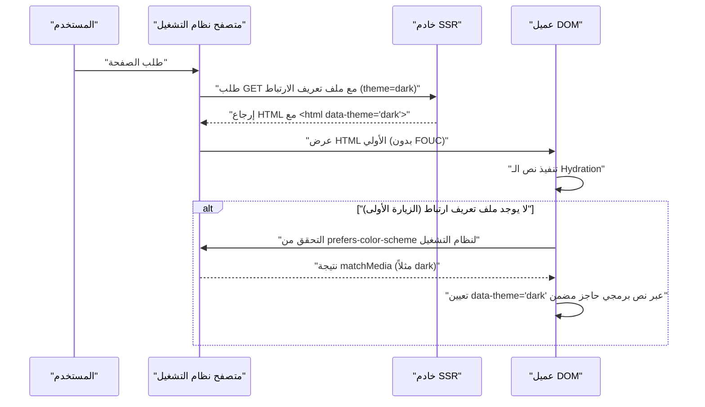

في تطوير الويب الحديث، تحول دعم الوضع الداكن (Dark Mode) من مجرد "ميزة إضافية جيدة" (Nice to have) إلى "متطلب أساسي" (Must have) لتحسين تجربة المستخدم (UX). خاصة في الوسائط التي تفترض قراءة النصوص لفترات طويلة مثل المدونات ومواقع الوثائق، حيث يقلل من إجهاد عين المستخدم ويحافظ على استهلاك بطارية الجهاز، لذا فإن أهمية دعم الوضع الداكن عالية جدًا.

في هذه المقالة، سنشرح بتعمق شديد من منظور مهندس الواجهة الأمامية التحديات التقنية التي لا مفر منها لدعم الوضع الداكن في المدونات، ونقاط تصميم CSS ذات القابلية العالية للصيانة. سنغطي كل شيء بدءًا من استخدام المتغيرات المخصصة (CSS Custom Properties)، والتحكم المتقدم عبر JavaScript والتكامل مع SSR لمنع FOUC (Flash of Unstyled Content)، وتصميم الألوان لضمان إمكانية الوصول (WCAG 2.1 AAA) (بما في ذلك RGB و HSL وأحدث OKLCH)، وحتى أمثلة عملية للأكواد باستخدام Tailwind CSS.

---

## 1. أساسيات تصميم السمات باستخدام متغيرات CSS (CSS Custom Properties)

النهج الأكثر قياسية وقوة حاليًا لتنفيذ الوضع الداكن هو استخدام **متغيرات CSS المخصصة (CSS Custom Properties)**. على عكس متغيرات معالجات CSS مثل Sass (مثلاً `$color`) التي يتم حلها بشكل ثابت أثناء الترجمة (compile)، يتم حل متغيرات CSS والكتابة فوقها ديناميكيًا في وقت التشغيل (runtime) للمتصفح. يتيح ذلك تغيير ألوان الصفحة بالكامل فورًا بمجرد تبديل الفئة (class) عبر JavaScript.

### 1.1 تعريف سمة الألوان الأساسية

أولاً، نستخدم الفئة الزائفة `:root` لتعريف لوحة ألوان الوضع الفاتح (الافتراضي). ثم النمط التصميمي الشائع هو الكتابة فوق تلك المتغيرات عند إضافة سمة مثل `[data-theme='dark']` (أو فئة `.dark`).

```css
/* تعريف متغيرات الوضع الفاتح (الافتراضي) */
:root {
  --color-bg-primary: #ffffff;
  --color-bg-secondary: #f3f4f6;
  --color-text-primary: #111827;
  --color-text-secondary: #4b5563;
  --color-accent: #3b82f6;
  --color-border: #e5e7eb;
}

/* الكتابة فوق المتغيرات في الوضع الداكن */
[data-theme='dark'] {
  --color-bg-primary: #111827;
  --color-bg-secondary: #1f2937;
  --color-text-primary: #f9fafb;
  --color-text-secondary: #9ca3af;
  --color-accent: #60a5fa;
  --color-border: #374151;
}

/* التطبيق الفعلي */
body {
  background-color: var(--color-bg-primary);
  color: var(--color-text-primary);
  transition: background-color 0.3s ease, color 0.3s ease;
}

a {
  color: var(--color-accent);
}
```

بهذه الطريقة، من خلال الفصل التام بين التخطيط والطباعة من جهة وتحديد الألوان (السمة) من جهة أخرى، تتحسن قابلية صيانة CSS بشكل كبير.

### 1.2 الاستفادة من @media (prefers-color-scheme: dark)

إذا تم تعيين الوضع الداكن على مستوى نظام التشغيل، فمن المستحسن من منظور تجربة المستخدم تطبيق السمة الداكنة تلقائيًا منذ الزيارة الأولى للموقع. الاستعلام الإعلامي (media query) `@media (prefers-color-scheme: dark)` يحقق ذلك.

```css
/* حل بديل عندما يكون إعداد بيئة نظام التشغيل هو الوضع الداكن */
@media (prefers-color-scheme: dark) {
  :root:not([data-theme='light']) {
    --color-bg-primary: #111827;
    --color-bg-secondary: #1f2937;
    --color-text-primary: #f9fafb;
    --color-text-secondary: #9ca3af;
    --color-accent: #60a5fa;
    --color-border: #374151;
  }
}
```

في هذا التدوين، طالما أن المستخدم لم يختر الوضع الفاتح صراحةً (`data-theme='light'`)، فسيتم احترام إعداد الوضع الداكن لنظام التشغيل والكتابة فوق المتغيرات.

---

## 2. فهم مساحات الألوان وإمكانية الوصول (WCAG 2.1 AAA)

في تصميم ألوان الوضع الداكن، لا يكفي مجرد "جعل الخلفية سوداء والنص أبيض". إذا كان التباين قويًا جدًا، فسيؤدي ذلك إلى توهج (halation) ويجعل القراءة أصعب، وإذا كان منخفضًا جدًا، فستتأثر الرؤية. تحدد إرشادات إمكانية الوصول لمحتوى الويب (WCAG) بدقة نسبة التباين المطلوبة لضمان الرؤية الواضحة.

### 2.1 معادلة حساب نسبة التباين في WCAG

تُعرف نسبة التباين (Contrast Ratio) $CR$ في WCAG باستخدام الإضاءة النسبية (Relative Luminance) للون الخلفية ولون المقدمة على النحو التالي:

$$CR = \frac{L_{lighter} + 0.05}{L_{darker} + 0.05}$$

حيث أن $L_{lighter}$ هو الإضاءة النسبية للون الأفتح، و $L_{darker}$ هو الإضاءة النسبية للون الأغمق (نطاق القيم من 0.0 إلى 1.0). لتحقيق مستوى AAA في WCAG 2.1، يلزم نسبة تباين تبلغ **7:1 أو أكثر** للنصوص العادية، و **4.5:1 أو أكثر** للنصوص الكبيرة.

تُحسب الإضاءة النسبية $L$ من قيم RGB في مساحة ألوان sRGB باستخدام المعادلة المعقدة التالية:

$$L = 0.2126 \times R + 0.7152 \times G + 0.0722 \times B$$

كل مكون ($R, G, B$) يستخدم القيمة المُطبعة (normalized value) عن طريق قسمة القيمة الأصلية ذات الـ 8 بت ($R_{sRGB}$) على 255، ويقوم بالتحويل التالي لفك تصحيح جاما:

$$
R, G, B = 
\begin{cases} 
\frac{C_{sRGB}}{12.92} & \text{if } C_{sRGB} \le 0.03928 \\
\left( \frac{C_{sRGB} + 0.055}{1.055} \right)^{2.4} & \text{otherwise}
\end{cases}
$$

من الصعب إجراء هذه الحسابات يدويًا، ولكن باستخدام أدوات تصميم الألوان، يمكنك تلقائيًا تحديد الألوان التي تلبي نسبة تباين 7:1 ($CR \ge 7.0$).

### 2.2 HSL مقابل RGB مقابل OKLCH

عند إنشاء لوحات الألوان، كانت RGB و HSL هي السائدة في الماضي. ولكن هذه النماذج بها عيوب كبيرة فيما يتعلق بـ "التوحيد الإدراكي" (perceptual uniformity).

*   **RGB**: هي ألوان الضوء الأساسية الآلية، ومن الصعب على البشر إجراء تعديلات بديهية مثل "جعله أفتح" أو "جعله أغمق".
*   **HSL**: تستخدم تدرج اللون (Hue)، والتشبع (Saturation)، والإضاءة (Lightness)، لكن "الإضاءة (L)" في HSL لا تتطابق مع السطوع الإدراكي للعين البشرية. على سبيل المثال، الأصفر النقي والأزرق النقي بإضاءة 50% في HSL لهما نفس السطوع عدديًا، ولكن الأصفر يبدو أكثر سطوعًا للعين البشرية بشكل هائل.
*   **OKLCH**: هي أحدث مساحة ألوان تم تقديمها في CSS Color Module Level 4. وتتكون من الإضاءة الإدراكية (Lightness)، والتشبع (Chroma)، وتدرج اللون (Hue)، وهي **تتطابق تمامًا مع الخصائص البصرية البشرية (موحدة إدراكيًا)**.

باستخدام OKLCH، يمكنك الحفاظ على نفس الإضاءة الإدراكية (Lightness) حتى لو قمت بتغيير تدرج اللون (Hue)، مما يجعل إنشاء لوحات ألوان الوضع الداكن قابلة للتنبؤ وآمنة للغاية.

```css
/* مثال على تعريف متغيرات CSS باستخدام OKLCH */
:root {
  /* في الوضع الفاتح، تكون الإضاءة الأساسية عالية والتشبع منخفض */
  --bg-base: oklch(0.98 0.01 250);
  --text-base: oklch(0.25 0.02 250);
  --primary-brand: oklch(0.65 0.15 250);
}

[data-theme="dark"] {
  /* في الوضع الداكن، بمجرد عكس الإضاءة يسهل الحفاظ على التباين الإدراكي */
  --bg-base: oklch(0.20 0.02 250);
  --text-base: oklch(0.95 0.01 250);
  --primary-brand: oklch(0.75 0.15 250); /* جعله أفتح قليلاً للوضع الداكن لضمان الرؤية */
}
```

من خلال تبني OKLCH بهذه الطريقة، يمكنك ببساطة بناء منطق يضمن نسبة تباين متسقة (بمستوى WCAG AAA) عبر سمات متعددة.

---

## 3. منع FOUC (وميض المحتوى غير المنسق) و SSR Hydration

المشكلة الأكبر التي تزعج المطورين عند دعم الوضع الداكن هي مشكلة وميض الشاشة المعروفة باسم **FOUC (Flash of Unstyled Content)**.

### 3.1 فخ تبديل السمات عبر Client-Side JS

في SPA مثل React أو Vue (أو المواقع الثابتة عبر SSG)، من الشائع حفظ إعدادات المستخدم في `localStorage` وقراءتها بواسطة JavaScript لتبديل السمة. ومع ذلك، إذا تم هذا الإجراء في `useEffect` في React، فستحدث المشكلات التالية:

1. يقوم المتصفح بعرض HTML/CSS في الوضع الفاتح.
2. يتم تحميل حزمة JS وتنفيذها.
3. يقرأ إعداد `dark` من `localStorage`.
4. تتم إضافة فئة `dark` إلى HTML، وتصبح الشاشة داكنة فجأة (وميض).

### 3.2 الحل المثالي لمنع FOUC: استخدام ملفات تعريف الارتباط (Cookies) و SSR

أفضل ممارسة لمنع FOUC تمامًا ومنع أخطاء الـ hydration هي **حفظ إعدادات سمة المستخدم في `document.cookie`، وإرجاع HTML مع الفئة المناسبة المُضافة بالفعل أثناء مرحلة العرض من جانب الخادم (SSR)**.

يوضح مخطط التسلسل التالي التدفق المثالي لتهيئة السمة باستخدام ملفات تعريف الارتباط.



### 3.3 خط الدفاع عبر النصوص البرمجية المضمنة (للمواقع الثابتة التي لا تستخدم Cookies)

في حالة المدونات التي تستخدم SSG (توليد المواقع الثابتة) فقط حيث يكون SSR غير ممكن (مثل Hugo أو Gatsby أو التصدير الثابت لـ Astro)، من الضروري وضع نص JavaScript مضمن يُنفذ بشكل يحظر العرض (blocking) داخل وسم `<head>` لإضافة الفئة قبل رسم DOM مباشرةً.

```html
<!-- يوضع في نهاية <head> -->
<script>
  (function() {
    try {
      var localTheme = localStorage.getItem('theme');
      var osTheme = window.matchMedia('(prefers-color-scheme: dark)').matches ? 'dark' : 'light';
      var theme = localTheme || osTheme;
      document.documentElement.setAttribute('data-theme', theme);
    } catch (e) {}
  })();
</script>
```

هذا النص الصغير يحظر عرض المتصفح ويُنفذ على الفور، لذلك بحلول وقت رسم الشاشة، تكون سمة `data-theme` قد تم تعيينها بالفعل، مما يمنع وميض الشاشة (FOUC) بشكل كامل.

---

## 4. أساليب التنفيذ باستخدام Tailwind CSS و Raw SCSS/CSS

عند دمج الوضع الداكن في مشاريع فعلية، يجب فهم أسلوب كل أداة.

### 4.1 الوضع الداكن في Tailwind CSS

يوفر Tailwind CSS بشكل افتراضي متغير `dark:`، مما يجعل تنفيذ الوضع الداكن أمرًا سهلاً للغاية. يمكنك تعيين خاصية `darkMode` في ملف الإعدادات (`tailwind.config.js`).

```javascript
// tailwind.config.js
module.exports = {
  // 'media' (يعتمد على إعداد نظام التشغيل) أو 'class' (يمكن تبديله يدويًا)
  darkMode: 'class', 
  theme: {
    extend: {
      colors: {
        /* توسيع لوحة ألوان Tailwind باستخدام متغيرات CSS */
        primary: 'rgb(var(--color-primary) / <alpha-value>)',
        background: 'rgb(var(--color-background) / <alpha-value>)',
      }
    }
  }
}
```

في جانب HTML، ما عليك سوى إضافة الفئات كما يلي.

```html
<div class="bg-white dark:bg-gray-900 text-gray-900 dark:text-gray-100">
  <h1 class="text-2xl font-bold">مرحبا بالعالم</h1>
  <p class="mt-2">يجعل Tailwind الوضع الداكن سهلاً بشكل لا يصدق.</p>
</div>
```

ومع ذلك، كتابة `dark:bg-xxx` على كل عنصر يمكن أن يتسبب في تضخم المكونات. بالنسبة للمدونات والتطبيقات واسعة النطاق، يُوصى بتصميم هجين (تصميم الألوان الدلالية) **يعتمد على متغيرات CSS، ويشير Tailwind إلى تلك المتغيرات**.

فيما يلي مخطط فئة يوضح وراثة متغيرات CSS وطبقة التطبيق.

```mermaid
classDiagram
    class GlobalCSSVariables {
        "--color-brand-500"
        "--color-gray-900"
    }
    class SemanticVariables {
        "--bg-primary"
        "--text-base"
        "--accent"
    }
    class TailwindConfig {
        "theme.colors.background"
        "theme.colors.primary"
    }
    class UIComponents {
        "class='bg-background text-primary'"
    }

    GlobalCSSVariables <|-- SemanticVariables : ":root & .dark"
    SemanticVariables <|-- TailwindConfig : "tailwind.config.js"
    TailwindConfig <.. UIComponents : "تطبيق فئات المنفعة"
```

### 4.2 التنفيذ باستخدام Raw SCSS/CSS (الاستفادة من Mixin)

في المشاريع التي لا تستخدم Tailwind وتكتب SCSS بشكل مخصص، نستخدم `@mixin` لتغليف أنماط الوضع الداكن.

```scss
/* تعريف SCSS Mixin */
@mixin dark-mode {
  /* يدعم كلاً من سمة [data-theme='dark'] أو إعدادات نظام التشغيل */
  [data-theme='dark'] & {
    @content;
  }
  @media (prefers-color-scheme: dark) {
    :root:not([data-theme='light']) & {
      @content;
    }
  }
}

/* مثال الاستخدام */
.card {
  background-color: #ffffff;
  color: #333333;
  border: 1px solid #eeeeee;

  @include dark-mode {
    background-color: #1a202c;
    color: #e2e8f0;
    border-color: #2d3748;
  }
}
```

هذه الطريقة بديهية، ولكن نظرًا لأن حجم ملف CSS النهائي يميل إلى التضخم (يتم تكرار media query لكل محدد)، فإن الاتجاه الحالي هو الانتقال إلى تصميم يتمحور حول متغيرات CSS (Custom Properties).

---

## 5. تحسين الوضع الداكن للصور (Image) و SVG

حتى لو اكتمل تصميم ألوان النصوص والخلفية، إذا ظلت الصور والأيقونات (SVG) الموضوعة كمحتوى في وضعها الفاتح، فستبدو ساطعة للغاية وبارزة بشكل مزعج في الوضع الداكن. يعد تحسين هذه العناصر أيضًا أمرًا بالغ الأهمية.

### 5.1 فلتر CSS لتقليل إضاءة الصور

الصور النقطية مثل الصور الفوتوغرافية يمكن أن تكون ساطعة جدًا إذا تم عرضها كما هي في الوضع الداكن. باستخدام خاصية `filter` في CSS، يمكنك تقليل الإضاءة (brightness) والتباين (contrast) قليلاً، مما يسمح لها بالاندماج بشكل طبيعي في واجهة المستخدم للسمة الداكنة.

```css
[data-theme='dark'] img:not([src*=".svg"]) {
  /* تقليل الإضاءة وزيادة التباين قليلاً */
  filter: brightness(0.8) contrast(1.1);
  transition: filter 0.3s ease;
}

[data-theme='dark'] img:hover {
  /* استعادة السطوع الأصلي عند التمرير (إذا كان المستخدم يريد رؤية التفاصيل) */
  filter: brightness(1) contrast(1);
}
```

### 5.2 عرض الصور باستخدام وسم `<picture>`

لا يمكن التعامل مع صور الشعارات أو الرسوم التوضيحية (مثل صور JPEG ذات الخلفية البيضاء الثابتة) باستخدام الفلاتر فقط. في هذه الحالة، الحل الصحيح هو استخدام عنصر `<picture>` في HTML مع استعلامات الوسائط (media queries) لتبديل وعرض ملف صورة مختلف للوضع الداكن.

```html
<picture>
  <!-- عرض هذا للمستخدمين ذوي إعداد نظام التشغيل للوضع الداكن -->
  <source srcset="/img/logo-dark.png" media="(prefers-color-scheme: dark)">
  <!-- الافتراضي (الوضع الفاتح) -->
  
</picture>
```
※ ومع ذلك، لا ترتبط هذه الطريقة بالتبديل اليدوي من خلال أشياء مثل `localStorage` (إنها تعتمد فقط على إعداد نظام التشغيل). إذا قمت بتنفيذ التبديل اليدوي، فستحتاج إما إلى إعادة كتابة الـ `src` للصور ديناميكيًا باستخدام JS، أو تبديل `display: none` باستخدام فئات CSS.

### 5.3 دعم `currentColor` في أيقونات SVG

بالنسبة لرسومات SVG المضمنة المستخدمة كأيقونات وغيرها، فإن أذكى طريقة هي ربط لون التعبئة بلون النص الخاص بالعنصر الأصل. حدد `currentColor` في سمة `fill` أو `stroke` الخاصة بـ SVG.

```html
<!-- يتم تطبيق قيمة خاصية color في CSS (مثل var(--text-primary)) تلقائيًا -->
<svg viewBox="0 0 24 24" fill="currentColor">
  <path d="M12 2L2 22h20L12 2z" />
</svg>
```

من خلال هذا، عند التبديل إلى الوضع الداكن ويصبح لون نص العنصر الأصل أبيض، ستتغير أيقونة SVG تلقائيًا أيضًا إلى اللون الأبيض.

---

## 6. الخلاصة: نحو تصميم مستدام للوضع الداكن

لتنفيذ وضع داكن عالي الجودة في المدونات وتطبيقات الويب، لا غنى عن تصميم CSS يغطي النقاط التالية:

1.  **استخدام CSS Custom Properties**: تجنب الترميز الثابت (hardcoding) للألوان، وقم بتجريدها إلى أسماء متغيرات دلالية (مثل: `--bg-primary`).
2.  **اعتماد مساحة الألوان OKLCH**: صمم منطقيًا نسبة تباين عالية الوصول (7:1 أو أكثر) تلبي معايير WCAG 2.1 AAA ضمن مساحة ألوان موحدة إدراكيًا.
3.  **تنفيذ تدابير FOUC بصرامة**: تخلص تمامًا من وميض الشاشة عند التحميل الأولي من خلال التنسيق بين SSR وملفات تعريف الارتباط (Cookies)، أو باستخدام نصوص برمجية حاجبة مضمنة داخل `<head>`.
4.  **تحسين الوسائط والأصول**: استخدم `filter: brightness()` و `currentColor` وعلامات `<picture>` لمزامنة العناصر بخلاف النصوص مع السمة الداكنة.

هذا الاهتمام الدقيق بالتفاصيل الذي يتجاوز مجرد "عكس الألوان" هو ما يصنع الفارق في تجربة المستخدم، وهو شرط أساسي لمدونة حديثة توفر تجربة قراءة ممتازة ومريحة للعين وتحظى بتقدير طويل الأمد. نأمل أن يستخدم المطورون الذين يخططون لإضافة الوضع الداكن أنماط التصميم المذكورة في هذه المقالة كمرجع.
