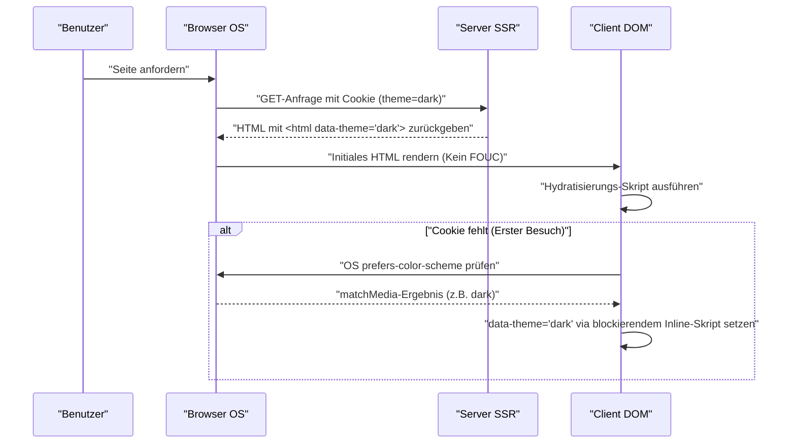

In der modernen Webentwicklung hat sich die Unterstützung des Dark Mode (Dunkelmodus) von einer bloßen „Nice-to-have“-Funktion zu einer „Must-have“-Anforderung zur Verbesserung der User Experience (UX) gewandelt. Besonders bei Medien wie Blogs und Dokumentationsseiten, die auf langes Lesen von Texten ausgelegt sind, ist die Bedeutung der Dark-Mode-Unterstützung extrem hoch, da sie die Augenbelastung der Nutzer verringert und den Akkuverbrauch der Geräte senkt.

In diesem Artikel werden wir die technischen Herausforderungen, die bei der Dark-Mode-Unterstützung von Blogs unweigerlich auftreten, sowie die Punkte eines hochgradig wartbaren CSS-Designs aus der Perspektive eines Frontend-Entwicklers sehr tiefgehend beleuchten. Wir decken alles rund um die Implementierung des Dark Mode ab: von der Nutzung von CSS Custom Properties (CSS-Variablen), fortgeschrittener JavaScript-Steuerung und SSR-Integration zur Vermeidung von FOUC (Flash of Unstyled Content), über Farbdesign (RGB, HSL und das neueste OKLCH) zur Gewährleistung der Barrierefreiheit (WCAG 2.1 AAA), bis hin zu praktischen Code-Beispielen mit Tailwind CSS.

---

## 1. Grundlagen des Theme-Designs mit CSS Custom Properties (CSS-Variablen)

Der aktuell standardmäßigste und leistungsstärkste Ansatz zur Implementierung des Dark Mode ist die Verwendung von **CSS Custom Properties (CSS-Variablen)**. Während Variablen (`$color`) in CSS-Präprozessoren wie Sass zur Kompilierzeit statisch aufgelöst werden, werden CSS-Variablen zur Laufzeit des Browsers dynamisch aufgelöst und überschrieben. Dies macht es möglich, die Farbgebung der gesamten Seite sofort zu ändern, indem einfach Klassen über JavaScript umgeschaltet werden.

### 1.1 Definition des grundlegenden Farb-Themes

Zunächst definieren wir die Farbpalette für den Light Mode (Standard) mithilfe der Pseudoklasse `:root`. Das klassische Designmuster besteht dann darin, diese Variablen zu überschreiben, wenn ein Attribut wie `[data-theme='dark']` (oder eine `.dark`-Klasse) hinzugefügt wird.

```css
/* Variablen-Definition für den Light Mode (Standard) */
:root {
  --color-bg-primary: #ffffff;
  --color-bg-secondary: #f3f4f6;
  --color-text-primary: #111827;
  --color-text-secondary: #4b5563;
  --color-accent: #3b82f6;
  --color-border: #e5e7eb;
}

/* Variablen-Überschreibung im Dark Mode */
[data-theme='dark'] {
  --color-bg-primary: #111827;
  --color-bg-secondary: #1f2937;
  --color-text-primary: #f9fafb;
  --color-text-secondary: #9ca3af;
  --color-accent: #60a5fa;
  --color-border: #374151;
}

/* Tatsächliche Anwendung */
body {
  background-color: var(--color-bg-primary);
  color: var(--color-text-primary);
  transition: background-color 0.3s ease, color 0.3s ease;
}

a {
  color: var(--color-accent);
}
```

Durch die vollständige Trennung von Layout- oder Typografie-Spezifikationen und Farb-(Theme-)Spezifikationen auf diese Weise wird die Wartbarkeit von CSS drastisch verbessert.

### 1.2 Nutzung von @media (prefers-color-scheme: dark)

Wenn der Dark Mode auf Betriebssystemebene eingestellt ist, ist es aus UX-Sicht wünschenswert, das dunkle Theme ab dem ersten Besuch der Website automatisch anzuwenden. Dies wird durch die Media-Query `@media (prefers-color-scheme: dark)` erreicht.

```css
/* Fallback, wenn das Betriebssystem auf Dark Mode eingestellt ist */
@media (prefers-color-scheme: dark) {
  :root:not([data-theme='light']) {
    --color-bg-primary: #111827;
    --color-bg-secondary: #1f2937;
    --color-text-primary: #f9fafb;
    --color-text-secondary: #9ca3af;
    --color-accent: #60a5fa;
    --color-border: #374151;
  }
}
```

Bei dieser Schreibweise wird die Dark-Mode-Einstellung des Betriebssystems respektiert und die Variablen werden überschrieben, es sei denn, der Benutzer hat explizit den Light Mode gewählt (`data-theme='light'`).

---

## 2. Verständnis von Farbräumen und Barrierefreiheit (WCAG 2.1 AAA)

Beim Farbdesign für den Dark Mode reicht es nicht aus, einfach „den Hintergrund schwarz und den Text weiß zu machen“. Wenn der Kontrast zu stark ist, kann dies zu einer Überstrahlung führen und das Lesen erschweren; ist der Kontrast zu gering, wird die Sichtbarkeit beeinträchtigt. In den Web Content Accessibility Guidelines (WCAG) ist das Kontrastverhältnis zur Gewährleistung der Sichtbarkeit streng definiert.

### 2.1 Berechnungsformel für das WCAG-Kontrastverhältnis

Das Kontrastverhältnis (Contrast Ratio) $CR$ in den WCAG wird anhand der relativen Leuchtdichte (Relative Luminance) von Hintergrund- und Vordergrundfarbe wie folgt definiert:

$$CR = \frac{L_{lighter} + 0.05}{L_{darker} + 0.05}$$

Hierbei ist $L_{lighter}$ die relative Leuchtdichte der helleren Farbe und $L_{darker}$ die relative Leuchtdichte der dunkleren Farbe (der Wertebereich liegt zwischen 0,0 und 1,0). Um das Level AAA der WCAG 2.1 zu erreichen, ist ein Kontrastverhältnis von **mindestens 7:1** für normalen Text und **mindestens 4.5:1** für großen Text erforderlich.

Die relative Leuchtdichte $L$ wird aus den RGB-Werten des sRGB-Farbraums mit der folgenden komplexen Formel berechnet:

$$L = 0.2126 \times R + 0.7152 \times G + 0.0722 \times B$$

Für jede Komponente ($R, G, B$) wird der normalisierte Wert verwendet, der durch Teilen des ursprünglichen 8-Bit-Werts ($R_{sRGB}$) durch 255 ermittelt wird, und die folgende Transformation zur Aufhebung der Gammakorrektur durchgeführt:

$$
R, G, B = 
\begin{cases} 
\frac{C_{sRGB}}{12.92} & \text{if } C_{sRGB} \le 0.03928 \\
\left( \frac{C_{sRGB} + 0.055}{1.055} \right)^{2.4} & \text{otherwise}
\end{cases}
$$

Es ist schwierig, diese Berechnung manuell durchzuführen, aber durch den Einsatz von Farbdesign-Tools können mechanisch Farben ausgewählt werden, die das Kontrastverhältnis von 7:1 ($CR \ge 7.0$) erfüllen.

### 2.2 HSL vs. RGB vs. OKLCH

Früher waren RGB und HSL die vorherrschenden Methoden bei der Erstellung von Farbpaletten. Diese weisen jedoch in Bezug auf die „wahrnehmungsbezogene Gleichmäßigkeit“ große Mängel auf.

*   **RGB**: Es handelt sich um mechanische primäre Lichtfarben, was es für Menschen schwierig macht, intuitiv Anpassungen wie „heller machen“ oder „dunkler machen“ vorzunehmen.
*   **HSL**: Verwendet Farbton (Hue), Sättigung (Saturation) und Helligkeit (Lightness), aber die „Helligkeit (L)“ in HSL stimmt nicht mit der wahrgenommenen Helligkeit des menschlichen Auges überein. Beispielsweise haben ein reines Gelb und ein reines Blau mit einer Helligkeit von 50 % in HSL numerisch die gleiche Helligkeit, aber für das menschliche Auge erscheint das Gelb überwältigend heller.
*   **OKLCH**: Der neueste Farbraum, der kürzlich in das CSS Color Module Level 4 aufgenommen wurde. Er besteht aus Lightness (wahrgenommene Helligkeit), Chroma (Sättigung) und Hue (Farbton) und ist **vollständig auf die menschlichen Seheigenschaften abgestimmt (wahrnehmungsbezogen gleichmäßig)**.

Durch die Verwendung von OKLCH kann die gleiche wahrgenommene Helligkeit (Lightness) auch dann beibehalten werden, wenn sich der Farbton (Hue) ändert, was die Generierung von Farbpaletten für den Dark Mode extrem vorhersehbar und sicher macht.

```css
/* Beispiel für die Definition von CSS-Variablen mit OKLCH */
:root {
  /* Höhere Basishelligkeit und geringere Sättigung für den Light Mode */
  --bg-base: oklch(0.98 0.01 250);
  --text-base: oklch(0.25 0.02 250);
  --primary-brand: oklch(0.65 0.15 250);
}

[data-theme="dark"] {
  /* Im Dark Mode wird nur die Helligkeit umgekehrt, um den wahrgenommenen Kontrast leicht beizubehalten */
  --bg-base: oklch(0.20 0.02 250);
  --text-base: oklch(0.95 0.01 250);
  --primary-brand: oklch(0.75 0.15 250); /* Etwas heller für den Dark Mode, um die Sichtbarkeit zu gewährleisten */
}
```

Durch die Einführung von OKLCH auf diese Weise lässt sich eine einfache Logik aufbauen, um ein konsistentes Kontrastverhältnis (WCAG AAA-Niveau) über mehrere Themes hinweg zu garantieren.

---

## 3. Vermeidung von FOUC (Flash of Unstyled Content) und SSR-Hydratisierung

Das Problem, das Entwickler bei der Unterstützung des Dark Mode am meisten plagt, ist das Flackern des Bildschirms, bekannt als **FOUC (Flash of Unstyled Content)**.

### 3.1 Die Falle des Theme-Wechsels via clientseitigem JS

Bei SPAs wie React oder Vue (oder statischen Seiten durch SSG) ist es üblich, die Einstellungen des Nutzers im `localStorage` zu speichern, sie mit JavaScript auszulesen und das Theme umzuschalten. Wenn dieser Prozess jedoch z. B. im `useEffect` von React durchgeführt wird, treten die folgenden Probleme auf:

1. Der Browser rendert das HTML/CSS des Light Mode.
2. Das JS-Bundle wird geladen und ausgeführt.
3. Die `dark`-Einstellung wird aus dem `localStorage` gelesen.
4. Die Klasse `dark` wird dem HTML hinzugefügt und der Bildschirm wird plötzlich dunkel (Flackern).

### 3.2 Die perfekte Maßnahme gegen FOUC: Einsatz von Cookies und SSR

Die Best Practice, um FOUC vollständig zu vermeiden und Hydratisierungsfehler zu verhindern, besteht darin, **die Theme-Einstellungen des Nutzers in `document.cookie` zu speichern und das HTML mit den entsprechenden Klassen bereits in der Phase des serverseitigen Renderings (SSR) zurückzugeben**.

Das folgende Sequenzdiagramm zeigt den idealen Ablauf der Theme-Initialisierung mithilfe von Cookies.



### 3.3 Verteidigungslinie durch Inline-Skripte (Für statische Seiten, die keine Cookies verwenden können)

Bei Blogs, die reines SSG (Static Site Generation) ohne SSR-Möglichkeit nutzen (wie statische Exporte von Hugo, Gatsby oder Astro), ist es zwingend erforderlich, ein blockierendes Inline-JavaScript innerhalb des `<head>`-Tags zu platzieren, das die Klasse unmittelbar vor dem Rendern des DOM hinzufügt.

```html
<!-- Am Ende innerhalb von <head> platzieren -->
<script>
  (function() {
    try {
      var localTheme = localStorage.getItem('theme');
      var osTheme = window.matchMedia('(prefers-color-scheme: dark)').matches ? 'dark' : 'light';
      var theme = localTheme || osTheme;
      document.documentElement.setAttribute('data-theme', theme);
    } catch (e) {}
  })();
</script>
```

Da dieses kleine Skript das Rendering des Browsers blockiert und sofort ausgeführt wird, ist das Attribut `data-theme` bereits zum Zeitpunkt des Zeichnens des Bildschirms gesetzt, wodurch das Bildschirmflackern (FOUC) vollständig vermieden wird.

---

## 4. Implementierungsansätze mit Tailwind CSS und rohem SCSS/CSS

Wenn Sie den Dark Mode in ein reales Projekt integrieren, müssen Sie die werkzeugspezifischen Ansätze verstehen.

### 4.1 Dark Mode in Tailwind CSS

Tailwind CSS bietet standardmäßig die Variante `dark:`, was die Implementierung des Dark Mode extrem einfach macht. Setzen Sie die Eigenschaft `darkMode` in der Konfigurationsdatei (`tailwind.config.js`).

```javascript
// tailwind.config.js
module.exports = {
  // 'media' (abhängig von OS-Einstellung) oder 'class' (manuell umschaltbar)
  darkMode: 'class', 
  theme: {
    extend: {
      colors: {
        /* Erweitern Sie die Tailwind-Farbpalette mithilfe von CSS-Variablen */
        primary: 'rgb(var(--color-primary) / <alpha-value>)',
        background: 'rgb(var(--color-background) / <alpha-value>)',
      }
    }
  }
}
```

Auf der HTML-Seite müssen Sie lediglich die Klassen wie folgt hinzufügen:

```html
<div class="bg-white dark:bg-gray-900 text-gray-900 dark:text-gray-100">
  <h1 class="text-2xl font-bold">Hallo Welt</h1>
  <p class="mt-2">Tailwind macht den Dark Mode unglaublich einfach.</p>
</div>
```

Es ist jedoch eine Ursache für aufgeblähte Komponenten, `dark:bg-xxx` auf alle Elemente anzuwenden. In großen Blogs und Apps wird ein hybrides Design (semantisches Farbdesign) empfohlen, **das auf CSS-Variablen basiert und von Tailwind aus auf diese CSS-Variablen verweist**.

Hier ist ein Klassendiagramm, das die Vererbung und Anwendungsebenen von CSS-Variablen zeigt:

```mermaid
classDiagram
    class GlobalCSSVariables {
        "--color-brand-500"
        "--color-gray-900"
    }
    class SemanticVariables {
        "--bg-primary"
        "--text-base"
        "--accent"
    }
    class TailwindConfig {
        "theme.colors.background"
        "theme.colors.primary"
    }
    class UIComponents {
        "class='bg-background text-primary'"
    }

    GlobalCSSVariables <|-- SemanticVariables : ":root & .dark"
    SemanticVariables <|-- TailwindConfig : "tailwind.config.js"
    TailwindConfig <.. UIComponents : "Wendet Utility-Klassen an"
```

### 4.2 Implementierung mit Raw SCSS/CSS (Nutzung von Mixins)

In Projekten, die SCSS selbst schreiben, ohne Tailwind zu verwenden, kapseln wir die Dark-Mode-Stile mithilfe von `@mixin`.

```scss
/* Definition des SCSS Mixins */
@mixin dark-mode {
  /* Unterstützt sowohl das [data-theme='dark'] Attribut als auch OS-Einstellungen */
  [data-theme='dark'] & {
    @content;
  }
  @media (prefers-color-scheme: dark) {
    :root:not([data-theme='light']) & {
      @content;
    }
  }
}

/* Anwendungsbeispiel */
.card {
  background-color: #ffffff;
  color: #333333;
  border: 1px solid #eeeeee;

  @include dark-mode {
    background-color: #1a202c;
    color: #e2e8f0;
    border-color: #2d3748;
  }
}
```

Diese Methode ist intuitiv, aber da die Dateigröße des CSS nach der Kompilierung dazu neigt, aufzublähen (Media-Queries werden für jeden Selektor dupliziert), ist der aktuelle Trend die Umstellung auf ein Design, das sich auf CSS-Variablen (Custom Properties) konzentriert.

---

## 5. Dark-Mode-Optimierung für Bilder (Images) und SVGs

Auch wenn das Farbdesign von Text und Hintergrund abgeschlossen ist, wirken als Inhalt platzierte Bilder und Icons (SVGs), wenn sie im Light Mode verbleiben, extrem blendend und isoliert im Dark Mode. Eine Optimierung auch für diese ist unerlässlich.

### 5.1 CSS-Filter zur Reduzierung der Bildhelligkeit

Bitmap-Bilder wie Fotos können zu hell sein, wenn sie unverändert im Dark Mode angezeigt werden. Durch die Verwendung der CSS-Eigenschaft `filter`, um die Helligkeit (brightness) und den Kontrast (contrast) des Bildes leicht zu verringern, kann es natürlich in die Dark-Theme-UI integriert werden.

```css
[data-theme='dark'] img:not([src*=".svg"]) {
  /* Helligkeit verringern, Kontrast leicht erhöhen */
  filter: brightness(0.8) contrast(1.1);
  transition: filter 0.3s ease;
}

[data-theme='dark'] img:hover {
  /* Beim Hovern zur ursprünglichen Helligkeit zurückkehren (falls der Benutzer Details sehen möchte) */
  filter: brightness(1) contrast(1);
}
```

### 5.2 Bildunterscheidung mit dem `<picture>`-Tag

Logo-Bilder oder erklärende Illustrationen (wie JPEGs mit festem weißem Hintergrund) können nicht allein durch Filterung behandelt werden. In diesem Fall ist es die richtige Lösung, das HTML-Element `<picture>` und Media-Queries zu verwenden, um eine andere Bilddatei für den Dark Mode anzuzeigen.

```html
<picture>
  <!-- Wird für Benutzer mit Dark-Mode-OS-Einstellung angezeigt -->
  <source srcset="/img/logo-dark.png" media="(prefers-color-scheme: dark)">
  <!-- Standard (Light Mode) -->
  
</picture>
```
*Hinweis: Da diese Methode nicht mit manuellem Umschalten über `localStorage` etc. verknüpft ist (sie hängt nur von den OS-Einstellungen ab), müssen Sie bei der Implementierung einer manuellen Umschaltung die Bild-`src` dynamisch mit JS umschreiben oder `display: none` mit CSS-Klassen umschalten.*

### 5.3 `currentColor`-Unterstützung für SVG-Icons

Für Inline-SVGs, die z. B. in Icons verwendet werden, ist es am elegantesten, die Füllfarbe an die Textfarbe des übergeordneten Elements zu koppeln. Geben Sie `currentColor` für die Attribute `fill` oder `stroke` des SVG an.

```html
<!-- Der Wert der CSS color Eigenschaft (z.B. var(--text-primary)) wird automatisch angewendet -->
<svg viewBox="0 0 24 24" fill="currentColor">
  <path d="M12 2L2 22h20L12 2z" />
</svg>
```

Wenn nun in den Dark Mode gewechselt wird und die Textfarbe des übergeordneten Elements in das weiße Spektrum wechselt, ändert sich auch das SVG-Icon automatisch in das weiße Spektrum.

---

## 6. Fazit: Auf dem Weg zu einem nachhaltigen Dark-Mode-Design

Um in Blogs und Webanwendungen einen qualitativ hochwertigen Dark Mode zu implementieren, ist ein CSS-Design, das die folgenden Punkte abdeckt, unerlässlich:

1.  **Nutzung von CSS Custom Properties**: Vermeiden Sie die feste Kodierung von Farbspezifikationen und abstrahieren Sie auf semantische Variablennamen (z.B. `--bg-primary`).
2.  **Einsatz des OKLCH-Farbraums**: Entwerfen Sie ein sehr zugängliches Kontrastverhältnis (7:1 oder höher), das WCAG 2.1 AAA erfüllt, logisch in einem wahrnehmungsbezogen gleichmäßigen Farbraum.
3.  **Konsequente FOUC-Verhinderung**: Eliminieren Sie das anfängliche Bildschirmflackern beim Laden vollständig durch die Kombination von SSR und Cookies oder durch blockierende Inline-Skripte im `<head>`.
4.  **Medien- und Asset-Optimierung**: Nutzen Sie `filter: brightness()`, `currentColor` und `<picture>`-Tags, um auch Nicht-Text-Elemente in das dunkle Theme zu harmonisieren.

Diese feinen Anpassungen, die über eine bloße "Farbinvertierung" hinausgehen, sind die Voraussetzung für einen modernen Blog, der von den Nutzern geliebt wird und ein exzellentes, augenschonendes Leseerlebnis (Reading Experience) bietet. Entwickler, die den Dark Mode implementieren möchten, sollten die Designmuster in diesem Artikel als Referenz verwenden.
