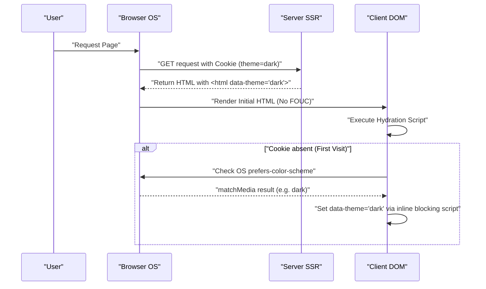

In modern web development, dark mode support has shifted from a mere "nice to have" feature to a "must have" requirement for improving user experience (UX). Particularly for media that assume long periods of text reading, such as blogs and documentation sites, dark mode support is extremely important because it helps reduce user eye strain and conserves device battery consumption.

In this article, I will delve deeply into the unavoidable technical challenges and key points of highly maintainable CSS design for blog dark mode support from a frontend engineer's perspective. It covers everything about dark mode implementation: utilizing CSS Custom Properties (CSS variables), advanced JavaScript control and SSR integration to prevent FOUC (Flash of Unstyled Content), color design (RGB, HSL, and the latest OKLCH) to ensure accessibility (WCAG 2.1 AAA), and even practical code examples using Tailwind CSS.

---

## 1. Basics of Theme Design with CSS Custom Properties (CSS Variables)

Currently, the most standard and powerful approach for implementing dark mode is the use of **CSS Custom Properties (CSS variables)**. While variables in CSS preprocessors like Sass (`$color`) are statically resolved at compile time, CSS variables are dynamically resolved and overridden in the browser's runtime. This makes it possible to instantly change the overall page color simply by toggling a class from JavaScript.

### 1.1 Basic Color Theme Definition

First, we define a color palette for the light mode (default) using the `:root` pseudo-class. Then, the standard design pattern is to override those variables when an attribute like `[data-theme='dark']` (or a `.dark` class) is applied.

```css
/* Light mode (default) variable definitions */
:root {
  --color-bg-primary: #ffffff;
  --color-bg-secondary: #f3f4f6;
  --color-text-primary: #111827;
  --color-text-secondary: #4b5563;
  --color-accent: #3b82f6;
  --color-border: #e5e7eb;
}

/* Variable overrides for dark mode */
[data-theme='dark'] {
  --color-bg-primary: #111827;
  --color-bg-secondary: #1f2937;
  --color-text-primary: #f9fafb;
  --color-text-secondary: #9ca3af;
  --color-accent: #60a5fa;
  --color-border: #374151;
}

/* Actual application */
body {
  background-color: var(--color-bg-primary);
  color: var(--color-text-primary);
  transition: background-color 0.3s ease, color 0.3s ease;
}

a {
  color: var(--color-accent);
}
```

By completely separating layout and typography specifications from color (theme) specifications in this manner, the maintainability of your CSS improves dramatically.

### 1.2 Utilizing @media (prefers-color-scheme: dark)

When dark mode is set at the OS level, it is desirable from a UX perspective to automatically apply the dark theme from the first visit to the website. This is achieved using the `@media (prefers-color-scheme: dark)` media query.

```css
/* Fallback when the OS environment setting is dark mode */
@media (prefers-color-scheme: dark) {
  :root:not([data-theme='light']) {
    --color-bg-primary: #111827;
    --color-bg-secondary: #1f2937;
    --color-text-primary: #f9fafb;
    --color-text-secondary: #9ca3af;
    --color-accent: #60a5fa;
    --color-border: #374151;
  }
}
```

With this syntax, the variables are overridden in deference to the OS dark mode settings, unless the user has explicitly selected light mode (`data-theme='light'`).

---

## 2. Understanding Color Spaces and Accessibility (WCAG 2.1 AAA)

In the color design of dark mode, simply "making the background black and text white" is insufficient. If the contrast is too strong, it causes halation and ironically becomes harder to read; if the contrast is too low, visibility is compromised. The Web Content Accessibility Guidelines (WCAG) strictly define the contrast ratio required to ensure visibility.

### 2.1 WCAG Contrast Ratio Calculation Formula

The Contrast Ratio $CR$ in WCAG is defined using the Relative Luminance of the background and foreground colors as follows:

$$CR = \frac{L_{lighter} + 0.05}{L_{darker} + 0.05}$$

Here, $L_{lighter}$ is the relative luminance of the lighter color, and $L_{darker}$ is the relative luminance of the darker color (values range from 0.0 to 1.0). To achieve WCAG 2.1 Level AAA, a contrast ratio of **7:1 or higher** for normal text and **4.5:1 or higher** for large text is required.

The relative luminance $L$ is calculated from the RGB values of the sRGB color space using the following complex formula:

$$L = 0.2126 \times R + 0.7152 \times G + 0.0722 \times B$$

For each component ($R, G, B$), using the normalized value obtained by dividing the original 8-bit value ($R_{sRGB}$) by 255, the following transformation is performed to decode gamma correction:

$$
R, G, B = 
\begin{cases} 
\frac{C_{sRGB}}{12.92} & \text{if } C_{sRGB} \le 0.03928 \\
\left( \frac{C_{sRGB} + 0.055}{1.055} \right)^{2.4} & \text{otherwise}
\end{cases}
$$

Performing this calculation manually is difficult, but by utilizing color design tools, you can mechanically select colors that satisfy a contrast ratio of 7:1 ($CR \ge 7.0$).

### 2.2 HSL vs RGB vs OKLCH

When creating a color palette, RGB and HSL used to be the mainstream. However, they have significant flaws in terms of "perceptual uniformity."

*   **RGB**: It represents the mechanical three primary colors of light, making it difficult for humans to intuitively make adjustments like "make it lighter" or "make it darker."
*   **HSL**: Uses Hue, Saturation, and Lightness, but the "Lightness (L)" in HSL does not match the perceptual brightness of the human eye. For example, pure yellow and pure blue with 50% lightness in HSL have the same brightness numerically, but the yellow appears overwhelmingly brighter to the human eye.
*   **OKLCH**: The latest color space introduced in CSS Color Module Level 4 recently. Composed of Lightness (perceptual lightness), Chroma (saturation), and Hue, it **perfectly matches human visual characteristics (perceptually uniform)**.

By using OKLCH, you can maintain the same perceptual Lightness even if you change the Hue, making color palette generation for dark mode extremely predictable and safe.

```css
/* Example of CSS variable definition using OKLCH */
:root {
  /* Set base lightness high and keep chroma moderate for light mode */
  --bg-base: oklch(0.98 0.01 250);
  --text-base: oklch(0.25 0.02 250);
  --primary-brand: oklch(0.65 0.15 250);
}

[data-theme="dark"] {
  /* For dark mode, just invert the lightness to easily maintain perceptual contrast */
  --bg-base: oklch(0.20 0.02 250);
  --text-base: oklch(0.95 0.01 250);
  --primary-brand: oklch(0.75 0.15 250); /* Slightly lighter for dark mode to ensure visibility */
}
```

By adopting OKLCH like this, you can simply build logic to ensure consistent contrast ratios (WCAG AAA level) across multiple themes.

---

## 3. Preventing FOUC (Flash of Unstyled Content) and SSR Hydration

The most troubling issue for developers regarding dark mode support is the screen flickering problem known as **FOUC (Flash of Unstyled Content)**.

### 3.1 The Trap of Client-Side JS Theme Switching

In SPAs like React or Vue (or static sites generated by SSG), it is common to save user settings in `localStorage` and switch themes by reading them with JavaScript. However, if this process is done using React's `useEffect`, the following problems occur:

1. The browser renders the light mode HTML/CSS.
2. The JS bundle is loaded and executed.
3. The `dark` setting is read from `localStorage`.
4. The `dark` class is applied to the HTML, and the screen suddenly goes dark (flickering).

### 3.2 The Perfect Anti-FOUC Measure: Utilizing Cookies and SSR

The best practice for completely preventing FOUC and avoiding hydration errors is to **save the user's theme setting in a `document.cookie` and return HTML with the appropriate class applied during Server-Side Rendering (SSR)**.

The sequence diagram below illustrates the ideal flow of theme initialization using cookies.



### 3.3 Defense Line with Inline Scripts (For Static Sites Without Cookies)

For blogs where SSR is impossible and only SSG (Static Site Generation) is used (such as Hugo, Gatsby, or Astro's static exports), it is essential to place an inline, blocking JavaScript execution inside the `<head>` tag to apply the class right before the DOM is rendered.

```html
<!-- Place at the end inside <head> -->
<script>
  (function() {
    try {
      var localTheme = localStorage.getItem('theme');
      var osTheme = window.matchMedia('(prefers-color-scheme: dark)').matches ? 'dark' : 'light';
      var theme = localTheme || osTheme;
      document.documentElement.setAttribute('data-theme', theme);
    } catch (e) {}
  })();
</script>
```

Since this small script blocks browser rendering and executes immediately, the `data-theme` attribute is already set by the time the screen is rendered, completely preventing screen flickering (FOUC).

---

## 4. Implementation Approaches with Tailwind CSS and Raw SCSS/CSS

When incorporating dark mode into an actual project, it is necessary to understand the approaches for each tool.

### 4.1 Dark Mode in Tailwind CSS

Tailwind CSS provides a `dark:` variant by default, allowing for extremely easy dark mode implementation. You set the `darkMode` property in the configuration file (`tailwind.config.js`).

```javascript
// tailwind.config.js
module.exports = {
  // 'media' (depends on OS settings) or 'class' (can be toggled manually)
  darkMode: 'class', 
  theme: {
    extend: {
      colors: {
        /* Extend Tailwind's color palette using CSS variables */
        primary: 'rgb(var(--color-primary) / <alpha-value>)',
        background: 'rgb(var(--color-background) / <alpha-value>)',
      }
    }
  }
}
```

On the HTML side, you just add classes like below.

```html
<div class="bg-white dark:bg-gray-900 text-gray-900 dark:text-gray-100">
  <h1 class="text-2xl font-bold">Hello World</h1>
  <p class="mt-2">Tailwind makes dark mode incredibly easy.</p>
</div>
```

However, writing `dark:bg-xxx` on every element can cause components to become bloated. For large blogs or apps, a hybrid design (semantic color design) where **CSS variables serve as the foundation, and Tailwind references those CSS variables**, is recommended.

Below is a class diagram illustrating the inheritance of CSS variables and application layers.

```mermaid
classDiagram
    class GlobalCSSVariables {
        "--color-brand-500"
        "--color-gray-900"
    }
    class SemanticVariables {
        "--bg-primary"
        "--text-base"
        "--accent"
    }
    class TailwindConfig {
        "theme.colors.background"
        "theme.colors.primary"
    }
    class UIComponents {
        "class='bg-background text-primary'"
    }

    GlobalCSSVariables <|-- SemanticVariables : ":root & .dark"
    SemanticVariables <|-- TailwindConfig : "tailwind.config.js"
    TailwindConfig <.. UIComponents : "Applies Utility Classes"
```

### 4.2 Implementation with Raw SCSS/CSS (Using Mixins)

In projects that do not use Tailwind and write custom SCSS, `@mixin` is utilized to encapsulate dark mode styles.

```scss
/* SCSS Mixin definition */
@mixin dark-mode {
  /* Supports both [data-theme='dark'] attribute and OS settings */
  [data-theme='dark'] & {
    @content;
  }
  @media (prefers-color-scheme: dark) {
    :root:not([data-theme='light']) & {
      @content;
    }
  }
}

/* Usage example */
.card {
  background-color: #ffffff;
  color: #333333;
  border: 1px solid #eeeeee;

  @include dark-mode {
    background-color: #1a202c;
    color: #e2e8f0;
    border-color: #2d3748;
  }
}
```

This method is intuitive, but because it tends to bloat the compiled CSS file size (as media queries are duplicated for each selector), moving to a design centered around CSS variables (Custom Properties) is the current trend.

---

## 5. Optimizing Images and SVGs for Dark Mode

Even after color design for text and backgrounds is complete, if content images and icons (SVGs) remain in light mode, they will appear glaringly out of place during dark mode. Optimizing these is also essential.

### 5.1 CSS Filters to Reduce Image Brightness

Bitmap images, such as photos, can sometimes be too glaring if displayed as-is in dark mode. By using the CSS `filter` property to slightly reduce the brightness and contrast of the image, you can make it blend naturally into the dark theme UI.

```css
[data-theme='dark'] img:not([src*=".svg"]) {
  /* Reduce brightness and slightly increase contrast */
  filter: brightness(0.8) contrast(1.1);
  transition: filter 0.3s ease;
}

[data-theme='dark'] img:hover {
  /* Revert to original brightness on hover (for when users want to see details) */
  filter: brightness(1) contrast(1);
}
```

### 5.2 Conditional Image Rendering via the `<picture>` Tag

For logo images or explanatory diagrams (like JPEGs with a fixed white background), applying filters alone is not enough. In such cases, the correct approach is to use the HTML `<picture>` element and media queries to serve a different image file specifically for dark mode.

```html
<picture>
  <!-- Display this for users with OS dark mode settings -->
  <source srcset="/img/logo-dark.png" media="(prefers-color-scheme: dark)">
  <!-- Default (light mode) -->
  
</picture>
```
*Note: Since this method does not sync with manual toggles via `localStorage` or similar (it relies solely on OS settings), if you have implemented manual switching, you will need to either dynamically rewrite the image's `src` using JS or toggle `display: none` using CSS classes.

### 5.3 `currentColor` Support for SVG Icons

For inline SVGs used as icons, the smartest approach is to link their fill color to the parent element's text color. Specify `currentColor` for the SVG's `fill` or `stroke` attributes.

```html
<!-- The value of the CSS color property (e.g., var(--text-primary)) is automatically applied -->
<svg viewBox="0 0 24 24" fill="currentColor">
  <path d="M12 2L2 22h20L12 2z" />
</svg>
```

With this, if the site switches to dark mode and the parent element's text color turns to a shade of white, the SVG icon will also automatically change to a shade of white.

---

## 6. Conclusion: Toward Sustainable Dark Mode Design

To implement high-quality dark mode in blogs and web applications, a CSS design that covers the following points is essential:

1.  **Utilize CSS Custom Properties**: Avoid hardcoding colors and abstract them into semantic variable names (e.g., `--bg-primary`).
2.  **Adopt the OKLCH Color Space**: Logically design highly accessible contrast ratios (7:1 or higher) that satisfy WCAG 2.1 AAA using a perceptually uniform color space.
3.  **Thoroughly implement anti-FOUC measures**: Completely eliminate screen flickering on initial load through SSR and cookie integration, or by using blocking inline scripts inside the `<head>`.
4.  **Optimize media and assets**: Master `filter: brightness()`, `currentColor`, and `<picture>` tags to harmonize non-text elements with the dark theme.

It is precisely these meticulous considerations—going beyond mere "color inversion"—that can be called the prerequisites of a modern blog that provides an excellent, eye-friendly reading experience cherished by users for a long time. For developers looking to introduce dark mode, please be sure to refer to the design patterns in this article.
