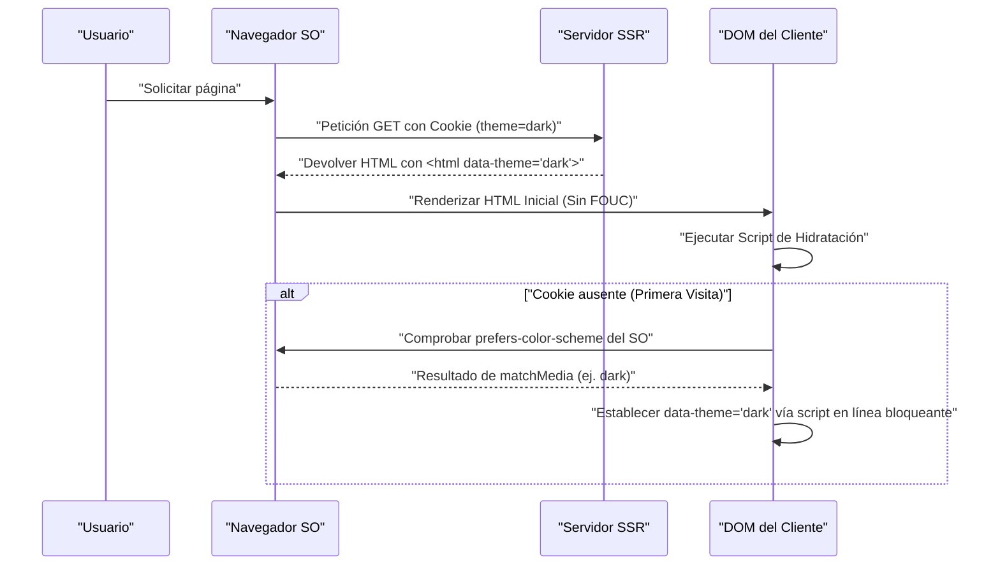

En el desarrollo web moderno, el soporte para el modo oscuro (Dark Mode) ha pasado de ser una simple "función agradable de tener" (Nice to have) a un "requisito indispensable" (Must have) para mejorar la experiencia del usuario (UX). Especialmente en medios que asumen lecturas prolongadas de texto, como blogs o sitios de documentación, tiene el efecto de reducir la fatiga visual del usuario y el consumo de batería del dispositivo, por lo que la importancia de la compatibilidad con el modo oscuro es extremadamente alta.

En este artículo, profundizaremos desde la perspectiva de un ingeniero frontend en los desafíos técnicos inevitables y los puntos clave para un diseño CSS de alta mantenibilidad al implementar el modo oscuro en un blog. Cubriremos todo sobre la implementación del modo oscuro: el uso de CSS Custom Properties (variables CSS), controles avanzados de JavaScript e integración con SSR para prevenir FOUC (Flash of Unstyled Content), diseño de colores (RGB, HSL y el más reciente OKLCH) para garantizar la accesibilidad (WCAG 2.1 AAA), y ejemplos prácticos de código utilizando Tailwind CSS.

---

## 1. Fundamentos del diseño de temas mediante CSS Custom Properties (Variables CSS)

Al implementar el modo oscuro, el enfoque más estándar y poderoso en la actualidad es el uso de **CSS Custom Properties (variables CSS)**. Mientras que las variables (`$color`) de los preprocesadores CSS como Sass se resuelven estáticamente durante la compilación, las variables CSS se resuelven y sobrescriben dinámicamente en el tiempo de ejecución del navegador. Esto hace posible cambiar el tono de color de toda la página al instante simplemente cambiando de clase desde JavaScript.

### 1.1 Definición de la paleta de colores básica

Primero, utilizamos la pseudoclase `:root` para definir la paleta de colores del modo claro (predeterminado). Luego, el patrón de diseño principal consiste en sobrescribir estas variables cuando se aplica un atributo como `[data-theme='dark']` (o la clase `.dark`).

```css
/* Definición de variables del modo claro (predeterminado) */
:root {
  --color-bg-primary: #ffffff;
  --color-bg-secondary: #f3f4f6;
  --color-text-primary: #111827;
  --color-text-secondary: #4b5563;
  --color-accent: #3b82f6;
  --color-border: #e5e7eb;
}

/* Sobrescritura de variables en modo oscuro */
[data-theme='dark'] {
  --color-bg-primary: #111827;
  --color-bg-secondary: #1f2937;
  --color-text-primary: #f9fafb;
  --color-text-secondary: #9ca3af;
  --color-accent: #60a5fa;
  --color-border: #374151;
}

/* Aplicación real */
body {
  background-color: var(--color-bg-primary);
  color: var(--color-text-primary);
  transition: background-color 0.3s ease, color 0.3s ease;
}

a {
  color: var(--color-accent);
}
```

De esta manera, separando por completo la especificación de diseño y tipografía de la especificación de colores (tema), la mantenibilidad del CSS mejora drásticamente.

### 1.2 Uso de @media (prefers-color-scheme: dark)

Si el modo oscuro está configurado a nivel de sistema operativo (OS), es deseable desde el punto de vista de UX aplicar automáticamente el tema oscuro desde la primera visita al sitio web. Esto se logra mediante la media query `@media (prefers-color-scheme: dark)`.

```css
/* Fallback para cuando el modo oscuro está configurado en el SO */
@media (prefers-color-scheme: dark) {
  :root:not([data-theme='light']) {
    --color-bg-primary: #111827;
    --color-bg-secondary: #1f2937;
    --color-text-primary: #f9fafb;
    --color-text-secondary: #9ca3af;
    --color-accent: #60a5fa;
    --color-border: #374151;
  }
}
```

Con esta notación, a menos que el usuario haya seleccionado explícitamente el modo claro (`data-theme='light'`), se sobrescriben las variables respetando la configuración del modo oscuro del SO.

---

## 2. Comprensión del espacio de color y accesibilidad (WCAG 2.1 AAA)

En el diseño de color para el modo oscuro, no basta simplemente con "poner el fondo negro y el texto blanco". Si el contraste es demasiado fuerte, causará halos y dificultará la lectura; si el contraste es demasiado bajo, la visibilidad se verá comprometida. Las Web Content Accessibility Guidelines (WCAG) definen estrictamente las relaciones de contraste para asegurar la visibilidad.

### 2.1 Fórmula para calcular el ratio de contraste de WCAG

El ratio de contraste (Contrast Ratio) $CR$ en WCAG se define de la siguiente manera, utilizando la luminancia relativa (Relative Luminance) del color de fondo y el color de primer plano.

$$CR = \frac{L_{lighter} + 0.05}{L_{darker} + 0.05}$$

Aquí, $L_{lighter}$ es la luminancia relativa del color más claro y $L_{darker}$ es la luminancia relativa del color más oscuro (los valores van de 0.0 a 1.0). Para alcanzar el nivel AAA de WCAG 2.1, se requiere un ratio de contraste de **7:1 o superior** para el texto normal y de **4.5:1 o superior** para texto grande.

La luminancia relativa $L$ se calcula a partir de los valores RGB del espacio de color sRGB usando la siguiente fórmula compleja.

$$L = 0.2126 \times R + 0.7152 \times G + 0.0722 \times B$$

Cada componente ($R, G, B$) utiliza el valor normalizado obtenido al dividir el valor original de 8 bits ($R_{sRGB}$) entre 255, y aplica la siguiente transformación para deshacer la corrección gamma:

$$
R, G, B = 
\begin{cases} 
\frac{C_{sRGB}}{12.92} & \text{if } C_{sRGB} \le 0.03928 \\
\left( \frac{C_{sRGB} + 0.055}{1.055} \right)^{2.4} & \text{otherwise}
\end{cases}
$$

Realizar este cálculo manualmente es difícil, pero al usar herramientas de diseño de color, es posible seleccionar automáticamente colores que cumplan con un ratio de contraste de 7:1 ($CR \ge 7.0$).

### 2.2 HSL vs RGB vs OKLCH

Al crear una paleta de colores, el RGB y el HSL solían ser los más populares. Sin embargo, tienen un gran defecto desde el punto de vista de la "uniformidad perceptual".

*   **RGB**: Son los tres colores primarios mecánicos de la luz, y es difícil para los humanos hacer ajustes intuitivos como "hacerlo más brillante" o "hacerlo más oscuro".
*   **HSL**: Utiliza Tono (Hue), Saturación (Saturation) y Luminosidad (Lightness), pero la "Luminosidad (L)" de HSL no coincide con el brillo percibido por el ojo humano. Por ejemplo, en HSL, un amarillo puro y un azul puro al 50% de luminosidad son numéricamente igual de brillantes, pero al ojo humano, el amarillo parece abrumadoramente más brillante.
*   **OKLCH**: Es el espacio de color más nuevo introducido en CSS Color Module Level 4. Está compuesto por Lightness (Luminosidad perceptual), Chroma (Croma/Saturación) y Hue (Tono), y **coincide perfectamente con las características visuales humanas (uniformidad perceptual)**.

Al utilizar OKLCH, incluso si cambias el tono (Hue), puedes mantener la misma luminosidad perceptual (Lightness), lo que hace que la generación de una paleta de colores para el modo oscuro sea extremadamente predecible y segura.

```css
/* Ejemplo de definición de variables CSS usando OKLCH */
:root {
  /* En el modo claro, luminosidad base alta, saturación contenida */
  --bg-base: oklch(0.98 0.01 250);
  --text-base: oklch(0.25 0.02 250);
  --primary-brand: oklch(0.65 0.15 250);
}

[data-theme="dark"] {
  /* En el modo oscuro, solo invirtiendo la luminosidad es fácil mantener el contraste perceptual */
  --bg-base: oklch(0.20 0.02 250);
  --text-base: oklch(0.95 0.01 250);
  --primary-brand: oklch(0.75 0.15 250); /* Un poco más claro para el modo oscuro para asegurar visibilidad */
}
```

Al adoptar OKLCH de esta manera, se puede construir lógicamente y de forma sencilla un mecanismo que garantice un ratio de contraste consistente (nivel WCAG AAA) entre múltiples temas.

---

## 3. Prevención de FOUC (Flash of Unstyled Content) e Hidratación SSR

El problema que más molesta a los desarrolladores en la implementación del modo oscuro es el parpadeo de la pantalla conocido como **FOUC (Flash of Unstyled Content)**.

### 3.1 La trampa de cambiar de tema con JS en el lado del cliente

En SPAs (o sitios estáticos vía SSG) como React o Vue, es común guardar las preferencias del usuario en `localStorage` y leerlas con JavaScript para cambiar el tema. Sin embargo, si este proceso se realiza dentro de algo como `useEffect` de React, ocurren los siguientes problemas:

1. El navegador renderiza el HTML/CSS del modo claro.
2. Se carga y se ejecuta el bundle de JS.
3. Se lee la configuración `dark` de `localStorage`.
4. Se aplica la clase `dark` al HTML y la pantalla se oscurece de repente (parpadeo).

### 3.2 La solución perfecta para FOUC: Uso de Cookies y SSR

La mejor práctica para prevenir completamente el FOUC y evitar errores de hidratación es **guardar la configuración del tema del usuario en `document.cookie` y devolver el HTML con la clase adecuada ya aplicada durante la fase de Renderizado del Lado del Servidor (SSR)**.

El siguiente diagrama de secuencia muestra el flujo ideal para inicializar el tema utilizando una Cookie.



### 3.3 Línea de defensa mediante script en línea (Para sitios estáticos que no pueden usar Cookies)

Para los blogs donde solo se utiliza SSG (Generación de Sitios Estáticos) y el SSR es imposible (exportaciones estáticas de Hugo, Gatsby o Astro), es indispensable colocar un código JavaScript en línea dentro de la etiqueta `<head>` que bloquee la ejecución y aplique la clase justo antes de que el DOM se renderice.

```html
<!-- Colocar al final dentro de <head> -->
<script>
  (function() {
    try {
      var localTheme = localStorage.getItem('theme');
      var osTheme = window.matchMedia('(prefers-color-scheme: dark)').matches ? 'dark' : 'light';
      var theme = localTheme || osTheme;
      document.documentElement.setAttribute('data-theme', theme);
    } catch (e) {}
  })();
</script>
```

Dado que este pequeño script bloquea el renderizado del navegador y se ejecuta de inmediato, el atributo `data-theme` ya estará establecido en el momento en que se dibuje la pantalla, lo que permite prevenir completamente el parpadeo de la pantalla (FOUC).

---

## 4. Enfoques de implementación con Tailwind CSS y SCSS/CSS puro

Al incorporar el modo oscuro en un proyecto real, es necesario comprender el enfoque según cada herramienta.

### 4.1 Modo oscuro en Tailwind CSS

Tailwind CSS proporciona la variante `dark:` por defecto, lo que facilita enormemente la implementación del modo oscuro. Se configura la propiedad `darkMode` en el archivo de configuración (`tailwind.config.js`).

```javascript
// tailwind.config.js
module.exports = {
  // 'media' (depende de la config del SO) o 'class' (se puede cambiar manualmente)
  darkMode: 'class', 
  theme: {
    extend: {
      colors: {
        /* Expandir la paleta de colores de Tailwind usando variables CSS */
        primary: 'rgb(var(--color-primary) / <alpha-value>)',
        background: 'rgb(var(--color-background) / <alpha-value>)',
      }
    }
  }
}
```

En el lado del HTML, simplemente se añaden clases como en el siguiente ejemplo:

```html
<div class="bg-white dark:bg-gray-900 text-gray-900 dark:text-gray-100">
  <h1 class="text-2xl font-bold">Hello World</h1>
  <p class="mt-2">Tailwind makes dark mode incredibly easy.</p>
</div>
```

Sin embargo, escribir `dark:bg-xxx` en todos los elementos puede causar que los componentes se vuelvan excesivamente grandes. En blogs o aplicaciones a gran escala, se recomienda un diseño híbrido (diseño de color semántico) donde **la base sean las variables CSS y Tailwind referencie esas variables CSS**.

A continuación se muestra un diagrama de clases que ilustra la herencia de variables CSS y sus capas de aplicación.

```mermaid
classDiagram
    class GlobalCSSVariables {
        "--color-brand-500"
        "--color-gray-900"
    }
    class SemanticVariables {
        "--bg-primary"
        "--text-base"
        "--accent"
    }
    class TailwindConfig {
        "theme.colors.background"
        "theme.colors.primary"
    }
    class UIComponents {
        "class='bg-background text-primary'"
    }

    GlobalCSSVariables <|-- SemanticVariables : ":root & .dark"
    SemanticVariables <|-- TailwindConfig : "tailwind.config.js"
    TailwindConfig <.. UIComponents : "Aplica clases de utilidad"
```

### 4.2 Implementación con SCSS/CSS puro (Uso de Mixin)

En proyectos que no utilizan Tailwind y escriben SCSS propio, se puede aprovechar `@mixin` para encapsular los estilos del modo oscuro.

```scss
/* Definición del Mixin de SCSS */
@mixin dark-mode {
  /* Soporta tanto el atributo [data-theme='dark'] como la configuración del SO */
  [data-theme='dark'] & {
    @content;
  }
  @media (prefers-color-scheme: dark) {
    :root:not([data-theme='light']) & {
      @content;
    }
  }
}

/* Ejemplo de uso */
.card {
  background-color: #ffffff;
  color: #333333;
  border: 1px solid #eeeeee;

  @include dark-mode {
    background-color: #1a202c;
    color: #e2e8f0;
    border-color: #2d3748;
  }
}
```

Este método es intuitivo, pero el tamaño del archivo CSS compilado tiende a crecer considerablemente (las media queries se duplican para cada selector), por lo que la tendencia actual es migrar a un diseño centrado en las variables CSS (Custom Properties).

---

## 5. Optimización del modo oscuro para imágenes (Image) y SVG

Incluso si el diseño de color del texto y los fondos está completo, si las imágenes o los iconos (SVG) colocados como contenido permanecen en el modo claro, se verán deslumbrantes y desentonarán en el modo oscuro. La optimización para estos elementos también es indispensable.

### 5.1 Filtros CSS para reducir la luminosidad de las imágenes

Las imágenes de mapa de bits, como las fotografías, a veces pueden ser demasiado brillantes si se muestran tal cual en el modo oscuro. Al usar la propiedad `filter` de CSS para reducir ligeramente la luminosidad (brightness) y el contraste (contrast) de las imágenes, se pueden integrar de manera natural en la interfaz de usuario del tema oscuro.

```css
[data-theme='dark'] img:not([src*=".svg"]) {
  /* Reducir el brillo y aumentar un poco el contraste */
  filter: brightness(0.8) contrast(1.1);
  transition: filter 0.3s ease;
}

[data-theme='dark'] img:hover {
  /* Restaurar el brillo original al hacer hover (si el usuario quiere ver los detalles) */
  filter: brightness(1) contrast(1);
}
```

### 5.2 Alternancia de imágenes mediante la etiqueta `<picture>`

Para imágenes de logotipos o diagramas explicativos (como JPEGs con un fondo blanco fijo), el procesamiento de filtros por sí solo no es suficiente. En esos casos, la solución correcta es utilizar el elemento `<picture>` de HTML y media queries para cargar un archivo de imagen diferente diseñado para el modo oscuro.

```html
<picture>
  <!-- Mostrar esto a los usuarios con la configuración del SO en modo oscuro -->
  <source srcset="/img/logo-dark.png" media="(prefers-color-scheme: dark)">
  <!-- Predeterminado (Modo claro) -->
  
</picture>
```
*No obstante, dado que este método no se sincroniza con cambios manuales a través de `localStorage` o similares (depende únicamente de la configuración del SO), si has implementado un cambio manual, necesitarás reescribir dinámicamente el `src` de las imágenes mediante JS, o alternar su visibilidad cambiando la propiedad `display: none` con clases CSS.*

### 5.3 Compatibilidad con `currentColor` para iconos SVG

Para los SVGs en línea utilizados como iconos o similares, lo más inteligente es vincular el color de relleno al color del texto del elemento padre. Para ello, se especifica `currentColor` en los atributos `fill` o `stroke` del SVG.

```html
<!-- El valor de la propiedad color en CSS (como var(--text-primary)) se aplicará automáticamente -->
<svg viewBox="0 0 24 24" fill="currentColor">
  <path d="M12 2L2 22h20L12 2z" />
</svg>
```

De esta manera, si cambias al modo oscuro y el color del texto del elemento padre se vuelve blanquecino, el icono SVG también cambiará automáticamente a tonos blancos.

---

## 6. Conclusión: Hacia un diseño de modo oscuro sostenible

Para implementar un modo oscuro de alta calidad en blogs o aplicaciones web, es esencial un diseño CSS que cubra los siguientes puntos clave:

1.  **Aprovechar CSS Custom Properties**: Evitar codificar colores directamente y abstraerlos en nombres de variables semánticos (ej. `--bg-primary`).
2.  **Adoptar el espacio de color OKLCH**: Diseñar lógicamente un ratio de contraste altamente accesible que cumpla con WCAG 2.1 AAA (7:1 o superior) en un espacio de color que sea perceptualmente uniforme.
3.  **Prevención estricta de FOUC**: Eliminar completamente el parpadeo de la pantalla durante la carga inicial mediante la integración de SSR y Cookies, o a través de scripts en línea bloqueantes dentro de `<head>`.
4.  **Optimización de medios y recursos**: Hacer uso de `filter: brightness()`, `currentColor` y la etiqueta `<picture>` para que los elementos distintos al texto también armonicen con el tema oscuro.

Estas cuidadosas consideraciones, que van mucho más allá de una simple "inversión de colores", son las condiciones de un blog moderno que proporciona una experiencia de lectura excelente y sin fatiga visual, y que los usuarios apreciarán durante mucho tiempo. Si eres un desarrollador que va a introducir el modo oscuro, te animamos a que tomes como referencia los patrones de diseño presentados en este artículo.
