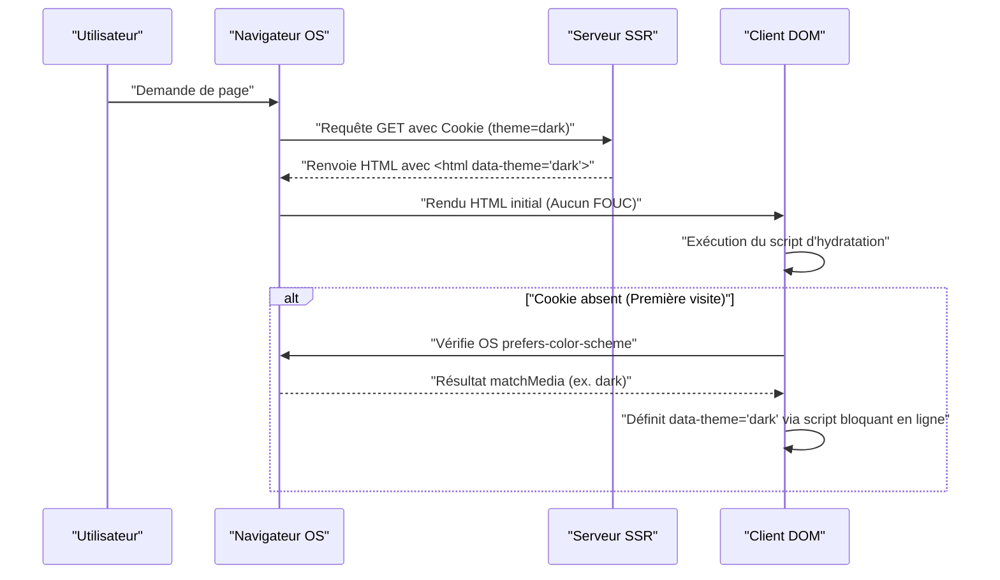

Dans le développement web moderne, la prise en charge du mode sombre (Dark Mode) n'est plus une simple « fonctionnalité intéressante à avoir » (Nice to have), mais est devenue une « exigence essentielle » (Must have) pour améliorer l'expérience utilisateur (UX). Surtout pour les médias tels que les blogs et les sites de documentation, qui impliquent de longues périodes de lecture de texte, la prise en charge du mode sombre est extrêmement importante car elle réduit la fatigue oculaire des utilisateurs et diminue la consommation de batterie des appareils.

Dans cet article, nous explorerons en profondeur, du point de vue d'un ingénieur front-end, les défis techniques inévitables liés à l'intégration du mode sombre sur un blog, ainsi que les points clés d'une conception CSS hautement maintenable. Nous couvrirons tout ce qu'il faut savoir sur l'implémentation du mode sombre : l'utilisation des CSS Custom Properties (variables CSS), les contrôles JavaScript avancés et la collaboration SSR pour prévenir le FOUC (Flash of Unstyled Content), la conception des couleurs (RGB, HSL, et le plus récent OKLCH) pour assurer l'accessibilité (WCAG 2.1 AAA), et même des exemples de code pratiques utilisant Tailwind CSS.

---

## 1. Bases de la conception de thèmes avec les CSS Custom Properties (variables CSS)

Actuellement, l'approche la plus standard et la plus puissante pour implémenter le mode sombre est l'utilisation des **CSS Custom Properties (variables CSS)**. Contrairement aux variables des préprocesseurs CSS comme Sass (`$color`) qui sont résolues de manière statique lors de la compilation, les variables CSS sont résolues et écrasées dynamiquement à l'exécution par le navigateur. Cela permet de modifier instantanément la palette de couleurs de l'ensemble de la page simplement en changeant de classe via JavaScript.

### 1.1 Définition d'un thème de couleurs de base

Tout d'abord, nous définissons la palette de couleurs du mode clair (par défaut) en utilisant la pseudo-classe `:root`. Ensuite, le modèle de conception classique consiste à écraser ces variables lorsqu'un attribut tel que `[data-theme='dark']` (ou la classe `.dark`) est ajouté.

```css
/* Définition des variables pour le mode clair (par défaut) */
:root {
  --color-bg-primary: #ffffff;
  --color-bg-secondary: #f3f4f6;
  --color-text-primary: #111827;
  --color-text-secondary: #4b5563;
  --color-accent: #3b82f6;
  --color-border: #e5e7eb;
}

/* Écrasement des variables en mode sombre */
[data-theme='dark'] {
  --color-bg-primary: #111827;
  --color-bg-secondary: #1f2937;
  --color-text-primary: #f9fafb;
  --color-text-secondary: #9ca3af;
  --color-accent: #60a5fa;
  --color-border: #374151;
}

/* Application pratique */
body {
  background-color: var(--color-bg-primary);
  color: var(--color-text-primary);
  transition: background-color 0.3s ease, color 0.3s ease;
}

a {
  color: var(--color-accent);
}
```

De cette façon, en séparant complètement la spécification de la disposition et de la typographie de celle de la couleur (thème), la maintenabilité du CSS est considérablement améliorée.

### 1.2 Utilisation de @media (prefers-color-scheme: dark)

Si le mode sombre est configuré au niveau du système d'exploitation (OS), il est souhaitable du point de vue de l'UX d'appliquer automatiquement le thème sombre dès la première visite de l'utilisateur sur le site Web. Cela est rendu possible par la requête multimédia (media query) `@media (prefers-color-scheme: dark)`.

```css
/* Solution de repli lorsque le mode sombre est configuré dans l'OS */
@media (prefers-color-scheme: dark) {
  :root:not([data-theme='light']) {
    --color-bg-primary: #111827;
    --color-bg-secondary: #1f2937;
    --color-text-primary: #f9fafb;
    --color-text-secondary: #9ca3af;
    --color-accent: #60a5fa;
    --color-border: #374151;
  }
}
```

Avec cette syntaxe, à moins que l'utilisateur n'ait explicitement sélectionné le mode clair (`data-theme='light'`), le paramètre du mode sombre de l'OS est respecté et les variables sont écrasées.

---

## 2. Comprendre les espaces colorimétriques et l'accessibilité (WCAG 2.1 AAA)

Dans la conception des couleurs du mode sombre, il ne suffit pas de simplement « rendre le fond noir et le texte blanc ». Si le contraste est trop fort, cela peut provoquer un effet de halo, rendant la lecture difficile ; à l'inverse, si le contraste est trop faible, la visibilité en pâtit. Dans les directives pour l'accessibilité des contenus Web (WCAG - Web Content Accessibility Guidelines), les ratios de contraste pour assurer la visibilité sont strictement définis.

### 2.1 Formule de calcul du ratio de contraste des WCAG

Le ratio de contraste (Contrast Ratio) $CR$ dans les WCAG est défini de la manière suivante en utilisant la luminance relative (Relative Luminance) de la couleur de fond et de la couleur de premier plan.

$$CR = \frac{L_{lighter} + 0.05}{L_{darker} + 0.05}$$

Ici, $L_{lighter}$ est la luminance relative de la couleur la plus claire, et $L_{darker}$ est la luminance relative de la couleur la plus sombre (les valeurs vont de 0.0 à 1.0). Pour atteindre le niveau AAA des WCAG 2.1, un ratio de contraste de **7:1 ou plus** est requis pour le texte normal, et de **4.5:1 ou plus** pour le texte de grande taille.

La luminance relative $L$ est calculée à partir des valeurs RGB de l'espace colorimétrique sRGB avec la formule complexe suivante.

$$L = 0.2126 \times R + 0.7152 \times G + 0.0722 \times B$$

Chaque composante ($R, G, B$) utilise une valeur normalisée obtenue en divisant la valeur d'origine sur 8 bits ($R_{sRGB}$) par 255, puis subit la conversion suivante pour lever la correction gamma.

$$
R, G, B = 
\begin{cases} 
\frac{C_{sRGB}}{12.92} & \text{if } C_{sRGB} \le 0.03928 \\
\left( \frac{C_{sRGB} + 0.055}{1.055} \right)^{2.4} & \text{otherwise}
\end{cases}
$$

Il est difficile d'effectuer ce calcul manuellement, mais en utilisant des outils de conception de couleurs, on peut sélectionner mécaniquement des couleurs qui répondent à un ratio de contraste de 7:1 ($CR \ge 7.0$).

### 2.2 HSL vs RGB vs OKLCH

Lors de la création de palettes de couleurs, les formats RGB ou HSL étaient autrefois dominants. Cependant, ceux-ci présentent un défaut majeur en termes d'« uniformité perceptuelle ».

*   **RGB** : Il s'agit des trois couleurs primaires de la lumière mécanique, ce qui rend difficile pour les humains de faire des ajustements intuitifs comme « éclaircir » ou « assombrir ».
*   **HSL** : Il utilise la teinte (Hue), la saturation (Saturation) et la luminosité (Lightness), mais la « luminosité (L) » du HSL ne correspond pas à la luminosité perçue par l'œil humain. Par exemple, un jaune pur et un bleu pur avec une luminosité de 50 % en HSL ont la même luminosité numériquement, mais le jaune paraît infiniment plus lumineux à l'œil humain.
*   **OKLCH** : C'est le dernier espace colorimétrique introduit récemment dans CSS Color Module Level 4. Composé de la luminosité perceptuelle (Lightness), de la chromaticité/saturation (Chroma) et de la teinte (Hue), il **correspond parfaitement aux caractéristiques visuelles humaines (uniformité perceptuelle)**.

L'utilisation d'OKLCH permet de conserver la même luminosité perceptuelle (Lightness) même si l'on change la teinte (Hue), ce qui rend la génération d'une palette de couleurs pour le mode sombre extrêmement prévisible et sûre.

```css
/* Exemple de définition de variables CSS utilisant OKLCH */
:root {
  /* Mode clair avec une luminosité de base élevée et une saturation modérée */
  --bg-base: oklch(0.98 0.01 250);
  --text-base: oklch(0.25 0.02 250);
  --primary-brand: oklch(0.65 0.15 250);
}

[data-theme="dark"] {
  /* En mode sombre, il suffit d'inverser la luminosité pour maintenir facilement le contraste perceptuel */
  --bg-base: oklch(0.20 0.02 250);
  --text-base: oklch(0.95 0.01 250);
  --primary-brand: oklch(0.75 0.15 250); /* Légèrement plus clair pour assurer la visibilité en mode sombre */
}
```

En adoptant ainsi l'OKLCH, vous pouvez construire simplement une logique qui garantit un ratio de contraste constant (au niveau WCAG AAA) à travers plusieurs thèmes.

---

## 3. Prévention du FOUC (Flash of Unstyled Content) et hydratation SSR

Ce qui préoccupe le plus les développeurs dans la prise en charge du mode sombre, c'est le problème de scintillement de l'écran appelé **FOUC (Flash of Unstyled Content)**.

### 3.1 Le piège du basculement de thème par JS côté client

Dans les SPA comme React ou Vue (ou les sites statiques via SSG), il est courant d'enregistrer les paramètres de l'utilisateur dans le `localStorage` et de les lire avec JavaScript pour basculer de thème. Cependant, si ce processus est effectué via `useEffect` dans React par exemple, les problèmes suivants se produisent.

1. Le navigateur rend le HTML/CSS du mode clair.
2. Le bundle JS est chargé et exécuté.
3. Le paramètre `dark` est lu depuis le `localStorage`.
4. La classe `dark` est ajoutée au HTML, et l'écran s'assombrit soudainement (scintillement).

### 3.2 Une prévention parfaite du FOUC : Utilisation de Cookie et SSR

La meilleure pratique pour prévenir complètement le FOUC et éviter les erreurs d'hydratation consiste à **enregistrer le paramètre de thème de l'utilisateur dans `document.cookie` et à renvoyer le HTML avec les classes appropriées ajoutées lors du rendu côté serveur (SSR)**.

Le diagramme de séquence ci-dessous illustre le flux idéal d'initialisation du thème à l'aide de cookies.



### 3.3 Ligne de défense via un script en ligne (Pour les sites statiques sans cookies)

Pour les blogs générés uniquement de manière statique (SSG) où le SSR est impossible (comme les exports statiques de Hugo, Gatsby ou Astro), il est indispensable de placer un script JavaScript en ligne s'exécutant de manière bloquante à l'intérieur de la balise `<head>`, qui ajoute la classe juste avant le rendu du DOM.

```html
<!-- À placer à la fin de la balise <head> -->
<script>
  (function() {
    try {
      var localTheme = localStorage.getItem('theme');
      var osTheme = window.matchMedia('(prefers-color-scheme: dark)').matches ? 'dark' : 'light';
      var theme = localTheme || osTheme;
      document.documentElement.setAttribute('data-theme', theme);
    } catch (e) {}
  })();
</script>
```

Ce petit script bloque le rendu du navigateur et s'exécute immédiatement. Ainsi, au moment où l'écran est affiché, l'attribut `data-theme` est déjà configuré, ce qui permet de prévenir complètement le scintillement de l'écran (FOUC).

---

## 4. Approches d'implémentation avec Tailwind CSS et SCSS/CSS natif

Lors de l'intégration du mode sombre dans un projet réel, il est important de comprendre l'approche de chaque outil.

### 4.1 Le mode sombre dans Tailwind CSS

Tailwind CSS fournit par défaut une variante `dark:`, ce qui rend l'implémentation du mode sombre très facile. On configure la propriété `darkMode` dans le fichier de configuration (`tailwind.config.js`).

```javascript
// tailwind.config.js
module.exports = {
  // 'media' (dépendant des paramètres OS) ou 'class' (basculable manuellement)
  darkMode: 'class', 
  theme: {
    extend: {
      colors: {
        /* Extension de la palette de couleurs Tailwind à l'aide de variables CSS */
        primary: 'rgb(var(--color-primary) / <alpha-value>)',
        background: 'rgb(var(--color-background) / <alpha-value>)',
      }
    }
  }
}
```

Du côté HTML, il suffit d'ajouter les classes de la manière suivante.

```html
<div class="bg-white dark:bg-gray-900 text-gray-900 dark:text-gray-100">
  <h1 class="text-2xl font-bold">Hello World</h1>
  <p class="mt-2">Tailwind makes dark mode incredibly easy.</p>
</div>
```

Cependant, écrire `dark:bg-xxx` pour tous les éléments peut causer une surcharge excessive des composants. Pour les blogs ou applications de grande envergure, il est recommandé d'adopter une conception hybride (conception de couleurs sémantiques) où **les variables CSS servent de base, et Tailwind référence ces variables CSS**.

Le diagramme de classes ci-dessous montre l'héritage des variables CSS et les couches d'application.

```mermaid
classDiagram
    class GlobalCSSVariables {
        "--color-brand-500"
        "--color-gray-900"
    }
    class SemanticVariables {
        "--bg-primary"
        "--text-base"
        "--accent"
    }
    class TailwindConfig {
        "theme.colors.background"
        "theme.colors.primary"
    }
    class UIComponents {
        "class='bg-background text-primary'"
    }

    GlobalCSSVariables <|-- SemanticVariables : ":root & .dark"
    SemanticVariables <|-- TailwindConfig : "tailwind.config.js"
    TailwindConfig <.. UIComponents : "Applique les classes utilitaires"
```

### 4.2 Implémentation en Raw SCSS/CSS (Utilisation des Mixins)

Pour les projets qui n'utilisent pas Tailwind et écrivent leur propre SCSS, on utilise les `@mixin` pour encapsuler les styles du mode sombre.

```scss
/* Définition du Mixin SCSS */
@mixin dark-mode {
  /* Supporte à la fois l'attribut [data-theme='dark'] et les paramètres de l'OS */
  [data-theme='dark'] & {
    @content;
  }
  @media (prefers-color-scheme: dark) {
    :root:not([data-theme='light']) & {
      @content;
    }
  }
}

/* Exemple d'utilisation */
.card {
  background-color: #ffffff;
  color: #333333;
  border: 1px solid #eeeeee;

  @include dark-mode {
    background-color: #1a202c;
    color: #e2e8f0;
    border-color: #2d3748;
  }
}
```

Cette méthode est intuitive, mais la taille du fichier CSS compilé a tendance à s'alourdir (la requête multimédia est dupliquée pour chaque sélecteur). C'est pourquoi la tendance actuelle se tourne plutôt vers une conception axée sur les variables CSS (Custom Properties).

---

## 5. Optimisation du mode sombre pour les images (Image) et les SVG

Même si la conception des couleurs pour le texte et les arrière-plans est achevée, si les images et les icônes (SVG) placées comme contenu restent en mode clair, elles paraîtront éblouissantes et se détacheront trop en mode sombre. Leur optimisation est également essentielle.

### 5.1 Filtres CSS pour réduire la luminosité des images

Les images bitmap telles que les photos peuvent être trop lumineuses si elles sont affichées telles quelles en mode sombre. En utilisant la propriété CSS `filter` pour réduire légèrement la luminosité (brightness) et augmenter le contraste (contrast) de l'image, on peut la faire fondre naturellement dans l'interface du thème sombre.

```css
[data-theme='dark'] img:not([src*=".svg"]) {
  /* Réduit la luminosité et augmente un peu le contraste */
  filter: brightness(0.8) contrast(1.1);
  transition: filter 0.3s ease;
}

[data-theme='dark'] img:hover {
  /* Restaure la luminosité d'origine au survol (si l'utilisateur veut voir les détails) */
  filter: brightness(1) contrast(1);
}
```

### 5.2 Remplacement d'images via la balise `<picture>`

Les images de logos ou les diagrammes explicatifs (comme les JPEG avec un fond blanc fixe) ne peuvent pas être gérés uniquement par des filtres. Dans ces cas-là, la bonne solution consiste à utiliser l'élément HTML `<picture>` et les requêtes multimédias (media queries) pour afficher un autre fichier image spécifique au mode sombre.

```html
<picture>
  <!-- Affiché pour les utilisateurs ayant configuré leur OS en mode sombre -->
  <source srcset="/img/logo-dark.png" media="(prefers-color-scheme: dark)">
  <!-- Par défaut (mode clair) -->
  
</picture>
```
※ Toutefois, cette méthode ne se synchronise pas avec les basculements manuels comme via `localStorage` (elle ne dépend que des paramètres de l'OS). Si vous implémentez un basculement manuel, vous devrez modifier dynamiquement la source `src` des images avec JS ou basculer un `display: none` via des classes CSS.

### 5.3 Prise en charge de `currentColor` pour les icônes SVG

La méthode la plus élégante pour les SVG en ligne utilisés pour des icônes est de lier leur couleur de remplissage à la couleur du texte de l'élément parent. Pour ce faire, spécifiez `currentColor` dans l'attribut `fill` ou `stroke` du SVG.

```html
<!-- La valeur de la propriété color du CSS (ex: var(--text-primary)) est appliquée automatiquement -->
<svg viewBox="0 0 24 24" fill="currentColor">
  <path d="M12 2L2 22h20L12 2z" />
</svg>
```

Ainsi, lors du passage au mode sombre, si la couleur du texte de l'élément parent devient blanche, l'icône SVG passera aussi automatiquement à une teinte blanche.

---

## 6. Conclusion : Vers une conception durable du mode sombre

Pour implémenter un mode sombre de haute qualité sur un blog ou une application web, une conception CSS couvrant les points suivants est indispensable.

1.  **Utiliser les CSS Custom Properties** : Éviter le codage en dur (hardcoding) des spécifications de couleurs et les abstraire dans des noms de variables sémantiques (ex: `--bg-primary`).
2.  **Adopter l'espace colorimétrique OKLCH** : Concevoir de manière logique des ratios de contraste hautement accessibles (7:1 ou plus) répondant à la norme WCAG 2.1 AAA, au sein d'un espace colorimétrique perceptuellement uniforme.
3.  **Appliquer des mesures strictes contre le FOUC** : Éliminer complètement les scintillements de l'écran lors du chargement initial grâce à l'association du SSR et des cookies, ou via des scripts bloquants en ligne dans le `<head>`.
4.  **Optimiser les médias et les ressources** : Harmoniser les éléments autres que le texte avec le thème sombre en exploitant `filter: brightness()`, `currentColor` et la balise `<picture>`.

Ces attentions minutieuses, qui vont bien au-delà d'une simple « inversion de couleurs », constituent les conditions d'un blog moderne offrant une expérience de lecture (reading experience) supérieure, agréable pour les yeux et appréciée durablement par les utilisateurs. Développeurs sur le point d'introduire le mode sombre, n'hésitez pas à vous référer aux modèles de conception présentés dans cet article.
