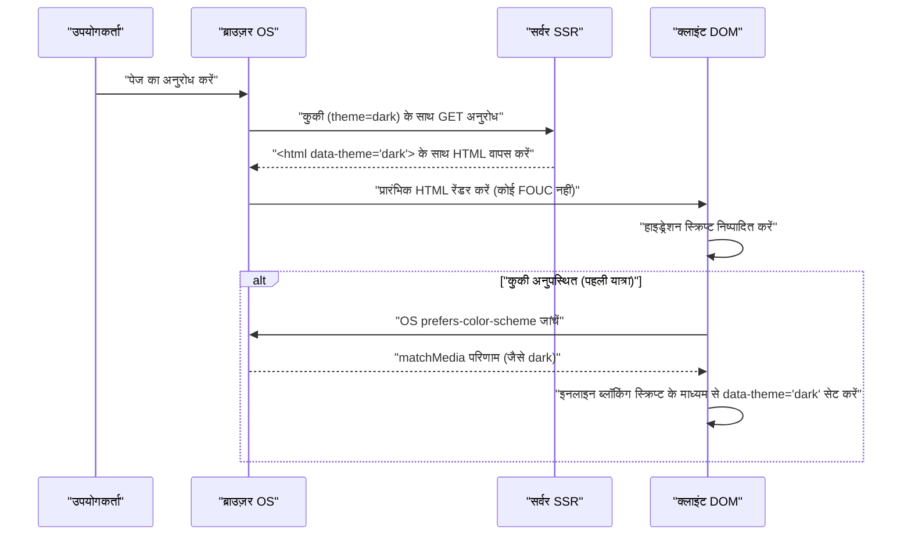

आधुनिक वेब विकास में, डार्क मोड (Dark Mode) का सपोर्ट केवल एक "सुखद सुविधा (Nice to have)" से बदलकर उपयोगकर्ता अनुभव (UX) को बेहतर बनाने के लिए एक "अनिवार्य आवश्यकता (Must have)" बन गया है। विशेष रूप से ब्लॉग या दस्तावेज़ साइटों जैसे मीडिया के लिए जहाँ लंबे समय तक पाठ पढ़ने की अपेक्षा की जाती है, डार्क मोड सपोर्ट का महत्व बहुत अधिक है क्योंकि यह उपयोगकर्ताओं की आँखों की थकान को कम करता है और डिवाइस की बैटरी खपत को बचाता है।

इस लेख में, हम एक फ्रंटएंड इंजीनियर के दृष्टिकोण से ब्लॉग के डार्क मोड सपोर्ट में आने वाली तकनीकी चुनौतियों और अत्यधिक बनाए रखने योग्य CSS डिज़ाइन के प्रमुख बिंदुओं पर बहुत गहराई से चर्चा करेंगे। हम CSS कस्टम प्रॉपर्टीज़ (CSS वेरिएबल्स) के उपयोग, FOUC (Flash of Unstyled Content) को रोकने के लिए उन्नत जावास्क्रिप्ट नियंत्रण और SSR एकीकरण, एक्सेसिबिलिटी (WCAG 2.1 AAA) सुनिश्चित करने के लिए रंग डिज़ाइन (RGB, HSL, और नवीनतम OKLCH), और Tailwind CSS का उपयोग करके व्यावहारिक कोड उदाहरणों सहित डार्क मोड कार्यान्वयन की हर चीज़ को कवर करेंगे।

---

## 1. CSS Custom Properties (CSS वेरिएबल्स) के माध्यम से थीम डिज़ाइन के मूल सिद्धांत

वर्तमान में डार्क मोड को लागू करने का सबसे मानक और शक्तिशाली तरीका **CSS Custom Properties (CSS वेरिएबल्स)** का उपयोग करना है। जबकि Sass जैसे CSS प्रीप्रोसेसर के चर (`$color`) संकलन समय (compile time) पर स्थिर रूप से हल किए जाते हैं, CSS वेरिएबल्स गतिशील रूप से हल किए जाते हैं और ब्राउज़र के रनटाइम में ओवरराइट किए जाते हैं। यह केवल जावास्क्रिप्ट से क्लास को स्विच करके तुरंत पूरे पेज की रंग योजना को बदलना संभव बनाता है।

### 1.1 बुनियादी कलर थीम को परिभाषित करना

सबसे पहले, लाइट मोड (डिफ़ॉल्ट) के कलर पैलेट को परिभाषित करने के लिए `:root` स्यूडो-क्लास का उपयोग करें। फिर, एक सामान्य डिज़ाइन पैटर्न यह है कि जब `[data-theme='dark']` (या `.dark` क्लास) जैसा कोई एट्रिब्यूट लागू होता है, तो उन वेरिएबल्स को ओवरराइट किया जाता है।

```css
/* लाइट मोड (डिफ़ॉल्ट) वेरिएबल परिभाषाएँ */
:root {
  --color-bg-primary: #ffffff;
  --color-bg-secondary: #f3f4f6;
  --color-text-primary: #111827;
  --color-text-secondary: #4b5563;
  --color-accent: #3b82f6;
  --color-border: #e5e7eb;
}

/* डार्क मोड में वेरिएबल्स को ओवरराइट करना */
[data-theme='dark'] {
  --color-bg-primary: #111827;
  --color-bg-secondary: #1f2937;
  --color-text-primary: #f9fafb;
  --color-text-secondary: #9ca3af;
  --color-accent: #60a5fa;
  --color-border: #374151;
}

/* वास्तविक अनुप्रयोग */
body {
  background-color: var(--color-bg-primary);
  color: var(--color-text-primary);
  transition: background-color 0.3s ease, color 0.3s ease;
}

a {
  color: var(--color-accent);
}
```

इस तरह से लेआउट और टाइपोग्राफी के विनिर्देशन को रंग (थीम) के विनिर्देशन से पूरी तरह अलग करने से CSS की मेंटेनबिलिटी (रखरखाव क्षमता) में भारी सुधार होता है।

### 1.2 @media (prefers-color-scheme: dark) का उपयोग

जब OS स्तर पर डार्क मोड सेट होता है, तो UX के दृष्टिकोण से यह वांछनीय है कि उपयोगकर्ता के पहली बार वेबसाइट पर आते ही स्वचालित रूप से डार्क थीम लागू हो जाए। इसे `@media (prefers-color-scheme: dark)` नामक मीडिया क्वेरी का उपयोग करके प्राप्त किया जा सकता है।

```css
/* जब OS पर्यावरण सेटिंग डार्क मोड में हो तो फ़ॉलबैक */
@media (prefers-color-scheme: dark) {
  :root:not([data-theme='light']) {
    --color-bg-primary: #111827;
    --color-bg-secondary: #1f2937;
    --color-text-primary: #f9fafb;
    --color-text-secondary: #9ca3af;
    --color-accent: #60a5fa;
    --color-border: #374151;
  }
}
```

इस नोटेशन के साथ, जब तक उपयोगकर्ता स्पष्ट रूप से लाइट मोड (`data-theme='light'`) नहीं चुनता, तब तक OS की डार्क मोड सेटिंग का सम्मान किया जाता है और वेरिएबल्स को ओवरराइट किया जाता है।

---

## 2. कलर स्पेस को समझना और एक्सेसिबिलिटी (WCAG 2.1 AAA)

डार्क मोड के लिए रंग डिज़ाइन करते समय, बस "बैकग्राउंड को काला करना और टेक्स्ट को सफेद करना" पर्याप्त नहीं है। यदि कंट्रास्ट बहुत अधिक है, तो यह चमक (हलेशन) पैदा कर सकता है और इसे पढ़ना कठिन बना सकता है; यदि कंट्रास्ट बहुत कम है, तो दृश्यता से समझौता किया जाता है। वेब कंटेंट एक्सेसिबिलिटी गाइडलाइंस (WCAG) दृश्यता सुनिश्चित करने के लिए कंट्रास्ट अनुपात को सख्ती से परिभाषित करती हैं।

### 2.1 WCAG कंट्रास्ट अनुपात गणना सूत्र

WCAG में कंट्रास्ट अनुपात (Contrast Ratio) $CR$ को पृष्ठभूमि रंग और अग्रभूमि रंग की सापेक्ष चमक (Relative Luminance) का उपयोग करके निम्नानुसार परिभाषित किया गया है।

$$CR = \frac{L_{lighter} + 0.05}{L_{darker} + 0.05}$$

जहाँ, $L_{lighter}$ हल्के रंग की सापेक्ष चमक है, और $L_{darker}$ गहरे रंग की सापेक्ष चमक है (मान सीमा 0.0 से 1.0 तक है)। WCAG 2.1 स्तर AAA को प्राप्त करने के लिए, सामान्य टेक्स्ट के लिए **7:1 या अधिक** और बड़े टेक्स्ट के लिए **4.5:1 या अधिक** के कंट्रास्ट अनुपात की आवश्यकता होती है।

सापेक्ष चमक $L$ की गणना sRGB कलर स्पेस के RGB मानों से निम्नलिखित जटिल सूत्र का उपयोग करके की जाती है।

$$L = 0.2126 \times R + 0.7152 \times G + 0.0722 \times B$$

प्रत्येक घटक ($R, G, B$) को 255 से विभाजित मूल 8-बिट मान ($R_{sRGB}$) के सामान्यीकृत मान का उपयोग करके गामा सुधार को हल करने के लिए निम्नलिखित रूपांतरण किया जाता है।

$$
R, G, B = 
\begin{cases} 
\frac{C_{sRGB}}{12.92} & \text{if } C_{sRGB} \le 0.03928 \\
\left( \frac{C_{sRGB} + 0.055}{1.055} \right)^{2.4} & \text{otherwise}
\end{cases}
$$

इस गणना को मैन्युअल रूप से करना मुश्किल है, लेकिन रंग डिज़ाइन टूल का उपयोग करके, आप यांत्रिक रूप से उन रंगों का चयन कर सकते हैं जो 7:1 ($CR \ge 7.0$) के कंट्रास्ट अनुपात को पूरा करते हैं।

### 2.2 HSL बनाम RGB बनाम OKLCH

कलर पैलेट बनाते समय, RGB या HSL मुख्य धारा हुआ करते थे। हालाँकि, "अवधारणात्मक एकरूपता (perceptual uniformity)" के मामले में इनमें एक बड़ी खामी है।

*   **RGB**: प्रकाश के यांत्रिक प्राथमिक रंग होने के कारण, मनुष्यों के लिए "हल्का (brighten)" या "गहरा (darken)" करने जैसे सहज समायोजन करना मुश्किल है।
*   **HSL**: यह ह्यु (Hue), सैचुरेशन (Saturation), और लाइटनेस (Lightness) का उपयोग करता है, लेकिन HSL की "लाइटनेस (L)" मानव आँख द्वारा देखी जाने वाली चमक से मेल नहीं खाती। उदाहरण के लिए, 50% HSL लाइटनेस वाला शुद्ध पीला और शुद्ध नीला संख्यात्मक रूप से समान रूप से चमकीले हैं, लेकिन पीला रंग मानव आँख को बहुत अधिक चमकीला दिखाई देता है।
*   **OKLCH**: यह नवीनतम कलर स्पेस है जिसे हाल ही में CSS Color Module Level 4 में पेश किया गया है। इसमें लाइटनेस (perceptual lightness), क्रोमा (saturation), और ह्यु (hue) शामिल हैं, और यह **मानव दृश्य विशेषताओं (अवधारणात्मक एकरूपता) से पूरी तरह मेल खाता है**।

OKLCH का उपयोग करके, आप ह्यु (Hue) बदलते समय समान अवधारणात्मक लाइटनेस बनाए रख सकते हैं, जिससे डार्क मोड के लिए कलर पैलेट जनरेशन अत्यधिक पूर्वानुमानित और सुरक्षित हो जाता है।

```css
/* OKLCH का उपयोग करके CSS वेरिएबल्स को परिभाषित करने का उदाहरण */
:root {
  /* लाइट मोड के लिए उच्च आधार लाइटनेस और कम सैचुरेशन */
  --bg-base: oklch(0.98 0.01 250);
  --text-base: oklch(0.25 0.02 250);
  --primary-brand: oklch(0.65 0.15 250);
}

[data-theme="dark"] {
  /* डार्क मोड में, केवल लाइटनेस को उलटने से अवधारणात्मक कंट्रास्ट बनाए रखना आसान हो जाता है */
  --bg-base: oklch(0.20 0.02 250);
  --text-base: oklch(0.95 0.01 250);
  --primary-brand: oklch(0.75 0.15 250); /* डार्क मोड के लिए दृश्यता सुनिश्चित करने के लिए थोड़ा हल्का */
}
```

इस तरह से OKLCH को अपनाकर, आप कई थीमों में लगातार कंट्रास्ट अनुपात (WCAG AAA मानक) सुनिश्चित करने के लिए आसानी से एक तर्क बना सकते हैं।

---

## 3. FOUC (Flash of Unstyled Content) की रोकथाम और SSR हाइड्रेशन

डार्क मोड का समर्थन करते समय डेवलपर्स को सबसे अधिक परेशान करने वाली समस्या स्क्रीन झिलमिलाहट (flickering) है, जिसे **FOUC (Flash of Unstyled Content)** कहा जाता है।

### 3.1 क्लाइंट-साइड JS द्वारा थीम स्विचिंग का जाल

React और Vue जैसे SPA (या SSG के साथ स्थिर साइटों) में, उपयोगकर्ता की प्राथमिकताओं को `localStorage` में सहेजना और थीम स्विच करने के लिए जावास्क्रिप्ट का उपयोग करके उन्हें पढ़ना आम बात है। हालाँकि, यदि यह प्रक्रिया React के `useEffect` में की जाती है, तो निम्नलिखित समस्याएँ उत्पन्न होती हैं।

1. ब्राउज़र लाइट मोड HTML/CSS रेंडर करता है।
2. JS बंडल लोड और निष्पादित (executed) किया जाता है।
3. `localStorage` से `dark` सेटिंग पढ़ी जाती है।
4. `dark` क्लास HTML में जोड़ा जाता है, और स्क्रीन अचानक डार्क हो जाती है (झिलमिलाहट)।

### 3.2 पूर्ण FOUC रोकथाम: कुकीज़ और SSR का उपयोग

FOUC को पूरी तरह से रोकने और हाइड्रेशन त्रुटियों से बचने का सबसे अच्छा अभ्यास है **उपयोगकर्ता की थीम सेटिंग्स को `document.cookie` में सहेजना और सर्वर-साइड रेंडरिंग (SSR) चरण में उपयुक्त क्लास के साथ HTML वापस करना**।

नीचे दिया गया अनुक्रम आरेख (sequence diagram) कुकीज़ का उपयोग करके थीम आरंभीकरण (theme initialization) के लिए आदर्श प्रवाह दिखाता है।



### 3.3 इनलाइन स्क्रिप्ट के माध्यम से रक्षा पंक्ति (उन स्थिर साइटों के लिए जो कुकीज़ का उपयोग नहीं कर सकती हैं)

उन ब्लॉगों के लिए जो केवल SSG (स्टेटिक साइट जेनरेशन) का उपयोग करते हैं और SSR नहीं कर सकते (जैसे Hugo, Gatsby, या Astro का स्टेटिक एक्सपोर्ट), `<head>` टैग के अंदर एक ब्लॉकिंग इनलाइन जावास्क्रिप्ट रखना अनिवार्य है जो DOM रेंडर होने से ठीक पहले क्लास जोड़ता है।

```html
<!-- <head> के अंत में रखें -->
<script>
  (function() {
    try {
      var localTheme = localStorage.getItem('theme');
      var osTheme = window.matchMedia('(prefers-color-scheme: dark)').matches ? 'dark' : 'light';
      var theme = localTheme || osTheme;
      document.documentElement.setAttribute('data-theme', theme);
    } catch (e) {}
  })();
</script>
```

चूँकि यह छोटी स्क्रिप्ट ब्राउज़र की रेंडरिंग को ब्लॉक करके तुरंत निष्पादित की जाती है, `data-theme` विशेषता स्क्रीन के रेंडर होने के समय तक पहले ही सेट हो जाती है, जिससे स्क्रीन झिलमिलाहट (FOUC) को पूरी तरह से रोका जा सकता है।

---

## 4. Tailwind CSS और रॉ SCSS/CSS कार्यान्वयन दृष्टिकोण

वास्तविक परियोजनाओं में डार्क मोड को एकीकृत करते समय, प्रत्येक टूल के दृष्टिकोण को समझना आवश्यक है।

### 4.1 Tailwind CSS में डार्क मोड

Tailwind CSS डिफ़ॉल्ट रूप से `dark:` संस्करण प्रदान करता है, जिससे डार्क मोड को लागू करना बहुत आसान हो जाता है। आप कॉन्फ़िगरेशन फ़ाइल (`tailwind.config.js`) में `darkMode` गुण सेट करते हैं।

```javascript
// tailwind.config.js
module.exports = {
  // 'media' (OS सेटिंग पर निर्भर) या 'class' (मैन्युअल रूप से टॉगल करने योग्य)
  darkMode: 'class', 
  theme: {
    extend: {
      colors: {
        /* CSS वेरिएबल्स का उपयोग करके Tailwind कलर पैलेट का विस्तार करें */
        primary: 'rgb(var(--color-primary) / <alpha-value>)',
        background: 'rgb(var(--color-background) / <alpha-value>)',
      }
    }
  }
}
```

HTML पक्ष पर, आपको बस निम्नानुसार क्लास जोड़ने की आवश्यकता है।

```html
<div class="bg-white dark:bg-gray-900 text-gray-900 dark:text-gray-100">
  <h1 class="text-2xl font-bold">Hello World</h1>
  <p class="mt-2">Tailwind makes dark mode incredibly easy.</p>
</div>
```

हालाँकि, हर तत्व में `dark:bg-xxx` जोड़ने से घटक का आकार (component bloat) बढ़ सकता है। बड़े ब्लॉग और ऐप के लिए, एक हाइब्रिड डिज़ाइन (सिमेंटिक कलर डिज़ाइन) की सिफारिश की जाती है जो **CSS वेरिएबल्स पर आधारित है और Tailwind से उन CSS वेरिएबल्स को संदर्भित करता है**।

नीचे दिया गया क्लास आरेख CSS वेरिएबल इनहेरिटेंस और एप्लिकेशन लेयर्स दिखाता है।

```mermaid
classDiagram
    class GlobalCSSVariables {
        "--color-brand-500"
        "--color-gray-900"
    }
    class SemanticVariables {
        "--bg-primary"
        "--text-base"
        "--accent"
    }
    class TailwindConfig {
        "theme.colors.background"
        "theme.colors.primary"
    }
    class UIComponents {
        "class='bg-background text-primary'"
    }

    GlobalCSSVariables <|-- SemanticVariables : ":root & .dark"
    SemanticVariables <|-- TailwindConfig : "tailwind.config.js"
    TailwindConfig <.. UIComponents : "उपयोगिता कक्षाएं लागू करता है"
```

### 4.2 Raw SCSS/CSS के साथ कार्यान्वयन (Mixin का उपयोग)

उन परियोजनाओं के लिए जो Tailwind का उपयोग नहीं करते हैं और अपना स्वयं का SCSS लिखते हैं, डार्क मोड शैलियों को एनकैप्सुलेट करने के लिए `@mixin` का उपयोग करें।

```scss
/* SCSS Mixin परिभाषा */
@mixin dark-mode {
  /* [data-theme='dark'] विशेषता या OS सेटिंग्स दोनों का समर्थन करता है */
  [data-theme='dark'] & {
    @content;
  }
  @media (prefers-color-scheme: dark) {
    :root:not([data-theme='light']) & {
      @content;
    }
  }
}

/* उपयोग उदाहरण */
.card {
  background-color: #ffffff;
  color: #333333;
  border: 1px solid #eeeeee;

  @include dark-mode {
    background-color: #1a202c;
    color: #e2e8f0;
    border-color: #2d3748;
  }
}
```

यह विधि सहज है, लेकिन संकलित CSS फ़ाइल का आकार आसानी से बढ़ सकता है (क्योंकि मीडिया क्वेरी प्रत्येक चयनकर्ता में डुप्लिकेट की जाती है), इसलिए वर्तमान प्रवृत्ति CSS वेरिएबल्स (Custom Properties) के आसपास केंद्रित डिज़ाइन में स्थानांतरित होने की है।

---

## 5. चित्र (Image) और SVG डार्क मोड अनुकूलन

भले ही टेक्स्ट और बैकग्राउंड के लिए रंग डिज़ाइन पूरा हो गया हो, यदि सामग्री के रूप में रखे गए चित्र और आइकन (SVG) लाइट मोड में रहते हैं, तो वे डार्क मोड में बहुत चमकीले और अलग दिखाई देंगे। इनके लिए अनुकूलन (optimization) भी आवश्यक है।

### 5.1 CSS फ़िल्टर चित्र की चमक को कम करने के लिए

फ़ोटो जैसी बिटमैप छवियों को डार्क मोड में प्रदर्शित किए जाने पर वे बहुत चमकीली हो सकती हैं। CSS `filter` प्रॉपर्टी का उपयोग करके चित्र की चमक (brightness) और कंट्रास्ट को थोड़ा कम करने से, इसे डार्क थीम UI में स्वाभाविक रूप से मिश्रित किया जा सकता है।

```css
[data-theme='dark'] img:not([src*=".svg"]) {
  /* चमक कम करें और कंट्रास्ट थोड़ा बढ़ाएं */
  filter: brightness(0.8) contrast(1.1);
  transition: filter 0.3s ease;
}

[data-theme='dark'] img:hover {
  /* होवर पर मूल चमक में वापस लौटें (यदि उपयोगकर्ता विवरण देखना चाहता है) */
  filter: brightness(1) contrast(1);
}
```

### 5.2 `<picture>` टैग के माध्यम से छवियों को स्विच करना

लोगो छवियाँ या व्याख्यात्मक आरेख (जैसे एक निश्चित सफेद पृष्ठभूमि वाले JPEG) को केवल फ़िल्टरिंग द्वारा नियंत्रित नहीं किया जा सकता है। उस स्थिति में, डार्क मोड के लिए एक अलग चित्र फ़ाइल पर स्विच करने के लिए HTML `<picture>` तत्व और मीडिया क्वेरीज़ का उपयोग करना सही तरीका है।

```html
<picture>
  <!-- डार्क मोड OS सेटिंग वाले उपयोगकर्ताओं को यह दिखाएं -->
  <source srcset="/img/logo-dark.png" media="(prefers-color-scheme: dark)">
  <!-- डिफ़ॉल्ट (लाइट मोड) -->
  
</picture>
```
※हालाँकि, यह विधि `localStorage` आदि का उपयोग करके मैन्युअल टॉगलिंग से जुड़ी नहीं है (यह केवल OS सेटिंग्स पर निर्भर करती है)। इसलिए, यदि आपने मैन्युअल स्विचिंग लागू की है, तो आपको JS का उपयोग करके छवि के `src` को गतिशील रूप से फिर से लिखना होगा, या CSS क्लास का उपयोग करके `display: none` को टॉगल करना होगा।

### 5.3 SVG आइकन के लिए `currentColor` समर्थन

आइकन के लिए उपयोग किए जाने वाले इनलाइन SVG को पैरेंट एलिमेंट के टेक्स्ट रंग से लिंक करना सबसे चतुर तरीका है। SVG के `fill` या `stroke` एट्रिब्यूट के लिए `currentColor` निर्दिष्ट करें।

```html
<!-- CSS color प्रॉपर्टी का मान (जैसे var(--text-primary)) स्वचालित रूप से लागू किया जाता है -->
<svg viewBox="0 0 24 24" fill="currentColor">
  <path d="M12 2L2 22h20L12 2z" />
</svg>
```

नतीजतन, जब डार्क मोड चालू होता है और पैरेंट एलिमेंट का टेक्स्ट रंग सफेद हो जाता है, तो SVG आइकन भी अपने आप सफेद हो जाएगा।

---

## 6. निष्कर्ष: टिकाऊ डार्क मोड डिज़ाइन की ओर

ब्लॉग या वेब एप्लिकेशन में उच्च गुणवत्ता वाले डार्क मोड को लागू करने के लिए, एक CSS डिज़ाइन आवश्यक है जो निम्नलिखित बिंदुओं को कवर करता हो:

1.  **CSS Custom Properties का लाभ उठाएं**: रंग हार्डकोडिंग से बचें और अर्थपूर्ण चर नामों (उदा. `--bg-primary`) का उपयोग करके उन्हें अमूर्त करें।
2.  **OKLCH कलर स्पेस अपनाएं**: WCAG 2.1 AAA के अनुरूप अत्यधिक सुलभ कंट्रास्ट अनुपात (7:1 या अधिक) को एक अवधारणात्मक रूप से समान कलर स्पेस का उपयोग करके तार्किक रूप से डिज़ाइन करें।
3.  **FOUC को सख्ती से रोकें**: SSR और कुकीज़ को जोड़कर, या `<head>` के अंदर ब्लॉकिंग इनलाइन स्क्रिप्ट का उपयोग करके शुरुआती लोड पर स्क्रीन की झिलमिलाहट को पूरी तरह से खत्म करें।
4.  **मीडिया और एसेट को अनुकूलित करें**: टेक्स्ट के अलावा अन्य तत्वों को डार्क थीम में मिलाने के लिए `filter: brightness()`, `currentColor`, और `<picture>` टैग का पूरा उपयोग करें।

यह कहा जा सकता है कि केवल "रंगों को उलटने" से परे ये सावधानीपूर्वक विचार एक आधुनिक ब्लॉग की शर्तें हैं जो उपयोगकर्ताओं द्वारा पसंद किया जाएगा और पढ़ने का एक उत्कृष्ट अनुभव (reading experience) प्रदान करेगा जो आँखों पर कम थकाने वाला है। यदि आप एक डेवलपर हैं जो डार्क मोड लागू करने वाले हैं, तो कृपया इस लेख में दिए गए डिज़ाइन पैटर्न को संदर्भ के रूप में उपयोग करें।
