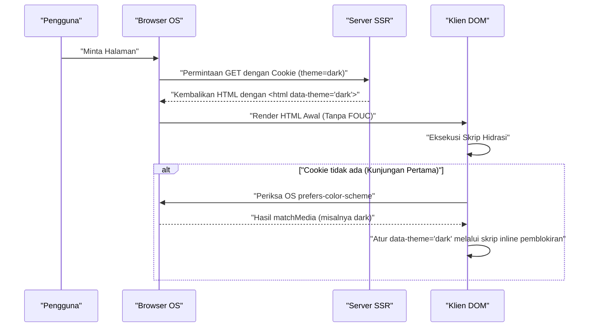

Dalam pengembangan web modern, dukungan mode gelap (Dark Mode) telah berubah dari sekadar "fitur tambahan yang bagus (Nice to have)" menjadi "persyaratan wajib (Must have)" untuk meningkatkan pengalaman pengguna (UX). Khususnya untuk media yang membutuhkan waktu baca yang lama seperti blog dan situs dokumentasi, dukungan mode gelap sangatlah penting karena dapat mengurangi kelelahan mata pengguna dan menghemat konsumsi baterai perangkat.

Pada artikel ini, saya akan membahas secara mendalam dari sudut pandang seorang frontend engineer mengenai tantangan teknis yang tidak dapat dihindari saat mengimplementasikan mode gelap di blog, beserta poin-poin desain CSS dengan maintainability yang tinggi. Saya akan mencakup semuanya tentang implementasi mode gelap, mulai dari penggunaan CSS Custom Properties (Variabel CSS), kontrol JavaScript tingkat lanjut dan integrasi SSR untuk mencegah FOUC (Flash of Unstyled Content), desain warna (RGB, HSL, dan OKLCH terbaru) untuk memastikan aksesibilitas (WCAG 2.1 AAA), hingga contoh kode praktis menggunakan Tailwind CSS.

---

## 1. Dasar-dasar Desain Tema dengan CSS Custom Properties (Variabel CSS)

Dalam mengimplementasikan mode gelap, pendekatan yang paling standar dan kuat saat ini adalah memanfaatkan **CSS Custom Properties (Variabel CSS)**. Berbeda dengan variabel preprocessor CSS seperti Sass (`$color`) yang diselesaikan secara statis saat kompilasi, variabel CSS dapat diselesaikan dan ditimpa secara dinamis pada runtime browser. Hal ini memungkinkan kita untuk mengubah warna keseluruhan halaman secara instan hanya dengan beralih kelas melalui JavaScript.

### 1.1 Mendefinisikan Tema Warna Dasar

Pertama, kita mendefinisikan palet warna untuk mode terang (default) menggunakan pseudo-class `:root`. Kemudian, pola desain utamanya adalah menimpa variabel-variabel tersebut ketika atribut seperti `[data-theme='dark']` (atau kelas `.dark`) diterapkan.

```css
/* Definisi variabel mode terang (default) */
:root {
  --color-bg-primary: #ffffff;
  --color-bg-secondary: #f3f4f6;
  --color-text-primary: #111827;
  --color-text-secondary: #4b5563;
  --color-accent: #3b82f6;
  --color-border: #e5e7eb;
}

/* Menimpa variabel saat mode gelap */
[data-theme='dark'] {
  --color-bg-primary: #111827;
  --color-bg-secondary: #1f2937;
  --color-text-primary: #f9fafb;
  --color-text-secondary: #9ca3af;
  --color-accent: #60a5fa;
  --color-border: #374151;
}

/* Penerapan aktual */
body {
  background-color: var(--color-bg-primary);
  color: var(--color-text-primary);
  transition: background-color 0.3s ease, color 0.3s ease;
}

a {
  color: var(--color-accent);
}
```

Dengan memisahkan secara sempurna antara spesifikasi tata letak atau tipografi dan spesifikasi warna (tema) seperti ini, kemudahan pemeliharaan (maintainability) CSS akan meningkat drastis.

### 1.2 Memanfaatkan @media (prefers-color-scheme: dark)

Jika mode gelap telah diatur di tingkat OS, maka secara otomatis menerapkan tema gelap sejak kunjungan pertama situs web sangat dianjurkan dari sudut pandang UX. Hal ini dapat dicapai melalui media query `@media (prefers-color-scheme: dark)`.

```css
/* Fallback ketika pengaturan sistem OS adalah mode gelap */
@media (prefers-color-scheme: dark) {
  :root:not([data-theme='light']) {
    --color-bg-primary: #111827;
    --color-bg-secondary: #1f2937;
    --color-text-primary: #f9fafb;
    --color-text-secondary: #9ca3af;
    --color-accent: #60a5fa;
    --color-border: #374151;
  }
}
```

Dengan penulisan ini, variabel akan ditimpa untuk menghormati pengaturan mode gelap pada OS, kecuali jika pengguna secara eksplisit memilih mode terang (`data-theme='light'`).

---

## 2. Memahami Ruang Warna dan Aksesibilitas (WCAG 2.1 AAA)

Dalam desain warna mode gelap, sekadar "membuat latar belakang hitam dan teks putih" tidaklah cukup. Jika kontras terlalu tinggi, dapat menyebabkan halation dan justru sulit dibaca; sedangkan jika kontras terlalu rendah, visibilitasnya akan berkurang. Web Content Accessibility Guidelines (WCAG) mendefinisikan rasio kontras secara ketat untuk memastikan visibilitas.

### 2.1 Rumus Perhitungan Rasio Kontras WCAG

Rasio Kontras (Contrast Ratio) $CR$ dalam WCAG didefinisikan sebagai berikut menggunakan Relative Luminance (Luminansi Relatif) dari warna latar belakang dan warna latar depan.

$$CR = \frac{L_{lighter} + 0.05}{L_{darker} + 0.05}$$

Di sini, $L_{lighter}$ adalah luminansi relatif dari warna yang lebih terang, dan $L_{darker}$ adalah luminansi relatif dari warna yang lebih gelap (rentang nilainya dari 0.0 hingga 1.0). Untuk mencapai WCAG 2.1 level AAA, rasio kontras yang diperlukan adalah **minimal 7:1** untuk teks biasa, dan **minimal 4.5:1** untuk teks berukuran besar.

Luminansi relatif $L$ dihitung dari nilai RGB pada ruang warna sRGB dengan rumus yang rumit berikut ini:

$$L = 0.2126 \times R + 0.7152 \times G + 0.0722 \times B$$

Setiap komponen ($R, G, B$) menggunakan nilai normalisasi yang didapat dengan membagi nilai 8-bit asli ($R_{sRGB}$) dengan 255, dan melakukan transformasi berikut untuk menyelesaikan koreksi gamma:

$$
R, G, B = 
\begin{cases} 
\frac{C_{sRGB}}{12.92} & \text{jika } C_{sRGB} \le 0.03928 \\
\left( \frac{C_{sRGB} + 0.055}{1.055} \right)^{2.4} & \text{lainnya}
\end{cases}
$$

Melakukan perhitungan ini secara manual sangatlah sulit, namun dengan memanfaatkan alat desain warna, kita dapat secara mekanis memilih warna yang memenuhi rasio kontras 7:1 ($CR \ge 7.0$).

### 2.2 HSL vs RGB vs OKLCH

Saat membuat palet warna, RGB dan HSL dulunya merupakan arus utama. Namun, keduanya memiliki kelemahan yang signifikan dalam hal "keseragaman persepsi" (perceptual uniformity).

*   **RGB**: Berdasarkan tiga warna primer cahaya mekanis, sehingga menyulitkan manusia untuk secara intuitif melakukan penyesuaian seperti "buat lebih terang" atau "buat lebih gelap".
*   **HSL**: Menggunakan warna (Hue), saturasi (Saturation), dan kecerahan (Lightness). Namun, "Lightness (L)" dalam HSL tidak sesuai dengan persepsi kecerahan pada mata manusia. Misalnya, warna kuning murni dan biru murni dengan Lightness 50% di HSL secara numerik memiliki kecerahan yang sama, tetapi di mata manusia warna kuning terlihat jauh lebih terang.
*   **OKLCH**: Ruang warna terbaru yang diperkenalkan pada CSS Color Module Level 4. Terdiri dari Lightness (kecerahan perseptual), Chroma (saturasi warna), dan Hue (corak warna), serta **sepenuhnya selaras dengan karakteristik visual manusia (keseragaman perseptual)**.

Dengan menggunakan OKLCH, meskipun kita mengubah corak warna (Hue), kecerahan perseptual (Lightness) akan tetap terjaga. Hal ini membuat pembuatan palet warna untuk mode gelap menjadi sangat dapat diprediksi dan aman.

```css
/* Contoh definisi variabel CSS menggunakan OKLCH */
:root {
  /* Kecerahan dasar mode terang tinggi, dengan saturasi yang direndahkan */
  --bg-base: oklch(0.98 0.01 250);
  --text-base: oklch(0.25 0.02 250);
  --primary-brand: oklch(0.65 0.15 250);
}

[data-theme="dark"] {
  /* Pada mode gelap, cukup balikkan kecerahan untuk menjaga kontras persepsi */
  --bg-base: oklch(0.20 0.02 250);
  --text-base: oklch(0.95 0.01 250);
  --primary-brand: oklch(0.75 0.15 250); /* Dibuat sedikit lebih terang untuk visibilitas mode gelap */
}
```

Dengan mengadopsi OKLCH seperti ini, kita dapat membangun logika sederhana untuk memastikan rasio kontras yang konsisten (standar WCAG AAA) pada beberapa tema.

---

## 3. Mencegah FOUC (Flash of Unstyled Content) dan SSR Hydration

Masalah yang paling merepotkan pengembang saat mendukung mode gelap adalah masalah kedipan layar yang disebut **FOUC (Flash of Unstyled Content)**.

### 3.1 Jebakan Peralihan Tema dengan Client-side JS

Pada SPA seperti React atau Vue (atau situs statis yang menggunakan SSG), sangat umum untuk menyimpan pengaturan pengguna di `localStorage`, kemudian membacanya dan mengganti tema menggunakan JavaScript. Namun, jika ini dilakukan di dalam React `useEffect` misalnya, masalah berikut akan muncul:

1. Browser merender HTML/CSS mode terang.
2. Bundle JS dimuat dan dieksekusi.
3. Membaca pengaturan `dark` dari `localStorage`.
4. Kelas `dark` ditambahkan ke HTML, dan layar tiba-tiba menjadi gelap (berkedip).

### 3.2 Solusi Pencegahan FOUC yang Sempurna: Menggunakan Cookie dan SSR

Praktik terbaik untuk sepenuhnya mencegah FOUC dan kesalahan hidrasi (hydration error) adalah dengan **menyimpan pengaturan tema pengguna di `document.cookie`, kemudian merender HTML yang sudah disertai kelas tema secara tepat pada tahap Server-side Rendering (SSR)**.

Diagram urutan berikut ini menunjukkan alur ideal inisialisasi tema menggunakan Cookie.



### 3.3 Garis Pertahanan dengan Skrip Inline (Untuk Situs Statis tanpa Cookie)

Untuk blog yang hanya menggunakan SSG (Static Site Generation) dan SSR tidak dimungkinkan (misalnya eksport statis pada Hugo, Gatsby, atau Astro), teknik menyisipkan skrip JavaScript inline yang bersifat memblokir (blocking) di dalam tag `<head>` menjadi hal yang wajib dilakukan untuk menambahkan kelas tepat sebelum DOM dirender.

```html
<!-- Tempatkan di bagian paling akhir dalam <head> -->
<script>
  (function() {
    try {
      var localTheme = localStorage.getItem('theme');
      var osTheme = window.matchMedia('(prefers-color-scheme: dark)').matches ? 'dark' : 'light';
      var theme = localTheme || osTheme;
      document.documentElement.setAttribute('data-theme', theme);
    } catch (e) {}
  })();
</script>
```

Skrip kecil ini akan memblokir rendering browser dan langsung dieksekusi, sehingga atribut `data-theme` sudah tersusun pada saat layar dirender, mencegah sepenuhnya kedipan layar (FOUC).

---

## 4. Pendekatan Implementasi pada Tailwind CSS dan Raw SCSS/CSS

Saat mengintegrasikan mode gelap ke dalam proyek nyata, kita perlu memahami pendekatan untuk setiap tools yang digunakan.

### 4.1 Mode Gelap pada Tailwind CSS

Tailwind CSS menyediakan varian `dark:` secara default, membuat implementasi mode gelap menjadi sangat mudah. Atur properti `darkMode` dalam file konfigurasi (`tailwind.config.js`).

```javascript
// tailwind.config.js
module.exports = {
  // 'media' (Bergantung pada pengaturan OS) atau 'class' (Bisa dialihkan secara manual)
  darkMode: 'class', 
  theme: {
    extend: {
      colors: {
        /* Memperluas palet warna Tailwind dengan variabel CSS */
        primary: 'rgb(var(--color-primary) / <alpha-value>)',
        background: 'rgb(var(--color-background) / <alpha-value>)',
      }
    }
  }
}
```

Di sisi HTML, kita hanya perlu menambahkan kelas seperti berikut.

```html
<div class="bg-white dark:bg-gray-900 text-gray-900 dark:text-gray-100">
  <h1 class="text-2xl font-bold">Hello World</h1>
  <p class="mt-2">Tailwind makes dark mode incredibly easy.</p>
</div>
```

Akan tetapi, menulis `dark:bg-xxx` pada setiap elemen dapat menyebabkan komponen membengkak. Pada aplikasi atau blog berskala besar, disarankan menggunakan pendekatan hibrida (desain warna semantik), di mana **basisnya menggunakan variabel CSS, dan Tailwind akan merujuk ke variabel CSS tersebut**.

Berikut adalah diagram kelas yang menunjukkan pewarisan variabel CSS dan lapisan penerapannya.

```mermaid
classDiagram
    class GlobalCSSVariables {
        "--color-brand-500"
        "--color-gray-900"
    }
    class SemanticVariables {
        "--bg-primary"
        "--text-base"
        "--accent"
    }
    class TailwindConfig {
        "theme.colors.background"
        "theme.colors.primary"
    }
    class UIComponents {
        "class='bg-background text-primary'"
    }

    GlobalCSSVariables <|-- SemanticVariables : ":root & .dark"
    SemanticVariables <|-- TailwindConfig : "tailwind.config.js"
    TailwindConfig <.. UIComponents : "Menerapkan Kelas Utilitas"
```

### 4.2 Implementasi pada Raw SCSS/CSS (Memanfaatkan Mixin)

Dalam proyek yang tidak menggunakan Tailwind dan menulis SCSS sendiri, gunakan `@mixin` untuk merangkum gaya (style) pada mode gelap.

```scss
/* Definisi SCSS Mixin */
@mixin dark-mode {
  /* Mendukung atribut [data-theme='dark'] dan pengaturan OS */
  [data-theme='dark'] & {
    @content;
  }
  @media (prefers-color-scheme: dark) {
    :root:not([data-theme='light']) & {
      @content;
    }
  }
}

/* Contoh Penggunaan */
.card {
  background-color: #ffffff;
  color: #333333;
  border: 1px solid #eeeeee;

  @include dark-mode {
    background-color: #1a202c;
    color: #e2e8f0;
    border-color: #2d3748;
  }
}
```

Metode ini memang intuitif, tetapi rentan menyebabkan pembengkakan ukuran file CSS hasil kompilasi (karena media query disalin ke setiap selector). Karenanya, tren saat ini bergeser ke desain berbasis variabel CSS (Custom Properties).

---

## 5. Optimalisasi Gambar (Image) dan SVG pada Mode Gelap

Meskipun desain warna pada teks atau latar belakang sudah selesai, jika gambar atau ikon (SVG) yang ditempatkan sebagai konten tetap pada pengaturan mode terang, tampilannya akan terlihat sangat menyilaukan dan menonjol ketika dilihat dalam mode gelap. Oleh karena itu, optimalisasi bagian ini sangatlah penting.

### 5.1 Filter CSS untuk Menurunkan Kecerahan Gambar

Gambar bitmap seperti foto, jika ditampilkan apa adanya saat mode gelap, terkadang terlalu menyilaukan. Dengan menggunakan properti `filter` pada CSS untuk sedikit menurunkan kecerahan (brightness) dan menaikkan kontras (contrast) gambar, kita dapat membaurkan gambar secara alami ke dalam UI mode gelap.

```css
[data-theme='dark'] img:not([src*=".svg"]) {
  /* Turunkan kecerahan, tingkatkan kontras sedikit */
  filter: brightness(0.8) contrast(1.1);
  transition: filter 0.3s ease;
}

[data-theme='dark'] img:hover {
  /* Kembalikan ke kecerahan asli saat hover (ketika pengguna ingin melihat detailnya) */
  filter: brightness(1) contrast(1);
}
```

### 5.2 Menyajikan Gambar Berbeda dengan Tag `<picture>`

Gambar logo atau ilustrasi penjelasan (seperti JPEG dengan latar belakang putih pekat) tidak bisa hanya diandalkan dengan filter. Dalam kasus seperti ini, solusi tepat adalah menyajikan file gambar yang berbeda untuk mode gelap menggunakan elemen HTML `<picture>` beserta media query.

```html
<picture>
  <!-- Tampilkan ini untuk pengguna dengan pengaturan OS mode gelap -->
  <source srcset="/img/logo-dark.png" media="(prefers-color-scheme: dark)">
  <!-- Default (Mode terang) -->
  
</picture>
```
*Catatan: Metode ini hanya bergantung pada pengaturan OS, sehingga tidak tersinkronisasi jika perubahan mode dilakukan manual (seperti lewat `localStorage`). Jika fitur peralihan manual diterapkan, Anda perlu mengubah `src` gambar secara dinamis dengan JS atau beralih kelas CSS dengan `display: none`.*

### 5.3 Dukungan `currentColor` untuk Ikon SVG

Untuk ikon SVG inline, cara paling cerdas adalah menautkan warna pengisian dengan warna teks dari elemen induknya. Cukup tentukan `currentColor` pada atribut `fill` atau `stroke` SVG.

```html
<!-- Nilai dari properti color CSS (seperti var(--text-primary)) akan diterapkan secara otomatis -->
<svg viewBox="0 0 24 24" fill="currentColor">
  <path d="M12 2L2 22h20L12 2z" />
</svg>
```

Dengan cara ini, saat beralih ke mode gelap dan warna font pada elemen induk berubah ke nuansa putih, ikon SVG juga akan otomatis berubah mengikuti warna putih tersebut.

---

## 6. Kesimpulan: Menuju Desain Mode Gelap yang Berkelanjutan

Untuk mengimplementasikan mode gelap berkualitas tinggi pada blog atau aplikasi web, desain CSS yang mencakup poin-poin berikut ini sangatlah esensial.

1.  **Memanfaatkan CSS Custom Properties**: Hindari hardcode pengaturan warna, melainkan abstraksikan ke dalam penamaan variabel semantik (misal: `--bg-primary`).
2.  **Mengadopsi Ruang Warna OKLCH**: Rancang secara logis pada ruang warna yang seragam secara perseptual untuk mencapai rasio kontras dengan aksesibilitas tinggi (minimal 7:1) yang memenuhi WCAG 2.1 AAA.
3.  **Mencegah FOUC Sepenuhnya**: Hilangkan kedipan layar sepenuhnya saat pertama dimuat menggunakan integrasi SSR dan Cookie, atau melalui skrip inline pemblokiran di dalam `<head>`.
4.  **Optimalisasi Media dan Aset**: Manfaatkan `filter: brightness()`, `currentColor`, dan tag `<picture>` agar elemen selain teks juga selaras dengan tema gelap.

Bukan sekadar "membalik warna", melainkan penerapan dengan detail mendalam inilah yang menjadi syarat sebuah blog modern. Blog yang dicintai pengguna untuk waktu yang lama dan mampu menyuguhkan pengalaman membaca (reading experience) yang hebat serta tidak membuat mata cepat lelah. Bagi para pengembang yang ingin memperkenalkan mode gelap ke depannya, silakan jadikan pola desain dari artikel ini sebagai referensi yang andal.
