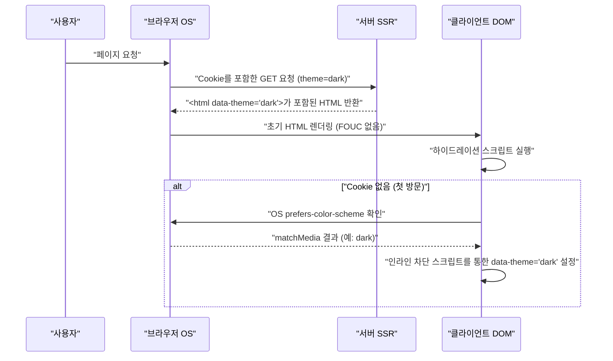

현대 웹 개발에서 다크 모드(Dark Mode) 지원은 단순한 '있으면 좋은 기능(Nice to have)'에서 사용자 경험(UX)을 향상시키기 위한 '필수 요건(Must have)'으로 변화하고 있습니다. 특히 블로그나 문서 사이트처럼 장시간 텍스트 읽기를 전제로 하는 미디어에서는 사용자의 눈의 피로를 덜어주고 기기의 배터리 소모를 줄이는 효과가 있기 때문에, 다크 모드 지원의 중요성은 매우 높다고 할 수 있습니다.

본 기사에서는 블로그의 다크 모드 지원에 있어 피할 수 없는 기술적인 과제와 유지보수성이 높은 CSS 설계의 핵심을 프런트엔드 엔지니어의 관점에서 매우 깊이 파고들어 해설합니다. CSS Custom Properties(CSS 변수)의 활용, FOUC(Flash of Unstyled Content)를 방지하기 위한 고급 JavaScript 제어와 SSR 연동, 접근성(WCAG 2.1 AAA)을 보장하기 위한 색채 설계(RGB, HSL, 그리고 최신 OKLCH), 나아가 Tailwind CSS를 활용한 실전 코드 예시까지 다크 모드 구현의 모든 것을 망라합니다.

---

## 1. CSS Custom Properties(CSS 변수)를 이용한 테마 설계의 기초

다크 모드를 구현하는 데 있어 현재 가장 표준적이고 강력한 방법이 **CSS Custom Properties(CSS 변수)** 를 이용한 접근법입니다. Sass 같은 CSS 전처리기의 변수(`$color`)가 컴파일 시점에 정적으로 해결되는 반면, CSS 변수는 브라우저의 런타임에서 동적으로 해결 및 덮어쓰기 됩니다. 이를 통해 JavaScript에서 클래스를 전환하는 것만으로 페이지 전체의 색조를 순식간에 변경하는 것이 가능해집니다.

### 1.1 기본적인 컬러 테마 정의

먼저, `:root` 가상 클래스를 사용하여 라이트 모드(기본값)의 컬러 팔레트를 정의합니다. 그리고 `[data-theme='dark']`와 같은 속성(또는 `.dark` 클래스)이 부여되었을 때, 해당 변수들을 덮어쓰는 설계 패턴이 정석입니다.

```css
/* 라이트 모드(기본값)의 변수 정의 */
:root {
  --color-bg-primary: #ffffff;
  --color-bg-secondary: #f3f4f6;
  --color-text-primary: #111827;
  --color-text-secondary: #4b5563;
  --color-accent: #3b82f6;
  --color-border: #e5e7eb;
}

/* 다크 모드 시의 변수 덮어쓰기 */
[data-theme='dark'] {
  --color-bg-primary: #111827;
  --color-bg-secondary: #1f2937;
  --color-text-primary: #f9fafb;
  --color-text-secondary: #9ca3af;
  --color-accent: #60a5fa;
  --color-border: #374151;
}

/* 실제 적용 */
body {
  background-color: var(--color-bg-primary);
  color: var(--color-text-primary);
  transition: background-color 0.3s ease, color 0.3s ease;
}

a {
  color: var(--color-accent);
}
```

이렇게 레이아웃이나 타이포그래피 지정과 색상(테마) 지정을 완전히 분리함으로써 CSS의 유지보수성은 비약적으로 향상됩니다.

### 1.2 @media (prefers-color-scheme: dark) 의 활용

OS 레벨에서 다크 모드가 설정된 경우, 웹사이트 첫 방문 시부터 자동으로 다크 테마를 적용하는 것이 UX 관점에서 바람직합니다. 이를 실현하는 것이 `@media (prefers-color-scheme: dark)` 라는 미디어 쿼리입니다.

```css
/* OS의 환경 설정이 다크 모드인 경우의 폴백 */
@media (prefers-color-scheme: dark) {
  :root:not([data-theme='light']) {
    --color-bg-primary: #111827;
    --color-bg-secondary: #1f2937;
    --color-text-primary: #f9fafb;
    --color-text-secondary: #9ca3af;
    --color-accent: #60a5fa;
    --color-border: #374151;
  }
}
```

이 표기법에서는 사용자가 명시적으로 라이트 모드를 선택(`data-theme='light'`)하지 않는 한, OS의 다크 모드 설정을 존중하여 변수를 덮어씁니다.

---

## 2. 색 공간의 이해와 접근성(WCAG 2.1 AAA)

다크 모드의 색채 설계에서 단순히 '배경을 검게, 글자를 하얗게' 하는 것만으로는 불충분합니다. 대비가 너무 강하면 헐레이션이 일어나 오히려 읽기 힘들어지고, 대비가 너무 낮으면 시인성이 떨어집니다. Web Content Accessibility Guidelines (WCAG)에서는 시인성을 확보하기 위한 대비율(명암비)이 엄격하게 정의되어 있습니다.

### 2.1 WCAG 대비율 계산식

WCAG에서의 대비율(Contrast Ratio) $CR$ 은 배경색과 전경색의 상대 휘도(Relative Luminance)를 이용하여 다음과 같이 정의됩니다.

$$CR = \frac{L_{lighter} + 0.05}{L_{darker} + 0.05}$$

여기서 $L_{lighter}$는 밝은 쪽 색의 상대 휘도, $L_{darker}$는 어두운 쪽 색의 상대 휘도입니다(값의 범위는 0.0부터 1.0까지). WCAG 2.1의 레벨 AAA를 달성하기 위해서는 일반 텍스트에서 **7:1 이상**, 큰 텍스트에서 **4.5:1 이상**의 대비율이 요구됩니다.

상대 휘도 $L$ 은 sRGB 색 공간의 RGB 값으로부터 아래의 복잡한 수식으로 계산됩니다.

$$L = 0.2126 \times R + 0.7152 \times G + 0.0722 \times B$$

각 성분($R, G, B$)은 원래의 8비트 값($R_{sRGB}$)을 255로 나눈 정규화 값을 사용하여 감마 보정을 풀기 위한 다음 변환을 수행합니다.

$$
R, G, B = 
\begin{cases} 
\frac{C_{sRGB}}{12.92} & \text{if } C_{sRGB} \le 0.03928 \\
\left( \frac{C_{sRGB} + 0.055}{1.055} \right)^{2.4} & \text{otherwise}
\end{cases}
$$

이 계산을 수동으로 하는 것은 어렵지만, 색채 설계 도구를 활용하면 대비율이 7:1 ($CR \ge 7.0$)을 만족하는 색을 기계적으로 선정할 수 있습니다.

### 2.2 HSL vs RGB vs OKLCH

컬러 팔레트를 만들 때, 예전에는 RGB나 HSL이 주류였습니다. 하지만 이것들에는 '지각적 균일성'이라는 관점에서 큰 결함이 있습니다.

*   **RGB**: 기계적인 빛의 삼원색이며, 사람이 직관적으로 '밝게 한다', '어둡게 한다'와 같은 조정을 하기가 어렵습니다.
*   **HSL**: 색상(Hue), 채도(Saturation), 명도(Lightness)를 사용하지만, HSL의 '명도(L)'는 사람 눈의 지각적인 밝기와 일치하지 않습니다. 예를 들어 HSL에서 명도 50%인 순수한 노란색과 순수한 파란색은 수치상으로는 같은 밝기지만, 사람의 눈에는 노란색이 압도적으로 밝게 보입니다.
*   **OKLCH**: 최근 CSS Color Module Level 4에서 도입된 최신 색 공간입니다. Lightness(지각적 명도), Chroma(채도), Hue(색상)로 구성되어 있으며, **인간의 시각 특성과 완전히 일치(지각적 균일)**합니다.

OKLCH를 사용하면 색상(Hue)을 변경해도 동일한 지각적 명도(Lightness)를 유지할 수 있기 때문에 다크 모드용 컬러 팔레트 생성이 극도로 예측 가능하고 안전해집니다.

```css
/* OKLCH를 사용한 CSS 변수의 정의 예 */
:root {
  /* 라이트 모드의 기본 명도를 높게, 채도를 억제하여 */
  --bg-base: oklch(0.98 0.01 250);
  --text-base: oklch(0.25 0.02 250);
  --primary-brand: oklch(0.65 0.15 250);
}

[data-theme="dark"] {
  /* 다크 모드에서는 명도를 반전시키는 것만으로, 지각적 대비를 유지하기 쉬움 */
  --bg-base: oklch(0.20 0.02 250);
  --text-base: oklch(0.95 0.01 250);
  --primary-brand: oklch(0.75 0.15 250); /* 다크 모드용으로 조금 밝게 하여 시인성을 확보 */
}
```

이와 같이 OKLCH를 도입함으로써 여러 테마 간에 일관된 대비율(WCAG AAA 수준)을 보장하는 로직을 심플하게 구축할 수 있습니다.

---

## 3. FOUC(Flash of Unstyled Content) 방지와 SSR 하이드레이션

다크 모드 지원에서 개발자를 가장 괴롭히는 것이 **FOUC(Flash of Unstyled Content)** 라고 불리는 화면 깜빡임 문제입니다.

### 3.1 클라이언트 사이드 JS를 통한 테마 전환의 함정

React나 Vue 같은 SPA(혹은 SSG를 통한 정적 사이트)에서 사용자의 설정을 `localStorage` 에 저장하고, JavaScript로 불러와 테마를 전환하는 방식이 일반적입니다. 하지만 이 처리를 React의 `useEffect` 등에서 수행하면 다음과 같은 문제가 발생합니다.

1. 브라우저가 라이트 모드의 HTML/CSS를 렌더링한다.
2. JS 번들이 로드되고 실행된다.
3. `localStorage` 에서 `dark` 설정을 읽어온다.
4. HTML에 `dark` 클래스가 부여되고 화면이 갑자기 어두워진다 (깜빡임).

### 3.2 완벽한 FOUC 방지책: Cookie와 SSR의 활용

FOUC를 완전히 방지하고 하이드레이션 오류를 막기 위한 모범 사례는 **사용자의 테마 설정을 `document.cookie` 에 저장하고, 서버 사이드 렌더링(SSR) 단계에서 적절한 클래스를 부여한 HTML을 반환** 하는 것입니다.

아래 시퀀스 다이어그램은 Cookie를 이용한 테마 초기화의 이상적인 흐름을 보여줍니다.



### 3.3 인라인 스크립트를 통한 방어선(Cookie를 사용할 수 없는 정적 사이트의 경우)

SSG(정적 사이트 생성)만 지원되어 SSR이 불가능한 블로그(Hugo나 Gatsby, Astro의 정적 익스포트 등)의 경우, `<head>` 태그 내부에 렌더링을 차단하며 실행되는 인라인 JavaScript를 배치하고 DOM이 렌더링 되기 직전에 클래스를 부여하는 방식이 필수적입니다.

```html
<!-- <head> 안의 마지막에 배치한다 -->
<script>
  (function() {
    try {
      var localTheme = localStorage.getItem('theme');
      var osTheme = window.matchMedia('(prefers-color-scheme: dark)').matches ? 'dark' : 'light';
      var theme = localTheme || osTheme;
      document.documentElement.setAttribute('data-theme', theme);
    } catch (e) {}
  })();
</script>
```

이 작은 스크립트는 브라우저의 렌더링을 차단하고 즉시 실행되기 때문에 화면이 렌더링 되는 시점에는 이미 `data-theme` 속성이 설정되어 있어 화면 깜빡임(FOUC)을 완벽하게 방지할 수 있습니다.

---

## 4. Tailwind CSS 와 순수 SCSS/CSS에서의 구현 접근법

다크 모드를 실제 프로젝트에 통합할 때, 각 도구별 접근 방식을 이해해 둘 필요가 있습니다.

### 4.1 Tailwind CSS 에서의 다크 모드

Tailwind CSS 는 기본적으로 `dark:` 변형(variant)을 제공하고 있어 매우 쉽게 다크 모드를 구현할 수 있습니다. 설정 파일(`tailwind.config.js`)에서 `darkMode` 속성을 설정합니다.

```javascript
// tailwind.config.js
module.exports = {
  // 'media' (OS 설정 의존) 또는 'class' (수동 전환 가능)
  darkMode: 'class', 
  theme: {
    extend: {
      colors: {
        /* CSS 변수를 이용하여 Tailwind의 컬러 팔레트를 확장 */
        primary: 'rgb(var(--color-primary) / <alpha-value>)',
        background: 'rgb(var(--color-background) / <alpha-value>)',
      }
    }
  }
}
```

HTML 측에서는 아래와 같이 클래스를 부여하기만 하면 됩니다.

```html
<div class="bg-white dark:bg-gray-900 text-gray-900 dark:text-gray-100">
  <h1 class="text-2xl font-bold">Hello World</h1>
  <p class="mt-2">Tailwind makes dark mode incredibly easy.</p>
</div>
```

하지만 모든 요소에 `dark:bg-xxx` 라고 작성하는 것은 컴포넌트가 비대해지는 원인이 되기도 합니다. 대규모 블로그나 앱에서는 **CSS 변수를 기반으로 하고 Tailwind에서는 그 CSS 변수를 참조하는** 하이브리드 설계(시맨틱 컬러 설계)가 권장됩니다.

아래는 CSS 변수의 상속과 적용 계층을 보여주는 클래스 다이어그램입니다.

```mermaid
classDiagram
    class GlobalCSSVariables {
        "--color-brand-500"
        "--color-gray-900"
    }
    class SemanticVariables {
        "--bg-primary"
        "--text-base"
        "--accent"
    }
    class TailwindConfig {
        "theme.colors.background"
        "theme.colors.primary"
    }
    class UIComponents {
        "class='bg-background text-primary'"
    }

    GlobalCSSVariables <|-- SemanticVariables : ":root & .dark"
    SemanticVariables <|-- TailwindConfig : "tailwind.config.js"
    TailwindConfig <.. UIComponents : "유틸리티 클래스 적용"
```

### 4.2 Raw SCSS/CSS 에서의 구현(Mixin 활용)

Tailwind를 사용하지 않고 자체적으로 SCSS를 작성하는 프로젝트에서는 `@mixin` 을 활용하여 다크 모드의 스타일을 캡슐화합니다.

```scss
/* SCSS Mixin 정의 */
@mixin dark-mode {
  /* [data-theme='dark'] 속성, 또는 OS 설정 양쪽을 모두 지원 */
  [data-theme='dark'] & {
    @content;
  }
  @media (prefers-color-scheme: dark) {
    :root:not([data-theme='light']) & {
      @content;
    }
  }
}

/* 사용 예 */
.card {
  background-color: #ffffff;
  color: #333333;
  border: 1px solid #eeeeee;

  @include dark-mode {
    background-color: #1a202c;
    color: #e2e8f0;
    border-color: #2d3748;
  }
}
```

이 방법은 직관적이지만 컴파일 후의 CSS 파일 크기가 비대해지기 쉽기(미디어 쿼리가 각 선택자마다 복제됨) 때문에, 역시 CSS 변수(Custom Properties)를 중심으로 한 설계로의 전환이 현재의 트렌드입니다.

---

## 5. 이미지(Image)와 SVG의 다크 모드 최적화

텍스트와 배경의 색채 설계가 완료되었더라도, 콘텐츠로 배치된 이미지나 아이콘(SVG)이 라이트 모드 그대로라면 다크 모드 시에 너무 눈부시게 떠 보이게 됩니다. 이들에 대한 최적화도 필수적입니다.

### 5.1 이미지의 밝기를 낮추는 CSS 필터

사진 등의 비트맵 이미지는 다크 모드 시에 그대로 표시하면 너무 눈부실 수 있습니다. CSS의 `filter` 속성을 사용하여 이미지의 명도(brightness)와 대비(contrast)를 약간 낮춤으로써 다크 테마의 UI에 자연스럽게 녹아들게 할 수 있습니다.

```css
[data-theme='dark'] img:not([src*=".svg"]) {
  /* 밝기를 낮추고, 약간 대비를 올림 */
  filter: brightness(0.8) contrast(1.1);
  transition: filter 0.3s ease;
}

[data-theme='dark'] img:hover {
  /* 호버 시에는 원래 밝기로 되돌림 (사용자가 자세히 보고 싶은 경우) */
  filter: brightness(1) contrast(1);
}
```

### 5.2 `<picture>` 태그를 통한 이미지 분기 처리

로고 이미지나 설명용 도해(배경이 흰색으로 고정된 JPEG 등)는 필터 처리만으로는 대응할 수 없습니다. 이 경우 HTML의 `<picture>` 요소와 미디어 쿼리를 사용하여 다크 모드용의 다른 이미지 파일을 분기 처리하여 보여주는 것이 정답입니다.

```html
<picture>
  <!-- 다크 모드 OS 설정의 사용자에게는 이곳을 표시 -->
  <source srcset="/img/logo-dark.png" media="(prefers-color-scheme: dark)">
  <!-- 기본(라이트 모드) -->
  
</picture>
```
※단, 이 방법은 `localStorage` 등을 통한 수동 토글과는 연동되지 않기(OS 설정에만 의존) 때문에, 수동 전환을 구현한 경우에는 JS로 이미지의 `src`를 동적으로 변경하거나 CSS 클래스로 `display: none`을 전환할 필요가 있습니다.

### 5.3 SVG 아이콘의 `currentColor` 대응

아이콘 등에 사용하는 인라인 SVG는 칠하기 색상을 부모 요소의 텍스트 컬러와 연동시키는 가장 스마트한 방법입니다. SVG의 `fill` 이나 `stroke` 속성에 `currentColor` 를 지정합니다.

```html
<!-- CSS의 color 속성 값(var(--text-primary) 등)이 자동으로 적용된다 -->
<svg viewBox="0 0 24 24" fill="currentColor">
  <path d="M12 2L2 22h20L12 2z" />
</svg>
```

이를 통해 다크 모드로 전환되어 부모 요소의 글자색이 흰색 계통이 되면, SVG 아이콘도 자동으로 흰색 계통으로 변합니다.

---

## 6. 요약: 지속 가능한 다크 모드 설계를 향해

블로그나 웹 애플리케이션에서 고품질의 다크 모드를 구현하기 위해서는 아래의 포인트를 망라한 CSS 설계가 필수적입니다.

1.  **CSS Custom Properties 활용하기**: 색상 지정의 하드코딩을 피하고, 시맨틱한 변수명(예: `--bg-primary`)으로 추상화한다.
2.  **OKLCH 색 공간 채택하기**: WCAG 2.1 AAA를 만족하는 접근성 높은 대비율(7:1 이상)을 지각적으로 균일한 색 공간에서 논리적으로 설계한다.
3.  **FOUC 대책 철저히 하기**: SSR과 Cookie의 연동, 혹은 `<head>` 내의 렌더링 차단 인라인 스크립트를 통해 초기 로드 시의 화면 깜빡임을 완전히 배제한다.
4.  **미디어와 자산의 최적화**: `filter: brightness()` 나 `currentColor`, `<picture>` 태그를 구사하여 텍스트 이외의 요소도 다크 테마와 조화시킨다.

단순한 '색상 반전'을 넘어서는 이러한 세심한 배려야말로 사용자에게 오랫동안 사랑받고 눈이 피로하지 않은 훌륭한 독서 경험(리딩 익스피리언스)을 제공하는 모던 블로그의 조건이라 할 수 있겠습니다. 앞으로 다크 모드를 도입할 개발자 분들은 꼭 이 글의 설계 패턴을 참고해 보시기 바랍니다.
