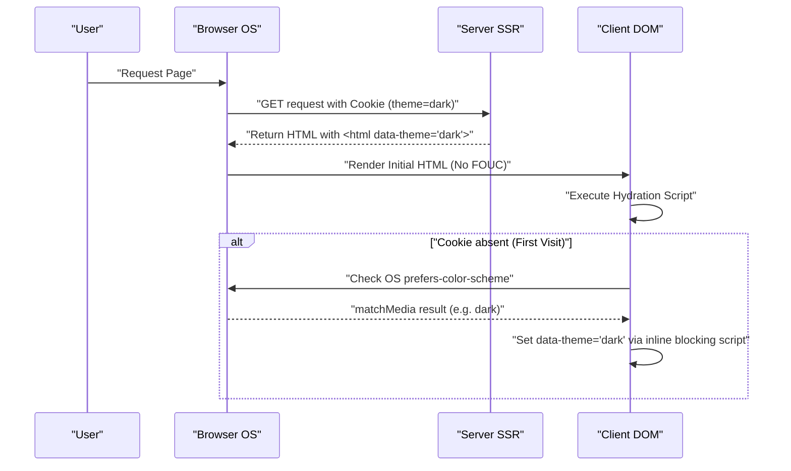

現代のWeb開発において、ダークモード（Dark Mode）のサポートは単なる「あれば嬉しい機能（Nice to have）」から、ユーザー体験（UX）を向上させるための「必須要件（Must have）」へと変化しています。特にブログやドキュメントサイトのように長時間のテキストリーディングを前提とするメディアでは、ユーザーの眼精疲労を軽減し、デバイスのバッテリー消費を抑える効果があるため、ダークモード対応の重要性は極めて高いと言えます。

本記事では、ブログのダークモード対応において避けては通れない技術的な課題と、保守性の高いCSS設計のポイントについて、フロントエンドエンジニアの視点から非常に深く掘り下げて解説します。CSS Custom Properties（CSS変数）の活用、FOUC（Flash of Unstyled Content）を防ぐための高度なJavaScript制御とSSR連携、アクセシビリティ（WCAG 2.1 AAA）を担保するための色彩設計（RGB, HSL, そして最新のOKLCH）、さらにはTailwind CSSを用いた実践的なコード例まで、ダークモード実装のすべてを網羅します。

---

## 1. CSS Custom Properties（CSS変数）によるテーマ設計の基礎

ダークモードを実装する上で、現在もっとも標準的かつ強力な手法が **CSS Custom Properties（CSS変数）** を利用したアプローチです。SassなどのCSSプリプロセッサの変数（`$color`）がコンパイル時に静的に解決されるのに対し、CSS変数はブラウザのランタイムで動的に解決・上書きされます。これにより、JavaScriptからクラスを切り替えるだけで、ページ全体の色合いを瞬時に変更することが可能になります。

### 1.1 基本的なカラーテーマの定義

まずは、`:root` 疑似クラスを用いて、ライトモード（デフォルト）のカラーパレットを定義します。そして、`[data-theme='dark']` のような属性（あるいは `.dark` クラス）が付与された際に、それらの変数を上書きするという設計パターンが王道です。

```css
/* ライトモード（デフォルト）の変数定義 */
:root {
  --color-bg-primary: #ffffff;
  --color-bg-secondary: #f3f4f6;
  --color-text-primary: #111827;
  --color-text-secondary: #4b5563;
  --color-accent: #3b82f6;
  --color-border: #e5e7eb;
}

/* ダークモード時の変数上書き */
[data-theme='dark'] {
  --color-bg-primary: #111827;
  --color-bg-secondary: #1f2937;
  --color-text-primary: #f9fafb;
  --color-text-secondary: #9ca3af;
  --color-accent: #60a5fa;
  --color-border: #374151;
}

/* 実際の適用 */
body {
  background-color: var(--color-bg-primary);
  color: var(--color-text-primary);
  transition: background-color 0.3s ease, color 0.3s ease;
}

a {
  color: var(--color-accent);
}
```

このように、レイアウトやタイポグラフィの指定と、色（テーマ）の指定を完全に分離することで、CSSの保守性は飛躍的に向上します。

### 1.2 @media (prefers-color-scheme: dark) の活用

OSレベルでダークモードが設定されている場合、Webサイト初回訪問時から自動的にダークテーマを適用することがUXの観点から望ましいです。これを実現するのが `@media (prefers-color-scheme: dark)` というメディアクエリです。

```css
/* OSの環境設定がダークモードの場合のフォールバック */
@media (prefers-color-scheme: dark) {
  :root:not([data-theme='light']) {
    --color-bg-primary: #111827;
    --color-bg-secondary: #1f2937;
    --color-text-primary: #f9fafb;
    --color-text-secondary: #9ca3af;
    --color-accent: #60a5fa;
    --color-border: #374151;
  }
}
```

この記法では、ユーザーが明示的にライトモードを選択（`data-theme='light'`）していない限り、OSのダークモード設定を尊重して変数を上書きします。

---

## 2. 色空間の理解とアクセシビリティ（WCAG 2.1 AAA）

ダークモードの色彩設計において、単に「背景を黒く、文字を白くする」だけでは不十分です。コントラストが強すぎるとハレーションを起こして逆に読みにくくなり、コントラストが低すぎると視認性が損なわれます。Web Content Accessibility Guidelines (WCAG) では、視認性を確保するためのコントラスト比が厳密に定義されています。

### 2.1 WCAG コントラスト比の計算式

WCAG におけるコントラスト比（Contrast Ratio） $CR$ は、背景色と前景色の相対輝度（Relative Luminance）を用いて以下のように定義されます。

$$CR = \frac{L_{lighter} + 0.05}{L_{darker} + 0.05}$$

ここで、$L_{lighter}$ は明るい方の色の相対輝度、$L_{darker}$ は暗い方の色の相対輝度です（値の範囲は 0.0 から 1.0 まで）。WCAG 2.1 のレベル AAA を達成するためには、通常のテキストで **7:1 以上**、大きなテキストで **4.5:1 以上** のコントラスト比が求められます。

相対輝度 $L$ は、sRGB 色空間のRGB値から以下の複雑な数式で計算されます。

$$L = 0.2126 \times R + 0.7152 \times G + 0.0722 \times B$$

各成分（$R, G, B$）は、元の8ビット値（$R_{sRGB}$）を255で割った正規化値を用いて、ガンマ補正を解くための以下の変換を行います。

$$
R, G, B = 
\begin{cases} 
\frac{C_{sRGB}}{12.92} & \text{if } C_{sRGB} \le 0.03928 \\
\left( \frac{C_{sRGB} + 0.055}{1.055} \right)^{2.4} & \text{otherwise}
\end{cases}
$$

この計算を手動で行うのは困難ですが、色彩設計ツールを活用することで、コントラスト比が 7:1 ($CR \ge 7.0$) を満たす色を機械的に選定できます。

### 2.2 HSL vs RGB vs OKLCH

カラーパレットを作成する際、かつては RGB や HSL が主流でした。しかし、これらには「知覚的な均一性」という観点で大きな欠陥があります。

*   **RGB**: 機械的な光の三原色であり、人間が直感的に「明るくする」「暗くする」といった調整を行うのが困難です。
*   **HSL**: 色相 (Hue)、彩度 (Saturation)、輝度 (Lightness) を用いますが、HSL の「輝度 (L)」は人間の目の知覚的な明るさと一致しません。例えば、HSLで輝度50%の純粋な黄色と純粋な青は、数値上は同じ明るさですが、人間の目には黄色の方が圧倒的に明るく見えます。
*   **OKLCH**: 近年 CSS Color Module Level 4 で導入された最新の色空間です。Lightness (知覚的明度)、Chroma (彩度)、Hue (色相) で構成されており、**人間の視覚特性に完全に一致（知覚的均一）** しています。

OKLCH を使用することで、色相（Hue）を変えても同じ知覚的明度（Lightness）を保つことができるため、ダークモード用のカラーパレット生成が極めて予測可能かつ安全になります。

```css
/* OKLCHを用いたCSS変数の定義例 */
:root {
  /* ライトモードのベース明度を高く、彩度を抑えめに */
  --bg-base: oklch(0.98 0.01 250);
  --text-base: oklch(0.25 0.02 250);
  --primary-brand: oklch(0.65 0.15 250);
}

[data-theme="dark"] {
  /* ダークモードでは明度を反転させるだけで、知覚的コントラストを維持しやすい */
  --bg-base: oklch(0.20 0.02 250);
  --text-base: oklch(0.95 0.01 250);
  --primary-brand: oklch(0.75 0.15 250); /* ダークモード用に少し明るくして視認性を確保 */
}
```

このようにOKLCHを採用することで、複数のテーマ間で一貫したコントラスト比（WCAG AAA水準）を担保するロジックをシンプルに構築できます。

---

## 3. FOUC（Flash of Unstyled Content）の防止とSSRハイドレーション

ダークモード対応で最も開発者を悩ませるのが、**FOUC（Flash of Unstyled Content）** と呼ばれる画面のチラつき問題です。

### 3.1 クライアントサイドJSによるテーマ切り替えの罠

ReactやVueなどのSPA（あるいはSSGによる静的サイト）において、ユーザーの設定を `localStorage` に保存し、JavaScriptで読み込んでテーマを切り替える手法が一般的です。しかし、この処理をReactの `useEffect` などで行うと、以下のような問題が発生します。

1. ブラウザがライトモードのHTML/CSSを描画する。
2. JSのバンドルが読み込まれ、実行される。
3. `localStorage` から `dark` 設定を読み取る。
4. HTMLに `dark` クラスが付与され、画面が突然暗くなる（チラつき）。

### 3.2 完璧なFOUC防止策：CookieとSSRの活用

FOUCを完全に防止し、ハイドレーションのエラーを防ぐためのベストプラクティスは、**ユーザーのテーマ設定を `document.cookie` に保存し、サーバーサイドレンダリング（SSR）の段階で適切なクラスを付与したHTMLを返す** ことです。

以下のシーケンス図は、Cookieを利用したテーマ初期化の理想的なフローを示しています。



### 3.3 インラインスクリプトによる防衛線（Cookieが使えない静的サイトの場合）

SSG（静的サイト生成）のみでSSRが不可能なブログ（HugoやGatsby, Astroの静的エクスポートなど）の場合は、`<head>` タグの内部にブロッキング実行されるインラインのJavaScriptを配置し、DOMが描画される直前にクラスを付与する手法が必須となります。

```html
<!-- <head> 内の最後に配置する -->
<script>
  (function() {
    try {
      var localTheme = localStorage.getItem('theme');
      var osTheme = window.matchMedia('(prefers-color-scheme: dark)').matches ? 'dark' : 'light';
      var theme = localTheme || osTheme;
      document.documentElement.setAttribute('data-theme', theme);
    } catch (e) {}
  })();
</script>
```

この小さなスクリプトは、ブラウザのレンダリングをブロックして即座に実行されるため、画面が描画される時点では既に `data-theme` 属性がセットされており、画面のチラつき（FOUC）を完全に防ぐことができます。

---

## 4. Tailwind CSS と生のSCSS/CSSでの実装アプローチ

ダークモードを実際のプロジェクトに組み込む際、ツールごとのアプローチを理解しておく必要があります。

### 4.1 Tailwind CSS におけるダークモード

Tailwind CSS は、デフォルトで `dark:` バリアントを提供しており、非常に簡単にダークモードを実装できます。設定ファイル（`tailwind.config.js`）で `darkMode` プロパティを設定します。

```javascript
// tailwind.config.js
module.exports = {
  // 'media' (OS設定依存) または 'class' (手動切り替え可能)
  darkMode: 'class', 
  theme: {
    extend: {
      colors: {
        /* CSS変数を利用してTailwindのカラーパレットを拡張 */
        primary: 'rgb(var(--color-primary) / <alpha-value>)',
        background: 'rgb(var(--color-background) / <alpha-value>)',
      }
    }
  }
}
```

HTML側では以下のようにクラスを付与するだけです。

```html
<div class="bg-white dark:bg-gray-900 text-gray-900 dark:text-gray-100">
  <h1 class="text-2xl font-bold">Hello World</h1>
  <p class="mt-2">Tailwind makes dark mode incredibly easy.</p>
</div>
```

しかし、すべての要素に `dark:bg-xxx` と記述するのはコンポーネントが肥大化する原因にもなります。大規模なブログやアプリでは、**CSS変数を基盤とし、TailwindからはそのCSS変数を参照する** というハイブリッドな設計（セマンティックカラー設計）が推奨されます。

以下は、CSS変数の継承と適用レイヤーを示すクラス図です。

```mermaid
classDiagram
    class GlobalCSSVariables {
        "--color-brand-500"
        "--color-gray-900"
    }
    class SemanticVariables {
        "--bg-primary"
        "--text-base"
        "--accent"
    }
    class TailwindConfig {
        "theme.colors.background"
        "theme.colors.primary"
    }
    class UIComponents {
        "class='bg-background text-primary'"
    }

    GlobalCSSVariables <|-- SemanticVariables : ":root & .dark"
    SemanticVariables <|-- TailwindConfig : "tailwind.config.js"
    TailwindConfig <.. UIComponents : "Applies Utility Classes"
```

### 4.2 Raw SCSS/CSS での実装（Mixinの活用）

Tailwindを使用せず、独自にSCSSを記述するプロジェクトでは、`@mixin` を活用してダークモードのスタイルをカプセル化します。

```scss
/* SCSS Mixinの定義 */
@mixin dark-mode {
  /* [data-theme='dark'] 属性、または OS設定 の両方をサポート */
  [data-theme='dark'] & {
    @content;
  }
  @media (prefers-color-scheme: dark) {
    :root:not([data-theme='light']) & {
      @content;
    }
  }
}

/* 使用例 */
.card {
  background-color: #ffffff;
  color: #333333;
  border: 1px solid #eeeeee;

  @include dark-mode {
    background-color: #1a202c;
    color: #e2e8f0;
    border-color: #2d3748;
  }
}
```

この方法は直感的ですが、コンパイル後のCSSファイルサイズが肥大化しやすい（メディアクエリが各セレクタに複製される）ため、やはりCSS変数（Custom Properties）を中心とした設計への移行が現在のトレンドです。

---

## 5. 画像（Image）と SVG のダークモード最適化

テキストや背景の色彩設計が完了しても、コンテンツとして配置されている画像やアイコン（SVG）がライトモードのままだと、ダークモード時に非常に眩しく浮いて見えてしまいます。これらに対する最適化も不可欠です。

### 5.1 画像の輝度を抑える CSS フィルタ

写真などのビットマップ画像は、ダークモード時にそのまま表示すると眩しすぎることがあります。CSSの `filter` プロパティを使用して、画像の輝度（brightness）とコントラスト（contrast）をわずかに下げることで、ダークテーマのUIに自然に馴染ませることができます。

```css
[data-theme='dark'] img:not([src*=".svg"]) {
  /* 明るさを下げ、少しコントラストを上げる */
  filter: brightness(0.8) contrast(1.1);
  transition: filter 0.3s ease;
}

[data-theme='dark'] img:hover {
  /* ホバー時は元の明るさに戻す（ユーザーが詳細を見たい場合） */
  filter: brightness(1) contrast(1);
}
```

### 5.2 `<picture>` タグによる画像の出し分け

ロゴ画像や、説明用の図解（背景が白で固定されているJPEGなど）は、フィルタ処理だけでは対応できません。その場合は、HTMLの `<picture>` 要素とメディアクエリを使用して、ダークモード用の別の画像ファイルを出し分けるのが正解です。

```html
<picture>
  <!-- ダークモードOS設定のユーザーにはこちらを表示 -->
  <source srcset="/img/logo-dark.png" media="(prefers-color-scheme: dark)">
  <!-- デフォルト（ライトモード） -->
  
</picture>
```
※ただし、この方法は `localStorage` などによる手動トグルとは連動しない（OS設定にのみ依存する）ため、手動切り替えを実装している場合は、JSで画像の `src` を動的に書き換えるか、CSSクラスで `display: none` を切り替える必要があります。

### 5.3 SVGアイコンの `currentColor` 対応

アイコン等で使用するインラインSVGは、塗りつぶしの色を親要素のテキストカラーに連動させるのが最もスマートです。SVGの `fill` や `stroke` 属性に `currentColor` を指定します。

```html
<!-- CSSの color プロパティの値（var(--text-primary)など）が自動的に適用される -->
<svg viewBox="0 0 24 24" fill="currentColor">
  <path d="M12 2L2 22h20L12 2z" />
</svg>
```

これにより、ダークモードへ切り替わって親要素の文字色が白系統になれば、SVGアイコンも自動的に白系統に変化します。

---

## 6. まとめ：持続可能なダークモード設計に向けて

ブログやWebアプリケーションにおいて、高品質なダークモードを実装するためには、以下のポイントを網羅したCSS設計が不可欠です。

1.  **CSS Custom Properties を活用する**: 色指定のハードコードを避け、セマンティックな変数名（例: `--bg-primary`）に抽象化する。
2.  **OKLCH 色空間を採用する**: WCAG 2.1 AAA を満たすアクセシビリティの高いコントラスト比（7:1以上）を、知覚的に均一な色空間でロジカルに設計する。
3.  **FOUC対策を徹底する**: SSRとCookieの連携、あるいは `<head>` 内のブロッキング・インラインスクリプトにより、初回ロード時の画面のチラつきを完全に排除する。
4.  **メディアとアセットの最適化**: `filter: brightness()` や `currentColor`、`<picture>` タグを駆使して、テキスト以外の要素もダークテーマに調和させる。

単なる「色の反転」を超えたこれらの細やかな配慮こそが、ユーザーに長く愛され、目の疲れにくい優れた読書体験（リーディング・エクスペリエンス）を提供するモダンなブログの条件と言えるでしょう。これからダークモードを導入する開発者の方は、ぜひ本記事の設計パターンを参考にしてみてください。
