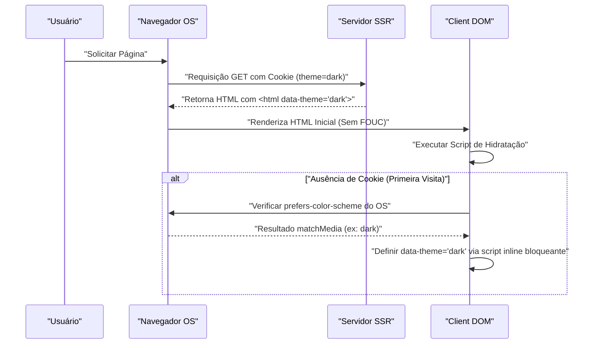

No desenvolvimento web moderno, o suporte ao Modo Escuro (Dark Mode) mudou de ser um mero "recurso interessante de se ter (Nice to have)" para um "requisito essencial (Must have)" a fim de melhorar a experiência do usuário (UX). Especialmente em mídias onde se espera longos períodos de leitura de texto, como blogs e sites de documentação, o suporte ao modo escuro é extremamente importante, pois ajuda a reduzir o cansaço visual do usuário e a economizar o consumo de bateria do dispositivo.

Neste artigo, aprofundaremos as questões técnicas inevitáveis na implementação do modo escuro em um blog e os pontos-chave de um design CSS altamente manutenível, a partir da perspectiva de um engenheiro de frontend. Cobriremos tudo sobre a implementação do modo escuro, incluindo a utilização de CSS Custom Properties (variáveis CSS), controle avançado de JavaScript e integração com SSR para prevenir FOUC (Flash of Unstyled Content), design de cores (RGB, HSL e o mais recente OKLCH) para garantir acessibilidade (WCAG 2.1 AAA), e até exemplos práticos de código usando Tailwind CSS.

---

## 1. Fundamentos do Design de Tema com CSS Custom Properties (Variáveis CSS)

Atualmente, a abordagem mais padrão e poderosa para implementar o modo escuro é o uso de **CSS Custom Properties (variáveis CSS)**. Enquanto as variáveis de pré-processadores CSS como Sass (`$color`) são resolvidas estaticamente durante a compilação, as variáveis CSS são resolvidas e sobrescritas dinamicamente em tempo de execução no navegador. Isso permite que você mude as cores de toda a página instantaneamente, apenas alternando as classes através do JavaScript.

### 1.1 Definição da Paleta de Cores Básica

Primeiro, definimos a paleta de cores para o modo claro (padrão) usando a pseudoclasse `:root`. O padrão clássico de design é sobrescrever essas variáveis quando um atributo como `[data-theme='dark']` (ou uma classe `.dark`) é adicionado.

```css
/* Definição de variáveis para o modo claro (padrão) */
:root {
  --color-bg-primary: #ffffff;
  --color-bg-secondary: #f3f4f6;
  --color-text-primary: #111827;
  --color-text-secondary: #4b5563;
  --color-accent: #3b82f6;
  --color-border: #e5e7eb;
}

/* Sobrescrevendo variáveis no modo escuro */
[data-theme='dark'] {
  --color-bg-primary: #111827;
  --color-bg-secondary: #1f2937;
  --color-text-primary: #f9fafb;
  --color-text-secondary: #9ca3af;
  --color-accent: #60a5fa;
  --color-border: #374151;
}

/* Aplicação real */
body {
  background-color: var(--color-bg-primary);
  color: var(--color-text-primary);
  transition: background-color 0.3s ease, color 0.3s ease;
}

a {
  color: var(--color-accent);
}
```

Desta forma, ao separar completamente as especificações de layout e tipografia das especificações de cores (tema), a manutenibilidade do CSS aumenta drasticamente.

### 1.2 Utilização do @media (prefers-color-scheme: dark)

Se o modo escuro estiver configurado a nível de sistema operacional (OS), é desejável do ponto de vista da UX aplicar o tema escuro automaticamente desde a primeira visita ao site. Isso é alcançado pela media query `@media (prefers-color-scheme: dark)`.

```css
/* Fallback caso a configuração do sistema operacional seja modo escuro */
@media (prefers-color-scheme: dark) {
  :root:not([data-theme='light']) {
    --color-bg-primary: #111827;
    --color-bg-secondary: #1f2937;
    --color-text-primary: #f9fafb;
    --color-text-secondary: #9ca3af;
    --color-accent: #60a5fa;
    --color-border: #374151;
  }
}
```

Nesta sintaxe, as variáveis são sobrescritas respeitando a configuração de modo escuro do OS, a menos que o usuário tenha selecionado explicitamente o modo claro (`data-theme='light'`).

---

## 2. Compreendendo Espaços de Cores e Acessibilidade (WCAG 2.1 AAA)

Ao projetar as cores para o modo escuro, simplesmente "tornar o fundo preto e o texto branco" não é suficiente. Se o contraste for muito forte, causará halação e dificultará a leitura, enquanto que se o contraste for muito baixo, a visibilidade será prejudicada. As Diretrizes de Acessibilidade de Conteúdo da Web (WCAG) definem rigorosamente a taxa de contraste para garantir a visibilidade.

### 2.1 Fórmula de Cálculo da Taxa de Contraste WCAG

A taxa de contraste (Contrast Ratio) $CR$ no WCAG é definida usando a luminância relativa (Relative Luminance) da cor de fundo e da cor do primeiro plano, da seguinte forma:

$$CR = \frac{L_{lighter} + 0.05}{L_{darker} + 0.05}$$

Onde $L_{lighter}$ é a luminância relativa da cor mais clara e $L_{darker}$ é a luminância relativa da cor mais escura (os valores variam de 0.0 a 1.0). Para alcançar o nível AAA do WCAG 2.1, é necessária uma taxa de contraste de **7:1 ou superior** para textos normais e **4.5:1 ou superior** para textos grandes.

A luminância relativa $L$ é calculada através da seguinte fórmula complexa a partir dos valores RGB no espaço de cor sRGB.

$$L = 0.2126 \times R + 0.7152 \times G + 0.0722 \times B$$

Cada componente ($R, G, B$) usa o valor normalizado resultante da divisão do valor original de 8 bits ($R_{sRGB}$) por 255 e passa pela seguinte transformação para desfazer a correção gama:

$$
R, G, B = 
\begin{cases} 
\frac{C_{sRGB}}{12.92} & \text{if } C_{sRGB} \le 0.03928 \\
\left( \frac{C_{sRGB} + 0.055}{1.055} \right)^{2.4} & \text{otherwise}
\end{cases}
$$

É difícil fazer esse cálculo manualmente, mas usando ferramentas de design de cores, é possível selecionar mecanicamente cores que satisfaçam a taxa de contraste de 7:1 ($CR \ge 7.0$).

### 2.2 HSL vs RGB vs OKLCH

Antigamente, RGB e HSL eram as opções predominantes ao criar paletas de cores. No entanto, elas possuem grandes falhas do ponto de vista da "uniformidade perceptiva".

*   **RGB**: São as três cores primárias mecânicas da luz, tornando difícil para os humanos ajustarem intuitivamente, como "fazer mais claro" ou "fazer mais escuro".
*   **HSL**: Usa Matiz (Hue), Saturação (Saturation) e Luminosidade (Lightness), mas a "Luminosidade (L)" do HSL não corresponde ao brilho percebido pelo olho humano. Por exemplo, um amarelo puro e um azul puro com 50% de luminosidade no HSL têm o mesmo brilho numericamente, mas para o olho humano, o amarelo parece esmagadoramente mais brilhante.
*   **OKLCH**: O espaço de cores mais recente introduzido no CSS Color Module Level 4. Consiste em Lightness (Luminosidade perceptiva), Chroma (Saturação) e Hue (Matiz), e **corresponde perfeitamente às características visuais humanas (uniformidade perceptiva)**.

Usando OKLCH, você pode manter a mesma luminosidade perceptiva (Lightness) mesmo se alterar o matiz (Hue), tornando a geração de paletas de cores para o modo escuro extremamente previsível e segura.

```css
/* Exemplo de definição de variáveis CSS usando OKLCH */
:root {
  /* Modo claro com luminosidade base alta e saturação contida */
  --bg-base: oklch(0.98 0.01 250);
  --text-base: oklch(0.25 0.02 250);
  --primary-brand: oklch(0.65 0.15 250);
}

[data-theme="dark"] {
  /* No modo escuro, basta inverter a luminosidade, sendo mais fácil manter o contraste perceptivo */
  --bg-base: oklch(0.20 0.02 250);
  --text-base: oklch(0.95 0.01 250);
  --primary-brand: oklch(0.75 0.15 250); /* Um pouco mais claro para o modo escuro visando garantir visibilidade */
}
```

Ao adotar OKLCH desta maneira, você pode construir de forma simples a lógica para garantir uma taxa de contraste consistente (nível WCAG AAA) entre vários temas.

---

## 3. Prevenção de FOUC (Flash of Unstyled Content) e Hidratação SSR

O que mais incomoda os desenvolvedores na implementação do modo escuro é o problema da tela piscando, conhecido como **FOUC (Flash of Unstyled Content)**.

### 3.1 A Armadilha da Mudança de Tema no Lado do Cliente (JS)

Em SPAs como React ou Vue (ou sites estáticos baseados em SSG), a abordagem comum é salvar a configuração do usuário no `localStorage`, lê-la com JavaScript e então alternar o tema. No entanto, quando esse processo é feito num `useEffect` do React, ocorrem os seguintes problemas:

1. O navegador renderiza o HTML/CSS do modo claro.
2. O bundle do JS é carregado e executado.
3. Lê a configuração `dark` do `localStorage`.
4. A classe `dark` é adicionada ao HTML e a tela escurece repentinamente (pisca).

### 3.2 A Prevenção Perfeita contra FOUC: Utilização de Cookies e SSR

A melhor prática para prevenir completamente o FOUC e evitar erros de hidratação é **salvar as configurações de tema do usuário em `document.cookie` e retornar o HTML com as classes apropriadas anexadas no estágio de Renderização do Lado do Servidor (SSR)**.

O diagrama de sequência abaixo mostra o fluxo ideal para inicializar o tema usando Cookies.



### 3.3 Linha de Defesa via Scripts Inline (Para sites estáticos que não podem usar Cookies)

No caso de blogs (como Hugo, Gatsby ou exportações estáticas do Astro) baseados apenas em SSG (Geração de Site Estático) onde o SSR é impossível, é essencial colocar um script JavaScript inline dentro da tag `<head>` para execução bloqueante e anexar a classe antes da renderização do DOM.

```html
<!-- Colocar no final do <head> -->
<script>
  (function() {
    try {
      var localTheme = localStorage.getItem('theme');
      var osTheme = window.matchMedia('(prefers-color-scheme: dark)').matches ? 'dark' : 'light';
      var theme = localTheme || osTheme;
      document.documentElement.setAttribute('data-theme', theme);
    } catch (e) {}
  })();
</script>
```

Esse pequeno script bloqueia a renderização do navegador e é executado instantaneamente. Como o atributo `data-theme` já está configurado no momento em que a tela é renderizada, ele previne completamente a cintilação da tela (FOUC).

---

## 4. Abordagens de Implementação com Tailwind CSS e SCSS/CSS Puro

Ao incorporar o modo escuro num projeto real, é necessário entender as abordagens de cada ferramenta.

### 4.1 Modo Escuro no Tailwind CSS

O Tailwind CSS oferece nativamente a variante `dark:`, tornando a implementação do modo escuro extremamente simples. O atributo `darkMode` deve ser definido no arquivo de configuração (`tailwind.config.js`).

```javascript
// tailwind.config.js
module.exports = {
  // 'media' (depende do OS) ou 'class' (pode ser alternado manualmente)
  darkMode: 'class', 
  theme: {
    extend: {
      colors: {
        /* Usando variáveis CSS para estender a paleta de cores do Tailwind */
        primary: 'rgb(var(--color-primary) / <alpha-value>)',
        background: 'rgb(var(--color-background) / <alpha-value>)',
      }
    }
  }
}
```

Do lado do HTML, basta adicionar as classes conforme mostrado abaixo.

```html
<div class="bg-white dark:bg-gray-900 text-gray-900 dark:text-gray-100">
  <h1 class="text-2xl font-bold">Hello World</h1>
  <p class="mt-2">Tailwind makes dark mode incredibly easy.</p>
</div>
```

Porém, escrever `dark:bg-xxx` em todos os elementos pode causar inchaço nos componentes. Em blogs ou aplicações de grande escala, recomenda-se um design híbrido (design de cores semânticas), onde as **variáveis CSS são a base e o Tailwind apenas faz referência a elas**.

Abaixo está o diagrama de classes que ilustra a herança das variáveis CSS e a camada de aplicação.

```mermaid
classDiagram
    class GlobalCSSVariables {
        "--color-brand-500"
        "--color-gray-900"
    }
    class SemanticVariables {
        "--bg-primary"
        "--text-base"
        "--accent"
    }
    class TailwindConfig {
        "theme.colors.background"
        "theme.colors.primary"
    }
    class UIComponents {
        "class='bg-background text-primary'"
    }

    GlobalCSSVariables <|-- SemanticVariables : ":root & .dark"
    SemanticVariables <|-- TailwindConfig : "tailwind.config.js"
    TailwindConfig <.. UIComponents : "Aplica Classes de Utilidade"
```

### 4.2 Implementação em Raw SCSS/CSS (Uso de Mixin)

Em projetos que não usam Tailwind e utilizam SCSS próprio, você pode usar `@mixin` para encapsular estilos do modo escuro.

```scss
/* Definição de SCSS Mixin */
@mixin dark-mode {
  /* Suporta tanto o atributo [data-theme='dark'] quanto a configuração do OS */
  [data-theme='dark'] & {
    @content;
  }
  @media (prefers-color-scheme: dark) {
    :root:not([data-theme='light']) & {
      @content;
    }
  }
}

/* Exemplo de uso */
.card {
  background-color: #ffffff;
  color: #333333;
  border: 1px solid #eeeeee;

  @include dark-mode {
    background-color: #1a202c;
    color: #e2e8f0;
    border-color: #2d3748;
  }
}
```

Embora esse método seja intuitivo, o tamanho do arquivo CSS compilado tende a inflar (já que media queries são duplicadas em cada seletor). Assim, a tendência atual ainda é migrar para um design focado em Variáveis CSS (Custom Properties).

---

## 5. Otimização de Imagens (Image) e SVG para o Modo Escuro

Mesmo que o design de cores de textos e fundos seja concluído, imagens e ícones (SVG) posicionados como conteúdo podem parecer extremamente brilhantes e fora de sintonia se permanecerem na configuração de modo claro. A otimização para eles também é indispensável.

### 5.1 Filtro CSS para Reduzir a Luminosidade da Imagem

Imagens bitmap, como fotografias, às vezes ficam brilhantes demais quando exibidas diretamente no modo escuro. Ao usar a propriedade `filter` do CSS para reduzir ligeiramente a luminosidade (brightness) e contraste (contrast) da imagem, é possível integrá-la naturalmente à interface do tema escuro.

```css
[data-theme='dark'] img:not([src*=".svg"]) {
  /* Reduz brilho e aumenta ligeiramente o contraste */
  filter: brightness(0.8) contrast(1.1);
  transition: filter 0.3s ease;
}

[data-theme='dark'] img:hover {
  /* Retorna ao brilho original ao passar o mouse (se o usuário quiser ver mais detalhes) */
  filter: brightness(1) contrast(1);
}
```

### 5.2 Alternando Imagens com a Tag `<picture>`

Imagens de logotipo ou ilustrações (como JPEGs com fundo branco fixo) não podem ser corrigidas apenas com processamento de filtros. Nesses casos, o método correto é usar o elemento HTML `<picture>` e media queries para alternar para outro arquivo de imagem específico para o modo escuro.

```html
<picture>
  <!-- Exibido para usuários com configuração do OS no modo escuro -->
  <source srcset="/img/logo-dark.png" media="(prefers-color-scheme: dark)">
  <!-- Padrão (modo claro) -->
  
</picture>
```
*Nota: Este método não está vinculado à alternância manual (por `localStorage`, etc.) porque depende exclusivamente da configuração do SO. Se a alternância manual estiver implementada, você deve alterar dinamicamente a propriedade `src` da imagem via JS, ou alternar a classe CSS com `display: none`.

### 5.3 Suporte SVG Icons via `currentColor`

Para SVGs embutidos, como ícones, o mais inteligente a fazer é vincular a cor de preenchimento à cor do texto do elemento pai. Defina `currentColor` no atributo `fill` ou `stroke` do SVG.

```html
<!-- O valor da propriedade 'color' do CSS (como var(--text-primary)) é aplicado automaticamente -->
<svg viewBox="0 0 24 24" fill="currentColor">
  <path d="M12 2L2 22h20L12 2z" />
</svg>
```

Isso garante que, quando você mudar para o modo escuro e a cor do texto do elemento pai se tornar um tom de branco, o ícone SVG também mudará automaticamente para a mesma cor.

---

## 6. Conclusão: Em Direção a um Design de Modo Escuro Sustentável

Para implementar um modo escuro de alta qualidade em blogs e aplicações web, um design CSS que aborde todos os pontos abaixo é indispensável:

1.  **Utilizar CSS Custom Properties**: Evitar fixar códigos de cores e usar abstração para nomes de variáveis ​​semânticas (ex: `--bg-primary`).
2.  **Adotar o espaço de cores OKLCH**: Projetar uma taxa de contraste logicamente acessível (7:1 ou maior) que atenda aos critérios WCAG 2.1 AAA em um espaço de cor perceptualmente uniforme.
3.  **Medidas Rigorosas Contra FOUC**: Eliminar completamente o piscar da tela no carregamento inicial via integração de SSR e Cookies, ou usando scripts inline de bloqueio no `<head>`.
4.  **Otimização de Mídias e Ativos**: Usar recursos como `filter: brightness()`, `currentColor` e tags `<picture>` para harmonizar elementos não textuais com o tema escuro.

Ir além da simples "inversão de cores" com estas atenções detalhadas é a marca de um blog moderno que será amado pelos usuários e fornecerá uma excelente experiência de leitura com menos cansaço visual. Aconselhamos os desenvolvedores que estiverem implementando o modo escuro a consultarem os padrões de design discutidos neste artigo.
