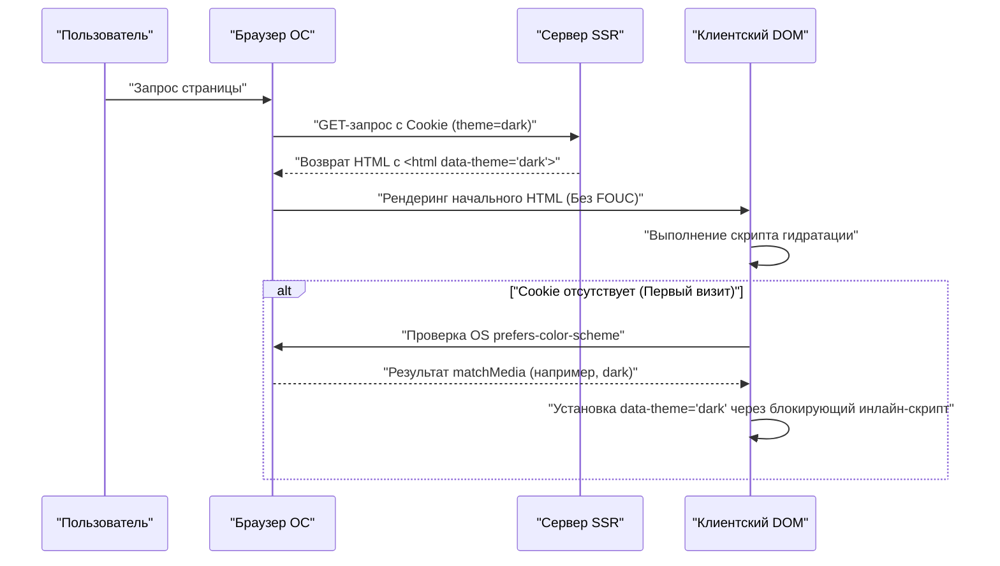

В современной веб-разработке поддержка темного режима (Dark Mode) превратилась из просто «приятного дополнения» (Nice to have) в «обязательное требование» (Must have) для улучшения пользовательского опыта (UX). В частности, для медиа, предполагающих длительное чтение текста, таких как блоги и сайты с документацией, важность поддержки темного режима крайне высока, поскольку он снижает нагрузку на глаза пользователей и уменьшает расход заряда батареи устройств.

В этой статье мы глубоко погрузимся в технические проблемы, которых не избежать при внедрении темного режима в блог, и ключевые моменты CSS-проектирования с высокой степенью поддерживаемости с точки зрения фронтенд-инженера. Мы охватим все аспекты реализации темного режима: использование CSS Custom Properties (CSS-переменных), продвинутое управление JavaScript и интеграцию с SSR для предотвращения FOUC (Flash of Unstyled Content), цветовой дизайн (RGB, HSL и новейший OKLCH) для обеспечения доступности (WCAG 2.1 AAA), а также практические примеры кода с использованием Tailwind CSS.

---

## 1. Основы проектирования тем с использованием CSS Custom Properties (CSS-переменных)

В настоящее время наиболее стандартным и мощным методом реализации темного режима является подход с использованием **CSS Custom Properties (CSS-переменных)**. В отличие от переменных в CSS-препроцессорах, таких как Sass (`$color`), которые разрешаются статически во время компиляции, CSS-переменные разрешаются и переопределяются динамически во время выполнения в браузере. Это позволяет мгновенно изменить цветовую гамму всей страницы, просто переключая классы с помощью JavaScript.

### 1.1 Базовое определение цветовой темы

Во-первых, мы используем псевдокласс `:root` для определения цветовой палитры светлого режима (по умолчанию). Затем классический паттерн проектирования заключается в переопределении этих переменных при добавлении атрибута, такого как `[data-theme='dark']` (или класса `.dark`).

```css
/* Определение переменных светлого режима (по умолчанию) */
:root {
  --color-bg-primary: #ffffff;
  --color-bg-secondary: #f3f4f6;
  --color-text-primary: #111827;
  --color-text-secondary: #4b5563;
  --color-accent: #3b82f6;
  --color-border: #e5e7eb;
}

/* Переопределение переменных для темного режима */
[data-theme='dark'] {
  --color-bg-primary: #111827;
  --color-bg-secondary: #1f2937;
  --color-text-primary: #f9fafb;
  --color-text-secondary: #9ca3af;
  --color-accent: #60a5fa;
  --color-border: #374151;
}

/* Фактическое применение */
body {
  background-color: var(--color-bg-primary);
  color: var(--color-text-primary);
  transition: background-color 0.3s ease, color 0.3s ease;
}

a {
  color: var(--color-accent);
}
```

Таким образом, полностью разделяя определение макета/типографики и цвета (темы), поддерживаемость CSS значительно повышается.

### 1.2 Использование @media (prefers-color-scheme: dark)

Если темный режим установлен на уровне ОС, с точки зрения UX желательно автоматически применять темную тему с момента первого посещения веб-сайта. Это достигается с помощью медиа-запроса `@media (prefers-color-scheme: dark)`.

```css
/* Фолбэк, если в настройках ОС выбран темный режим */
@media (prefers-color-scheme: dark) {
  :root:not([data-theme='light']) {
    --color-bg-primary: #111827;
    --color-bg-secondary: #1f2937;
    --color-text-primary: #f9fafb;
    --color-text-secondary: #9ca3af;
    --color-accent: #60a5fa;
    --color-border: #374151;
  }
}
```

При таком написании переменные переопределяются с учетом настроек темного режима ОС, если только пользователь явно не выбрал светлый режим (`data-theme='light'`).

---

## 2. Понимание цветового пространства и доступность (WCAG 2.1 AAA)

При цветовом проектировании для темного режима недостаточно просто «сделать фон черным, а текст белым». Если контраст слишком сильный, это вызовет ореол и усложнит чтение, а если контраст слишком низкий, пострадает видимость. В Web Content Accessibility Guidelines (WCAG) строго определен коэффициент контрастности для обеспечения видимости.

### 2.1 Формула расчета коэффициента контрастности WCAG

Коэффициент контрастности (Contrast Ratio) $CR$ в WCAG определяется следующим образом с использованием относительной яркости (Relative Luminance) цвета фона и цвета переднего плана.

$$CR = \frac{L_{lighter} + 0.05}{L_{darker} + 0.05}$$

Здесь $L_{lighter}$ — относительная яркость более светлого цвета, а $L_{darker}$ — относительная яркость более темного цвета (диапазон значений от 0.0 до 1.0). Для достижения уровня AAA по стандарту WCAG 2.1 требуется коэффициент контрастности **не менее 7:1** для обычного текста и **не менее 4.5:1** для крупного текста.

Относительная яркость $L$ рассчитывается по следующей сложной формуле из значений RGB в цветовом пространстве sRGB.

$$L = 0.2126 \times R + 0.7152 \times G + 0.0722 \times B$$

Каждый компонент ($R, G, B$) использует нормализованное значение исходного 8-битного значения ($R_{sRGB}$), деленное на 255, и выполняет следующее преобразование для снятия гамма-коррекции.

$$
R, G, B = 
\begin{cases} 
\frac{C_{sRGB}}{12.92} & \text{if } C_{sRGB} \le 0.03928 \\
\left( \frac{C_{sRGB} + 0.055}{1.055} \right)^{2.4} & \text{otherwise}
\end{cases}
$$

Выполнять этот расчет вручную сложно, но, используя инструменты цветового проектирования, можно механически подобрать цвета, которые удовлетворяют коэффициенту контрастности 7:1 ($CR \ge 7.0$).

### 2.2 HSL vs RGB vs OKLCH

При создании цветовой палитры раньше доминировали RGB и HSL. Однако они имеют серьезный недостаток с точки зрения «перцептивной однородности» (perceptual uniformity).

*   **RGB**: Это механические три основных цвета света, и людям сложно интуитивно вносить коррективы вроде «сделать светлее» или «сделать темнее».
*   **HSL**: Использует оттенок (Hue), насыщенность (Saturation) и светлоту (Lightness), но «светлота (L)» в HSL не совпадает с воспринимаемой яркостью человеческим глазом. Например, чистый желтый и чистый синий со светлотой 50% в HSL численно имеют одинаковую яркость, но человеческому глазу желтый кажется значительно ярче.
*   **OKLCH**: Это новейшее цветовое пространство, введенное в CSS Color Module Level 4. Оно состоит из светлоты (Lightness — перцептивной яркости), насыщенности (Chroma) и оттенка (Hue), и **полностью соответствует зрительным характеристикам человека (перцептивно однородно)**.

Используя OKLCH, вы можете сохранять ту же перцептивную яркость (Lightness) даже при изменении оттенка (Hue), что делает создание цветовой палитры для темного режима чрезвычайно предсказуемым и безопасным.

```css
/* Пример определения CSS-переменных с использованием OKLCH */
:root {
  /* Светлый режим: высокая базовая яркость, умеренная насыщенность */
  --bg-base: oklch(0.98 0.01 250);
  --text-base: oklch(0.25 0.02 250);
  --primary-brand: oklch(0.65 0.15 250);
}

[data-theme="dark"] {
  /* В темном режиме просто инвертируем яркость, легче поддерживать перцептивный контраст */
  --bg-base: oklch(0.20 0.02 250);
  --text-base: oklch(0.95 0.01 250);
  --primary-brand: oklch(0.75 0.15 250); /* Слегка осветляем для темного режима для обеспечения видимости */
}
```

Приняв OKLCH таким образом, можно просто построить логику, гарантирующую согласованный коэффициент контрастности (уровень WCAG AAA) в нескольких темах.

---

## 3. Предотвращение FOUC (Flash of Unstyled Content) и SSR гидратация

Наиболее раздражающей проблемой для разработчиков при реализации темного режима является мерцание экрана, известное как **FOUC (Flash of Unstyled Content)**.

### 3.1 Ловушка переключения тем с помощью клиентского JS

В SPA, таких как React или Vue (или статических сайтах с помощью SSG), распространена практика сохранения пользовательских настроек в `localStorage` и их чтения с помощью JavaScript для переключения темы. Однако если этот процесс выполняется в `useEffect` в React или аналогичном хуке, возникают следующие проблемы:

1. Браузер отрисовывает HTML/CSS светлого режима.
2. Загружается и выполняется JS-бандл.
3. Из `localStorage` считывается настройка `dark`.
4. В HTML добавляется класс `dark`, и экран внезапно темнеет (мерцание).

### 3.2 Идеальная мера предотвращения FOUC: использование Cookie и SSR

Лучшая практика для полного предотвращения FOUC и предотвращения ошибок гидратации — это **сохранение пользовательских настроек темы в `document.cookie` и возврат HTML с соответствующими классами, добавленными на этапе серверного рендеринга (SSR)**.

Следующая диаграмма последовательности иллюстрирует идеальный процесс инициализации темы с использованием Cookie.



### 3.3 Линия защиты с помощью инлайн-скриптов (Для статических сайтов, где Cookie недоступны)

Для блогов, которые используют только SSG (генерацию статических сайтов) и где SSR невозможен (например, Hugo, Gatsby, статический экспорт Astro), необходимо разместить блокирующий инлайн-скрипт JavaScript внутри тега `<head>` для добавления класса непосредственно перед отрисовкой DOM.

```html
<!-- Размещается в конце тега <head> -->
<script>
  (function() {
    try {
      var localTheme = localStorage.getItem('theme');
      var osTheme = window.matchMedia('(prefers-color-scheme: dark)').matches ? 'dark' : 'light';
      var theme = localTheme || osTheme;
      document.documentElement.setAttribute('data-theme', theme);
    } catch (e) {}
  })();
</script>
```

Поскольку этот небольшой скрипт блокирует рендеринг браузера и выполняется немедленно, атрибут `data-theme` уже установлен к моменту отрисовки экрана, что полностью предотвращает мерцание экрана (FOUC).

---

## 4. Подходы к реализации с использованием Tailwind CSS и чистого SCSS/CSS

При внедрении темного режима в реальный проект необходимо понимать подходы, специфичные для каждого инструмента.

### 4.1 Темный режим в Tailwind CSS

Tailwind CSS предоставляет вариант `dark:` по умолчанию, что делает реализацию темного режима чрезвычайно простой. Вы настраиваете свойство `darkMode` в конфигурационном файле (`tailwind.config.js`).

```javascript
// tailwind.config.js
module.exports = {
  // 'media' (зависит от настроек ОС) или 'class' (переключается вручную)
  darkMode: 'class', 
  theme: {
    extend: {
      colors: {
        /* Расширение цветовой палитры Tailwind с использованием CSS-переменных */
        primary: 'rgb(var(--color-primary) / <alpha-value>)',
        background: 'rgb(var(--color-background) / <alpha-value>)',
      }
    }
  }
}
```

На стороне HTML вы просто добавляете классы следующим образом:

```html
<div class="bg-white dark:bg-gray-900 text-gray-900 dark:text-gray-100">
  <h1 class="text-2xl font-bold">Hello World</h1>
  <p class="mt-2">Tailwind makes dark mode incredibly easy.</p>
</div>
```

Однако, написание `dark:bg-xxx` для каждого элемента может привести к раздуванию компонентов. В крупных блогах или приложениях рекомендуется гибридный подход (семантический цветовой дизайн), где **CSS-переменные служат основой, а Tailwind ссылается на эти CSS-переменные**.

Ниже представлена диаграмма классов, показывающая наследование CSS-переменных и уровни применения.

```mermaid
classDiagram
    class GlobalCSSVariables {
        "--color-brand-500"
        "--color-gray-900"
    }
    class SemanticVariables {
        "--bg-primary"
        "--text-base"
        "--accent"
    }
    class TailwindConfig {
        "theme.colors.background"
        "theme.colors.primary"
    }
    class UIComponents {
        "class='bg-background text-primary'"
    }

    GlobalCSSVariables <|-- SemanticVariables : ":root & .dark"
    SemanticVariables <|-- TailwindConfig : "tailwind.config.js"
    TailwindConfig <.. UIComponents : "Применяет утилитарные классы"
```

### 4.2 Реализация на чистом SCSS/CSS (Использование примесей/Mixin)

В проектах, которые не используют Tailwind, а пишут собственные SCSS, стили темного режима инкапсулируются с помощью `@mixin`.

```scss
/* Определение SCSS Mixin */
@mixin dark-mode {
  /* Поддерживает как атрибут [data-theme='dark'], так и настройки ОС */
  [data-theme='dark'] & {
    @content;
  }
  @media (prefers-color-scheme: dark) {
    :root:not([data-theme='light']) & {
      @content;
    }
  }
}

/* Пример использования */
.card {
  background-color: #ffffff;
  color: #333333;
  border: 1px solid #eeeeee;

  @include dark-mode {
    background-color: #1a202c;
    color: #e2e8f0;
    border-color: #2d3748;
  }
}
```

Хотя этот метод интуитивно понятен, скомпилированный файл CSS имеет тенденцию раздуваться (поскольку медиа-запросы дублируются для каждого селектора), поэтому современным трендом является переход к дизайну, ориентированному на CSS-переменные (Custom Properties).

---

## 5. Оптимизация изображений (Image) и SVG для темного режима

Даже если цветовой дизайн текста и фона завершен, если изображения и иконки (SVG), размещенные в качестве контента, останутся в светлом режиме, они будут выглядеть слишком яркими и неуместными в темном режиме. Оптимизация этих элементов также имеет важное значение.

### 5.1 CSS-фильтры для снижения яркости изображений

Растровые изображения, такие как фотографии, могут быть слишком яркими, если они отображаются как есть в темном режиме. Используя свойство CSS `filter` для незначительного снижения яркости (brightness) и контрастности (contrast) изображений, вы можете заставить их естественным образом сливаться с пользовательским интерфейсом темной темы.

```css
[data-theme='dark'] img:not([src*=".svg"]) {
  /* Уменьшаем яркость, немного увеличиваем контраст */
  filter: brightness(0.8) contrast(1.1);
  transition: filter 0.3s ease;
}

[data-theme='dark'] img:hover {
  /* Возвращаем исходную яркость при наведении (если пользователь хочет рассмотреть детали) */
  filter: brightness(1) contrast(1);
}
```

### 5.2 Переключение изображений с помощью тега `<picture>`

Изображения логотипов и пояснительные схемы (например, JPEG с фиксированным белым фоном) не могут быть адаптированы только с помощью фильтров. В этом случае правильным подходом будет использование элемента HTML `<picture>` и медиа-запросов для предоставления отдельного файла изображения для темного режима.

```html
<picture>
  <!-- Показывать это пользователям с настройками ОС в темном режиме -->
  <source srcset="/img/logo-dark.png" media="(prefers-color-scheme: dark)">
  <!-- По умолчанию (светлый режим) -->
  
</picture>
```
※ Однако этот метод не связан с ручным переключением через `localStorage` и т.д. (он зависит только от настроек ОС). Поэтому, если вы реализуете ручное переключение, вам нужно либо динамически переписывать атрибут `src` изображений с помощью JS, либо переключать `display: none` с помощью CSS-классов.

### 5.3 Использование `currentColor` для SVG-иконок

Самый элегантный способ работы с инлайн-SVG, используемыми для иконок, — это связать цвет заливки с цветом текста родительского элемента. Задайте `currentColor` для атрибутов `fill` или `stroke` в SVG.

```html
<!-- Значение свойства CSS color (например, var(--text-primary)) применяется автоматически -->
<svg viewBox="0 0 24 24" fill="currentColor">
  <path d="M12 2L2 22h20L12 2z" />
</svg>
```

Благодаря этому, когда включается темный режим и цвет текста родительского элемента становится светлым/белым, SVG-иконка также автоматически меняется на светлый/белый.

---

## 6. Заключение: К устойчивому проектированию темного режима

Чтобы реализовать качественный темный режим в блоге или веб-приложении, необходимо CSS-проектирование, охватывающее следующие ключевые моменты:

1.  **Использование CSS Custom Properties**: Избегайте жесткого кодирования (хардкода) цветов и абстрагируйте их в семантические имена переменных (например, `--bg-primary`).
2.  **Принятие цветового пространства OKLCH**: Логическое проектирование высокодоступного коэффициента контрастности (7:1 или выше), соответствующего WCAG 2.1 AAA, в перцептивно однородном цветовом пространстве.
3.  **Строгие меры предотвращения FOUC**: Полное устранение мерцания экрана при начальной загрузке путем связывания SSR и Cookie или блокирующего инлайн-скрипта в `<head>`.
4.  **Оптимизация медиа и ассетов**: Использование `filter: brightness()`, `currentColor` и тегов `<picture>`, чтобы нетекстовые элементы гармонировали с темной темой.

Можно сказать, что эти тщательные соображения, выходящие за рамки простого «инвертирования цветов», являются отличительной чертой современного блога, который обеспечивает превосходный опыт чтения, любим пользователями в течение долгого времени и меньше утомляет глаза. Разработчикам, которые собираются внедрять темный режим, обязательно стоит использовать паттерны проектирования из этой статьи в качестве справочного материала.
