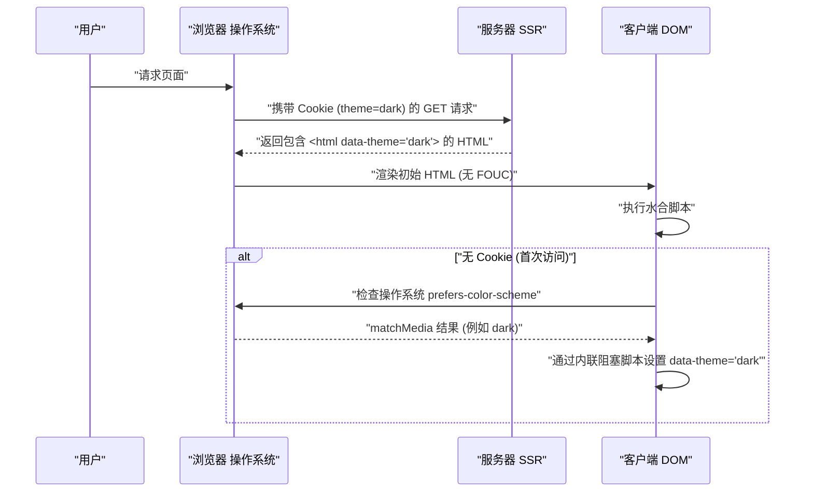

现代Web开发中，深色模式（Dark Mode）的支持已经从单纯的“锦上添花的特性（Nice to have）”转变为提升用户体验（UX）的“必备要求（Must have）”。特别是像博客和文档网站这样需要长时间阅读文本的媒体，它能够减轻用户的眼睛疲劳，并降低设备的电池消耗，因此支持深色模式的重要性可以说是极高的。

本文将从前端工程师的视角，极其深入地剖析博客在适配深色模式时不可避免的技术挑战和高可维护性CSS设计要点。涵盖的内容包括：利用CSS Custom Properties（CSS变量）、防止FOUC（Flash of Unstyled Content）的高级JavaScript控制与SSR结合、确保无障碍访问（WCAG 2.1 AAA）的色彩设计（RGB、HSL以及最新的OKLCH），还有使用Tailwind CSS的实用代码示例，网罗深色模式实现的方方面面。

---

## 1. 基于CSS Custom Properties（CSS变量）的主题设计基础

在实现深色模式时，目前最标准且强大的方法是利用 **CSS Custom Properties（CSS变量）**。与Sass等CSS预处理器的变量（`$color`）在编译时静态解析不同，CSS变量是在浏览器的运行时动态解析和覆盖的。由此，只需通过JavaScript切换类名，即可瞬间改变整个页面的色调。

### 1.1 基本色彩主题的定义

首先，使用 `:root` 伪类定义浅色模式（默认）的调色板。然后，当赋予 `[data-theme='dark']` 等属性（或 `.dark` 类）时，对这些变量进行覆盖，这是最经典的设计模式。

```css
/* 浅色模式（默认）的变量定义 */
:root {
  --color-bg-primary: #ffffff;
  --color-bg-secondary: #f3f4f6;
  --color-text-primary: #111827;
  --color-text-secondary: #4b5563;
  --color-accent: #3b82f6;
  --color-border: #e5e7eb;
}

/* 深色模式时的变量覆盖 */
[data-theme='dark'] {
  --color-bg-primary: #111827;
  --color-bg-secondary: #1f2937;
  --color-text-primary: #f9fafb;
  --color-text-secondary: #9ca3af;
  --color-accent: #60a5fa;
  --color-border: #374151;
}

/* 实际应用 */
body {
  background-color: var(--color-bg-primary);
  color: var(--color-text-primary);
  transition: background-color 0.3s ease, color 0.3s ease;
}

a {
  color: var(--color-accent);
}
```

如此这般，通过将布局或排版的指定与颜色（主题）的指定完全分离，CSS的可维护性将会实现飞跃性的提升。

### 1.2 灵活运用 @media (prefers-color-scheme: dark)

如果操作系统级别设置了深色模式，从用户首次访问网站开始自动应用深色主题，从UX的角度来看是更理想的。实现这一点的正是 `@media (prefers-color-scheme: dark)` 这个媒体查询。

```css
/* 当操作系统的环境设置为深色模式时的回退方案 */
@media (prefers-color-scheme: dark) {
  :root:not([data-theme='light']) {
    --color-bg-primary: #111827;
    --color-bg-secondary: #1f2937;
    --color-text-primary: #f9fafb;
    --color-text-secondary: #9ca3af;
    --color-accent: #60a5fa;
    --color-border: #374151;
  }
}
```

在这种写法中，除非用户明确选择了浅色模式（`data-theme='light'`），否则会尊重操作系统的深色模式设置来覆盖变量。

---

## 2. 理解色彩空间与无障碍访问（WCAG 2.1 AAA）

在深色模式的色彩设计中，仅仅“把背景变黑，文字变白”是不够的。如果对比度过强，会引起光晕现象反而难以阅读；而如果对比度过低，又会损害可视性。Web Content Accessibility Guidelines (WCAG) 对确保可视性的对比度进行了严格的定义。

### 2.1 WCAG 对比度计算公式

WCAG 中的对比度（Contrast Ratio） $CR$ 使用背景色和前景色（文本色）的相对亮度（Relative Luminance）定义如下：

$$CR = \frac{L_{lighter} + 0.05}{L_{darker} + 0.05}$$

这里，$L_{lighter}$ 是较亮颜色的相对亮度，$L_{darker}$ 是较暗颜色的相对亮度（值的范围是 0.0 到 1.0）。为了达到 WCAG 2.1 的 AAA 级别，常规文本需要 **7:1 以上**，大文本需要 **4.5:1 以上** 的对比度。

相对亮度 $L$ 可由 sRGB 色彩空间的 RGB 值通过以下复杂的公式计算得出：

$$L = 0.2126 \times R + 0.7152 \times G + 0.0722 \times B$$

各分量（$R, G, B$）是使用原有的 8 位值（$R_{sRGB}$）除以 255 后的归一化值，为解除伽马校正进行如下转换：

$$
R, G, B = 
\begin{cases} 
\frac{C_{sRGB}}{12.92} & \text{if } C_{sRGB} \le 0.03928 \\
\left( \frac{C_{sRGB} + 0.055}{1.055} \right)^{2.4} & \text{otherwise}
\end{cases}
$$

手动进行这样的计算很困难，但通过利用色彩设计工具，可以机械地挑选出满足对比度 7:1 ($CR \ge 7.0$) 的颜色。

### 2.2 HSL vs RGB vs OKLCH

在创建调色板时，过去 RGB 或 HSL 是主流。然而，从“感知均匀性”的角度来看，它们有着巨大的缺陷。

*   **RGB**: 机械的光学三原色，人类难以直观地进行“调亮”或“调暗”之类的调整。
*   **HSL**: 使用色相 (Hue)、饱和度 (Saturation) 和亮度 (Lightness)，但 HSL 的“亮度 (L)”与人类眼睛感知的亮度并不一致。例如，在 HSL 中亮度同为 50% 的纯黄色和纯蓝色，在数值上亮度相同，但在人眼看来黄色却亮得多。
*   **OKLCH**: 近年在 CSS Color Module Level 4 中引入的最新色彩空间。由 Lightness（感知明度）、Chroma（饱和度）、Hue（色相）组成，**完全符合人类的视觉特性（感知均匀）**。

通过使用 OKLCH，即使改变色相（Hue）也能保持相同的感知明度（Lightness），这使得为深色模式生成调色板变得极具可预测性且安全。

```css
/* 使用 OKLCH 定义 CSS 变量的示例 */
:root {
  /* 浅色模式的基础明度较高，饱和度较低 */
  --bg-base: oklch(0.98 0.01 250);
  --text-base: oklch(0.25 0.02 250);
  --primary-brand: oklch(0.65 0.15 250);
}

[data-theme="dark"] {
  /* 在深色模式中只需反转明度，即可轻松保持感知对比度 */
  --bg-base: oklch(0.20 0.02 250);
  --text-base: oklch(0.95 0.01 250);
  --primary-brand: oklch(0.75 0.15 250); /* 针对深色模式稍作提亮以确保可视性 */
}
```

这样通过采用 OKLCH，就能非常简单地构建起在多个主题间保证一致对比度（WCAG AAA 水平）的逻辑。

---

## 3. 防止FOUC（Flash of Unstyled Content）与SSR水合作用

在支持深色模式时最令开发者头疼的，就是被称为 **FOUC (Flash of Unstyled Content)** 的画面闪烁问题。

### 3.1 客户端 JS 切换主题的陷阱

在 React 或 Vue 等 SPA（或 SSG 生成的静态网站）中，将用户的设置保存在 `localStorage`，然后用 JavaScript 读取并切换主题是常见的做法。然而，如果在 React 的 `useEffect` 等中执行此操作，就会发生以下问题：

1. 浏览器渲染浅色模式的 HTML/CSS。
2. JS 包被加载并执行。
3. 从 `localStorage` 读取 `dark` 设置。
4. HTML 被赋予 `dark` 类，画面突然变暗（闪烁）。

### 3.2 完美的 FOUC 防御对策：结合 Cookie 与 SSR

为了彻底防止 FOUC 并避免水合错误（Hydration Error），最佳实践是 **将用户的主题设置保存在 `document.cookie` 中，并在服务器端渲染（SSR）阶段返回赋予了合适类名的 HTML**。

以下的时序图展示了利用 Cookie 进行主题初始化的理想流程：



### 3.3 通过内联脚本构建防线（适用于无法使用 Cookie 的静态网站）

对于仅支持 SSG（静态网站生成）且无法进行 SSR 的博客（例如 Hugo、Gatsby 或 Astro 的静态导出等），必须在 `<head>` 标签内部放置会阻塞渲染的内联 JavaScript，并在 DOM 渲染前一刻赋予相应类名，这是必不可少的方法。

```html
<!-- 放置在 <head> 内部的最后 -->
<script>
  (function() {
    try {
      var localTheme = localStorage.getItem('theme');
      var osTheme = window.matchMedia('(prefers-color-scheme: dark)').matches ? 'dark' : 'light';
      var theme = localTheme || osTheme;
      document.documentElement.setAttribute('data-theme', theme);
    } catch (e) {}
  })();
</script>
```

这段简短的脚本会阻塞浏览器的渲染并立即执行，因此在画面渲染时就已经设置好了 `data-theme` 属性，能够彻底防止画面的闪烁（FOUC）。

---

## 4. Tailwind CSS 与原生 SCSS/CSS 的实现方法

将深色模式引入实际项目时，需要了解各个工具的实现方法。

### 4.1 Tailwind CSS 中的深色模式

Tailwind CSS 默认提供了 `dark:` 变体（variant），可以非常简单地实现深色模式。在配置文件（`tailwind.config.js`）中设置 `darkMode` 属性。

```javascript
// tailwind.config.js
module.exports = {
  // 'media' (依赖操作系统设置) 或 'class' (可手动切换)
  darkMode: 'class', 
  theme: {
    extend: {
      colors: {
        /* 利用 CSS 变量扩展 Tailwind 的调色板 */
        primary: 'rgb(var(--color-primary) / <alpha-value>)',
        background: 'rgb(var(--color-background) / <alpha-value>)',
      }
    }
  }
}
```

在 HTML 方面只需像下面这样添加类名即可。

```html
<div class="bg-white dark:bg-gray-900 text-gray-900 dark:text-gray-100">
  <h1 class="text-2xl font-bold">Hello World</h1>
  <p class="mt-2">Tailwind makes dark mode incredibly easy.</p>
</div>
```

然而，对所有元素都写上 `dark:bg-xxx` 也会成为组件变得臃肿的原因。在大型博客或应用程序中，推荐采用**以 CSS 变量为基础，从 Tailwind 引用这些 CSS 变量**的混合设计（语义化颜色设计）。

以下是展示 CSS 变量继承和应用层级的类图：

```mermaid
classDiagram
    class GlobalCSSVariables {
        "--color-brand-500"
        "--color-gray-900"
    }
    class SemanticVariables {
        "--bg-primary"
        "--text-base"
        "--accent"
    }
    class TailwindConfig {
        "theme.colors.background"
        "theme.colors.primary"
    }
    class UIComponents {
        "class='bg-background text-primary'"
    }

    GlobalCSSVariables <|-- SemanticVariables : ":root & .dark"
    SemanticVariables <|-- TailwindConfig : "tailwind.config.js"
    TailwindConfig <.. UIComponents : "应用工具类"
```

### 4.2 使用原生 SCSS/CSS 实现（活用 Mixin）

在不使用 Tailwind 而独立编写 SCSS 的项目中，可以利用 `@mixin` 将深色模式的样式封装起来。

```scss
/* SCSS Mixin 的定义 */
@mixin dark-mode {
  /* 支持 [data-theme='dark'] 属性，或操作系统设置 */
  [data-theme='dark'] & {
    @content;
  }
  @media (prefers-color-scheme: dark) {
    :root:not([data-theme='light']) & {
      @content;
    }
  }
}

/* 使用示例 */
.card {
  background-color: #ffffff;
  color: #333333;
  border: 1px solid #eeeeee;

  @include dark-mode {
    background-color: #1a202c;
    color: #e2e8f0;
    border-color: #2d3748;
  }
}
```

这种方法虽然直观，但编译后的 CSS 文件体积容易膨胀（媒体查询会被复制到各个选择器中），因此目前的趋势仍然是过渡到以 CSS 变量（Custom Properties）为核心的设计。

---

## 5. 图片（Image）与 SVG 的深色模式优化

即使文本和背景的色彩设计已经完成，如果作为内容放置的图片或图标（SVG）仍然保持浅色模式的状态，在深色模式下就会显得非常刺眼且格格不入。对它们进行优化也是必不可少的。

### 5.1 降低图片亮度的 CSS 滤镜

如果将照片等位图图像在深色模式下原样显示，有时会过于刺眼。通过使用 CSS 的 `filter` 属性，稍微降低图像的亮度（brightness）并增加对比度（contrast），就能使其自然地融入深色主题的 UI 中。

```css
[data-theme='dark'] img:not([src*=".svg"]) {
  /* 降低亮度，稍微提高对比度 */
  filter: brightness(0.8) contrast(1.1);
  transition: filter 0.3s ease;
}

[data-theme='dark'] img:hover {
  /* 悬停时恢复原有的亮度（为了用户想要查看细节的情况） */
  filter: brightness(1) contrast(1);
}
```

### 5.2 使用 `<picture>` 标签切换图片

像 Logo 或说明用的图解（如背景固定为白色的 JPEG）等，仅靠滤镜处理是无法解决的。在这种情况下，正确的做法是结合 HTML 的 `<picture>` 元素和媒体查询，为深色模式提供另一份图片文件。

```html
<picture>
  <!-- 向系统设置为深色模式的用户显示这张图片 -->
  <source srcset="/img/logo-dark.png" media="(prefers-color-scheme: dark)">
  <!-- 默认（浅色模式） -->
  
</picture>
```
※需要注意的是，这种方法不会与 `localStorage` 等手动切换功能联动（仅依赖于操作系统设置）。如果实现了手动切换，则需要使用 JS 动态修改图片的 `src`，或者通过 CSS 类切换 `display: none`。

### 5.3 SVG 图标的 `currentColor` 适配

对于图标等处使用的内联 SVG，将其填充颜色与父元素的文本颜色联动是最高明的做法。只需将 SVG 的 `fill` 或 `stroke` 属性指定为 `currentColor` 即可。

```html
<!-- CSS 的 color 属性的值（例如 var(--text-primary)）将自动被应用 -->
<svg viewBox="0 0 24 24" fill="currentColor">
  <path d="M12 2L2 22h20L12 2z" />
</svg>
```

由此一来，当切换到深色模式，父元素的文字颜色变成白色系时，SVG 图标也会自动变为白色系。

---

## 6. 总结：迈向可持续的深色模式设计

在博客或 Web 应用程序中，要实现高质量的深色模式，涵盖以下要点的 CSS 设计是不可或缺的：

1.  **活用 CSS Custom Properties（CSS变量）**: 避免硬编码颜色指定，将其抽象为语义化的变量名（例: `--bg-primary`）。
2.  **采用 OKLCH 色彩空间**: 在感知均匀的色彩空间中进行符合逻辑的设计，以满足 WCAG 2.1 AAA 标准中高无障碍访问的对比度（7:1 以上）。
3.  **彻底做好 FOUC 防御对策**: 结合 SSR 和 Cookie，或使用 `<head>` 内的阻塞式内联脚本，彻底消除初次加载时的画面闪烁。
4.  **媒体与静态资源的优化**: 充分运用 `filter: brightness()`、`currentColor` 以及 `<picture>` 标签，使文本以外的元素也能与深色主题相得益彰。

超越了单纯的“颜色反转”，正是这些细致入微的考量，才能被称为是一个能够长期受用户喜爱、提供不伤眼且卓越阅读体验（Reading Experience）的现代博客的条件。准备引入深色模式的开发者们，请务必参考本文的设计模式。
