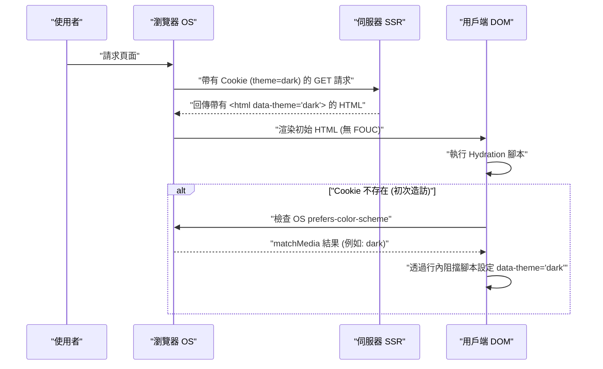

現代 Web 開發中，深色模式（Dark Mode）的支援已經從單純的「有了會更好（Nice to have）」的功能，轉變為提升使用者體驗（UX）的「必備條件（Must have）」。特別是在部落格或文件網站這類以長時間閱讀文字為前提的媒體中，因為具有減輕使用者眼睛疲勞、降低裝置電池消耗的效果，深色模式支援的重要性可說是非常高。

本文將從前端工程師的視角，非常深入地探討在部落格的深色模式支援中無法避免的技術課題，以及高維護性 CSS 設計的重點。從 CSS Custom Properties（CSS 變數）的活用、防止 FOUC（Flash of Unstyled Content）的進階 JavaScript 控制與 SSR 整合、確保無障礙（WCAG 2.1 AAA）的色彩設計（RGB、HSL 以及最新的 OKLCH），甚至到使用 Tailwind CSS 的實作程式碼範例，網羅了深色模式實作的所有內容。

---

## 1. 透過 CSS Custom Properties（CSS 變數）進行主題設計的基礎

在實作深色模式時，目前最標準且最強大的手法就是利用 **CSS Custom Properties（CSS 變數）** 的方法。相對於 Sass 等 CSS 預處理器的變數（`$color`）是在編譯時靜態解析，CSS 變數則是在瀏覽器的執行階段動態解析並覆寫。這使得只要透過 JavaScript 切換 class，就能瞬間改變整個頁面的色調。

### 1.1 基本色彩主題的定義

首先，使用 `:root` 偽類別來定義淺色模式（預設）的調色盤。然後，當賦予如 `[data-theme='dark']` 這樣的屬性（或是 `.dark` class）時，覆寫這些變數，這是最常見的設計模式。

```css
/* 淺色模式（預設）的變數定義 */
:root {
  --color-bg-primary: #ffffff;
  --color-bg-secondary: #f3f4f6;
  --color-text-primary: #111827;
  --color-text-secondary: #4b5563;
  --color-accent: #3b82f6;
  --color-border: #e5e7eb;
}

/* 深色模式時的變數覆寫 */
[data-theme='dark'] {
  --color-bg-primary: #111827;
  --color-bg-secondary: #1f2937;
  --color-text-primary: #f9fafb;
  --color-text-secondary: #9ca3af;
  --color-accent: #60a5fa;
  --color-border: #374151;
}

/* 實際套用 */
body {
  background-color: var(--color-bg-primary);
  color: var(--color-text-primary);
  transition: background-color 0.3s ease, color 0.3s ease;
}

a {
  color: var(--color-accent);
}
```

像這樣，將排版與字體的指定和顏色（主題）的指定完全分離，能讓 CSS 的維護性有飛躍性的提升。

### 1.2 活用 @media (prefers-color-scheme: dark)

當作業系統層級設定為深色模式時，從使用者初次造訪網站起就自動套用深色主題，這在 UX 的觀點上是比較理想的。能夠實現這點的就是 `@media (prefers-color-scheme: dark)` 這個媒體查詢。

```css
/* 當 OS 環境設定為深色模式時的備用方案（Fallback） */
@media (prefers-color-scheme: dark) {
  :root:not([data-theme='light']) {
    --color-bg-primary: #111827;
    --color-bg-secondary: #1f2937;
    --color-text-primary: #f9fafb;
    --color-text-secondary: #9ca3af;
    --color-accent: #60a5fa;
    --color-border: #374151;
  }
}
```

在這種寫法中，除非使用者明確選擇淺色模式（`data-theme='light'`），否則會尊重作業系統的深色模式設定來覆寫變數。

---

## 2. 理解色彩空間與無障礙設計（WCAG 2.1 AAA）

在深色模式的色彩設計中，單純地「把背景變黑、文字變白」是不夠的。對比太強會產生光暈反而難以閱讀，對比太低則會損害易視性。在網頁內容無障礙指南 (WCAG) 中，為了確保易視性，對比度有著嚴格的定義。

### 2.1 WCAG 對比度的計算公式

WCAG 中的對比度（Contrast Ratio） $CR$ ，是使用背景色與前景色的相對亮度（Relative Luminance）以下列方式定義：

$$CR = \frac{L_{lighter} + 0.05}{L_{darker} + 0.05}$$

這裡的 $L_{lighter}$ 是較亮顏色的相對亮度，$L_{darker}$ 是較暗顏色的相對亮度（值的範圍從 0.0 到 1.0）。為了達到 WCAG 2.1 的 AAA 等級，一般文字需要 **7:1 以上**，大型文字則需要 **4.5:1 以上** 的對比度。

相對亮度 $L$ 是從 sRGB 色彩空間的 RGB 值透過以下複雜的數學公式計算而來：

$$L = 0.2126 \times R + 0.7152 \times G + 0.0722 \times B$$

各成分（$R, G, B$）使用原始 8 位元值（$R_{sRGB}$）除以 255 的標準化值，進行以下轉換以解開伽瑪校正：

$$
R, G, B = 
\begin{cases} 
\frac{C_{sRGB}}{12.92} & \text{if } C_{sRGB} \le 0.03928 \\
\left( \frac{C_{sRGB} + 0.055}{1.055} \right)^{2.4} & \text{otherwise}
\end{cases}
$$

手動進行這項計算很困難，但透過運用色彩設計工具，可以機械式地選出符合對比度 7:1 ($CR \ge 7.0$) 的顏色。

### 2.2 HSL vs RGB vs OKLCH

過去在建立調色盤時，主流是 RGB 或 HSL。然而，這些在「知覺均勻度」的觀點上有著很大的缺陷。

*   **RGB**: 是機械式的光的三原色，人類很難直觀地進行「調亮」、「調暗」這類的調整。
*   **HSL**: 使用色相 (Hue)、彩度 (Saturation)、亮度 (Lightness)，但 HSL 的「亮度 (L)」與人類眼睛知覺到的亮度並不一致。例如，在 HSL 中亮度為 50% 的純黃色和純藍色，在數值上亮度相同，但在人類眼中黃色看起來卻亮得多。
*   **OKLCH**: 是近年在 CSS Color Module Level 4 中導入的最新色彩空間。由亮度 (Lightness，知覺明度)、彩度 (Chroma)、色相 (Hue) 組成，**完全符合人類的視覺特性（知覺均勻）**。

透過使用 OKLCH，即使改變色相（Hue），也能保持相同的知覺明度（Lightness），因此深色模式用的調色盤生成變得極具預測性且安全。

```css
/* 使用 OKLCH 的 CSS 變數定義範例 */
:root {
  /* 淺色模式的基礎明度較高，彩度較低 */
  --bg-base: oklch(0.98 0.01 250);
  --text-base: oklch(0.25 0.02 250);
  --primary-brand: oklch(0.65 0.15 250);
}

[data-theme="dark"] {
  /* 深色模式只需反轉明度，就容易維持知覺對比度 */
  --bg-base: oklch(0.20 0.02 250);
  --text-base: oklch(0.95 0.01 250);
  --primary-brand: oklch(0.75 0.15 250); /* 針對深色模式稍微調亮以確保易視性 */
}
```

像這樣採用 OKLCH，能夠簡單地建構出在多個主題間確保一致對比度（WCAG AAA 水準）的邏輯。

---

## 3. 防止 FOUC（Flash of Unstyled Content）與 SSR Hydration

在支援深色模式時，最讓開發者頭痛的就是被稱為 **FOUC（Flash of Unstyled Content）** 的畫面閃爍問題。

### 3.1 透過用戶端 JS 切換主題的陷阱

在 React 或 Vue 等 SPA（或是透過 SSG 建立的靜態網站）中，一般的做法是將使用者的設定儲存在 `localStorage`，再透過 JavaScript 讀取並切換主題。然而，如果將這個處理放在 React 的 `useEffect` 等地方執行，就會發生以下問題：

1. 瀏覽器渲染淺色模式的 HTML/CSS。
2. JS 的 Bundle 被載入並執行。
3. 從 `localStorage` 讀取 `dark` 設定。
4. HTML 被賦予 `dark` class，畫面突然變暗（閃爍）。

### 3.2 完美的 FOUC 防止對策：活用 Cookie 與 SSR

為了完全防止 FOUC，並預防 Hydration 錯誤，最佳實踐是**將使用者的主題設定儲存在 `document.cookie` 中，並在伺服器端渲染（SSR）階段回傳已賦予適當 class 的 HTML**。

以下的循序圖展示了利用 Cookie 進行主題初始化的理想流程：



### 3.3 透過行內腳本建立防線（無法使用 Cookie 的靜態網站情況）

如果是只有 SSG（靜態網站生成）而無法進行 SSR 的部落格（如 Hugo、Gatsby，或 Astro 的靜態匯出等），必須在 `<head>` 標籤內部配置會阻擋渲染執行的行內（inline）JavaScript，在 DOM 渲染前一刻賦予 class 的手法。

```html
<!-- 配置在 <head> 內的最後面 -->
<script>
  (function() {
    try {
      var localTheme = localStorage.getItem('theme');
      var osTheme = window.matchMedia('(prefers-color-scheme: dark)').matches ? 'dark' : 'light';
      var theme = localTheme || osTheme;
      document.documentElement.setAttribute('data-theme', theme);
    } catch (e) {}
  })();
</script>
```

這個小腳本會阻擋瀏覽器的渲染並立即執行，因此在畫面渲染的時間點，`data-theme` 屬性已經被設定好，可以完全防止畫面的閃爍（FOUC）。

---

## 4. Tailwind CSS 與原生 SCSS/CSS 的實作方法

在將深色模式實際整合進專案時，必須理解各項工具的做法。

### 4.1 Tailwind CSS 中的深色模式

Tailwind CSS 預設提供了 `dark:` 變體（variant），可以非常簡單地實作深色模式。在設定檔（`tailwind.config.js`）中設定 `darkMode` 屬性。

```javascript
// tailwind.config.js
module.exports = {
  // 'media' (依賴 OS 設定) 或是 'class' (可手動切換)
  darkMode: 'class', 
  theme: {
    extend: {
      colors: {
        /* 利用 CSS 變數來擴充 Tailwind 的調色盤 */
        primary: 'rgb(var(--color-primary) / <alpha-value>)',
        background: 'rgb(var(--color-background) / <alpha-value>)',
      }
    }
  }
}
```

在 HTML 端只需像下面這樣賦予 class 即可。

```html
<div class="bg-white dark:bg-gray-900 text-gray-900 dark:text-gray-100">
  <h1 class="text-2xl font-bold">Hello World</h1>
  <p class="mt-2">Tailwind makes dark mode incredibly easy.</p>
</div>
```

然而，對所有元素都寫上 `dark:bg-xxx` 也會成為元件肥大的原因。在大型部落格或應用程式中，推薦採用**以 CSS 變數為基礎，並從 Tailwind 參考這些 CSS 變數**的混合式設計（語意化色彩設計）。

以下是展示 CSS 變數的繼承與套用層級的類別圖。

```mermaid
classDiagram
    class GlobalCSSVariables {
        "--color-brand-500"
        "--color-gray-900"
    }
    class SemanticVariables {
        "--bg-primary"
        "--text-base"
        "--accent"
    }
    class TailwindConfig {
        "theme.colors.background"
        "theme.colors.primary"
    }
    class UIComponents {
        "class='bg-background text-primary'"
    }

    GlobalCSSVariables <|-- SemanticVariables : ":root & .dark"
    SemanticVariables <|-- TailwindConfig : "tailwind.config.js"
    TailwindConfig <.. UIComponents : "套用工具類別"
```

### 4.2 原生 SCSS/CSS 的實作（活用 Mixin）

在不使用 Tailwind，而是自行撰寫 SCSS 的專案中，可以活用 `@mixin` 來封裝深色模式的樣式。

```scss
/* SCSS Mixin 的定義 */
@mixin dark-mode {
  /* 支援 [data-theme='dark'] 屬性，或是 OS 設定這兩者 */
  [data-theme='dark'] & {
    @content;
  }
  @media (prefers-color-scheme: dark) {
    :root:not([data-theme='light']) & {
      @content;
    }
  }
}

/* 使用範例 */
.card {
  background-color: #ffffff;
  color: #333333;
  border: 1px solid #eeeeee;

  @include dark-mode {
    background-color: #1a202c;
    color: #e2e8f0;
    border-color: #2d3748;
  }
}
```

這個方法很直觀，但編譯後的 CSS 檔案大小容易肥大（媒體查詢會複製到各個選擇器上），因此目前趨勢依然是轉向以 CSS 變數（Custom Properties）為中心的設計。

---

## 5. 圖片（Image）與 SVG 的深色模式最佳化

即使文字或背景的色彩設計完成，如果配置為內容的圖片或圖示（SVG）仍維持淺色模式的狀態，在深色模式下會顯得非常刺眼且突兀。對這些元素進行最佳化也是不可或缺的。

### 5.1 降低圖片亮度的 CSS 濾鏡

像是照片等點陣圖，在深色模式下直接顯示有時會過於刺眼。使用 CSS 的 `filter` 屬性，稍微降低圖片的亮度（brightness）與對比度（contrast），就能讓圖片自然地融入深色主題的 UI 中。

```css
[data-theme='dark'] img:not([src*=".svg"]) {
  /* 降低亮度，稍微提高對比度 */
  filter: brightness(0.8) contrast(1.1);
  transition: filter 0.3s ease;
}

[data-theme='dark'] img:hover {
  /* 懸停時恢復原始亮度（使用者想要看清楚細節時） */
  filter: brightness(1) contrast(1);
}
```

### 5.2 透過 `<picture>` 標籤切換圖片

Logo 圖片或是說明的圖解（背景固定為白色的 JPEG 等），光靠濾鏡處理是無法解決的。在這種情況下，正確的做法是使用 HTML 的 `<picture>` 元素和媒體查詢，來切換顯示深色模式用的另一張圖片檔案。

```html
<picture>
  <!-- 針對深色模式 OS 設定的使用者顯示這張 -->
  <source srcset="/img/logo-dark.png" media="(prefers-color-scheme: dark)">
  <!-- 預設（淺色模式） -->
  
</picture>
```
※不過，這個方法無法與透過 `localStorage` 等進行的手動切換連動（只依賴 OS 設定），因此如果實作了手動切換功能，就需要透過 JS 動態改寫圖片的 `src`，或是透過 CSS class 切換 `display: none`。

### 5.3 SVG 圖示的 `currentColor` 支援

在圖示等地方使用的行內（inline）SVG，最聰明的做法是讓填滿的顏色與父元素的文字顏色連動。在 SVG 的 `fill` 或 `stroke` 屬性中指定 `currentColor`。

```html
<!-- CSS 的 color 屬性值（如 var(--text-primary)）會自動套用 -->
<svg viewBox="0 0 24 24" fill="currentColor">
  <path d="M12 2L2 22h20L12 2z" />
</svg>
```

這樣一來，當切換到深色模式且父元素的文字顏色變成白色系時，SVG 圖示也會自動變成白色系。

---

## 6. 總結：邁向永續的深色模式設計

為了在部落格或 Web 應用程式中實作高品質的深色模式，網羅了以下重點的 CSS 設計是不可或缺的。

1.  **活用 CSS Custom Properties**：避免硬編碼（hardcoding）指定顏色，將其抽象化為語意化的變數名稱（例如：`--bg-primary`）。
2.  **採用 OKLCH 色彩空間**：在知覺均勻的色彩空間中，有邏輯地設計出滿足 WCAG 2.1 AAA 的高無障礙對比度（7:1 以上）。
3.  **貫徹 FOUC 對策**：透過 SSR 與 Cookie 的整合，或是在 `<head>` 內阻擋渲染的行內腳本，完全排除初次載入時的畫面閃爍。
4.  **媒體與資源的最佳化**：充分運用 `filter: brightness()`、`currentColor` 以及 `<picture>` 標籤，讓文字以外的元素也能與深色主題協調。

超越單純的「顏色反轉」，這些細膩的考量正是現代部落格能長久受使用者喜愛、提供不易造成眼睛疲勞的優良閱讀體驗（Reading Experience）的必備條件。即將導入深色模式的開發者們，請務必參考本文的設計模式。
