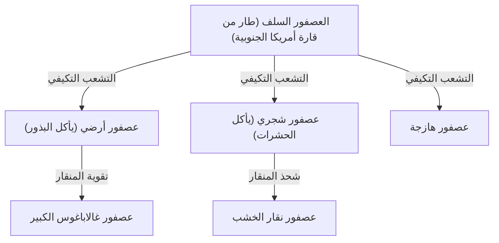
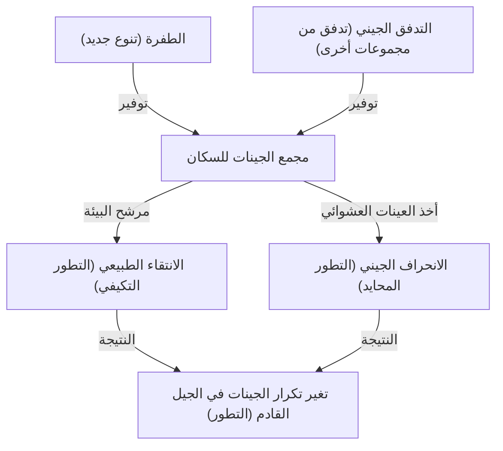

## مقدمة: تنوع الحياة وثورة داروين

في 24 نوفمبر 1859، نُشر كتاب "أصل الأنواع" (On the Origin of Species) لتشارلز داروين، والذي أصبح عملاً تاريخيًا لم يقلب علم الأحياء فحسب، بل قلب نظرة البشرية للعالم من جذورها. في مواجهة النموذج الخلقي السابق القائل بأن "جميع الأنواع خُلقت بشكل فردي من قبل الله وهي غير قابلة للتغيير"، اقترح داروين نظرية التطور القائمة على آلية "الانتقاء الطبيعي" (Natural Selection).

في هذا المقال، سنتعمق بشكل مفصل للغاية في كيفية تشكيل نظرية داروين للتطور، والبنية المنطقية لنظرية الانتقاء الطبيعي التي تمثل جوهرها، والدعم الرياضي من علم الوراثة السكانية الحديث (الداروينية الجديدة)، وحتى تنفيذ الخوارزميات الجينية كقياس لعملية التطور باستخدام بايثون.

## 1. الخلفية التاريخية: رحلة سفينة بيجل والإلهام

من عام 1831 إلى عام 1836، أبحر تشارلز داروين حول العالم كعالم طبيعة على متن سفينة المسح البحرية البريطانية، بيجل. وقد كان لملاحظاته في جزر غالاباغوس بشكل خاص تأثير حاسم على تفكيره.

### تنوع عصافير غالاباغوس

كانت جزر غالاباغوس موطنًا لعصافير (تُصنف الآن في فصيلة التناجر) ذات أشكال مناقير مختلفة على كل جزيرة. تخصصت مناقيرها حسب نظامها الغذائي: فمنها من يأكل الصبار، ومنها من يأكل الحشرات، ومنها من يكسر البذور.



اعتقد داروين أن هذه العصافير تفرعت من سلف مشترك وتكيفت مع بيئة كل جزيرة.

## 2. البنية المنطقية لنظرية الانتقاء الطبيعي

تتكون نظرية الانتقاء الطبيعي لداروين من حقائق الملاحظة الثلاثة والاستنتاجين التاليين.

1. **الإفراط في التكاثر (Overproduction)**: تنتج الكائنات الحية نسلًا أكثر مما تستطيع البيئة دعمه.
2. **التباين الفردي (Variation)**: حتى داخل نفس النوع، توجد اختلافات (تباينات) في الشكل والخصائص بين الأفراد.
3. **الوراثة (Inheritance)**: تنتقل بعض هذه التباينات بالوراثة من الآباء إلى الأبناء.

الآلية المستمدة من هذا هي **الانتقاء الطبيعي (Natural Selection)**. في صراع البقاء (الصراع)، تبقى الأفراد ذات السمات الأكثر تكيفًا مع البيئة على قيد الحياة وتترك عددًا أكبر من النسل. بتكرار هذا عبر الأجيال، يتغير النوع بأكمله في اتجاه التكيف مع البيئة.

### التعريف الرياضي للياقة

في علم الوراثة السكانية الحديث، تتم صياغة الانتقاء الطبيعي رياضيًا بمفهوم "اللياقة" (Fitness). تُعرّف اللياقة $W$ على أنها العدد النسبي للنسل الذي يتركه نمط جيني معين للجيل القادم.

$$ \Delta p = \frac{p q [p(W_{11} - W_{12}) + q(W_{12} - W_{22})]}{\bar{W}} $$

هنا،
- $p, q$ هي تكرارات الأليلات $A, a$
- $W_{11}, W_{12}, W_{22}$ هي لياقة كل نمط جيني ($AA, Aa, aa$)
- $\bar{W}$ هي متوسط اللياقة للسكان ($\bar{W} = p^2 W_{11} + 2pq W_{12} + q^2 W_{22}$)

توضح هذه المعادلة أن تكرار الجينات يتغير في اتجاه زيادة متوسط اللياقة، وهو إثبات رياضي للانتقاء الطبيعي لداروين.

## 3. التطور إلى النظرية التركيبية (الداروينية الجديدة)

في عصر داروين، كانت "آلية الوراثة" المتعلقة بكيفية حدوث التباينات وكيفية توريثها غير معروفة (لم يتم إعادة اكتشاف قوانين مندل حتى عام 1900).

من الثلاثينيات إلى الأربعينيات من القرن العشرين، اندمجت نظرية الانتقاء الطبيعي لداروين وعلم الوراثة المندلي، بالإضافة إلى علم الوراثة السكانية وعلم الحفريات، لتأسيس "النظرية التركيبية" (Modern Synthesis). وضع رونالد فيشر، وجي بي إس هالدين، وسيوال رايت وآخرون الأسس الرياضية لها.

### العوامل الأربعة التي تدفع التطور

في علم الأحياء الحديث، يُستشهد بالعوامل الأربعة التالية كمسببات للتطور (التغير في تكرار الأليلات داخل مجموعة سكانية).

1. **الانتقاء الطبيعي (Natural Selection)**
2. **الطفرة (Mutation)**: توفير أليلات جديدة بسبب أخطاء تكرار الحمض النووي وما إلى ذلك.
3. **الانحراف الجيني (Genetic Drift)**: تقلبات تكرار الجينات بسبب الصدفة في المجموعات السكانية المحدودة.
4. **التدفق الجيني (Gene Flow)**: تهجين الجينات نتيجة انتقال الأفراد بين المجموعات السكانية.



## 4. تجربة الانتقاء الطبيعي بالبرمجة: الخوارزميات الجينية

يتم تطبيق آلية التطور في الهندسة كطريقة حسابية لحل مشاكل التحسين تسمى "الخوارزمية الجينية" (Genetic Algorithm, GA). هنا، دعونا ننفذ محاكاة بسيطة باستخدام بايثون تولد السلسلة النصية "DARWIN" من خلال التطور.

```python
import random
import string

TARGET = "DARWIN"
POP_SIZE = 100
MUTATION_RATE = 0.05

def random_string(length):
    return ''.join(random.choice(string.ascii_uppercase) for _ in range(length))

def calculate_fitness(individual):
    # استخدام عدد الأحرف المتطابقة مع السلسلة المستهدفة كلياقة
    return sum(1 for a, b in zip(individual, TARGET) if a == b)

def crossover(parent1, parent2):
    mid = len(TARGET) // 2
    return parent1[:mid] + parent2[mid:]

def mutate(individual):
    res = list(individual)
    for i in range(len(res)):
        if random.random() < MUTATION_RATE:
            res[i] = random.choice(string.ascii_uppercase)
    return "".join(res)

# إنشاء السكان الأوليين
population = [random_string(len(TARGET)) for _ in range(POP_SIZE)]

generation = 0
while True:
    population.sort(key=calculate_fitness, reverse=True)
    best = population[0]
    
    print(f"Generation {generation}: {best} (Fitness: {calculate_fitness(best)})")
    
    if best == TARGET:
        print("Evolution complete!")
        break
        
    # اختيار النخبة وإنشاء الجيل القادم
    next_gen = population[:10]  # الإبقاء على أفضل 10 ذوي أعلى لياقة كما هم
    
    while len(next_gen) < POP_SIZE:
        # اختيار الآباء عشوائياً وإجراء التقاطع والطفرة
        p1, p2 = random.choices(population[:50], k=2)
        child = mutate(crossover(p1, p2))
        next_gen.append(child)
        
    population = next_gen
    generation += 1
```

يحاكي هذا الكود العملية التي تبدأ من مجموعة سلاسل نصية عشوائية، ويتم اختيار الأفراد الأقرب إلى الهدف "DARWIN" (ذوي اللياقة الأعلى)، ويشكلون الجيل القادم من خلال التقاطع والطفرات. يجب أن تكون قادرًا على تأكيد ظهور السلسلة المستهدفة بـ "التطور" في غضون بضعة أجيال.

## 5. الخلاصة وحاضر نظرية التطور

أظهر كتاب "أصل الأنواع" لداروين أن الكائنات الحية ليست كائنات ثابتة، بل تقع في تاريخ ديناميكي ومستمر. اليوم، من خلال تحليل تسلسل الحمض النووي (علم الوراثة العرقي الجزيئي)، ثبت أن كل أشكال الحياة تفرعت من سلف مشترك (LUCA: Last Universal Common Ancestor).

نظرية التطور ليست مجرد "فرضية"، بل هي نموذج ضخم يوحد علم الأحياء الحديث بأكمله. كما قال عالم الوراثة التطورية ثيودوسيوس دوبجانسكي، "لا شيء في علم الأحياء يبدو منطقيًا إلا في ضوء التطور" (Nothing in Biology Makes Sense Except in the Light of Evolution).
