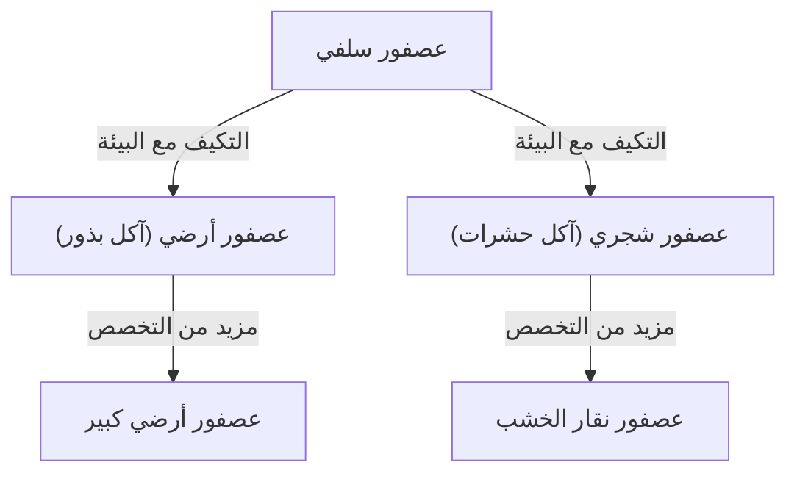

## مقدمة: تنوع الحياة وثورة داروين

في 24 نوفمبر 1859، نُشر كتاب "أصل الأنواع" (On the Origin of Species) لتشارلز داروين، والذي لم يقلب علم الأحياء فحسب، بل وجهة نظر البشرية للعالم من جذورها، ليصبح عملاً تاريخياً. في مواجهة النموذج الخلقي الذي كان سائدًا حتى ذلك الحين والذي ينص على أن "جميع الأنواع خُلقت بشكل فردي بواسطة الله وهي غير قابلة للتغيير"، اقترح داروين نظرية التطور القائمة على آلية "الانتقاء الطبيعي" (Natural Selection).

في هذا المقال، سنشرح بالتفصيل كيف تشكلت نظرية التطور لداروين، والبنية المنطقية لنظرية الانتقاء الطبيعي التي تشكل جوهرها، ومكانتها في علم الأحياء الحديث، وصولاً إلى تأثيرها على المجتمع.

## 1. الخلفية التاريخية: رحلة سفينة البيجل والإلهام

من عام 1831 إلى 1836، صعد تشارلز داروين على متن سفينة المسح التابعة للبحرية البريطانية "بيجل" كعالم طبيعة وقام برحلة حول العالم. هذه الرحلة، التي شملت مسح سواحل قارة أمريكا الجنوبية والتنقل بين جزر المحيط الهادئ، كان لها تأثير حاسم على تفكيره.

### الملاحظات في جزر غالاباغوس

الإلهام الأكبر جاء بشكل خاص من ملاحظاته في جزر غالاباغوس، الواقعة قبالة سواحل الإكوادور في أمريكا الجنوبية. كانت هذه الجزر المعزولة موطناً للعديد من النباتات والحيوانات التي خضعت لتطورها الفريد.

كانت "عصافير داروين" الشهيرة (طيور صغيرة تُصنف ضمن فصيلة التناجر) تمتلك مناقير بأشكال مختلفة تختلف من جزيرة إلى أخرى. تكيفت مناقيرها وتخصصت وفقاً لنظامها الغذائي؛ فمنها من يتغذى أساساً على الصبار، ومنها من يصطاد الحشرات، ومنها من يكسر البذور الصلبة لأكلها.

اعتقد داروين أن هذه العصافير تفرعت من سلف مشترك هاجر من قارة أمريكا الجنوبية، ونتجت عن تكيفها مع بيئة كل جزيرة. أدى هذا لاحقاً إلى مفهوم "التشعب التكيفي".

## 2. البنية المنطقية لنظرية الانتقاء الطبيعي

يكمن جوهر نظرية التطور لداروين في شرحها للآلية التي "كيف يحدث التطور". هذه هي "نظرية الانتقاء الطبيعي". تتكون هذه النظرية بشكل أساسي من الحقائق الملاحظة والاستنتاجات التالية.

### التباين والوراثة

حتى داخل النوع الواحد، توجد اختلافات في الشكل والخصائص بين الأفراد (تباين فردي). وبعض هذه التباينات تُورث من الآباء إلى الأبناء. على الرغم من أن داروين في ذلك الوقت لم يكن يعرف آلية الوراثة (الحمض النووي أو الجينات)، إلا أنه أدرك هذه الحقيقة كقاعدة تجريبية.

### الصراع من أجل البقاء والبقاء للأصلح

عادة ما تحاول الكائنات الحية ترك عدد من النسل يتجاوز ما يمكن للبيئة أن تدعمه (التكاثر المفرط). ومع ذلك، نظراً لأن الموارد مثل الغذاء والموائل محدودة، يحدث صراع من أجل البقاء بين الأفراد.

في هذا الصراع، الأفراد الذين يمتلكون خصائص (تباينات) أكثر فائدة في بيئة معينة هم أكثر عرضة للبقاء على قيد الحياة وترك المزيد من النسل. هذا هو "البقاء للأصلح".

### التغيير عبر الأجيال

بانتقال الخصائص المفيدة عبر الأجيال، تزداد نسبة الأفراد الذين يمتلكون هذه الخصائص تدريجياً داخل التجمع. اعتقد داروين أنه مع تكرار هذه العملية على مدى فترات طويلة من الزمن، يتغير النوع بأكمله في اتجاه التكيف مع البيئة، مما يؤدي في النهاية إلى تكوين أنواع جديدة.

## 3. الصدمة التي أحدثها "أصل الأنواع"

أحدث كتاب "أصل الأنواع" لداروين صدمة لا تقدر بثمن في مجتمع ذلك الوقت.

### تحول النموذج العلمي

كان علم الأحياء حتى ذلك الحين يتمحور حول علم التصنيف ويفترض ثبات الأنواع. ومع ذلك، قدمت نظرية التطور لداروين مفهوم "شجرة الحياة"، حيث تطورت جميع الكائنات الحية وتفرعت من سلف مشترك، مما حوّل علم الأحياء إلى علم ديناميكي ذي منظور تاريخي.

### التأثير على الدين والفلسفة

اصطدم الادعاء بأن "الإنسان أيضاً نتاج للتطور مثل الحيوانات الأخرى" وجهاً لوجه مع النظرة المسيحية للإنسان (العقيدة القائلة بأن الإنسان خُلق بشكل خاص على صورة الله). ونتيجة لذلك، واجهت معارضة شديدة من الأوساط الدينية، ولا يزال الجدل حول قبول نظرية التطور مستمراً في بعض المناطق حتى يومنا هذا.

من ناحية أخرى، أثرت أيضاً على مجالات الفلسفة والعلوم الاجتماعية، حيث ظهرت أفكار مثل الداروينية الاجتماعية، التي حاولت تطبيق مفهوم الانتقاء الطبيعي على المنافسة وعدم المساواة في المجتمع البشري (وهذا يختلف عن نية داروين الأصلية وتعرض لاحقاً للكثير من الانتقادات).

## 4. التطور إلى علم الأحياء التطوري الحديث (الداروينية الحديثة)

الآلية الجينية التي كانت مجهولة في عصر داروين أصبحت واضحة في القرن العشرين من خلال إعادة اكتشاف قوانين مندل للوراثة وتوضيح بنية الحمض النووي.

### دمج الطفرات والانتقاء الطبيعي

في علم الأحياء التطوري الحديث (الاصطناع التطوري الحديث، أو الداروينية الحديثة)، يُشرح مسار التطور على النحو التالي:

1. **الطفرة**: تحدث تباينات جينية جديدة بالصدفة بسبب أخطاء في نسخ الحمض النووي وما إلى ذلك.
2. **الانتقاء الطبيعي**: تعمل التباينات المفيدة المتكيفة مع البيئة بشكل إيجابي في البقاء والتكاثر، وتنتشر داخل التجمع.
3. **الانحراف الجيني**: تتقلب وتيرة الجينات بسبب عوامل الصدفة (يظهر بشكل خاص في التجمعات الصغيرة).
4. **العزلة**: تنقطع التبادلات الجينية بين التجمعات بسبب العزلة الجغرافية أو الإنجابية، مما يعزز الانتواع.

وهكذا، اندمجت نظرية الانتقاء الطبيعي لداروين مع المعرفة الحديثة لعلم الوراثة والبيولوجيا الجزيئية، لتصبح نظرية علمية أكثر قوة وأساساً لعلوم الحياة الحديثة.

## الخلاصة: ما تخبرنا به نظرية التطور

نظرية التطور لداروين ليست مجرد نظرية أكاديمية من الماضي. حتى في العصر الحديث، أصبح المنظور التطوري أمراً لا غنى عنه في مجالات مختلفة، مثل ظهور البكتيريا المقاومة للمضادات الحيوية، وطفرات الفيروسات، وتحسين المحاصيل الزراعية، وحتى فهم آليات تكاثر الخلايا السرطانية.

"ليس الأقوى هو الذي يبقى، ولا الأذكى هو الذي ينجو. بل الوحيد الذي يبقى هو القادر على التغيير" —— على الرغم من أنه يُعتقد أن هذه المقولة ليست من أقوال داروين نفسه، إلا أنها معروفة على نطاق واسع كتعبير يجسد ببراعة جوهر نظرية الانتقاء الطبيعي.

تاريخ الحياة هو تاريخ التكيف المستمر مع التغيرات البيئية. لا يزال المنظور التطوري الذي شقه داروين أحد أقوى العدسات التي يمكننا من خلالها فهم تنوع وتعقيد الحياة.
