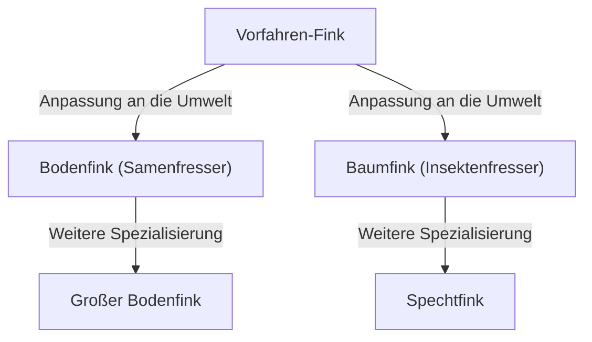

## Einleitung: Die Vielfalt des Lebens und Darwins Revolution

Am 24. November 1859 veröffentlichte Charles Darwin "Über die Entstehung der Arten" (On the Origin of Species), ein historisches Werk, das nicht nur die Biologie, sondern das Weltbild der Menschheit von Grund auf veränderte. Dem bis dahin geltenden kreationistischen Paradigma, dass "alle Arten von Gott individuell erschaffen wurden und unveränderlich sind", setzte Darwin die Evolutionstheorie entgegen, die auf dem Mechanismus der "natürlichen Selektion" (Natural Selection) basiert.

In diesem Artikel wird detailliert erläutert, wie Darwins Evolutionstheorie entstand, wie die logische Struktur der Theorie der natürlichen Selektion – ihr Kern – aufgebaut ist, welche Position sie in der modernen Biologie einnimmt und welche Auswirkungen sie auf die Gesellschaft hatte.

## 1. Historischer Hintergrund: Die Reise mit der Beagle und die Inspiration

Zwischen 1831 und 1836 nahm Charles Darwin als Naturforscher an einer Weltumsegelung auf dem Vermessungsschiff HMS Beagle der britischen Marine teil. Diese Reise, die ihn unter anderem zur Küstenvermessung des südamerikanischen Kontinents und zu den Inseln des Pazifischen Ozeans führte, hatte einen entscheidenden Einfluss auf sein Denken.

### Beobachtungen auf den Galapagosinseln

Eine besonders große Inspiration zog er aus seinen Beobachtungen auf den Galapagosinseln, die vor der Küste Ecuadors in Südamerika liegen. Auf diesen isolierten Inseln lebten viele Pflanzen und Tiere, die eine einzigartige Evolution durchlaufen hatten.

Die berühmten "Darwinfinken" (kleine Vögel, die in die Familie der Tangaren eingeordnet werden) hatten von Insel zu Insel unterschiedlich geformte Schnäbel. Je nach Ernährungsgewohnheit – einige ernährten sich hauptsächlich von Kakteen, andere jagten Insekten, wieder andere knackten harte Samen – waren ihre Schnäbel spezialisiert.

Darwin ging davon aus, dass diese Finken sich von einem gemeinsamen Vorfahren, der vom südamerikanischen Kontinent eingewandert war, aufgespalten und an die jeweilige Inselumwelt angepasst hatten. Dies führte später zum Konzept der "adaptiven Radiation".

## 2. Die logische Struktur der Theorie der natürlichen Selektion

Der Kern von Darwins Evolutionstheorie liegt darin, den Mechanismus zu erklären, "wie Evolution stattfindet". Dies ist die "Theorie der natürlichen Selektion". Diese Theorie besteht hauptsächlich aus den folgenden beobachteten Fakten und Schlussfolgerungen.

### Variation und Vererbung

Selbst innerhalb derselben Art gibt es Unterschiede in Form und Eigenschaften zwischen den Individuen (individuelle Variation). Einige dieser Variationen werden von den Eltern an die Nachkommen vererbt. Obwohl Darwin damals die Mechanismen der Vererbung (DNA und Gene) nicht kannte, erkannte er diese Tatsache als empirische Regel an.

### Kampf ums Dasein und Überleben des Stärkeren (Survival of the Fittest)

Lebewesen versuchen normalerweise, mehr Nachkommen zu hinterlassen, als die Umwelt tragen kann (Überproduktion). Da Ressourcen wie Nahrung und Lebensraum jedoch begrenzt sind, kommt es zu einem Überlebenskampf (Kampf ums Dasein) zwischen den Individuen.

In diesem Kampf haben Individuen mit vorteilhafteren Eigenschaften (Variationen) unter bestimmten Umweltbedingungen eine höhere Überlebenswahrscheinlichkeit und können mehr Nachkommen hinterlassen. Dies ist das "Überleben der am besten Angepassten" (Survival of the Fittest).

### Veränderungen über Generationen hinweg

Da vorteilhafte Eigenschaften über Generationen hinweg weitergegeben werden, nimmt der Anteil der Individuen mit diesen Eigenschaften in einer Population allmählich zu. Darwin glaubte, dass durch die Wiederholung dieses Prozesses über lange Zeiträume hinweg die gesamte Art in Richtung einer Anpassung an die Umwelt verändert wird und schließlich neue Arten entstehen.

## 3. Die Erschütterung, die "Über die Entstehung der Arten" auslöste

Darwins "Über die Entstehung der Arten" war ein unermesslicher Schock für die damalige Gesellschaft.

### Wissenschaftlicher Paradigmenwechsel

Die bisherige Biologie konzentrierte sich auf die Taxonomie und ging von der Unveränderlichkeit der Arten aus. Darwins Evolutionstheorie stellte jedoch das Konzept des "Baums des Lebens" vor, wonach sich alle Lebewesen aus einem gemeinsamen Vorfahren verzweigt und entwickelt haben, und verwandelte die Biologie in eine dynamische Wissenschaft mit einer historischen Perspektive.

### Auswirkungen auf Religion und Philosophie

Die Behauptung, "der Mensch sei ebenso wie andere Tiere ein Produkt der Evolution", geriet in direkten Konflikt mit der christlichen Sicht auf den Menschen (dem Dogma, dass der Mensch nach dem Ebenbild Gottes als etwas Besonderes geschaffen wurde). Dies führte zu heftigem Widerstand seitens der religiösen Kreise, und die Kontroverse um die Akzeptanz der Evolutionstheorie dauert in einigen Regionen bis heute an.

Andererseits beeinflusste sie auch die Philosophie und die Sozialwissenschaften. So entstanden Ideen wie der Sozialdarwinismus, der das Konzept der natürlichen Selektion auf Wettbewerb und Ungleichheit in der menschlichen Gesellschaft anzuwenden versuchte (dies entsprach jedoch nicht Darwins eigenen Absichten und stieß später auf viel Kritik).

## 4. Entwicklung zur modernen Evolutionsbiologie (Neodarwinismus)

Die zu Darwins Zeiten unbekannten Mechanismen der Vererbung wurden im 20. Jahrhundert durch die Wiederentdeckung von Gregor Mendels Vererbungsgesetzen und die Entschlüsselung der DNA-Struktur geklärt.

### Integration von Mutation und natürlicher Selektion

In der modernen Evolutionsbiologie (Synthetische Evolutionstheorie, Neodarwinismus) wird der Evolutionsprozess wie folgt erklärt:

1. **Mutation**: Durch Fehler bei der DNA-Replikation und andere Ursachen entstehen zufällig neue genetische Variationen.
2. **Natürliche Selektion**: Vorteilhafte Variationen, die an die Umwelt angepasst sind, bieten Vorteile beim Überleben und der Fortpflanzung und breiten sich in der Population aus.
3. **Gendrift**: Die Häufigkeit von Genen schwankt aufgrund zufälliger Faktoren (besonders ausgeprägt in kleinen Populationen).
4. **Isolation**: Durch geografische und reproduktive Isolation wird der Genaustausch zwischen Populationen unterbrochen, was die Artbildung fördert.

Auf diese Weise hat sich Darwins Theorie der natürlichen Selektion mit den Erkenntnissen der modernen Genetik und Molekularbiologie verschmolzen und bildet als fundiertere wissenschaftliche Theorie die Grundlage der modernen Biowissenschaften.

## Fazit: Was uns die Evolutionstheorie lehrt

Darwins Evolutionstheorie ist nicht nur eine Theorie aus der Vergangenheit. Auch heute noch ist die evolutionäre Perspektive in verschiedenen Bereichen unverzichtbar, sei es bei der Entstehung antibiotikaresistenter Bakterien, der Mutation von Viren, der Züchtung von Nutzpflanzen oder sogar beim Verständnis der Vermehrungsmechanismen von Krebszellen.

"Es ist nicht die stärkste Spezies, die überlebt, auch nicht die intelligenteste. Es ist diejenige, die sich am ehesten an Veränderungen anpassen kann." – Obwohl dieses Zitat wahrscheinlich nicht von Darwin selbst stammt, ist es als ein Ausdruck weithin bekannt, der den Kern der Theorie der natürlichen Selektion treffend erfasst.

Die Geschichte des Lebens ist eine Geschichte der kontinuierlichen Anpassung an Umweltveränderungen. Die evolutionäre Perspektive, die Darwin eröffnet hat, bleibt eine der wirkungsvollsten Linsen, durch die wir die Vielfalt und Komplexität des Lebens verstehen können.
