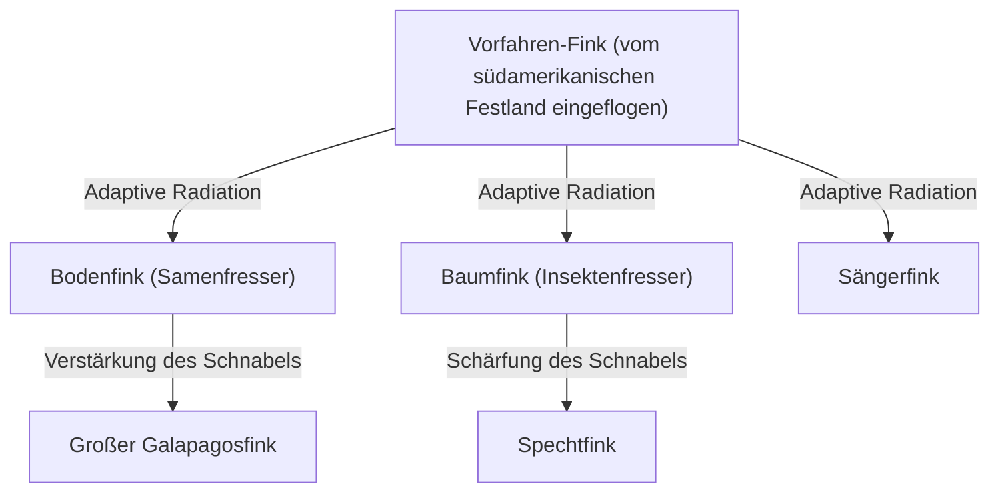
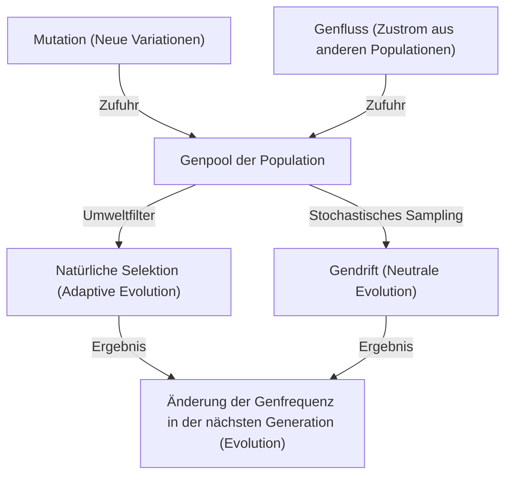

## Einführung: Die Vielfalt des Lebens und Darwins Revolution

Am 24. November 1859 veröffentlichte Charles Darwin *Über die Entstehung der Arten* (On the Origin of Species), ein historisches Werk, das nicht nur die Biologie, sondern das Weltbild der Menschheit grundlegend veränderte. Dem bis dahin geltenden kreationistischen Paradigma, dass „alle Arten einzeln von Gott erschaffen wurden und unveränderlich sind“, stellte Darwin seine Evolutionstheorie gegenüber, die auf dem Mechanismus der „natürlichen Selektion“ (Natural Selection) basiert.

In diesem Artikel werden wir im Detail untersuchen, wie Darwins Evolutionstheorie entstand, welche logische Struktur den Kern seiner Theorie der natürlichen Selektion bildet, wie die moderne Populationsgenetik (Neodarwinismus) sie mathematisch untermauert und wie wir einen evolutionären Prozess als genetischen Algorithmus mit Python implementieren können.

## 1. Historischer Hintergrund: Die Reise der Beagle und die Idee

Von 1831 bis 1836 nahm Charles Darwin als Naturforscher an einer Weltumsegelung auf dem britischen Vermessungsschiff HMS Beagle teil. Besonders seine Beobachtungen auf den Galapagosinseln hatten einen entscheidenden Einfluss auf sein Denken.

### Die Vielfalt der Darwinfinken

Auf den Galapagosinseln lebten Finken (die heute zur Familie der Tangaren gezählt werden) mit unterschiedlich geformten Schnäbeln, je nach Insel. Ihre Schnäbel hatten sich je nach Ernährung spezialisiert: einige fraßen Kakteen, andere Insekten und wieder andere knackten Samen.



Darwin kam zu dem Schluss, dass diese Finken von einem gemeinsamen Vorfahren abstammten und sich als Ergebnis der Anpassung an die jeweilige Inselumgebung differenziert hatten.

## 2. Die logische Struktur der Theorie der natürlichen Selektion

Darwins Theorie der natürlichen Selektion basiert auf den folgenden drei Beobachtungen und zwei Schlussfolgerungen.

1. **Überproduktion (Overproduction)**: Organismen produzieren mehr Nachkommen, als die Umwelt erhalten kann.
2. **Individuelle Variation (Variation)**: Auch innerhalb derselben Art gibt es Unterschiede (Variationen) in Form und Eigenschaften zwischen den Individuen.
3. **Vererbung (Inheritance)**: Einige dieser Variationen werden von den Eltern an die Nachkommen vererbt.

Der daraus abgeleitete Mechanismus ist die **natürliche Selektion (Natural Selection)**. Im Kampf ums Überleben überleben diejenigen Individuen, die Merkmale besitzen, die besser an die Umwelt angepasst sind, und hinterlassen mehr Nachkommen. Indem sich dies über Generationen wiederholt, verändert sich die gesamte Art in eine Richtung, in der sie an ihre Umwelt angepasst ist.

### Mathematische Definition der Fitness

In der modernen Populationsgenetik wird die natürliche Selektion durch das Konzept der „Fitness“ (Fitness) mathematisiert. Die Fitness $W$ ist definiert als die relative Anzahl von Nachkommen, die ein bestimmter Genotyp an die nächste Generation weitergibt.

$$ \Delta p = \frac{p q [p(W_{11} - W_{12}) + q(W_{12} - W_{22})]}{\bar{W}} $$

Hierbei ist,
- $p, q$ die Frequenz der Allele $A, a$
- $W_{11}, W_{12}, W_{22}$ die Fitness jedes Genotyps ($AA, Aa, aa$)
- $\bar{W}$ die durchschnittliche Fitness der Population ($\bar{W} = p^2 W_{11} + 2pq W_{12} + q^2 W_{22}$)

Diese Gleichung zeigt, dass sich die Genfrequenz in Richtung einer Erhöhung der durchschnittlichen Fitness ändert, was Darwins natürliche Selektion mathematisch beweist.

## 3. Entwicklung zur synthetischen Evolutionstheorie (Neodarwinismus)

Zu Darwins Zeit war der „Mechanismus der Vererbung“, wie Variationen entstehen und vererbt werden, unbekannt (die Mendelschen Regeln wurden erst 1900 wiederentdeckt).

In den 1930er und 40er Jahren wurden Darwins Theorie der natürlichen Selektion und Mendels Genetik sowie die Populationsgenetik und Paläontologie zur „synthetischen Evolutionstheorie“ (Modern Synthesis) zusammengeführt. Ronald Fisher, J.B.S. Haldane und Sewall Wright legten das mathematische Fundament.

### Die 4 treibenden Kräfte der Evolution

In der modernen Biologie werden die folgenden vier Faktoren als Ursachen der Evolution (Änderung der Allelfrequenz innerhalb einer Population) genannt.

1. **Natürliche Selektion (Natural Selection)**
2. **Mutation (Mutation)**: Bereitstellung neuer Allele durch Fehler bei der DNA-Replikation usw.
3. **Gendrift (Genetic Drift)**: Zufällige Schwankungen der Genfrequenz in einer endlichen Population.
4. **Genfluss (Gene Flow)**: Hybridisierung von Genen durch die Migration von Individuen zwischen Populationen.



## 4. Natürliche Selektion durch Programmierung erleben: Genetische Algorithmen

Der Mechanismus der Evolution wird in der Technik als Berechnungsmethode zur Lösung von Optimierungsproblemen angewendet, der „genetische Algorithmus“ (Genetic Algorithm, GA). Hier implementieren wir eine einfache Simulation mit Python, um die Zeichenfolge „DARWIN“ durch Evolution zu generieren.

```python
import random
import string

TARGET = "DARWIN"
POP_SIZE = 100
MUTATION_RATE = 0.05

def random_string(length):
    return ''.join(random.choice(string.ascii_uppercase) for _ in range(length))

def calculate_fitness(individual):
    # Die Anzahl der übereinstimmenden Zeichen mit dem Ziel-String ist die Fitness
    return sum(1 for a, b in zip(individual, TARGET) if a == b)

def crossover(parent1, parent2):
    mid = len(TARGET) // 2
    return parent1[:mid] + parent2[mid:]

def mutate(individual):
    res = list(individual)
    for i in range(len(res)):
        if random.random() < MUTATION_RATE:
            res[i] = random.choice(string.ascii_uppercase)
    return "".join(res)

# Generierung der Startpopulation
population = [random_string(len(TARGET)) for _ in range(POP_SIZE)]

generation = 0
while True:
    population.sort(key=calculate_fitness, reverse=True)
    best = population[0]
    
    print(f"Generation {generation}: {best} (Fitness: {calculate_fitness(best)})")
    
    if best == TARGET:
        print("Evolution complete!")
        break
        
    # Elitenauswahl und Generierung der nächsten Generation
    next_gen = population[:10]  # Die Top 10 mit der höchsten Fitness bleiben erhalten
    
    while len(next_gen) < POP_SIZE:
        # Eltern zufällig auswählen, um Kreuzung und Mutation durchzuführen
        p1, p2 = random.choices(population[:50], k=2)
        child = mutate(crossover(p1, p2))
        next_gen.append(child)
        
    population = next_gen
    generation += 1
```

Dieser Code beginnt mit einer Population von zufälligen Zeichenfolgen. Individuen, die dem Ziel „DARWIN“ am nächsten sind (hohe Fitness), werden ausgewählt und bilden durch Kreuzung und Mutation die nächste Generation. Sie sollten feststellen können, dass sich der Ziel-String innerhalb weniger Generationen durch „Evolution“ herausbildet.

## 5. Fazit und die Evolutionstheorie heute

Darwins *Über die Entstehung der Arten* zeigte, dass Organismen keine statischen Entitäten sind, sondern sich in einer dynamischen und kontinuierlichen Geschichte befinden. Heute hat die DNA-Sequenzanalyse (molekulare Phylogenie) bewiesen, dass alles Leben von einem gemeinsamen Vorfahren (LUCA: Last Universal Common Ancestor) abstammt.

Die Evolutionstheorie ist nicht nur eine „Hypothese“, sondern ein riesiges Paradigma, das die gesamte moderne Biologie integriert. Wie der Evolutionsgenetiker Theodosius Dobzhansky sagte: „Nichts in der Biologie ergibt einen Sinn außer im Licht der Evolution“ (Nothing in Biology Makes Sense Except in the Light of Evolution).
