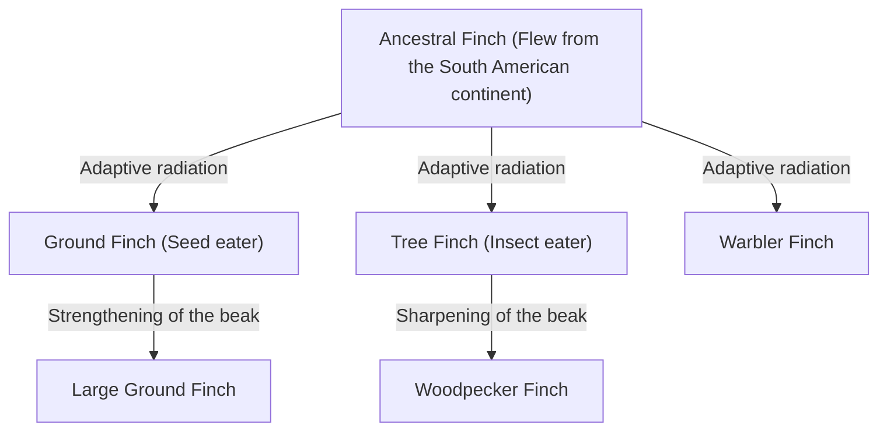
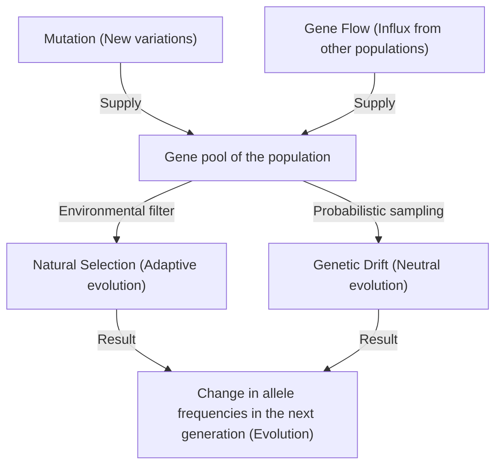

## Introduction: The Diversity of Life and Darwin's Revolution

On November 24, 1859, Charles Darwin published "On the Origin of Species", a historic work that fundamentally overturned not only biology but the worldview of humanity itself. Against the creationist paradigm up to that point, which held that "all species were individually created by God and are immutable", Darwin proposed a theory of evolution based on the mechanism of "Natural Selection".

In this article, we will delve deeply into how Darwin's theory of evolution was formed, the logical structure of natural selection at its core, its mathematical backing by modern population genetics (Neo-Darwinism), and even the implementation of a genetic algorithm as an analogy of the evolutionary process using Python.

## 1. Historical Background: The Voyage of the Beagle and Inspiration

From 1831 to 1836, Charles Darwin sailed around the world aboard the Royal Navy survey ship HMS Beagle as a naturalist. His observations in the Galapagos Islands, in particular, had a decisive impact on his thinking.

### The Diversity of Darwin's Finches

In the Galapagos Islands, there lived finches (now classified in the tanager family, Thraupidae) with differently shaped beaks depending on the island. Their beaks were specialized according to their diet, such as those that eat cacti, insects, or crush seeds.



Darwin thought that these finches differentiated from a common ancestor and adapted to the environment of their respective islands.

## 2. Logical Structure of the Theory of Natural Selection

Darwin's theory of natural selection consists of the following three observational facts and two inferences.

1. **Overproduction**: Organisms leave more offspring than the environment can support.
2. **Variation**: Even within the same species, there are differences (variations) in morphology and traits among individuals.
3. **Inheritance**: Some of these variations are inherited from parents to offspring.

The mechanism derived from this is **Natural Selection**. In the struggle for existence (competition), individuals with traits better adapted to the environment survive and leave more offspring. As this is repeated over generations, the species as a whole changes in a direction adapted to the environment.

### Mathematical Definition of Fitness

In modern population genetics, natural selection is formalized by the concept of "Fitness". Fitness $W$ is defined as the relative number of offspring a certain genotype leaves to the next generation.

$$ \Delta p = \frac{p q [p(W_{11} - W_{12}) + q(W_{12} - W_{22})]}{\bar{W}} $$

Here,
- $p, q$ are the frequencies of alleles $A, a$
- $W_{11}, W_{12}, W_{22}$ are the fitnesses of each genotype ($AA, Aa, aa$)
- $\bar{W}$ is the mean fitness of the population ($\bar{W} = p^2 W_{11} + 2pq W_{12} + q^2 W_{22}$)

This equation shows that the allele frequency changes in a direction that increases the average fitness, and is a mathematical proof of Darwin's natural selection.

## 3. Development into the Modern Synthesis (Neo-Darwinism)

In Darwin's time, the "mechanism of inheritance" regarding how variations arise and are inherited was unknown (Mendel's laws were rediscovered in 1900).

From the 1930s to the 40s, Darwin's theory of natural selection and Mendelian genetics, along with population genetics, paleontology, etc., merged to establish the "Modern Synthesis". Ronald Fisher, J.B.S. Haldane, Sewall Wright, and others laid the mathematical foundations.

### Four Factors that Drive Evolution

In modern biology, the following four factors are cited as causes of evolution (changes in allele frequencies within a population).

1. **Natural Selection**
2. **Mutation**: Supply of new alleles due to DNA replication errors, etc.
3. **Genetic Drift**: Fluctuations in allele frequencies due to chance in a finite population.
4. **Gene Flow**: Hybridization of genes due to the movement of individuals between populations.



## 4. Experiencing Natural Selection through Programming: Genetic Algorithms

The mechanism of evolution has been applied to engineering as a "Genetic Algorithm (GA)", a computational method for solving optimization problems. Here, let's implement a simple simulation using Python to generate the string "DARWIN" through evolution.

```python
import random
import string

TARGET = "DARWIN"
POP_SIZE = 100
MUTATION_RATE = 0.05

def random_string(length):
    return ''.join(random.choice(string.ascii_uppercase) for _ in range(length))

def calculate_fitness(individual):
    # The fitness is the number of characters that match the target string
    return sum(1 for a, b in zip(individual, TARGET) if a == b)

def crossover(parent1, parent2):
    mid = len(TARGET) // 2
    return parent1[:mid] + parent2[mid:]

def mutate(individual):
    res = list(individual)
    for i in range(len(res)):
        if random.random() < MUTATION_RATE:
            res[i] = random.choice(string.ascii_uppercase)
    return "".join(res)

# Generation of the initial population
population = [random_string(len(TARGET)) for _ in range(POP_SIZE)]

generation = 0
while True:
    population.sort(key=calculate_fitness, reverse=True)
    best = population[0]
    
    print(f"Generation {generation}: {best} (Fitness: {calculate_fitness(best)})")
    
    if best == TARGET:
        print("Evolution complete!")
        break
        
    # Elite selection and generation of the next generation
    next_gen = population[:10]  # Keep the top 10 with high fitness as is
    
    while len(next_gen) < POP_SIZE:
        # Randomly select parents and perform crossover and mutation
        p1, p2 = random.choices(population[:50], k=2)
        child = mutate(crossover(p1, p2))
        next_gen.append(child)
        
    population = next_gen
    generation += 1
```

This code starts with a population of random strings, selects individuals close to the target "DARWIN" (high fitness), and mimics the process of forming the next generation through crossover and mutation. You should be able to confirm that the target string "evolves" and appears within a few generations.

## 5. Conclusion and the Present of the Theory of Evolution

Darwin's "On the Origin of Species" showed that organisms are not static entities, but exist within a dynamic and continuous history. Today, DNA sequence analysis (molecular phylogenetics) has proven that all life diverged from a common ancestor (LUCA: Last Universal Common Ancestor).

The theory of evolution is not a mere "hypothesis", but a massive paradigm that integrates all of modern biology. As the evolutionary geneticist Theodosius Dobzhansky stated, "Nothing in Biology Makes Sense Except in the Light of Evolution".
