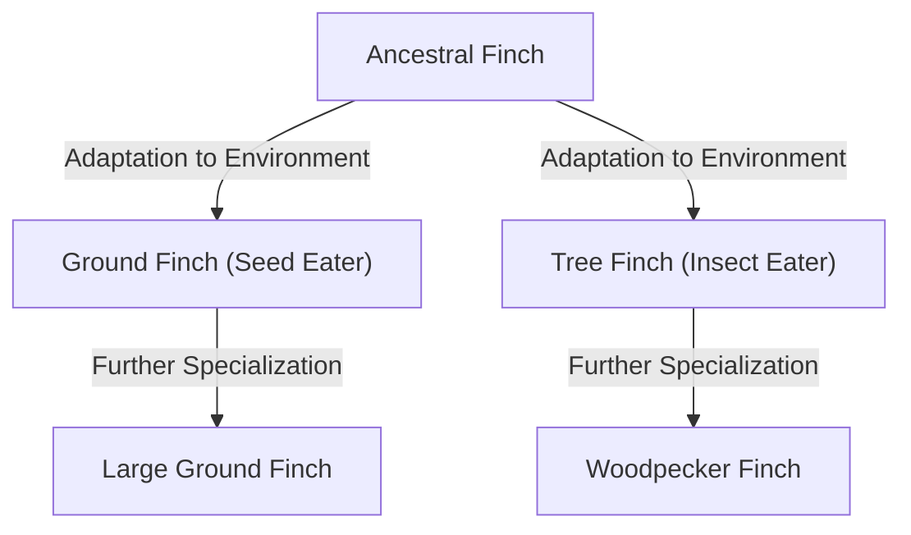

## Introduction: The Diversity of Life and Darwin's Revolution

Published on November 24, 1859, Charles Darwin's "On the Origin of Species" became a historical work that fundamentally overturned not only biology but also humanity's entire worldview. In contrast to the creationist paradigm of the time, which held that "all species were individually created by God and are immutable," Darwin proposed a theory of evolution based on the mechanism of "Natural Selection."

This article details how Darwin's theory of evolution was formed, the logical structure of its core theory of natural selection, its position in modern biology, and the impact it had on society.

## 1. Historical Background: The Voyage of the Beagle and Inspiration

From 1831 to 1836, Charles Darwin sailed around the world as a naturalist on the British Royal Navy survey ship HMS Beagle. This voyage, which included surveying the coast of the South American continent and visiting islands in the Pacific Ocean, had a decisive influence on his thinking.

### Observations in the Galapagos Islands

He gained particularly profound inspiration from his observations in the Galapagos Islands, located off the coast of Ecuador in South America. These isolated islands were home to many uniquely evolved flora and fauna.

The famous "Galapagos finches" (small birds classified in the tanager family) had different beak shapes depending on the island. Their beaks were specialized according to their diet, such as those that fed primarily on cactus, those that preyed on insects, and those that crushed and ate hard seeds.

Darwin thought that these finches diverged from a common ancestor that had migrated from the South American continent, and that this was the result of their adapting to the environments of their respective islands. This later led to the concept of "adaptive radiation."

## 2. Logical Structure of the Theory of Natural Selection

The core of Darwin's theory of evolution lies in its explanation of the mechanism of "how evolution occurs." This is the "theory of natural selection." This theory mainly consists of the following observed facts and inferences.

### Variation and Heredity

Even within the same species, there are differences in morphology and traits between individuals (individual variation). And some of these variations are inherited from parent to offspring. Although Darwin at the time did not know about the mechanisms of heredity (DNA and genes), he recognized this fact as an empirical rule.

### Struggle for Existence and Survival of the Fittest

Organisms usually try to leave behind more offspring than the environment can support (over-reproduction). However, because resources such as food and habitat are limited, a struggle for existence occurs between individuals.

In this competition, individuals with more advantageous traits (variations) under specific environments are more likely to survive and leave more offspring. This is the "survival of the fittest."

### Changes Across Generations

As advantageous traits are passed down across generations, the proportion of individuals with those traits gradually increases within the population. He thought that as this process is repeated over a long period of time, the entire species changes in a direction adapted to the environment, ultimately leading to the formation of new species.

## 3. The Impact of "On the Origin of Species"

Darwin's "On the Origin of Species" had an immeasurable impact on the society of his time.

### Scientific Paradigm Shift

Biology up to that point was centered on taxonomy and predicated on the immutability of species. However, Darwin's theory of evolution presented the concept of a "tree of life" where all organisms branched out and evolved from a common ancestor, transforming biology into a dynamic science with a historical perspective.

### Impact on Religion and Philosophy

The assertion that "humans are also the product of evolution, just like other animals" directly clashed with the Christian view of humanity (the doctrine that humans were specially created in the image of God). As a result, it faced fierce backlash from religious circles, and the controversy over the acceptance of evolution continues in some regions even today.

On the other hand, it also affected fields like philosophy and social sciences, giving rise to ideologies such as Social Darwinism, which attempted to apply the concept of natural selection to competition and inequality in human society (this differed from Darwin's own intentions and later drew much criticism).

## 4. Development into Modern Evolutionary Biology (Neo-Darwinism)

The mechanisms of heredity, which were unknown in Darwin's time, were revealed in the 20th century by the rediscovery of Gregor Mendel's laws of inheritance and the elucidation of the structure of DNA.

### Integration of Mutation and Natural Selection

In modern evolutionary biology (Modern Synthesis, Neo-Darwinism), the process of evolution is explained as follows:

1. **Mutation**: New genetic variations arise by chance due to errors in DNA replication, etc.
2. **Natural Selection**: Advantageous variations adapted to the environment work advantageously for survival and reproduction, spreading within the population.
3. **Genetic Drift**: Gene frequencies fluctuate due to random factors (especially prominent in small populations).
4. **Isolation**: Geographic or reproductive isolation cuts off gene flow between populations, promoting speciation.

In this way, Darwin's theory of natural selection has merged with the findings of modern genetics and molecular biology, forming the foundation of modern life sciences as a more robust scientific theory.

## Conclusion: What the Theory of Evolution Teaches Us

Darwin's theory of evolution is not merely an academic theory of the past. Even today, the perspective of evolution is indispensable in various fields, such as the emergence of antibiotic-resistant bacteria, the mutation of viruses, the selective breeding of crops, and the understanding of the proliferation mechanisms of cancer cells.

"It is not the strongest of the species that survives, nor the most intelligent that survives. It is the one that is most adaptable to change." —— Although this quote is said not to be Darwin's own statement, it is widely known as a brilliant expression that hits the essence of the theory of natural selection.

The history of life is a history of adaptation to constant environmental changes. The perspective of evolution pioneered by Darwin remains one of the most powerful lenses through which we can understand the diversity and complexity of life.
