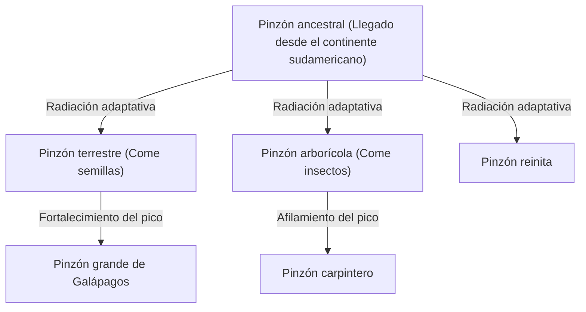
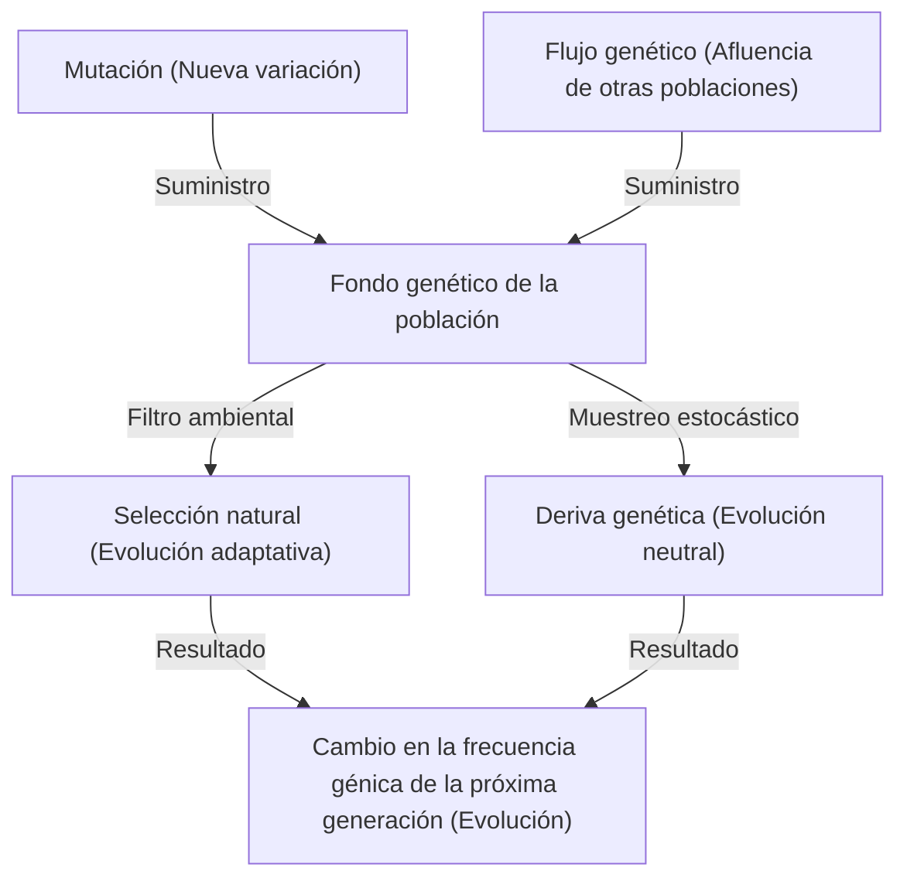

## Introducción: La diversidad de la vida y la revolución de Darwin

El 24 de noviembre de 1859, la publicación de "El origen de las especies (On the Origin of Species)" por Charles Darwin se convirtió en una obra histórica que cambió fundamentalmente no solo la biología, sino también la visión del mundo de la humanidad. En contraste con el paradigma creacionista anterior de que "todas las especies fueron creadas individualmente por Dios y son inmutables", Darwin propuso una teoría de la evolución basada en el mecanismo de "Selección Natural (Natural Selection)".

En este artículo, profundizaremos en gran detalle en cómo se formó la teoría de la evolución de Darwin, la estructura lógica de la teoría de la selección natural que es su núcleo, el respaldo matemático de la genética de poblaciones moderna (Neodarwinismo), y la implementación de algoritmos genéticos como una analogía del proceso evolutivo utilizando Python.

## 1. Antecedentes históricos: El viaje del Beagle y la inspiración

Charles Darwin navegó alrededor del mundo como naturalista en el barco de exploración naval británico HMS Beagle desde 1831 hasta 1836. Sus observaciones, particularmente en las Islas Galápagos, tuvieron un impacto decisivo en su pensamiento.

### La diversidad de los pinzones de Galápagos

Las Islas Galápagos estaban habitadas por pinzones (ahora clasificados en la familia Thraupidae) con formas de pico diferentes en cada isla. Sus picos se habían especializado según sus dietas, como los que comían cactus, los que comían insectos y los que aplastaban semillas.



Darwin pensó que estos pinzones se habían diferenciado de un ancestro común y eran el resultado de adaptarse al entorno de cada isla respectiva.

## 2. Estructura lógica de la teoría de la selección natural

La teoría de la selección natural de Darwin consta de los siguientes tres hechos observacionales y dos inferencias.

1. **Sobreproducción (Overproduction)**: Los organismos dejan más descendencia de la que el medio ambiente puede soportar.
2. **Variación individual (Variation)**: Incluso dentro de la misma especie, existen diferencias (variaciones) en forma y propiedades entre los individuos.
3. **Herencia (Inheritance)**: Algunas de estas variaciones se heredan de padres a hijos.

El mecanismo derivado de esto es la **Selección Natural (Natural Selection)**. En la lucha por la existencia (competencia), los individuos con rasgos mejor adaptados al medio ambiente sobreviven y dejan más descendencia. A medida que esto se repite a lo largo de las generaciones, toda la especie cambia en una dirección que se adapta al medio ambiente.

### Definición matemática de aptitud

En la genética de poblaciones moderna, la selección natural se formula con el concepto de "Aptitud (Fitness)". La aptitud $W$ se define como el número relativo de descendientes que un genotipo deja a la siguiente generación.

$$ \Delta p = \frac{p q [p(W_{11} - W_{12}) + q(W_{12} - W_{22})]}{\bar{W}} $$

Aquí,
- $p, q$ son las frecuencias de los alelos $A, a$
- $W_{11}, W_{12}, W_{22}$ son las aptitudes de cada genotipo ($AA, Aa, aa$)
- $\bar{W}$ es la aptitud media de la población ($\bar{W} = p^2 W_{11} + 2pq W_{12} + q^2 W_{22}$)

Esta ecuación muestra que la frecuencia alélica cambia en una dirección que aumenta la aptitud media, demostrando matemáticamente la selección natural de Darwin.

## 3. Desarrollo hacia la Síntesis Moderna (Neodarwinismo)

En la época de Darwin, se desconocía el "mecanismo de la herencia", es decir, cómo ocurrían las variaciones y cómo se heredaban (las leyes de Mendel no fueron redescubiertas hasta 1900).

Desde la década de 1930 hasta la de 1940, la teoría de la selección natural de Darwin y la genética de Mendel se integraron, junto con la genética de poblaciones, la paleontología y otras, para establecer la "Síntesis Moderna (Modern Synthesis)". Ronald Fisher, J.B.S. Haldane y Sewall Wright sentaron las bases matemáticas.

### Cuatro factores que impulsan la evolución

En la biología moderna, los siguientes cuatro factores se citan como causas de la evolución (cambios en las frecuencias alélicas dentro de una población).

1. **Selección Natural (Natural Selection)**
2. **Mutación (Mutation)**: Suministro de nuevos alelos debido a errores de replicación del ADN, etc.
3. **Deriva Genética (Genetic Drift)**: Fluctuaciones en la frecuencia génica debido al azar en poblaciones finitas.
4. **Flujo Genético (Gene Flow)**: Hibridación de genes debido al movimiento de individuos entre poblaciones.



## 4. Experimentando la selección natural con programación: Algoritmo genético

El mecanismo de la evolución se aplica en la ingeniería como un método computacional para resolver problemas de optimización, conocido como "Algoritmo Genético (Genetic Algorithm, GA)". Aquí, implementemos una simulación simple usando Python para generar la cadena "DARWIN" a través de la evolución.

```python
import random
import string

TARGET = "DARWIN"
POP_SIZE = 100
MUTATION_RATE = 0.05

def random_string(length):
    return ''.join(random.choice(string.ascii_uppercase) for _ in range(length))

def calculate_fitness(individual):
    # El número de caracteres que coinciden con la cadena objetivo se considera la aptitud
    return sum(1 for a, b in zip(individual, TARGET) if a == b)

def crossover(parent1, parent2):
    mid = len(TARGET) // 2
    return parent1[:mid] + parent2[mid:]

def mutate(individual):
    res = list(individual)
    for i in range(len(res)):
        if random.random() < MUTATION_RATE:
            res[i] = random.choice(string.ascii_uppercase)
    return "".join(res)

# Generación de la población inicial
population = [random_string(len(TARGET)) for _ in range(POP_SIZE)]

generation = 0
while True:
    population.sort(key=calculate_fitness, reverse=True)
    best = population[0]
    
    print(f"Generation {generation}: {best} (Fitness: {calculate_fitness(best)})")
    
    if best == TARGET:
        print("Evolution complete!")
        break
        
    # Selección de élite y generación de la próxima generación
    next_gen = population[:10]  # Conservar el top 10 con mayor aptitud tal cual
    
    while len(next_gen) < POP_SIZE:
        # Elegir padres al azar y realizar cruce y mutación
        p1, p2 = random.choices(population[:50], k=2)
        child = mutate(crossover(p1, p2))
        next_gen.append(child)
        
    population = next_gen
    generation += 1
```

Este código imita un proceso en el que partimos de una población de cadenas aleatorias, se seleccionan los individuos más cercanos al objetivo "DARWIN" (mayor aptitud), y forman la próxima generación a través del cruce y la mutación. Deberías poder ver que la cadena objetivo "evoluciona" y aparece en unas pocas generaciones.

## 5. Conclusión y el estado actual de la teoría de la evolución

"El origen de las especies" de Darwin demostró que los organismos no son entidades estáticas, sino que se encuentran en una historia dinámica y continua. Hoy en día, a través del análisis de la secuencia de bases del ADN (filogenética molecular), se ha demostrado que toda la vida se ha diversificado a partir de un ancestro común (LUCA: Last Universal Common Ancestor).

La teoría de la evolución no es una mera "hipótesis", sino un paradigma masivo que unifica toda la biología moderna. Como afirmó el genetista evolutivo Theodosius Dobzhansky: "Nada en biología tiene sentido excepto a la luz de la evolución (Nothing in Biology Makes Sense Except in the Light of Evolution)".
