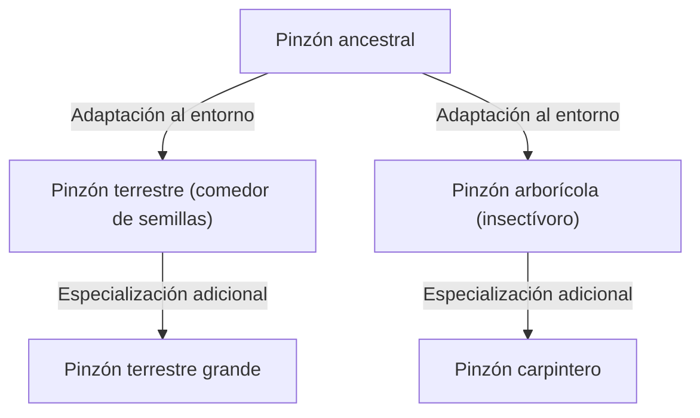

## Introducción: La diversidad de la vida y la revolución de Darwin

El 24 de noviembre de 1859, la publicación de "El origen de las especies" (On the Origin of Species) por Charles Darwin se convirtió en una obra histórica que revolucionó fundamentalmente no solo la biología, sino la visión del mundo de la humanidad en sí. Frente al paradigma creacionista predominante de que "todas las especies fueron creadas individualmente por Dios y son inmutables", Darwin propuso una teoría de la evolución basada en el mecanismo de la "selección natural" (Natural Selection).

En este artículo, explicaremos en detalle cómo se formó la teoría de la evolución de Darwin, la estructura lógica de su núcleo, la teoría de la selección natural, su posición en la biología moderna y el impacto que ha tenido en la sociedad.

## 1. Antecedentes históricos: El viaje del Beagle y la inspiración

Charles Darwin se embarcó como naturalista en el barco de exploración de la Marina Real Británica, el HMS Beagle, realizando un viaje alrededor del mundo entre 1831 y 1836. Este viaje, que incluyó estudios costeros del continente sudamericano y visitas a islas del Océano Pacífico, tuvo una influencia decisiva en su pensamiento.

### Observaciones en las Islas Galápagos

Donde obtuvo una inspiración particularmente grande fue a través de sus observaciones en las Islas Galápagos, ubicadas frente a la costa de Ecuador en América del Sur. En estas islas aisladas, habitaban numerosas plantas y animales que habían experimentado una evolución única.

Los famosos "pinzones de Galápagos" (pequeñas aves clasificadas en la familia Thraupidae) tenían picos de formas diferentes en cada isla. Sus picos se habían especializado según su dieta, como aquellos que se alimentaban principalmente de cactus, los que depredaban insectos y los que rompían y comían semillas duras.

Darwin pensó que estos pinzones divergieron de un ancestro común que cruzó desde el continente sudamericano y fueron el resultado de la adaptación al entorno de cada isla respectiva. Esto condujo al concepto posterior de "radiación adaptativa".

## 2. La estructura lógica de la teoría de la selección natural

El núcleo de la teoría de la evolución de Darwin radica en explicar el mecanismo de "cómo ocurre la evolución". Esta es la "teoría de la selección natural". Esta teoría se compone principalmente de los siguientes hechos de observación e inferencias.

### Variación y herencia

Incluso dentro de la misma especie, existen diferencias en forma y características (variación individual) entre los individuos. Y algunas de esas variaciones se heredan de padres a hijos. Aunque Darwin no conocía los mecanismos de la herencia (ADN y genes) en ese momento, reconoció este hecho como una regla empírica.

### Lucha por la existencia y supervivencia del más apto

Los organismos normalmente intentan dejar más descendencia de la que el entorno puede soportar (superpoblación). Sin embargo, debido a que los recursos como los alimentos y el hábitat son limitados, se produce una lucha por la existencia entre los individuos.

En esta competencia, los individuos con características (variaciones) más ventajosas en un entorno particular tienen más probabilidades de sobrevivir y pueden dejar más descendencia. Esto es la "supervivencia del más apto".

### Cambios a través de las generaciones

A medida que las características ventajosas se transmiten de generación en generación, la proporción de individuos con esas características aumenta gradualmente dentro de la población. Consideró que al repetirse este proceso a lo largo de muchos años, toda la especie cambia hacia la adaptación al entorno, formándose finalmente nuevas especies.

## 3. El impacto de "El origen de las especies"

"El origen de las especies" de Darwin tuvo un impacto incalculable en la sociedad de la época.

### Cambio de paradigma científico

La biología hasta ese momento se centraba en la taxonomía y asumía la inmutabilidad de las especies. Sin embargo, la teoría de la evolución de Darwin presentó el concepto del "árbol de la vida", en el cual todos los organismos evolucionaron ramificándose desde un ancestro común, transformando la biología en una ciencia dinámica con una perspectiva histórica.

### Impacto en la religión y la filosofía

La afirmación de que "los humanos también son un producto de la evolución al igual que otros animales" chocaba frontalmente con la visión cristiana del ser humano (la doctrina de que los humanos fueron creados especialmente a imagen de Dios). Por esta razón, enfrentó una fuerte oposición de los círculos religiosos, y las controversias sobre la aceptación de la teoría de la evolución continúan hoy en algunas regiones.

Por otro lado, también influyó en los campos de la filosofía y las ciencias sociales, dando lugar a pensamientos como el darwinismo social, que intentaba aplicar el concepto de selección natural a la competencia y la desigualdad en las sociedades humanas (esto difería de las intenciones del propio Darwin y más tarde enfrentaría muchas críticas).

## 4. Desarrollo hacia la biología evolutiva moderna (Neodarwinismo)

El mecanismo de la herencia, desconocido en la época de Darwin, quedó claro en el siglo XX a través del redescubrimiento de las leyes de la herencia de Gregor Mendel y la elucidación de la estructura del ADN.

### Integración de la mutación y la selección natural

En la biología evolutiva moderna (teoría sintética, neodarwinismo), el proceso de evolución se explica de la siguiente manera:

1. **Mutación**: Surgen nuevas variaciones genéticas por casualidad debido a errores en la replicación del ADN, etc.
2. **Selección natural**: Las variaciones ventajosas adaptadas al entorno favorecen la supervivencia y la reproducción, propagándose dentro de la población.
3. **Deriva genética**: Las frecuencias génicas fluctúan debido a factores fortuitos (especialmente pronunciado en poblaciones pequeñas).
4. **Aislamiento**: Debido al aislamiento geográfico y reproductivo, el intercambio genético entre poblaciones se interrumpe, promoviendo la especiación.

De esta manera, la teoría de la selección natural de Darwin se fusionó con los hallazgos de la genética y la biología molecular modernas, convirtiéndose en la base de las ciencias de la vida modernas como una teoría científica más sólida.

## Conclusión: Lo que nos enseña la teoría de la evolución

La teoría de la evolución de Darwin no es una mera teoría académica del pasado. Incluso hoy en día, la perspectiva evolutiva es indispensable en varios campos, como el surgimiento de bacterias resistentes a los antibióticos, las mutaciones virales, la mejora de cultivos agrícolas e incluso la comprensión de los mecanismos de proliferación de las células cancerosas.

"No es la especie más fuerte la que sobrevive, ni la más inteligente, sino la que mejor responde al cambio". Se dice que esta cita no fue pronunciada por el propio Darwin, pero es ampliamente conocida como una expresión que capta brillantemente la esencia de la teoría de la selección natural.

La historia de la vida es una historia de adaptación a cambios ambientales incesantes. La perspectiva evolutiva en la que Darwin fue pionero sigue siendo una de las lentes más poderosas a través de las cuales entendemos la diversidad y la complejidad de la vida.
