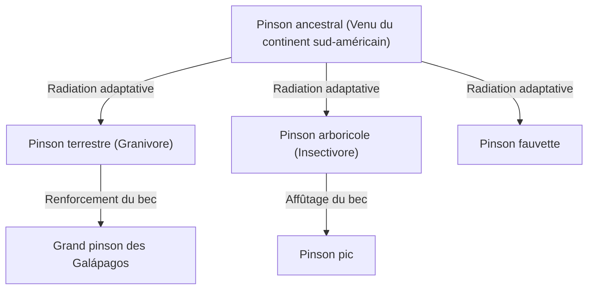
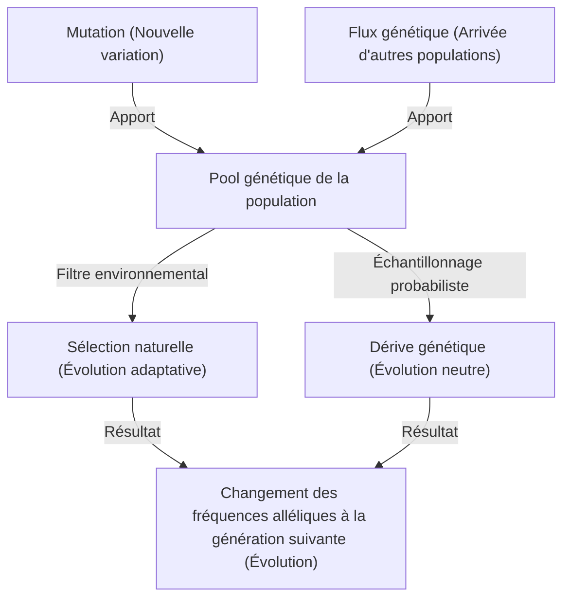

## Introduction : La diversité de la vie et la révolution de Darwin

Le 24 novembre 1859, la publication de *L'Origine des espèces* (On the Origin of Species) par Charles Darwin est devenue une œuvre historique qui a fondamentalement bouleversé non seulement la biologie, mais aussi la vision du monde de l'humanité. Face au paradigme créationniste prédominant selon lequel « toutes les espèces ont été créées individuellement par Dieu et sont immuables », Darwin a proposé une théorie de l'évolution basée sur le mécanisme de la « sélection naturelle » (Natural Selection).

Dans cet article, nous explorerons en profondeur la formation de la théorie de l'évolution de Darwin, la structure logique de la théorie de la sélection naturelle qui en est le cœur, son fondement mathématique issu de la génétique des populations moderne (néo-darwinisme), et enfin l'implémentation d'un algorithme génétique en Python comme analogie du processus évolutif.

## 1. Contexte historique : Le voyage du Beagle et l'inspiration

De 1831 à 1836, Charles Darwin a voyagé autour du monde en tant que naturaliste à bord du navire hydrographique HMS Beagle de la marine britannique. Ses observations dans les îles Galápagos, en particulier, ont eu une influence décisive sur sa pensée.

### La diversité des pinsons des Galápagos

Les îles Galápagos abritaient des pinsons (aujourd'hui classés dans la famille des Thraupidae) dont la forme du bec variait d'une île à l'autre. Ceux qui mangeaient des cactus, ceux qui mangeaient des insectes et ceux qui broyaient des graines présentaient des becs spécialisés selon leur régime alimentaire.



Darwin pensait que ces pinsons avaient divergé à partir d'un ancêtre commun, résultat de leur adaptation à l'environnement de chaque île.

## 2. Structure logique de la théorie de la sélection naturelle

La théorie de la sélection naturelle de Darwin repose sur les trois faits d'observation et les deux déductions suivantes :

1. **Surproduction (Overproduction)** : Les organismes laissent plus de descendants que l'environnement ne peut en supporter.
2. **Variation individuelle (Variation)** : Même au sein d'une même espèce, il existe des différences de forme et de propriétés (variations) entre les individus.
3. **Hérédité (Inheritance)** : Certaines de ces variations se transmettent de parent à enfant.

Le mécanisme qui en découle est la **sélection naturelle (Natural Selection)**. Dans la lutte pour la survie (compétition), les individus possédant des traits mieux adaptés à l'environnement survivent et laissent plus de descendants. C'est la répétition de ce processus sur plusieurs générations qui modifie l'ensemble de l'espèce dans le sens d'une adaptation à l'environnement.

### Définition mathématique de la valeur sélective

Dans la génétique des populations moderne, la sélection naturelle est mathématisée par le concept de « valeur sélective » (Fitness). La valeur sélective $W$ est définie comme le nombre relatif de descendants qu'un génotype particulier laisse à la génération suivante.

$$ \Delta p = \frac{p q [p(W_{11} - W_{12}) + q(W_{12} - W_{22})]}{\bar{W}} $$

Où,
- $p, q$ sont les fréquences des allèles $A, a$
- $W_{11}, W_{12}, W_{22}$ sont les valeurs sélectives de chaque génotype ($AA, Aa, aa$)
- $\bar{W}$ est la valeur sélective moyenne de la population ($\bar{W} = p^2 W_{11} + 2pq W_{12} + q^2 W_{22}$)

Cette équation montre que la fréquence allélique change dans le sens d'une augmentation de la valeur sélective moyenne, prouvant ainsi mathématiquement la sélection naturelle de Darwin.

## 3. Développement de la théorie synthétique (Néo-darwinisme)

À l'époque de Darwin, le « mécanisme de l'hérédité », c'est-à-dire la manière dont les variations se produisent et se transmettent, était inconnu (les lois de Mendel ne seront redécouvertes qu'en 1900).

Entre les années 1930 et 1940, la théorie de la sélection naturelle de Darwin a fusionné avec la génétique de Mendel, la génétique des populations et la paléontologie pour établir la « Synthèse moderne » (Modern Synthesis). Ronald Fisher, J.B.S. Haldane et Sewall Wright en ont jeté les bases mathématiques.

### Les 4 facteurs moteurs de l'évolution

Dans la biologie moderne, les quatre facteurs suivants sont cités comme provoquant l'évolution (changement des fréquences alléliques au sein d'une population) :

1. **Sélection naturelle (Natural Selection)**
2. **Mutation (Mutation)** : Apport de nouveaux allèles suite à des erreurs de réplication de l'ADN, etc.
3. **Dérive génétique (Genetic Drift)** : Fluctuation aléatoire des fréquences alléliques due au hasard dans une population finie.
4. **Flux génétique (Gene Flow)** : Croisement de gènes par la migration d'individus entre les populations.



## 4. Expérimenter la sélection naturelle par la programmation : L'algorithme génétique

Le mécanisme de l'évolution a été appliqué en ingénierie sous la forme d'une méthode de calcul appelée « algorithme génétique » (Genetic Algorithm, GA) pour résoudre des problèmes d'optimisation. Implémentons ici une simulation simple en Python générant la chaîne de caractères « DARWIN » par évolution.

```python
import random
import string

TARGET = "DARWIN"
POP_SIZE = 100
MUTATION_RATE = 0.05

def random_string(length):
    return ''.join(random.choice(string.ascii_uppercase) for _ in range(length))

def calculate_fitness(individual):
    # Le nombre de caractères correspondant à la chaîne cible sert de valeur sélective
    return sum(1 for a, b in zip(individual, TARGET) if a == b)

def crossover(parent1, parent2):
    mid = len(TARGET) // 2
    return parent1[:mid] + parent2[mid:]

def mutate(individual):
    res = list(individual)
    for i in range(len(res)):
        if random.random() < MUTATION_RATE:
            res[i] = random.choice(string.ascii_uppercase)
    return "".join(res)

# Génération de la population initiale
population = [random_string(len(TARGET)) for _ in range(POP_SIZE)]

generation = 0
while True:
    population.sort(key=calculate_fitness, reverse=True)
    best = population[0]
    
    print(f"Generation {generation}: {best} (Fitness: {calculate_fitness(best)})")
    
    if best == TARGET:
        print("Evolution complete!")
        break
        
    # Sélection des élites et création de la génération suivante
    next_gen = population[:10]  # On conserve tels quels les 10 meilleurs
    
    while len(next_gen) < POP_SIZE:
        # Sélection aléatoire des parents, croisement et mutation
        p1, p2 = random.choices(population[:50], k=2)
        child = mutate(crossover(p1, p2))
        next_gen.append(child)
        
    population = next_gen
    generation += 1
```

Ce code imite le processus où, à partir d'une population de chaînes de caractères aléatoires, les individus proches de la cible « DARWIN » (ceux ayant une forte valeur sélective) sont sélectionnés pour former la génération suivante par croisements et mutations. On peut observer l'« évolution » et l'apparition de la chaîne cible en quelques générations.

## 5. Conclusion et état actuel de la théorie de l'évolution

*L'Origine des espèces* de Darwin a montré que les organismes ne sont pas des entités statiques, mais qu'ils s'inscrivent dans une histoire dynamique et continue. Aujourd'hui, l'analyse des séquences d'ADN (phylogénie moléculaire) a prouvé que toute vie a divergé à partir d'un ancêtre commun (LUCA : Last Universal Common Ancestor).

La théorie de l'évolution n'est pas une simple « hypothèse », c'est l'immense paradigme qui unifie l'ensemble de la biologie moderne. Comme l'a déclaré le généticien de l'évolution Theodosius Dobzhansky, « Rien n'a de sens en biologie, si ce n'est à la lumière de l'évolution » (Nothing in Biology Makes Sense Except in the Light of Evolution).
