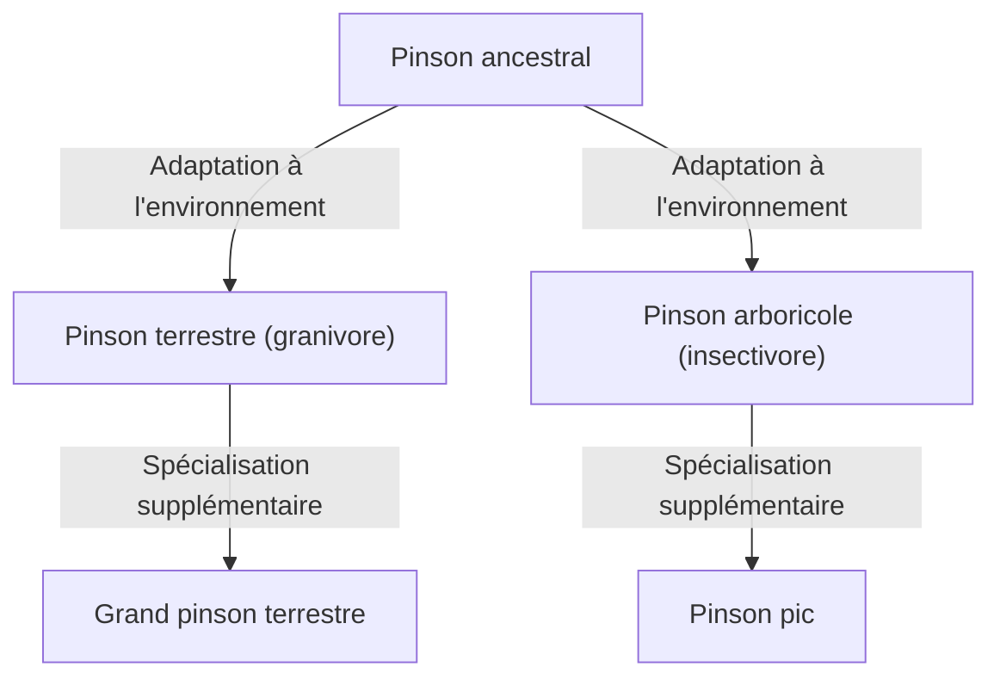

## Introduction : La diversité de la vie et la révolution de Darwin

Publié le 24 novembre 1859, l'ouvrage de Charles Darwin, *L'Origine des espèces* (On the Origin of Species), est devenu une œuvre historique qui a fondamentalement bouleversé non seulement la biologie, mais aussi la vision du monde de l'humanité. Face au paradigme créationniste de l'époque, selon lequel « toutes les espèces ont été créées individuellement par Dieu et sont immuables », Darwin a proposé une théorie de l'évolution basée sur le mécanisme de la « sélection naturelle » (Natural Selection).

Dans cet article, nous expliquerons en détail comment la théorie de l'évolution de Darwin a été élaborée, la structure logique de la théorie de la sélection naturelle qui en est le cœur, sa place dans la biologie moderne et son impact sur la société.

## 1. Contexte historique : Le voyage du Beagle et l'inspiration

Entre 1831 et 1836, Charles Darwin a voyagé autour du monde en tant que naturaliste à bord du HMS Beagle, un navire hydrographique de la Royal Navy. Ce voyage, qui comprenait l'étude côtière du continent sud-américain et la visite des îles du Pacifique, a eu une influence décisive sur sa pensée.

### Observations aux îles Galápagos

C'est lors de ses observations aux îles Galápagos, situées au large de l'Équateur en Amérique du Sud, qu'il a tiré l'une de ses plus grandes inspirations. Ces îles isolées abritaient de nombreuses plantes et animaux ayant connu une évolution unique.

Les célèbres « pinsons des Galápagos » (de petits oiseaux classés dans la famille des Thraupidae) possédaient des becs de formes différentes selon les îles. Leurs becs s'étaient spécialisés en fonction de leur régime alimentaire, qu'ils se nourrissent principalement de cactus, d'insectes ou de graines dures à casser.

Darwin a pensé que ces pinsons s'étaient différenciés à partir d'un ancêtre commun venu du continent sud-américain et s'étaient adaptés à l'environnement de chaque île. Cela conduira plus tard au concept de « radiation adaptative ».

## 2. Structure logique de la théorie de la sélection naturelle

Le cœur de la théorie de l'évolution de Darwin réside dans le fait qu'elle explique le mécanisme de « comment l'évolution se produit ». C'est la « théorie de la sélection naturelle ». Cette théorie repose principalement sur les faits d'observation et les déductions suivantes.

### Variation et hérédité

Même au sein d'une même espèce, il existe des différences de forme et de caractéristiques (variations individuelles) entre les individus. Une partie de ces variations est transmise des parents aux enfants (hérédité). À l'époque, Darwin ne connaissait pas le mécanisme de l'hérédité (l'ADN ou les gènes), mais il reconnaissait ce fait comme une règle empirique.

### Lutte pour l'existence et survie du plus apte

Les organismes tentent généralement de laisser plus de descendants que l'environnement ne peut en supporter (surproduction). Cependant, comme les ressources telles que la nourriture et l'habitat sont limitées, une lutte pour l'existence s'engage entre les individus.

Dans cette compétition, les individus possédant des caractéristiques (variations) plus avantageuses dans un environnement donné ont plus de chances de survivre et de laisser un plus grand nombre de descendants. C'est la « survie du plus apte ».

### Changements au fil des générations

Au fur et à mesure que les traits avantageux sont transmis de génération en génération, la proportion d'individus possédant ces traits augmente progressivement au sein de la population. Darwin pensait que la répétition de ce processus sur de longues périodes entraînait l'adaptation de l'espèce entière à son environnement, aboutissant finalement à la formation de nouvelles espèces.

## 3. L'impact de « L'Origine des espèces »

L'ouvrage de Darwin, *L'Origine des espèces*, a eu un impact incommensurable sur la société de l'époque.

### Changement de paradigme scientifique

La biologie d'alors était centrée sur la taxonomie et partait du principe de l'immuabilité des espèces. Cependant, la théorie de l'évolution de Darwin a présenté le concept d'un « arbre de vie » où tous les êtres vivants ont évolué à partir d'un ancêtre commun en se diversifiant, transformant ainsi la biologie en une science dynamique dotée d'une perspective historique.

### Impact sur la religion et la philosophie

L'affirmation selon laquelle « l'homme est également le produit de l'évolution, tout comme les autres animaux » est entrée en collision frontale avec la vision chrétienne de l'humanité (le dogme selon lequel l'homme a été spécialement créé à l'image de Dieu). De ce fait, elle a suscité une vive opposition de la part des milieux religieux, et la controverse autour de l'acceptation de la théorie de l'évolution se poursuit encore aujourd'hui dans certaines régions.

D'autre part, elle a également influencé les domaines de la philosophie et des sciences sociales, donnant naissance à des idéologies telles que le darwinisme social, qui tenta d'appliquer le concept de sélection naturelle à la concurrence et aux inégalités dans la société humaine (ceci diffère de l'intention de Darwin lui-même et fera l'objet de nombreuses critiques par la suite).

## 4. Développement vers la biologie évolutive moderne (Néo-darwinisme)

Le mécanisme de l'hérédité, inconnu à l'époque de Darwin, a été élucidé au XXe siècle avec la redécouverte des lois de l'hérédité de Gregor Mendel et la découverte de la structure de l'ADN.

### Intégration de la mutation et de la sélection naturelle

Dans la biologie évolutive moderne (théorie synthétique, néo-darwinisme), le processus d'évolution est expliqué de la manière suivante :

1. **Mutation** : De nouvelles variations génétiques apparaissent par hasard, notamment en raison d'erreurs de réplication de l'ADN.
2. **Sélection naturelle** : Les mutations avantageuses, adaptées à l'environnement, favorisent la survie et la reproduction, et se propagent au sein de la population.
3. **Dérive génétique** : La fréquence des gènes fluctue en raison de facteurs aléatoires (particulièrement prononcé dans les petites populations).
4. **Isolement** : L'isolement géographique ou reproductif interrompt le flux génétique entre les populations, favorisant la spéciation.

Ainsi, la théorie de la sélection naturelle de Darwin a fusionné avec les connaissances de la génétique et de la biologie moléculaire modernes pour devenir une théorie scientifique plus solide, formant la base des sciences de la vie contemporaines.

## Conclusion : Ce que nous apprend la théorie de l'évolution

La théorie de l'évolution de Darwin n'est pas simplement une doctrine du passé. Aujourd'hui encore, la perspective évolutive est indispensable dans de nombreux domaines, tels que l'émergence de bactéries résistantes aux antibiotiques, les mutations virales, l'amélioration des cultures agricoles, ou encore la compréhension des mécanismes de prolifération des cellules cancéreuses.

« Ce n'est pas le plus fort de l'espèce qui survit, ni le plus intelligent. C'est celui qui est le plus adaptable au changement. » —— Bien que cette citation ne soit pas de Darwin lui-même, elle est largement reconnue comme une expression saisissant parfaitement l'essence de la théorie de la sélection naturelle.

L'histoire de la vie est une histoire d'adaptation à des changements environnementaux incessants. La perspective évolutive ouverte par Darwin reste l'une des lentilles les plus puissantes pour comprendre la diversité et la complexité de la vie.
