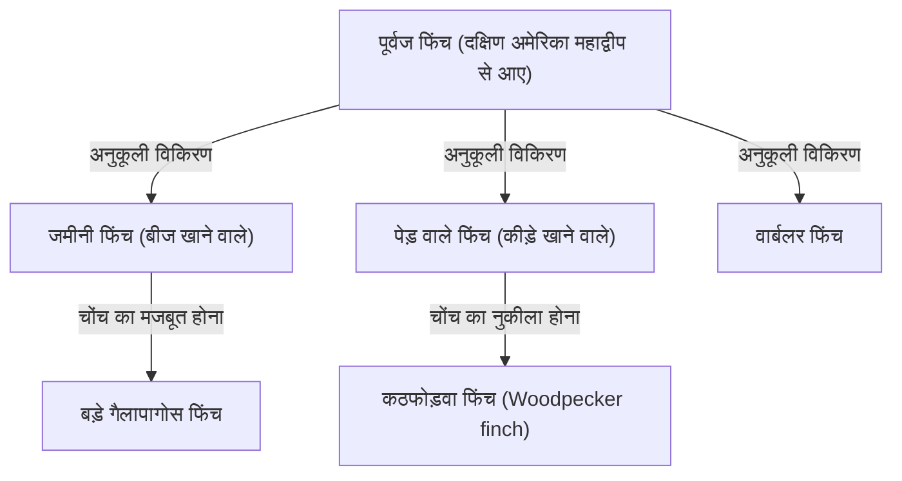
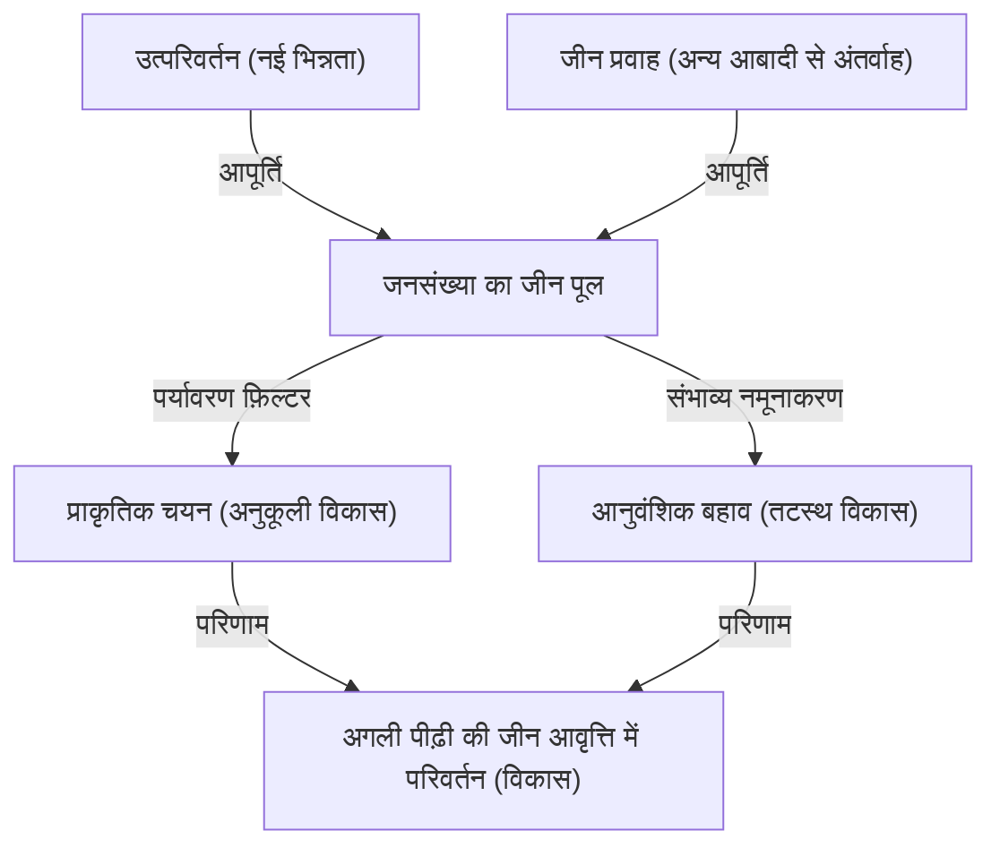

## प्रस्तावना: जीवन की विविधता और डार्विन की क्रांति

24 नवंबर 1859 को, चार्ल्स डार्विन द्वारा प्रकाशित "प्रजातियों की उत्पत्ति (On the Origin of Species)" एक ऐतिहासिक कृति बन गई, जिसने न केवल जीव विज्ञान, बल्कि मानवता के विश्वदृष्टिकोण को भी मूल रूप से बदल दिया। डार्विन ने तब तक चले आ रहे रचनावादी प्रतिमान (कि "सभी प्रजातियों को भगवान द्वारा व्यक्तिगत रूप से बनाया गया है और वे अपरिवर्तनीय हैं") के विपरीत, "प्राकृतिक चयन (Natural Selection)" के तंत्र पर आधारित विकासवाद का सिद्धांत प्रस्तुत किया।

इस लेख में, हम गहराई से चर्चा करेंगे कि डार्विन का विकासवाद कैसे बना, इसके मूल में प्राकृतिक चयन के सिद्धांत की तार्किक संरचना, आधुनिक जनसंख्या आनुवंशिकी (नियो-डार्विनवाद) द्वारा इसका गणितीय समर्थन, और पायथन का उपयोग करके विकासवादी प्रक्रिया के अनुरूप आनुवंशिक एल्गोरिथ्म (Genetic Algorithm) का कार्यान्वयन कैसे होता है।

## 1. ऐतिहासिक पृष्ठभूमि: बीगल जहाज की समुद्री यात्रा और विचार

चार्ल्स डार्विन ने 1831 से 1836 तक ब्रिटिश नौसेना के सर्वेक्षण जहाज एचएमएस बीगल पर एक प्रकृतिवादी के रूप में दुनिया भर की यात्रा की। विशेष रूप से गैलापागोस द्वीप समूह में उनके अवलोकनों ने उनकी सोच पर निर्णायक प्रभाव डाला।

### गैलापागोस फिंच की विविधता

गैलापागोस द्वीप समूह में, फिंच (जिन्हें अब थ्रुपिडे परिवार में वर्गीकृत किया गया है) की अलग-अलग प्रजातियां पाई जाती थीं जिनकी चोंच का आकार हर द्वीप पर अलग था। उनके आहार के अनुसार उनकी चोंच विशेष रूप से अनुकूलित हो गई थी, जैसे कैक्टस खाने वाले, कीड़े खाने वाले, और बीज तोड़ने वाले।



डार्विन ने माना कि ये फिंच एक ही पूर्वज से अलग हुए और अपने-अपने द्वीपों के पर्यावरण के अनुकूल होने के परिणामस्वरूप ऐसे बन गए।

## 2. प्राकृतिक चयन सिद्धांत की तार्किक संरचना

डार्विन का प्राकृतिक चयन का सिद्धांत निम्नलिखित 3 अवलोकन तथ्यों और 2 अनुमानों से बना है।

1. **अत्यधिक प्रजनन (Overproduction)**: जीव पर्यावरण द्वारा समर्थित की जा सकने वाली संख्या से अधिक संताने पैदा करते हैं।
2. **व्यक्तिगत भिन्नता (Variation)**: एक ही प्रजाति में भी, व्यक्तियों के बीच आकार और गुणों में अंतर (भिन्नता) होता है।
3. **वंशानुक्रम (Inheritance)**: इनमें से कुछ भिन्नताएं माता-पिता से बच्चों में स्थानांतरित (विरासत में) होती हैं।

यहाँ से जो तंत्र सामने आता है वह **प्राकृतिक चयन (Natural Selection)** है। अस्तित्व के संघर्ष में, पर्यावरण के अनुकूल गुणों वाले जीव जीवित रहते हैं और अधिक संतानें छोड़ते हैं। जब यह पीढ़ियों तक दोहराया जाता है, तो पूरी प्रजाति पर्यावरण के अनुकूल होने की दिशा में बदल जाती है।

### फिटनेस (अनुकूलन क्षमता) की गणितीय परिभाषा

आधुनिक जनसंख्या आनुवंशिकी में, प्राकृतिक चयन को "फिटनेस (Fitness)" की अवधारणा द्वारा गणितीय रूप में दर्शाया गया है। फिटनेस $W$ को उस सापेक्ष संख्या के रूप में परिभाषित किया जाता है जो एक निश्चित जीनोटाइप अगली पीढ़ी के लिए छोड़ता है।

$$ \Delta p = \frac{p q [p(W_{11} - W_{12}) + q(W_{12} - W_{22})]}{\bar{W}} $$

यहाँ,
- $p, q$ एलील $A, a$ की आवृत्ति हैं
- $W_{11}, W_{12}, W_{22}$ प्रत्येक जीनोटाइप ($AA, Aa, aa$) की फिटनेस हैं
- $\bar{W}$ जनसंख्या की औसत फिटनेस है ($\bar{W} = p^2 W_{11} + 2pq W_{12} + q^2 W_{22}$)

यह समीकरण दर्शाता है कि जीन आवृत्ति औसत फिटनेस बढ़ाने की दिशा में बदलती है, जो डार्विन के प्राकृतिक चयन को गणितीय रूप से सिद्ध करता है।

## 3. आधुनिक संश्लेषण (नियो-डार्विनवाद) का विकास

डार्विन के समय में, "आनुवंशिकता का तंत्र" अज्ञात था कि भिन्नता कैसे उत्पन्न होती है और यह कैसे विरासत में मिलती है (मेंडल के नियमों की पुनर्खोज 1900 में हुई थी)।

1930 और 1940 के दशक के बीच, डार्विन के प्राकृतिक चयन सिद्धांत और मेंडल के आनुवंशिकी के साथ-साथ जनसंख्या आनुवंशिकी और जीवाश्म विज्ञान का विलय हुआ, और "आधुनिक संश्लेषण (Modern Synthesis)" की स्थापना हुई। रोनाल्ड फिशर, जे.बी.एस. हाल्डेन और सीवॉल राइट ने इसकी गणितीय नींव रखी।

### विकास को प्रेरित करने वाले 4 कारक

आधुनिक जीव विज्ञान में, निम्नलिखित 4 कारकों को विकास (जनसंख्या के भीतर एलील आवृत्ति में परिवर्तन) के कारणों के रूप में उद्धृत किया गया है।

1. **प्राकृतिक चयन (Natural Selection)**
2. **उत्परिवर्तन (Mutation)**: डीएनए प्रतिकृति में त्रुटियों आदि के कारण नए एलील की आपूर्ति।
3. **आनुवंशिक बहाव (Genetic Drift)**: एक सीमित आबादी में संयोग से जीन आवृत्ति में उतार-चढ़ाव।
4. **जीन प्रवाह (Gene Flow)**: आबादी के बीच व्यक्तियों की आवाजाही के कारण जीन का मिश्रण।



## 4. प्रोग्रामिंग के माध्यम से प्राकृतिक चयन का अनुभव: आनुवंशिक एल्गोरिथ्म

विकासवादी तंत्र को अनुकूलन समस्याओं को हल करने के लिए एक कम्प्यूटेशनल विधि, "आनुवंशिक एल्गोरिथ्म (Genetic Algorithm, GA)" के रूप में इंजीनियरिंग में लागू किया गया है। यहाँ, आइए पायथन का उपयोग करके एक सरल सिमुलेशन लागू करें जो विकास द्वारा "DARWIN" स्ट्रिंग उत्पन्न करता है।

```python
import random
import string

TARGET = "DARWIN"
POP_SIZE = 100
MUTATION_RATE = 0.05

def random_string(length):
    return ''.join(random.choice(string.ascii_uppercase) for _ in range(length))

def calculate_fitness(individual):
    # लक्ष्य स्ट्रिंग से मेल खाने वाले वर्णों की संख्या फिटनेस है
    return sum(1 for a, b in zip(individual, TARGET) if a == b)

def crossover(parent1, parent2):
    mid = len(TARGET) // 2
    return parent1[:mid] + parent2[mid:]

def mutate(individual):
    res = list(individual)
    for i in range(len(res)):
        if random.random() < MUTATION_RATE:
            res[i] = random.choice(string.ascii_uppercase)
    return "".join(res)

# प्रारंभिक जनसंख्या उत्पन्न करना
population = [random_string(len(TARGET)) for _ in range(POP_SIZE)]

generation = 0
while True:
    population.sort(key=calculate_fitness, reverse=True)
    best = population[0]
    
    print(f"Generation {generation}: {best} (Fitness: {calculate_fitness(best)})")
    
    if best == TARGET:
        print("Evolution complete!")
        break
        
    # एलीट चयन और अगली पीढ़ी का निर्माण
    next_gen = population[:10]  # उच्च फिटनेस वाले टॉप 10 को वैसे ही रखें
    
    while len(next_gen) < POP_SIZE:
        # माता-पिता को यादृच्छिक रूप से चुनें और क्रॉसओवर तथा म्यूटेशन करें
        p1, p2 = random.choices(population[:50], k=2)
        child = mutate(crossover(p1, p2))
        next_gen.append(child)
        
    population = next_gen
    generation += 1
```

यह कोड यादृच्छिक स्ट्रिंग्स की आबादी से शुरू होता है, लक्ष्य "DARWIN" के सबसे करीब (उच्च फिटनेस) व्यक्तियों का चयन किया जाता है, और वे क्रॉसओवर और म्यूटेशन के माध्यम से अगली पीढ़ी बनाते हैं। यह देखा जा सकता है कि कुछ ही पीढ़ियों में लक्ष्य स्ट्रिंग "विकसित" हो जाती है।

## 5. निष्कर्ष और विकासवाद का वर्तमान

डार्विन की 'प्रजातियों की उत्पत्ति' ने दिखाया कि जीवित चीजें स्थिर संस्थाएं नहीं हैं, बल्कि एक गतिशील और निरंतर इतिहास का हिस्सा हैं। आज, डीएनए अनुक्रमण (आणविक फ़ाइलोजेनेटिक्स) द्वारा यह साबित हो चुका है कि सभी जीवन एक सामान्य पूर्वज (LUCA: Last Universal Common Ancestor) से अलग हुए हैं।

विकासवाद सिर्फ एक "परिकल्पना" नहीं है; यह एक विशाल प्रतिमान है जो आधुनिक जीव विज्ञान की सभी शाखाओं को एकीकृत करता है। जैसा कि विकासवादी आनुवंशिकीविद् थियोडोसियस डोबझानस्की ने कहा था, "विकासवाद के प्रकाश के बिना जीव विज्ञान में किसी भी चीज का कोई मतलब नहीं है (Nothing in Biology Makes Sense Except in the Light of Evolution)।"
