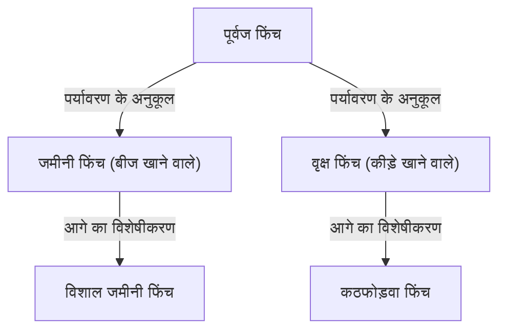

## प्रस्तावना: जीवन की विविधता और डार्विन की क्रांति

24 नवंबर 1859 को चार्ल्स डार्विन द्वारा प्रकाशित 'प्रजातियों की उत्पत्ति (On the Origin of Species)', एक ऐतिहासिक कृति बन गई जिसने न केवल जीव विज्ञान, बल्कि मानवता के विश्वदृष्टिकोण को मौलिक रूप से बदल दिया। डार्विन ने "प्राकृतिक चयन (Natural Selection)" के तंत्र पर आधारित विकासवाद का सिद्धांत प्रस्तुत किया, जिसने उस समय के सृजनवादी प्रतिमान को चुनौती दी कि "सभी प्रजातियाँ ईश्वर द्वारा व्यक्तिगत रूप से बनाई गई हैं और अपरिवर्तनीय हैं।"

इस लेख में, हम विस्तार से बताएंगे कि डार्विन का विकासवाद कैसे बना, प्राकृतिक चयन के इसके मुख्य सिद्धांत की तार्किक संरचना, आधुनिक जीव विज्ञान में इसका स्थान, और समाज पर इसका प्रभाव क्या रहा।

## 1. ऐतिहासिक पृष्ठभूमि: बीगल की यात्रा और प्रेरणा

चार्ल्स डार्विन ने 1831 से 1836 तक ब्रिटिश नौसेना के सर्वेक्षण जहाज एचएमएस बीगल (HMS Beagle) पर एक प्रकृतिवादी के रूप में दुनिया की यात्रा की। दक्षिण अमेरिकी महाद्वीप के तटीय सर्वेक्षणों के साथ-साथ प्रशांत द्वीपों की इस यात्रा ने उनकी सोच पर गहरा प्रभाव डाला।

### गैलापागोस द्वीप समूह में अवलोकन

उन्हें सबसे बड़ी प्रेरणा दक्षिण अमेरिका में इक्वाडोर के तट पर स्थित गैलापागोस द्वीप समूह में अपने अवलोकनों से मिली। इन अलग-थलग द्वीपों में बहुत सारे पौधे और जानवर थे जो अपने अनोखे तरीके से विकसित हुए थे।

प्रसिद्ध "गैलापागोस फिंच (टैनेजर परिवार में वर्गीकृत छोटी पक्षी)" की चोंच हर द्वीप पर अलग-अलग आकार की थी। उनके आहार के अनुसार उनकी चोंचें विशिष्ट हो गई थीं, जैसे कि कैक्टस खाने वाले, कीड़े पकड़ने वाले, और कठोर बीजों को कुचलकर खाने वाले।

डार्विन का मानना था कि ये फिंच दक्षिण अमेरिकी महाद्वीप से आए एक सामान्य पूर्वज से अलग हुए और प्रत्येक द्वीप के पर्यावरण के अनुकूल हो गए। यह बाद में "अनुकूली विकिरण (Adaptive Radiation)" की अवधारणा की ओर ले गया।

## 2. प्राकृतिक चयन सिद्धांत की तार्किक संरचना

डार्विन के विकासवाद का मूल इस तंत्र को स्पष्ट करने में है कि "विकास कैसे होता है।" यही "प्राकृतिक चयन का सिद्धांत (Natural Selection)" है। यह सिद्धांत मुख्य रूप से निम्नलिखित अवलोकनों और अनुमानों पर आधारित है।

### भिन्नता और आनुवंशिकता

भले ही वे एक ही प्रजाति के हों, व्यक्तियों के बीच रूप और गुणों (व्यक्तिगत भिन्नता) में अंतर होता है। और इनमें से कुछ भिन्नताएँ माता-पिता से संतानों में जाती हैं। उस समय डार्विन आनुवंशिकी (डीएनए या जीन) के तंत्र के बारे में नहीं जानते थे, लेकिन उन्होंने अनुभव के आधार पर इस तथ्य को पहचान लिया था।

### अस्तित्व के लिए संघर्ष और योग्यतम की उत्तरजीविता

जीव आमतौर पर पर्यावरण द्वारा समर्थित होने से अधिक संतान (अत्यधिक प्रजनन) पैदा करने की कोशिश करते हैं। हालाँकि, भोजन और आवास जैसे संसाधन सीमित हैं, इसलिए व्यक्तियों के बीच अस्तित्व के लिए संघर्ष होता है।

इस प्रतियोगिता में, किसी विशिष्ट वातावरण में अधिक अनुकूल गुणों (भिन्नता) वाले व्यक्तियों के जीवित रहने और अधिक संतान छोड़ने की संभावना अधिक होती है। यही "योग्यतम की उत्तरजीविता (Survival of the fittest)" है।

### पीढ़ियों के पार बदलाव

जैसे-जैसे अनुकूल गुण पीढ़ियों में पारित होते हैं, उन गुणों वाले व्यक्तियों का अनुपात धीरे-धीरे जनसंख्या में बढ़ता जाता है। माना जाता है कि कई वर्षों तक इस प्रक्रिया के दोहराए जाने से, पूरी प्रजाति पर्यावरण के अनुकूल होने की दिशा में बदल जाती है, और अंततः एक नई प्रजाति बन जाती है।

## 3. "प्रजातियों की उत्पत्ति" का प्रभाव

डार्विन की 'प्रजातियों की उत्पत्ति' ने उस समय के समाज पर अकल्पनीय प्रभाव डाला।

### वैज्ञानिक प्रतिमान में बदलाव

उस समय तक का जीव विज्ञान मुख्य रूप से वर्गीकरण पर केंद्रित था और प्रजातियों की अपरिवर्तनीयता पर आधारित था। हालाँकि, डार्विन के विकासवाद ने "जीवन के वृक्ष (Tree of Life)" की अवधारणा प्रस्तुत की, जिसमें सभी जीव एक सामान्य पूर्वज से अलग होकर विकसित हुए, और जीव विज्ञान को ऐतिहासिक परिप्रेक्ष्य के साथ एक गतिशील विज्ञान में बदल दिया।

### धर्म और दर्शन पर प्रभाव

यह दावा कि "मनुष्य भी अन्य जानवरों की तरह विकास की उपज हैं" ने ईसाई दृष्टिकोण (यह सिद्धांत कि मनुष्य विशेष रूप से ईश्वर की छवि में बनाए गए थे) से सीधे तौर पर टकराव किया। इसके कारण धार्मिक हलकों से भयंकर विरोध हुआ, और विकासवाद की स्वीकृति पर विवाद आज भी कुछ क्षेत्रों में जारी है।

दूसरी ओर, इसने दर्शन और सामाजिक विज्ञान को भी प्रभावित किया, और सामाजिक डार्विनवाद जैसी विचारधाराओं को जन्म दिया, जिसने प्राकृतिक चयन की अवधारणा को मानव समाज की प्रतिस्पर्धा और असमानता पर लागू करने का प्रयास किया (यह डार्विन के अपने इरादों से अलग था और बाद में इसकी काफी आलोचना हुई)।

## 4. आधुनिक विकासवादी जीव विज्ञान में विकास (नियो-डार्विनवाद)

आनुवंशिकता के तंत्र, जो डार्विन के समय में अज्ञात थे, 20वीं सदी में ग्रेगर मेंडल के आनुवंशिकी के नियमों की पुनर्खोज और डीएनए की संरचना के स्पष्टीकरण के साथ स्पष्ट हो गए।

### उत्परिवर्तन और प्राकृतिक चयन का एकीकरण

आधुनिक विकासवादी जीव विज्ञान (सिंथेटिक सिद्धांत, नियो-डार्विनवाद) में, विकास की प्रक्रिया को निम्नानुसार समझाया गया है:

1. **उत्परिवर्तन (Mutation)**: डीएनए प्रतिकृति में त्रुटियों के कारण संयोग से नए आनुवंशिक परिवर्तन उत्पन्न होते हैं।
2. **प्राकृतिक चयन (Natural selection)**: पर्यावरण के अनुकूल परिवर्तन जीवित रहने और प्रजनन में फायदेमंद होते हैं, और जनसंख्या में फैल जाते हैं।
3. **आनुवंशिक बहाव (Genetic drift)**: आकस्मिक कारकों के कारण जीन की आवृत्ति में उतार-चढ़ाव होता है (विशेष रूप से छोटी आबादी में)।
4. **अलगाव (Isolation)**: भौगोलिक या प्रजनन अलगाव आबादी के बीच जीन के आदान-प्रदान को काट देता है और प्रजातीकरण को बढ़ावा देता है।

इस तरह, डार्विन का प्राकृतिक चयन का सिद्धांत आधुनिक आनुवंशिकी और आणविक जीव विज्ञान के ज्ञान के साथ विलीन हो गया है, और आधुनिक जीवन विज्ञान की नींव के रूप में एक मजबूत वैज्ञानिक सिद्धांत बन गया है।

## निष्कर्ष: विकासवाद हमें क्या सिखाता है

डार्विन का विकासवाद अतीत का कोई साधारण सिद्धांत नहीं है। आधुनिक समय में भी, विकासवादी परिप्रेक्ष्य विभिन्न क्षेत्रों में आवश्यक है, जैसे कि एंटीबायोटिक-प्रतिरोधी बैक्टीरिया का उद्भव, वायरस का उत्परिवर्तन, कृषि फसलों का प्रजनन, और यहां तक ​​कि कैंसर कोशिकाओं के प्रसार के तंत्र को समझना।

"यह सबसे मजबूत प्रजाति नहीं है जो जीवित रहती है, न ही सबसे बुद्धिमान जो जीवित रहती है। यह वह है जो परिवर्तन के लिए सबसे अनुकूल है" - हालाँकि ऐसा कहा जाता है कि यह कथन स्वयं डार्विन का नहीं है, यह प्राकृतिक चयन के सिद्धांत के सार को शानदार ढंग से पकड़ने वाली अभिव्यक्ति के रूप में व्यापक रूप से जाना जाता है।

जीवन का इतिहास निरंतर पर्यावरणीय परिवर्तनों के अनुकूलन का इतिहास है। डार्विन द्वारा अग्रणी विकासवादी परिप्रेक्ष्य जीवन की विविधता और जटिलता को समझने के लिए हमारे पास सबसे शक्तिशाली लेंसों में से एक बना हुआ है।
